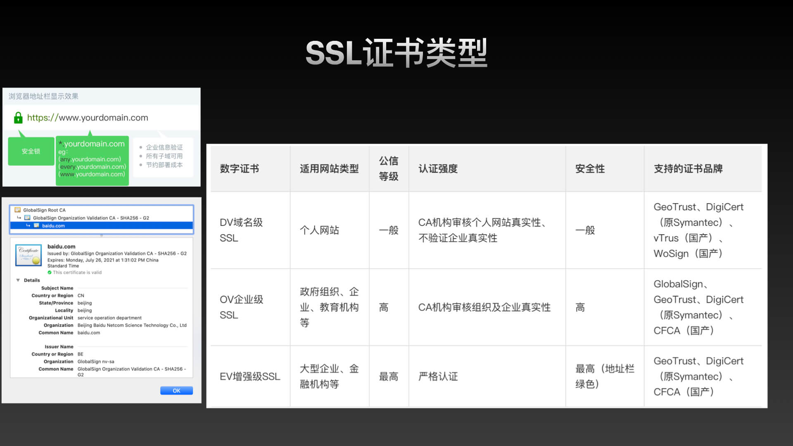

## 2020年底技术分享-FE服务器基础应用理论与实战 
### 为何前端需要关注服务器


* 更多的任务： 对于 node server 端的同学通常需要环境搭建、部署，甚至站在管理员的角度维护团队资源的日常；
* 融合度： 团队沟通成本会下降，横向扩展团队处理事务能力，减少团队单向沟通场景；
* 加分项：如果想实行全栈，我想这个点绕不过去的。起到桥梁作用，衔接前端和后台应用服务；


### 常用知识卡点


### 构建实验室的环境

docker 的优势：

* 环境隔离，不会污染主机，不要了只要删除容器和镜像就好了；
* 跨平台，可以在不同系统；
* 预置化环境配置，降低初始化成本；


Docker 容器间的通信通过桥接实现


正常情况使用 update 命令获取最新远程软件列表索引；

具体包的信息可以  <https://packages.debian.org/>包名 检索;

云服务厂商通常会有防火墙设置，主机端口受限，需要自己设置端口开放开关;


### 用户和组

创建用户默认会自动创建 对应用户名称相同的组，我们叫做主组；

这里的组添加的是附加组，一个用可以有多个附加组，但只有一个主组；


### 权限系统


#### Linux的权限设计


#### 权限问题的场景复现


#### 设置ACL权限


#### 其它的权限设计

* MAC:通常用于安防访问系统设计，分层结构
* RBAC: 通常用于公司员工组织架构 (商旅管理) 、内部管理系统 (中台支撑平台)


### 服务器软件


#### OSI七层网络协议模型

* UDP、TCP 协议属于传输层协议
* HTTP、FTP、SSH、SMTP、DNS 属于应用层协议


#### SSH


#### Nginx


##### 安装


##### 默认配置


##### 反向代理


##### 负载均衡


##### 个人在线简历搭建

先设置主机的host配置，让我们把域名指向本地

``` xml
127.0.0.1 crgt.com
127.0.0.1 crgt1.com
127.0.0.1 crgt2.com
```


##### SSL支持


##### SSL证书类型

* 域名型SSL证书，简称DV SSL
* 企业型SSL证书，简称OV
* 增强型SSL证书，简称EV SSL

阿里百度使用的CA机构品牌是 GlobalSign

> 自2020年9月1日起，全球CA颁发的证书有效期最长为1年 之前是两年

EV 招商银行、中国银行，有钱人。令人费解的是工商银行首页还是 http 协议



### PPT资源分享

地址: <https://github.com/dun-cat/ppt-share/tree/master/ppt-202012-op>

演示内容资料包括：

1. 网站创建
2. https 站点创建
3. 反向代理
4. Linux 权限
5. 用户和组
