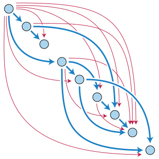

## Andorid 的 Gradle 构建及优化 
### 前言

Android 应用是基于 Gradle 作为其构建工具，所以对于 Android 构建知识内容基本都来自于 gradle，因此你可以去[这里](https://docs.gradle.org/current/userguide/userguide.html)查看官方用户指导文档。

### 构建生命周期

Gradle 的核心是一种基于依赖 (dependency) 的编程语言，它可以用来定义任务和任务之间的依赖关系。

> 任务是 Gradle 的一个核心概念，后面都将使用 Task 表示中文含义的任务。

Gradle 保证这些 Tasks 都能按照他们的依赖顺序执行，并且每个任务只执行一次。这些任务形成了一个[有向无环图](https://zh.wikipedia.org/wiki/有向无环图) (Directed Acyclic Graph) 。



有一些构建工具可以在执行任务时构建这样的依赖关系图，而 Gradle 在执行任何 Task 之前`构建完整的`依赖关系图。这是 Gradle 的核心，它使许多原本不可能的事情成为可能。

构建脚本配置此依赖关系图。因此，它们严格来说是构建`配置脚本`。

#### 构建阶段

Gradle 构建有三个不同阶段：`初始化` (Initialization) 、`配置` (Configuration) 、`执行` (Execution) ：

1. `初始化阶段`：Gradle 支持单项目和多项目构建。在初始化阶段，Gradle 确定哪些项目将参与构建，并为每个项目创建一个[Project 实例](https://docs.gradle.org/current/dsl/org.gradle.api.Project.html)；
2. `配置阶段`：在此阶段配置项目对象。`执行`作为构建一部分的`所有项目`的`构建脚本` (例：build.gradle) ；
3. `执行阶段`：Gradle 确定在配置阶段创建和配置的要执行的 Task 子集。该子集由传递给 Gradle 的命令和当前目录的 Task 名称参数确定。然后执行每个选定的 Task。

#### 配置文件

除了`构建脚本文件`，Gradle 还定义了一个`设置文件`。设置文件由 Gradle 通过命名约定确定。此文件的默认名称是 `settings.gradle` 。

#### 多项目构建

设置文件在`初始化`阶段执行。[多项目构建](https://docs.gradle.org/current/userguide/multi_project_builds.html#multi_project_builds)必须在多项目层次结构的`根项目`中有一个 `settings.gradle` 文件。这是**必需**的，因为设置文件定义了哪些项目参与了多项目构建。

一个基本的多项目构建包含`一个根项目`和`一个或多个子项目`。下面是一个多项目构建的结构，其中一个子项目名为 app ：

``` bash
.
├── app
│   ...
│   └── build.gradle
└── settings.gradle
```

对于单项目构建，设置文件是可选的。除了定义包含的项目外，你可能还需要将库添加到构建脚本 classpath (请参阅[组织 Gradle 项目](https://docs.gradle.org/current/userguide/organizing_gradle_projects.html#organizing_gradle_projects)) ，让我们首先对单项目构建进行审视。

在配置文件 `settings.gradle` 中：

``` groovy
rootProject.name = 'basic'
println 'This is executed during the initialization phase.'
```

在构建脚本 `build.gradle` 中：

``` groovy
println 'This is executed during the configuration phase.'

tasks.register('configured') {
    println 'This is also executed during the configuration phase, because :configured is used in the build.'
}

tasks.register('test') {
    doLast {
        println 'This is executed during the execution phase.'
    }
}

tasks.register('testBoth') {
 doFirst {
   println 'This is executed first during the execution phase.'
 }
 doLast {
   println 'This is executed last during the execution phase.'
 }
 println 'This is executed during the configuration phase as well, because :testBoth is used in the build.'
}
```

Gradle 执行输出：

``` bash
> gradle test testBoth
This is executed during the initialization phase.

> Configure project :
This is executed during the configuration phase.
This is executed during the configuration phase as well, because :testBoth is used in the build.

> Task :test
This is executed during the execution phase.

> Task :testBoth
This is executed first during the execution phase.
This is executed last during the execution phase.

BUILD SUCCESSFUL in 0s
2 actionable tasks: 2 executed
```

对于 build.gradle 中，`属性访问`和`方法调用`被委托给 `Project` 对象。查看 API 文档中的 [Project](https://docs.gradle.org/current/dsl/org.gradle.api.Project.html) 类以获取更多信息。

类似地，settings.gradle 中的`属性访问`和`方法调用`被委托给 `Settings` 对象。查看 API 文档中的 [Settings](https://docs.gradle.org/current/dsl/org.gradle.api.initialization.Settings.html) 类以获取更多信息。

#### 响应生命周期

随着构建在其生命周期中的进展，构建脚本可以接收通知。这些通知通常采用两种形式：

1. 实现特定的侦听器接口；
2. 提供一个`闭包` (Closure) 以在触发通知时执行。

下面的示例使用`闭包`。监听接口的使用方法请参考 API 文档。

##### 项目评估通知

你可以在项目评估 (Project Evaluation) 之前和之后立即收到通知。一旦应用了构建脚本中的所有定义，或者用于某些自定义日志记录或分析，这可用于执行其他配置等操作。

Gradle 提供了 [ProjectEvaluationListener](https://docs.gradle.org/current/javadoc/org/gradle/api/ProjectEvaluationListener.html) 作为侦听器，并提供了 `beforeEvaluate` 和 `afterEvaluate` 方法。

下面的例子：将名为 `test` 的 task 添加到具有特定属性集的每个项目。

在 build.gradle 中：

``` groovy
allprojects {
    afterEvaluate { project ->
        if (project.hasTests) {
            println "Adding test task to $project"
            project.task('test') {
                doLast {
                    println "Running tests for $project"
                }
            }
        }
    }
}
```

在项目 `project-a` 的构建脚本中：

``` groovy
hasTests = true
```

执行命令 `gradle -q test` ：

``` bash
> gradle -q test
Adding test task to project ':project-a'
Running tests for project ':project-a'
```

##### 任务创建通知

将 Task 添加到项目后，可以立即收到通知。这可用于在构建文件中提供 Task 执行之前设置一些默认值或添加行为。

下面的例子：在 srcDir 创建每个任务时设置它的属性。

``` groovy
tasks.whenTaskAdded { task ->
    task.ext.srcDir = 'src/main/java'
}

tasks.register('a')

println "source dir is $a.srcDir"
```

执行命令 `gradle -q a` ：

``` bash
> gradle -q a
source dir is src/main/java
```

你还可以将 [Action](https://docs.gradle.org/current/javadoc/org/gradle/api/Action.html) 添加到 [TaskContainer](https://docs.gradle.org/current/javadoc/org/gradle/api/tasks/TaskContainer.html) 以接收这些事件。

##### 任务执行通知

你可以在执行任何 Task `之前`和`之后`立即收到通知。

下面例子：记录每个任务执行的开始和结束。请注意，`afterTask` 无论任务是成功完成还是因异常而失败，都会收到通知。

``` groovy
tasks.register('ok')

tasks.register('broken') {
    dependsOn ok
    doLast {
        throw new RuntimeException('broken')
    }
}

gradle.taskGraph.beforeTask { Task task ->
    println "executing $task ..."
}

gradle.taskGraph.afterTask { Task task, TaskState state ->
    if (state.failure) {
        println "FAILED"
    }
    else {
        println "done"
    }
}
```

执行命令 `gradle -q broken` ：

``` bash
> gradle -q broken
executing task ':ok' ...
done
executing task ':broken' ...
FAILED

FAILURE: Build failed with an exception.

* Where:
Build file '/home/user/gradle/samples/build.gradle' line: 6

* What went wrong:
Execution failed for task ':broken'.
> broken

* Try:
> Run with --stacktrace option to get the stack trace.
> Run with --info or --debug option to get more log output.
> Run with --scan to get full insights.

* Get more help at https://help.gradle.org

BUILD FAILED in 0s
```

还可以使用 [TaskExecutionListener](https://docs.gradle.org/current/javadoc/org/gradle/api/execution/TaskExecutionListener.html) 到 [TaskExecutionGraph](https://docs.gradle.org/current/javadoc/org/gradle/api/execution/TaskExecutionGraph.html) 来接收这些事件。

### 构建脚本

Gradle 脚本使用[Groovy DSL](https://docs.gradle.org/current/userguide/groovy_build_script_primer.html)语言开发，基于 Groovy 语言结构，它看起来更像是配置。

Gradle 脚本是`配置脚本`。当脚本执行时，它会配置一个特定类型的对象。

例如，当构建脚本执行时，它会配置一个类型为 Project 的对象。该对象称为脚本的`委托对象` (delegate object)  。下表显示了每种类型的 Gradle 脚本的委托。

| 脚本类型    | 委托实例   |
| :----------- | :---------- |
|构建脚本 (build.gradle) |[Project](https://docs.gradle.org/current/dsl/org.gradle.api.Project.html)  |
|初始化脚本|[Gradle](https://docs.gradle.org/current/dsl/org.gradle.api.invocation.Gradle.html)   |
|设置脚本 (settings.gradle) |[Settings](https://docs.gradle.org/current/dsl/org.gradle.api.initialization.Settings.html) |

因此，可以在脚本中使用委托对象的`属性`和`方法`。

其次，每个 Gradle 脚本都实现了 [Script](https://docs.gradle.org/current/dsl/org.gradle.api.Script.html) 接口。在脚本中可以使用许多 Script 接口定义的属性和方法。

#### 构建脚本结构

构建脚本由零个或多个`语句` (Statement) 和`脚本块` (Block) 组成。

* 语句：包括`方法调用`、`属性分配`和`局部变量定义`。
* 脚本块：是一个以`闭包为参数`的`方法调用`。闭包被视为配置闭包，它在执行时配置一些委托对象。

下面列出了顶级脚本块：

| 块 | 描述 |
|:--|:--|
|[allprojects { }](https://docs.gradle.org/current/dsl/org.gradle.api.Project.html#org.gradle.api.Project:allprojects(groovy.lang.Closure))|配置此项目及其每个子项目。|
|[artifacts { }](https://docs.gradle.org/current/dsl/org.gradle.api.Project.html#org.gradle.api.Project:artifacts(groovy.lang.Closure))|为此项目配置已发布的工件。|
|[buildscript { }](https://docs.gradle.org/current/dsl/org.gradle.api.Project.html#org.gradle.api.Project:buildscript(groovy.lang.Closure))|为此项目配置构建脚本类路径。|
|[configurations { }](https://docs.gradle.org/current/dsl/org.gradle.api.Project.html#org.gradle.api.Project:configurations(groovy.lang.Closure))|配置此项目的依赖项配置。|
|[dependencies { }](https://docs.gradle.org/current/dsl/org.gradle.api.Project.html#org.gradle.api.Project:dependencies(groovy.lang.Closure))|配置此项目的依赖项。|
|[repositories { }](https://docs.gradle.org/current/dsl/org.gradle.api.Project.html#org.gradle.api.Project:repositories(groovy.lang.Closure))|配置此项目的存储库。|
|[sourceSets { }](https://docs.gradle.org/current/dsl/org.gradle.api.Project.html#org.gradle.api.Project:sourceSets(groovy.lang.Closure))|配置此项目的源集。|
|[subprojects { }](https://docs.gradle.org/current/dsl/org.gradle.api.Project.html#org.gradle.api.Project:subprojects(groovy.lang.Closure))|配置本项目的子项目。|
|[publishing { }](https://docs.gradle.org/current/dsl/org.gradle.api.Project.html#org.gradle.api.Project:publishing(groovy.lang.Closure))|配置PublishingExtension发布插件添加的内容。|

例子：

``` groovy
configurations {
    assets
}

sourceSets {
    main {
        java {
            srcDirs = ['src']
        }
    }
}

dependencies {
    implementation project(':util')
}
```

### 构建任务

构建指定任务：

``` bash
./gradlew task-name
```

通常 Android Gradle 插件会帮你生成主工程的构建任务，被命名为 `assemble` 。

所以你可以执行以下命令去构建主工程：

``` bash
./gradlew assemble
```

### 增量构建

Gradle 官方文档叫做 `Up-to-date checks`，也被叫做`增量构建` (Incremental Build) ，方便理解使用增量构建作为主称。

任何一个构建工具，都应该能够避免做一些已完成的事情。一旦你的源文件已经编译过，他们就不应该重复编译。跳过重复编译的步骤，可以节省大量时间。

但他们需要在编译的输入输出发生改变时，重新编译。例如：源文件发生修改或输出文件移除。

Gradle 支持开箱即用的`增量构建`功能。每当一个任务 (Task) 打印 `UP-TO-DATE` 文本时，表明该任务的构建被略过并使用构建缓存。

构建时，在 android studio 下的 build 日志可以看到下面的一些使用构建缓存的 `UP-TO-DATE` 标识：

``` bash
> Task :react-native-community_geolocation:preBuild UP-TO-DATE
> Task :react-native-community_geolocation:preDebugBuild UP-TO-DATE
```

下面的图展示一个任务的构建`输入` (inputs) 和`输出` (outputs) ：


一个输入的显著特征是它能够影响一个或多个输出，不同的`字节码` (bytecode) 生成依赖于源文件的内容和代码运行所在的 Java 运行时 (Java runtime) 的最小版本。

> Java 源文件生成的字节码以`.class`为后缀。

作为增量构建的一部分，Gradle 会检测最后一次构建的输入和输出是否改变。若没有改变，则会在下次构建跳过任务动作。要注意的是任务至少有一个输出，否则增量编译不会起作用。

### 构建缓存

> 此处描述的构建缓存功能与[Android 插件构建缓存](#Android 插件构建缓存)不同。

Gradle 构建缓存是一种`缓存机制`，旨在通过重用其他构建产生的输出来节省时间。

使用构建缓存的第一个特性是`任务输出缓存`。任务输出缓存不仅限于同一工作区中的先前构建，而是允许 Gradle 重用本地机器上任何位置的任何早期构建的任务输出。

除了任务之外，工件转换还可以利用构建缓存并重用其输出，类似于任务输出缓存。

#### 可缓存任务

由于 Task `描述了它的所有输入和输出`，Gradle 可以计算一个构建缓存 key，该 key 定义了 Task 的输出并且是唯一的，它用于从构建缓存请求获取先前的输出或将新输出存储在构建缓存中。

如果之前的构建输出已经被其他人 (例：CI 服务器或其他开发人员) 存储在缓存中，您可以避免在本地执行大多数 Task。

以下输入可以出成 Task 的构建缓存 key：

* Task 类型及 classpath；
* 输出属性名；
* 如[自定义任务类型](https://docs.gradle.org/current/userguide/more_about_tasks.html#sec:task_input_output_annotations)部分所述注释的属性的名称和值；
* DSL 通过[TaskInputs 添加的属性的名称和值](https://docs.gradle.org/current/javadoc/org/gradle/api/tasks/TaskInputs.html)；
* Gradle 发行版、buildSrc 和插件的 classpath；
* 构建脚本影响任务执行时的内容。

Task 类型需要使用[@CacheableTask](https://docs.gradle.org/current/javadoc/org/gradle/api/tasks/TaskInputs.html)注解选择加入 Task 输出缓存。

> @CacheableTask 不被子类继承。默认情况下，自定义 Task 类型不可缓存。

##### 内置可缓存任务

* Java 工具链： [JavaCompile](https://docs.gradle.org/current/dsl/org.gradle.api.tasks.compile.JavaCompile.html)、 Javadoc
* Groovy 工具链： GroovyCompile , Groovydoc
* Scala 工具链： ScalaCompile、 PlatformScalaCompile、 ScalaDoc
* 原生工具链： CppCompile、 CCompile、 SwiftCompile
* 测试： 测试
* 代码质量任务： Checkstyle、 CodeNarc、 Pmd
* JaCoCo： JacocoMerge， JacocoReport
* 其他任务： AntlrTask、 ValidatePlugins、 WriteProperties

所有其他内置任务当前不可缓存。

某些任务，例如 [Copy](https://docs.gradle.org/current/dsl/org.gradle.api.tasks.Copy.html)或 [Jar](https://docs.gradle.org/current/dsl/org.gradle.api.tasks.bundling.Jar.html)

将文件从一个位置 Copy 到另一个位置的 Task 使用缓存是没有意义的。不产生输出或没有 Action 的 Task 也是没有缓存意义的。

##### 启用不可缓存任务的缓存

举一个具体的例子：构建脚本使用通用任务通过委托给 NPM (并运行) NpmTask来创建 JavaScript 包。执行一个 `npm run **` 的 node 任务，默认情况下无法缓存。

这个任务的输入和输出很容易弄清楚。输入是包含 JavaScript 文件和 npm 配置文件的目录。输出是此任务生成的捆绑文件。

在 build.gradle 中:

``` groovy
task installReactNativeDeps(type:Exec) {
    workingDir "../../"
    commandLine 'npm', 'install'

    outputs.cacheIf { true }

    inputs.dir(new File(rootDir.parentFile,"./rn-deps"))
            .withPropertyName("rninput")
            .withPathSensitivity(PathSensitivity.RELATIVE)

    outputs.dirs(new File(rootDir.parentFile,"./node_modules"))
            .withPropertyName("rnoutpus")

    doFirst {
        println "开始安装"
    }
    doLast {
        println "结束安装"
    }
}

 preBuild.dependsOn installReactNativeDeps
```

### 配置缓存

[配置缓存](https://docs.gradle.org/current/userguide/configuration_cache.html#config_cache:usage)是一项通过缓存[配置阶段](#构建阶段)的结果并将其重用于后续构建来显着提高构建性能的功能。使用配置缓存，Gradle 可以在没有影响构建配置的任何内容 (例如构建脚本) 发生更改时完全`跳过配置阶段`。Gradle 还对任务执行进行了一些性能改进。

配置缓存在概念上类似于构建缓存，但缓存不同的信息。

`构建缓存`负责缓存构建的`输出`和`中间文件`，例如 Task 输出或 artifact 转换输出。配置缓存负责缓存特定任务集的构建配置。换句话说，配置缓存保存[配置阶段](#构建阶段)的输出，构建缓存保存[执行阶段](#构建阶段)的输出。

> 此功能目前正在孵化中，默认情况下未启用。

> 并非所有核心[Gradle 插件](https://docs.gradle.org/current/userguide/configuration_cache.html#config_cache:plugins:core)都受支持。您的构建和您依赖的插件可能需要更改才能满足要求。一些 Gradle 功能尚未实现。配置缓存尚未改进在 IDE 中导入和同步 Gradle 构建。

#### 开启配置缓存

默认情况下，配置缓存未启用。它可以从命令行启用：

``` bash
gradle --configuration-cache
```

也可以在gradle.properties文件中永久启用：

``` bash
org.gradle.unsafe.configuration-cache=true
```

### Android 插件构建缓存

#### 清除构建缓存

Android 插件的 `clean` 任务可以清除项目的 `build/` 目录，与之类似，可以运行 cleanBuildCache 任务来清除项目的构建缓存。

``` bash
./gradlew cleanBuildCache
```

当然你可以使用下面命令删除构建目录：

``` bash
./gradlew clean
```

如果报以下错误：

``` bash
FAILURE: Build failed with an exception.

* What went wrong:
Could not initialize class org.codehaus.groovy.runtime.InvokerHelper
```

请确认 Gradle 版本在`6.3-rc-4`以上，你可以在[这里](https://github.com/gradle/gradle/issues/12599)找到该问题的讨论。

参考资料：

\> [https://docs.gradle.org/current/userguide/build_cache.html](https://docs.gradle.org/current/userguide/build_cache.html)

\> [https://developer.android.com/studio/build/build-cache](https://developer.android.com/studio/build/build-cache)

\> [https://docs.gradle.org/current/userguide/more_about_tasks.html#sec:up_to_date_checks](https://docs.gradle.org/current/userguide/more_about_tasks.html#sec:up_to_date_checks)

\> [https://developer.android.com/studio/build/optimize-your-build](https://developer.android.com/studio/build/optimize-your-build)

\> [https://docs.gradle.org/current/userguide/build_lifecycle.html](https://docs.gradle.org/current/userguide/build_lifecycle.html)

\> [https://zh.wikipedia.org/wiki/有向无环图](https://zh.wikipedia.org/wiki/有向无环图)

\> [https://developer.mozilla.org/zh-CN/docs/Web/JavaScript/Closures](https://developer.mozilla.org/zh-CN/docs/Web/JavaScript/Closures)

\> [https://docs.gradle.org/current/userguide/groovy_build_script_primer.html](https://docs.gradle.org/current/userguide/groovy_build_script_primer.html)
