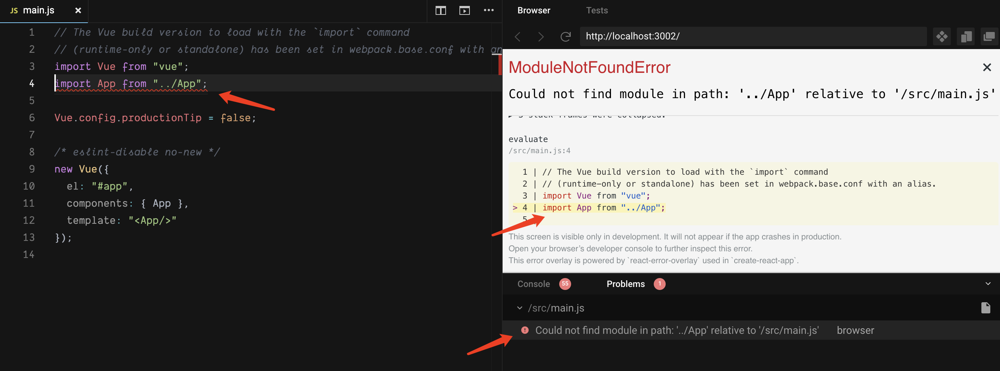

## Codesandbox-client 之源码拆解：codesandbox-api 
### 所起的作用

这个子项目用于消息事件派发，以`订阅发布`的设计模式展开，可以理解为一个独立用于事件派发的SDK。

在`编辑器` (Editor) 和`沙箱` (sandbox) 之间的`跨域`消息事件派发，通过浏览器的 postmessage 来实现。

codesanbox-api 分为几个模块：`actions`、`dispatcher`、`protocol` 。

#### actions

`派发的消息`要指定为两种关键信息：`动作 (action)` 和 `数据(data)`。codesandbox-api 通过`定义动作接口`来规范 `action` 的数据格式，而`数据`部分的格式平铺 (flat) 字段即可，这里需要注意的是数据部分的键名不能和 action 接口定义的键名相同。

在 codesandbox-api 里的 actions 有：correction、`editor`、error、glyph、notifications。

所有的 action 的接口定义都继承 `Action 接口` ：

``` ts
export interface Action {
  type: 'action';
  action: string;
}
```

这里拿 `editor` 里的 `OpenModuleAction` 接口为例，它在继承 Action 接口：

``` ts
export interface OpenModuleAction extends Action {
  path: string;
  lineNumber?: number;
  column?: number;
}

export function openModule(id: string, lineNumber?: number, column?: number): OpenModuleAction {
  // TODO automatically add type: 'action', maybe do this after conversion to TS
  return {
    type: 'action',
    action: 'editor.open-module',
    path: id, // 文件路径
    lineNumber, // 行号
    column, // 列号
  };
}
```

在项目编译出现问题后，openModule 会传递具体`错误位置`信息，通过点击`沙箱的错误提示`或沙箱下面的 `DevTools` 的 `Problems` 的错误信息，既可以把光标指向编辑器的具体错误代码位置。



#### dispatcher

dispatcher 包含`被订阅的对象`、消息事件的`接收派发`和`监听注册`

#### protocol

#### 其它属性

##### isStandalone

用于判断当前 sandbox 是否是独立的运行的。即 sandbox 不是被嵌入 iframe 中，而是作为页面直接打开。此时，sandbox 的 code 将通过网络接口获取。

他的校验代码如下：

``` ts
function checkIsStandalone() {
  if (typeof window === 'undefined') {
    return true;
  }

  if (window.location && window.location.href.indexOf('?standalone') > -1) {
    return true;
  }

  return !window.opener && window.parent === window;
}
```
