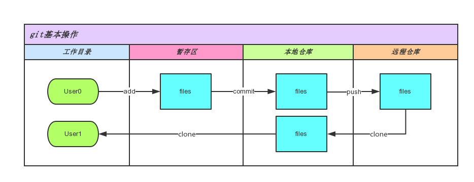
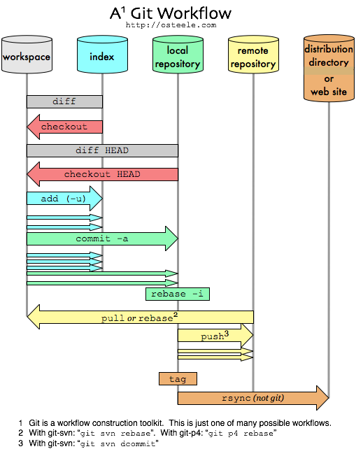

## Git 的基本使用 
### 基本流程



### 常见命令时序图

#### Git 数据传输


#### Git workflow



### 基本命令

#### fetch

拉取远程分支到本地一个指定分支上：

``` bash
git fetch origin feat/test:feat/test
```

#### pull

从服务器更新

``` bash
git pull
```

#### add

这是个`多功能命令`，根据目标文件的状态不同，此命令的效果也不同：

* 可以用它开始跟踪新文件
* 把已跟踪的文件放到暂存区
* 还能用于合并时把有冲突的文件标记为已解决状态

``` bash
git add . # 新建文件的时候，用于跟踪当前目录下的所有文件 (除去.gitignore) 
```

#### commit

提交暂存区里的文件到本地仓库。

``` bash
git commit -m '我是commit附带的消息'
git commit --amend --no-edit  #把这次改动合并到上一次commit，并且不修改提交信息。
```

#### push

* 提交本地仓库到远程服务器
* 提交分支到远程服务器
* 删除远程分支

``` bash
git push

git push origin dev # 提交本地分支dev到远程分支dev，假如远程分支dev不存在就会创建远程分支dev

git push origin dev:dev 一样的效果，[本地分支]:[远程分支] ，远程分支可重命名。 # 上面的写法是简写，全写如下

git push origin --delete hotfix # 删除远程 hotfix 分支
```

#### status

查看当前文件状态。

``` bash
    git status
```

#### checkout

`多功能命令`：

* 切换分支
* 切换HEAD到指定的commit

``` bash
git checkout somebranch

git checkout -b somebranch  # 创建 somebranch 分支并切换到 somebranch 分支

git checkout HEAD^ # 切换 HEAD 到上一个 commit。

git checkout HEAD -- my-file.txt # 从最新 commit 恢复一个文件
```

##### 重置指定目录

``` shell
git checkout feat/test -- path/dir # 从其它分支迁出指定文件目录
```

#### branch

查看分支、创建分支、删除分支

``` bash
git branch # 查看本地分支

git branch -r # 查看远程分支

git branch -a # 查看本地和远程分支

git branch dev # 创建本地dev分支

git branch -d feature-001 # 删除本地feature-001分支
```

#### tag

给当前分支打标签

``` bash
git tag v1.0
```

合并分支

``` bash
#### merge
git merge hotfix # 合并hotfix 分支到当前分支去
```

#### rm

移除对文件的追踪

``` bash
git rm readme.txt # 删除对 readme.txt 文件的跟踪，保留本地文件。
git rm -f readme.txt # 删除对 readme.txt 文件的跟踪，并删除本地文件。

git rm -r subdir #  删除对 subdir 文件夹的跟踪，并执行递归。
```

### 更换远程仓库

**1. 查看远程仓库配置**

使用 `git remote -v`，命令可以查看`拉取`仓库源和`推送`仓库源的地址信息。

``` bash
➜  door-cli git:(dev) git remote -v
origin  http://gitlab.lumin.tech/FE-BASE/door-cli.git (fetch)
origin  http://gitlab.lumin.tech/FE-BASE/door-cli.git (push)
```

**2. 修改远程仓库地址**

``` bash
git remote set-url origin git@github.com:dun-cat/door-cli.git
```

改后我们的地址发生了改变:

``` bash
➜  door-cli git:(dev) git remote -v                                                
origin  git@github.com:dun-cat/door-cli.git (fetch)
origin  git@github.com:dun-cat/door-cli.git (push)
```

**3. 同步本地分支到远程仓库**

如果我们只执行 `git push`，那么只会同步`当前分支`到远程的一个`新同名分支`。显然，我们更希望同步所有分支到远程仓库里去。

``` bash
➜  door-cli git:(dev) git push
Enumerating objects: 570, done.
Counting objects: 100% (570/570), done.
Delta compression using up to 12 threads
Compressing objects: 100% (512/512), done.
Writing objects: 100% (570/570), 163.08 KiB | 970.00 KiB/s, done.
Total 570 (delta 293), reused 0 (delta 0), pack-reused 0
remote: Resolving deltas: 100% (293/293), done.
To github.com:dun-cat/door-cli.git
 * [new branch]      dev -> dev
```

上面只同步了 dev 分支。我们需要同步所有分支，所以我们使用 `git push --all -u` 命令：

``` bash
➜  door-cli git:(dev) git push --all -u
Total 0 (delta 0), reused 0 (delta 0), pack-reused 0
remote: 
remote: Create a pull request for 'master' on GitHub by visiting:
remote:      https://github.com/dun-cat/door-cli/pull/new/master
remote: 
To github.com:dun-cat/door-cli.git
 * [new branch]      master -> master
Branch 'dev' set up to track remote branch 'dev' from 'origin'.
Branch 'master' set up to track remote branch 'master' from 'origin'.
```

上面使用了`--all`选项表示所有分支，而`-u, --set-stream`对于每个分支保证最新的，并且跟踪 (tracking) 分支引用，这使得后续的 `pull` 操作无障碍。

### 子模块

如果需要把另外一个仓库，作为主仓库的一个目录，可以使用 git 的子模块功能。

#### 添加子模块

``` bash
git submodule add git@github.com:dun-cat/door-cli.git dep_dir
```

如果 dep_dir 已经是被主仓库跟踪，你需要移除它：

``` bash
git rm -rf dep_dir
```

如果远程主仓库包含 `dep_dir` 目录，那么 git 会给出以下提示：

``` bash
A git directory for 'dep_dir' is found locally with remote(s):
  origin        git@github.com:dun-cat/door-cli.git
If you want to reuse this local git directory instead of cloning again from
  git@github.com:dun-cat/door-cli.git
use the '--force' option. If the local git directory is not the correct repo
or you are unsure what this means choose another name with the '--name' option.
```

如果你想重用本地目录，那么可以使用`--force`选项。否则，可以指定`--name`选项选择另一个目录名称。

当执行完成无问题后，在项目根目录下会生成`.gitmoduels`文件，它的内容如下：

``` conf
[submodule "door-cli"]
  path = dep_dir
  url =git@github.com:dun-cat/door-cli.git
```

#### 更新子模块

``` bash
git submodule update --remote
```

#### 切换子模块分支

``` bash
git submodule set-branch --branch feat/x dep_dir
```

#### Q & A

 `Q` : 直接在主仓库的目录，执行依赖仓库的克隆可以么？

 `A` : 这个操作只使用于本地，提交主仓库内容时，只会提交依赖仓库的内容，主仓库不会关联依赖仓库的地址。这意味着拉取主仓库并不会同时拉取子仓库。

<!-- ---

 `Q` : 如何解决 'dep_dir' already exists in the index 问题？

 `A` : 该问题是 dep-dir 已经被仓库索引，所以需要去掉。 -->

### 默认简写

* gco = git checkout
* gcmsg = git commit -m
* gp = git push
* gl = git pull
* gm = git merge
* ga =  git add
* gb = git branch

参考资料：

\> [https://blog.osteele.com/2008/05/my-git-workflow/](https://blog.osteele.com/2008/05/my-git-workflow/)
