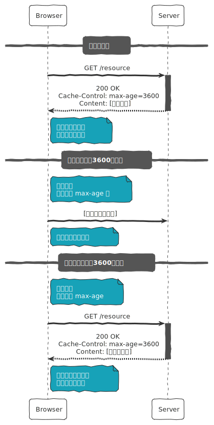
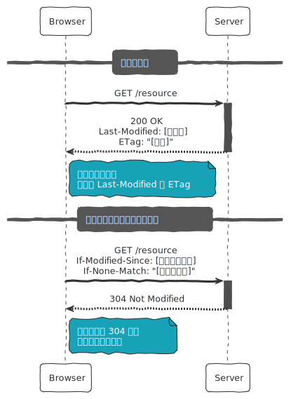
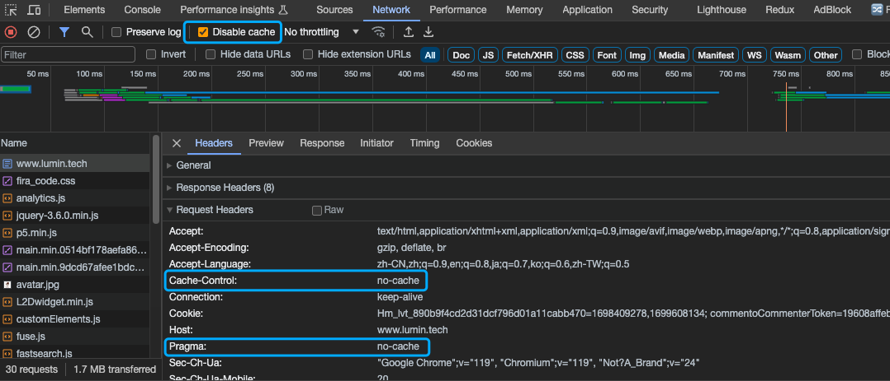

## HTTP 协议：缓存控制 
### 简介

HTTP 缓存是一种在客户端（如浏览器）或代理服务器中保存网页资源（如 HTML 页面、图像、JavaScript 文件等）副本的机制。这样，当再次需要相同资源时，可以直接从缓存中获取，而不是从远程服务器重新下载。HTTP 缓存可以`加快页面加载`，`减小服务器负载`，定制缓存策略。

缓存方式可以大致分为`新鲜度模型缓存`和`协商缓存`两类。

`新鲜度模型`的中，如果缓存在[保鲜期](https://www.rfc-editor.org/rfc/rfc9111.html#name-calculating-freshness-lifet) (Freshness Lifetime) 内，可以在`不进行验证`的情况下(即不需要检查原始服务器看缓存的响应是否仍对当前请求有效)重用本地缓存。

而如果响应不再新鲜了，使用`协商缓存`请求服务器进行`验证`，以确定浏览器本地缓存的资源是否仍然有效。

### 新鲜度模型

当一个响应被存储在缓存中时，根据 `Cache-Control` 或 `Expires` 头部的指令，缓存会判断该资源在一定时间内是否保持新鲜。如果资源仍然新鲜 (即在 max-age 时间内或未达到 Expires 时间)，客户端会直接从缓存中获取资源，而无需向服务器发出请求。他的验证流程如下：



### Cache-Control 指令

[Cache-Control](https://www.rfc-editor.org/rfc/rfc9111.html#name-cache-control) 是 `HTTP/1.1` 规范内容。它的值非常灵活，可以根据资源的特性和需求进行调整，以达到最佳的缓存效果。正确配置这些指令对于控制网页的缓存行为和提升网站性能至关重要。

例：max-age=3600，表示资源在接下来的 `1` 小时内有效。这个指令告诉浏览器该资源可以被缓存多长时间 (以`秒`为单位)，在这段时间内，浏览器**不需要**向服务器重新请求这个资源。

#### 特点

Cache-Control 头部字段被认为是`单向的` (unidirectional)。这意味着，尽管 Cache-Control 可以出现在请求和响应中，但请求中的缓存指令并不直接影响或决定响应中的缓存指令。

换句话说，客户端和服务器各自独立地设置它们认为合适的缓存策略，而不是自动沿用对方的设置。这种设计允许更灵活地控制缓存行为，因为客户端和服务器可能有不同的缓存需求和策略。

#### 请求指令

1. **max-age**：客户端希望获取的响应最大年龄。
2. **max-stale**：客户端愿意接受超过新鲜度时间的响应。
3. **min-fresh**：客户端希望响应在指定时间内保持新鲜。
4. **no-cache**：客户端要求每次使用缓存前`必须验证`其`新鲜度`。
5. **no-store**：缓存不得存储此请求或对应响应的任何部分。
6. **no-transform**：请求中介避免转换内容。
7. **only-if-cached**：客户端仅希望获取缓存的响应。

#### 响应指令

1. **max-age**：指定响应被认为陈旧的时间。
2. **must-revalidate**：一旦响应陈旧，缓存必须重新验证才能使用。
3. **must-understand**：限制响应缓存到理解该响应状态码要求的缓存。
4. **no-cache**：响应不能用于满足其他请求，除非先进行验证。
5. **no-store**：缓存不得存储请求或响应的任何部分。
6. **no-transform**：中介不得转换内容。
7. **private**：私有缓存可以存储响应，共享缓存不得存储。
8. **proxy-revalidate**：共享缓存在响应陈旧时必须重新验证才能使用。
9. **public**：缓存可以存储响应，即使正常情况下被禁止。
10. **s-maxage**：对共享缓存，此指令指定的最大年龄覆盖 max-age 指令或 Expires 头。

### 兼容 HTTP/1.0 的缓存字段

`Pragma` 和 `Expires` 在早期的 Web 应用中起着重要作用，特别是在提高网站性能和减少不必要的网络请求方面。随着 HTTP/1.1 的推出和广泛采用，`Cache-Control` 头引入了更多更复杂的`缓存控制策略`，但对于旧的或仅支持 HTTP/1.0 的系统，理解和使用这些头部仍然非常重要。

#### Pragma

`Pragma` 是一个 HTTP 头部字段，主要用于兼容 `HTTP/1.0` 缓存控制。在 HTTP/1.1 中，它通常用于以下场景：

1. **向后兼容**：`Pragma: no-cache` 是最常见的使用方式，用于向 HTTP/1.0 缓存机制指示不要缓存当前的资源。虽然在 HTTP/1.1 中，`Cache-Control: no-cache` 更为常见和有效，但 `Pragma: no-cache` 仍然在一些老旧系统或客户端中使用，以确保与只支持 HTTP/1.0 的缓存系统的兼容性。

2. **请求头中的缓存控制**：`Pragma` 通常只在请求头中使用，来告知服务器和任何中介缓存（如代理服务器）关于缓存的期望。响应头中很少使用 `Pragma`，因为有更具体的 HTTP/1.1 缓存控制头可用。

3. **无状态请求**：在某些情况下，尤其是在使用安全协议（如 HTTPS）时，设置 `Pragma: no-cache` 可以作为一种安全措施，以确保敏感信息不会被无意间缓存。

虽然 `Pragma` 头部在现代 Web 开发中已经较少使用，主要由于 `Cache-Control` 头的引入，但它仍然存在于 HTTP 规范中，以保证向后兼容性。在理解旧的 HTTP 客户端和服务器的行为时，了解 `Pragma` 的作用仍然很重要。

#### Expires

`Expires` 字段用于提供一个日期/时间，告诉浏览器在这个时间点之前不需要再次请求资源。如果设置为过去的时间，它可以用来表示资源已经过期，不应该被缓存。

在 HTTP/1.1 中，Expires 仍然有效，但通常被 Cache-Control 头中的 max-age 指令所取代，后者提供了更精确的控制。

在针对 HTTP/1.0 计算保鲜期时，通过 Expires - Date 来获取最大年龄。

``` text
Expires - Date = max-age
```

### 协商缓存

`协商缓存` (Negotiated Caching) 是基于`客户端`和`服务器`之间的通信来确定存储在客户端缓存中的资源是否仍然有效。这种机制涉及到两对主要的 HTTP 头部字段：`Last-Modified`/`If-Modified-Since` 和 `ETag`/`If-None-Match`。协商缓存的工作流程如下：



1. **初次请求和响应**：
   - 客户端（如浏览器）向服务器发送一个 HTTP 请求。
   - 服务器响应这个请求，并在响应头中包括 `Last-Modified`（资源最后修改的时间）和/或 `ETag`（资源的唯一标识符）字段。
   - 客户端接收响应，并将资源连同这些头部信息一起存储在本地缓存中。

2. **后续请求**：
   - 当客户端需要重新获取相同的资源时 (例如，当页面重新加载时)，它将发送一个新的请求。这次请求会包括 `If-Modified-Since` 头部，其值从缓存中获取的 `Last-Modified` 值设置，和/或 `If-None-Match` 头部，其值设置为之前存储的 `ETag` 值。
   - 服务器接收到请求后，将检查 `If-Modified-Since` 和 `If-None-Match` 头部的值。
     - 如果 `ETag` 匹配 (或者资源自 `Last-Modified` 日期以来没有更改)，服务器会发送一个 `304 Not Modified` 响应，无需重新发送整个资源。这告诉客户端它可以安全地使用其缓存副本。
     - 如果 `ETag` 不匹配 (或者资源已经更改)，服务器将发送一个完整的 `200 OK` 响应连同新的资源和更新后的头部信息。

#### 响应头

- **ETag**：叫作`实体标签`，服务器根据静态资源自动生成的`唯一标识符`。
  - 例：65568131-25e20
- **Last-Modified**：服务器在响应头表示静态资源的`最后的修改时间`。
  - 例：Thu, 16 Nov 2023 20:53:16 GMT

#### 请求头

- **If-None-Match**：上一次 ETag 的值。
  - 例：\W"65568131-25e20"，其中 `\W` 表示期望`弱校验器`(Weak Validator)，如果没有 \W 前缀表示强校验。
- **If-Modified-Since**：上一次 Last-Modified 的值。

### 拒绝缓存

#### Chrome DevTool 禁用缓存

在 Chrome 调试开启禁用缓存时，会在请求头设置如下请求头值，来告知服务器获取最新资源。

```text
Cache-control: no-cache
Pragama: no-cache
```



no-cache 要求服务必须进行验证，则请求头需要提供 `If-Modified-Since/If-None-Match` 值给服务器验证是否响应最新内容。

- 若验证通过，返回 304 Not Modified。
- 否则，返回最新内容。

#### 更新缓存键

`缓存键` (Cache Key) 是用来唯一标识存储在缓存中的特定资源的值。当一个请求到达缓存时，缓存系统使用这个键来查找是否已经存储了对应的响应。缓存键通常基于请求的某些部分构建，如请求的 `URL`、`请求方法` (通常是 GET 或 HEAD ) 以及其他可变因素。

现代构建工具生成资源文件时，通常可以基于文件内容生成像 `xxx.db19n4ob.js`，包含 hash 的文件名，如果资源内容发生改变，就会产生新的文件名，也就会改变 URL 从而更新缓存键。

而内容未发生变化的文件，将沿用之前的文件名。

\> [https://www.rfc-editor.org/rfc/rfc9111.html#name-overview-of-cache-operation](https://www.rfc-editor.org/rfc/rfc9111.html#name-overview-of-cache-operation)
