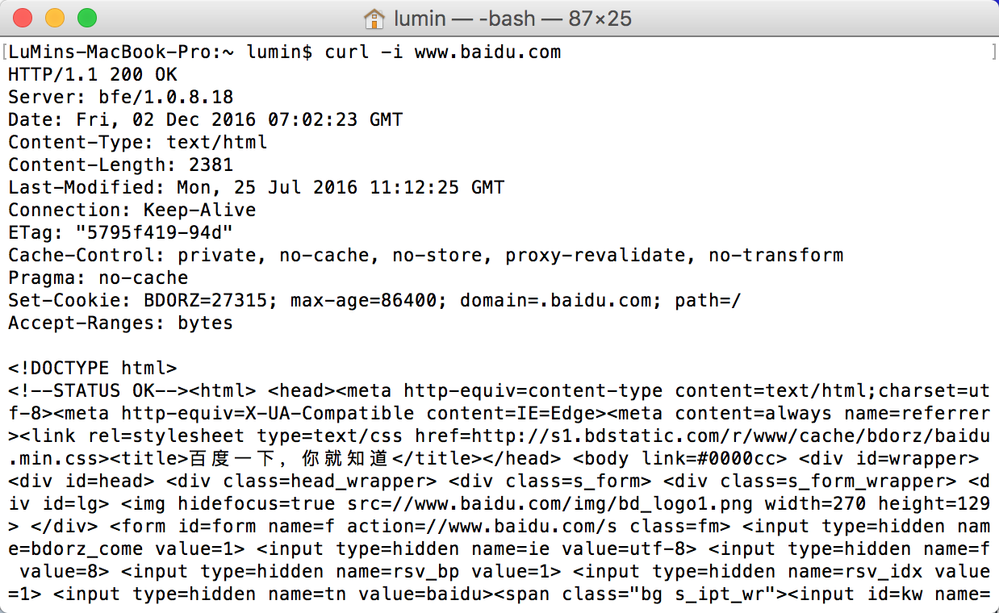

## Http1.1协议基础 
### 简介

HTTP (HyperTextTransferProtocol) 协议处于网络七层模型 (Open System Interconnection，开放系统互连) 中处于顶层协议。它是直接与应用程序进行信息沟通，因此具备一定的扩展性。比如：你可以自定义header里的键值对。

默认端口是80，这是服务器端的访问端口，是一个基本公共规范，而不是标准。所以端口是可以修改的。当然web服务器是用来提供公共服务的，不会去修改默认值的。

目前所使用的Http版本最常见的是Http1.1版本，打开浏览器调试功能的network模块都能找到类似于  `HTTP/1.1 200 OK` 格式的信息。它是由www协会和IETF组织一起发布的，在[RFC 2616](http://www.ietf.org/rfc/rfc2616.txt)文件中定义了HTTP 1.1，在这个文件里就可以知道Http协议的标准格式是如何。当然还是看中文版的好?,其实只要百度一下就有了。

版本的协议都需要客户端的支持，比如常见的客户端：浏览器。社会的进步永远不是一个人的战争，需要客户端和服务器端一同按照标准协议开发对应的软件。因为http1.1版本1997年就出世了，所以我们使用的时候并没觉得它的存在感如何，尤其对于已经被我们习惯使用的浏览器。它只有当出现开发问题时，才能刷出一些存在感。

2015年，HTTP/2 发布。它不叫 HTTP/2.0，没有子版本，下一版本将直接叫做HTTP/3。

### Http协议格式

基于实践理解该协议可概括为三部分组成：`请求行/响应行`、`请求/响应头(header)`、`实体(body)`。

以下是在mac上使用 `curl -i www.baidu.com` 命令查看http协议的服务器`响应(response)消息`输出。



#### 请求行

http协议的开始会包含目标Url、请求方法、返回状态码、目标地址及端口的信息。

``` bash
Request URL:http://www.lumin.tech:12345/
Request Method:GET
Status Code:200 OK
Remote Address:114.55.136.250:80
```

#### 响应行

HTTP/1.1 200 OK
请求／响应头(Header)
header是http协议里信息对于前端开发来说是经常需要查看的信息。

##### 请求头(Request Header)

``` bash
Accept:text/html,application/xhtml+xml,application/xml;q=0.9,image/webp,*/*;q=0.8
Accept-Encoding:gzip, deflate, sdch
Accept-Language:zh-CN,zh;q=0.8,en;q=0.6,ja;q=0.4,ko;q=0.2,zh-TW;q=0.2
Connection:keep-alive
Cookie:wp-settings-1=hidetb%3D1%26libraryContent%3Dbrowse%26editor%3Dtinymce%26post_dfw%3Doff%26editor_plain_text_paste_warning%3D1; wp-settings-time-1=1480000679; wordpress_test_cookie=WP+Cookie+check
Host:www.lumin520.com
Upgrade-Insecure-Requests:1
User-Agent:Mozilla/5.0 (Macintosh; Intel Mac OS X 10_12_0) AppleWebKit/537.36 (KHTML, like Gecko) Chrome/54.0.2840.98 Safari/537.36
```

##### 响应头(Response Header)

``` bash
Date: Fri, 02 Dec 2016 07:14:12 GMT
Server: Apache/2.4.7 (Ubuntu)
X-Powered-By: PHP/5.5.9-1ubuntu4.20
Link: <http://www.lumin.tech:12345/wp-json/>; rel="https://api.w.org/"
Vary: Accept-Encoding
Content-Encoding: gzip
Content-Length: 6974
Keep-Alive: timeout=5, max=100
Connection: Keep-Alive
Content-Type: text/html;
charset=UTF-8
```

#### 实体(body)

该里面包含实际请求或响应的信息。常见的json格式数据传输或者其它内容的数据都放在此处。

#### 常用字段

常用的一些字段往往对于理解和开发调试工作有一些帮助。

##### Connection：keep-alive

在http1.0之前是没有这个字段的，所以服务器对于客户端每个请求都得新建TCP连接。TCP的建立对于服务器端来说是好资源行为，所以在http1.0引入这个字段，并在http1.1里标准化。这样当一个请求到达服务器端时，连接在服务器设定好的时间内不会被关闭连接，下次同一个客户端地址发送过来请求就可以在这个连接重复使用。
也因为如此一旦第一个请求因为各种原因服务器响应速度较慢，那后面的请求都将被阻塞住，既导致"队头阻塞" (Head-of-line blocking) 。
所以有两种优化方式，对于前端来说就是减少请求数，而对于服务器来说就是对于同源的客户端同时开多个持久连接。
对于前端开发来说就需要网页优化技巧，比如合并脚本和样式表、将图片嵌入CSS代码、域名分片 (domain sharding) 等等

##### Set-Cookie 和 Cookie

cookie用于存储客户端的状态信息。比如常见的用户登录网站成功后返回的标识,也是作为浏览器解决保存用户登录状态信息问题的首选。
Set-Cookie  字段是由服务器端来设置http协议响应头(respone header)的，而Cookie字段则是客户端发送服务器时，由http协议的请求头(request header) 附带字段。客户端可以修改Cookie的值。

##### Content-Type

常见的类型有如下：

* text/plain
* text/html
* text/css
* image/jpeg
* image/png
* image/svg+xml
* audio/mp4
* video/mp4
* application/javascript
* application/pdf
* application/zip
* application/atom+xml

后台会依据这个字段知道处理内容的类型。对了这些类型统称 `MIME type(Multipurpose Internet Mail Extensions Type)`，最初是用于邮件附加的类型功能，现在明显已经不只是邮件所使用的附件传输的类型标记了。
标记类型不只是让服务器知道这是图片或者其它类型然后做响应处理，客户端也是如此。浏览器下载文件的后缀名可不是靠摇塞子生成的。

##### Content-Length

代表消息实体(body)内容的长度。对于http1.0协议来说必须包含此字段，因为服务器知道内容的长度，才知道解析内容的结尾。但是在http1.1里，这个字段却不是必须的。因为http1.1文件协议定义里在传输方式有所改变。

不过还是会附带上这个属性，为了兼容仅支持http1.0协议的服务器。除非确定了服务器版本高于1.0。

##### 传输编码 ` (Transfer-Encoding) `和 内容编码` (Content-Encoding & AcceptEncoding) `

上面提到传输方式有所改变，这也有关联到其它内容。传输编码不同于内容编码，内容编码作用于消息的实体(body)，而传输编码作用于整个消息。内容编码的作用主要用于压缩，而传输编码则是出于消息安全的考虑。

当Transfer-Encoding的值为"chunked"时，也就是所谓的"块化"传输方式。不同以往的把内容消息一次性缓存到服务器上，然后在做处理。而是按"流"的方式，把消息多块化，每一块包含消息和改块消息长度。一次处理一块的大小，以此可以节省服务器内存消耗。

### 常用状态码 (HTTP/1.1 200 OK )

200：常见完整的请求成功。

403：常见的服务器资源访问权限问题。

400：Bad Request。一般来说可能是请求消息的参数问题。检查header里的键值对。

404：表示服务器上的资源未能在当前路径找到。

500：这个错误也是出现率比较高的，错误在于服务器端的后台程序错误，但是不代表后台就是错误一方，因为也有可能是只前端和后台在约定的接口上有所出入。假如前端通过ajax请求发现这样的错误，还是马上和后台开发人员商量为好。
