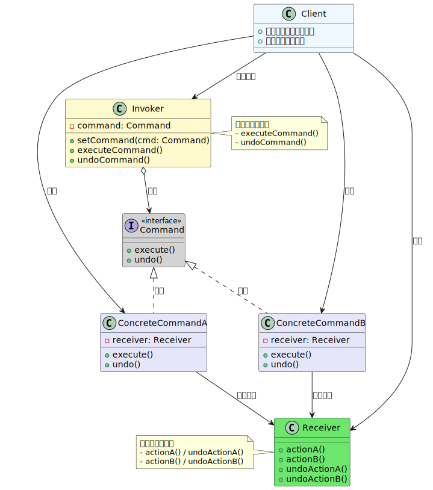

## Java 设计模式 (五) - 命令模式 
### 概念

简单来说就是任务执行的细分。分别得设置了任务请求对象和任务执行对象。而关联它们的方法就是设置一个接口，让实现接口的实例包裹被执行的任务，然后它再把自己送到执行者那里去执行。

虽然叫命令模式，但显然容易让思维限制住。名字不怎么好，而且网络上举的例子不太能够让人明白过来。

### 类图



#### 举例

以`遥控器控制家电`为例。

**接收者** (Receiver)：灯泡

``` java
class Light {
    public void turnOn() {
        System.out.println("Light is ON");
    }
    public void turnOff() {
        System.out.println("Light is OFF");
    }
}

```

**命令接口**：

``` java
interface Command {
    void execute();
    void undo();  // 可选：支持撤销
}
```

**实现命令接口**：灯的开关命令

``` java
class TurnOnLightCommand implements Command {
    private Light light;

    public TurnOnLightCommand(Light light) {
        this.light = light;
    }

    @Override
    public void execute() {
        light.turnOn();
    }

    @Override
    public void undo() {
        light.turnOff();
    }
}
```

**调用者** (Invoker)：遥控器按钮

``` java
class RemoteControlButton {
    private Command command;

    public void setCommand(Command command) {
        this.command = command;
    }

    public void pressButton() {
        command.execute();
    }

    public void pressUndo() {
        command.undo();  // 可选：撤销操作
    }
}
```

**客户端** (Client) 调用：

``` java
public class Client {
    public static void main(String[] args) {
        // 创建接收者
        Light light = new Light();
        
        // 创建命令并绑定接收者
        Command turnOn = new TurnOnLightCommand(light);
        
        // 配置调用者
        RemoteControlButton button = new RemoteControlButton();
        button.setCommand(turnOn);
        
        // 触发操作
        button.pressButton();  // 输出：Light is ON
        button.pressUndo();    // 输出：Light is OFF
    }
}
```
