## Javascript 事件循环机制 
### 基本执行示意图

它们的执行顺序是：

1. 首先，执行全局脚本中的同步代码。
2. 同步代码执行完毕后，调用栈被清空。
3. 然后，事件循环会检查`微任务队列`。如果微任务队列中有任务，那么这些任务会被连续执行，**直到**微任务队列为空。
4. 一旦微任务队列为空，浏览器可能会执行一些渲染工作 (如果有需要)。
5. 接下来，事件循环会从`宏任务队列`中取出一个宏任务执行。
6. 完成一个宏任务后，浏览器会**再次检查**微任务队列，并执行里面的所有任务。
7. 每当一个宏任务执行完毕后，微任务队列将被清空，然后浏览器可能会进行渲染，之后循环回到下一个宏任务，以此类推。

这意味着，如果在执行宏任务或者渲染之后有新的微任务被添加到微任务队列中，它们会在下一个宏任务执行之前完成。这也是为什么微任务可以用来实现比宏任务**更细粒度**的异步控制。

### 阐述

Javascript 中单线程实现异步的设计思想，比较简单。提供一个队列和暴露外部的 api，每当遇到异步任务就通过 api 加入队列，直到执行栈里无执行任务时，把队列里的任务取出来执行便可。

这有个在线可视化工具，用于帮助理解事件循环机制以及概念， 工具也是开源的。
[http://latentflip.com/loupe](http://latentflip.com/loupe)

### 基本概念

#### 调用栈 (Call Stack)

JavaScript 运行时包含一个`单线程调用栈`，这意味着它一次只能执行一个任务。当一个函数执行时，它会被放到栈顶，一旦该函数执行完毕，它就会从栈顶移除。

#### 事件循环 (Event Loop)

用于提取任务队列里的任务，然后把其加入执行栈执行。

#### 宏任务队列 (Macro Task Queue)

当异步事件发生时，例如一个时间延迟到期 (setTimeout)、一个外部资源加载完成 (如 AJAX 响应到达)，或者一个事件被触发 (如用户点击)，一个任务 (也称为“事件”) 会被添加到任务队列中。

例如：WebAPI 里的 onClick，需要绑定一个函数，那么这个函数在用户出发单击事件时，就会进入任务队列。

这类任务 WebAPI 提供的接口有以下一些：

* setTimeout
* setInterval
* setImmediate
* `requestAnimationFrame`
* I/O
* UI rendering

#### 微任务队列 (Micro Task Queue)

微任务 (例如 Promise 的.then、.catch、.finally 方法或 MutationObserver 的回调) 会被添加到一个特殊的微任务队列。在当前函数执行结束后，事件循环会立即处理所有的微任务队列，这个过程会在下一个宏任务 (macro-task) 开始前完成。

这类任务 WebAPI 提供的接口有以下一些:

* process.nextTick (Node 环境)
* Promises
* Object.observe
* MutationObserver

参考资料：

\> [https://developer.mozilla.org/en-US/docs/Web/JavaScript/EventLoop](https://developer.mozilla.org/en-US/docs/Web/JavaScript/EventLoop)

\> [https://www.youtube.com/watch?v=8aGhZQkoFbQ](https://www.youtube.com/watch?v=8aGhZQkoFbQ)

\> [https://www.jianshu.com/p/d3ee32538b53](https://www.jianshu.com/p/d3ee32538b53)
