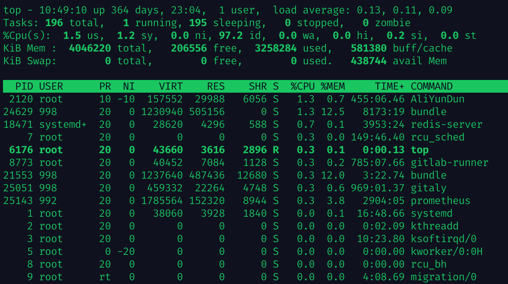
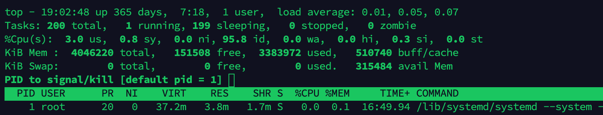
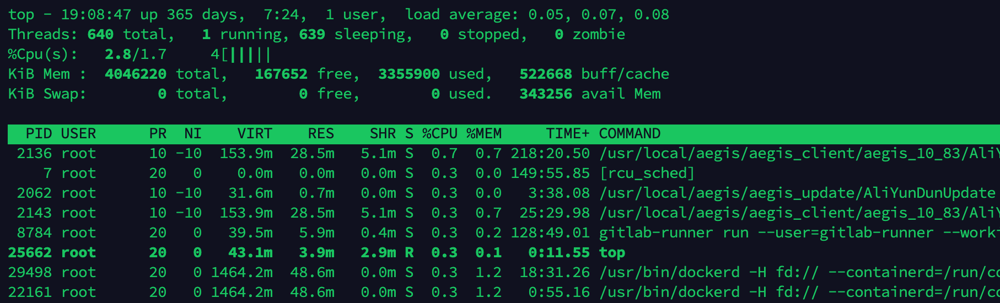
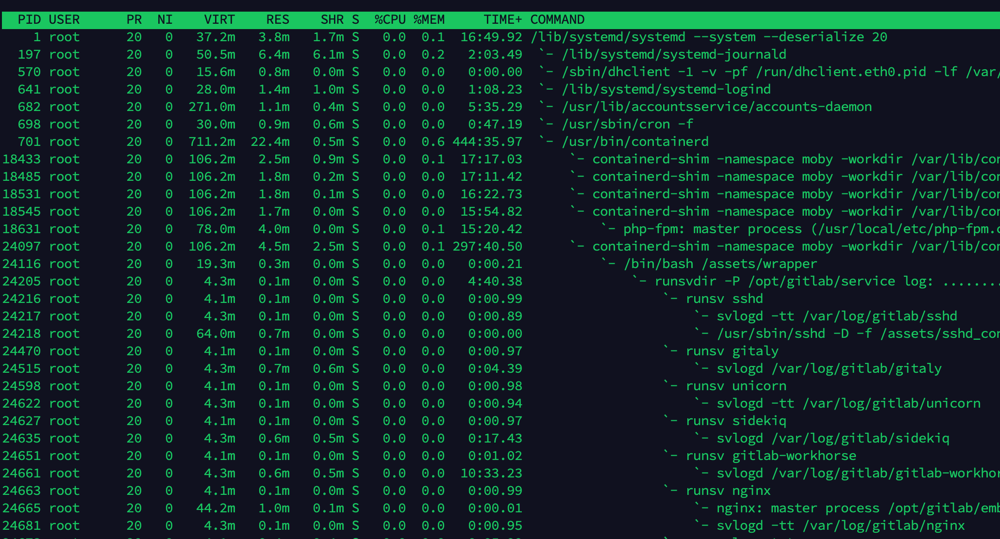
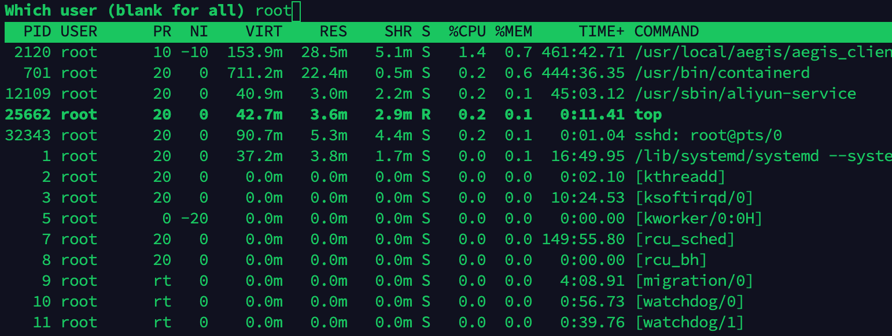
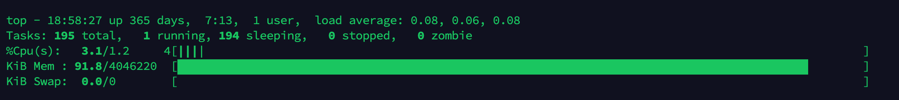

## Linux 的 top 命令 
### 简介

当你想做的事越多，接触的新事物就越多。今天就来说一下监控服务器性能的常用命令之Top命令。

它用来`显示进程动态`，包含我们经常要查看`内存`、`CPU` 等关键状态信息。以此来判断是哪项进程异常抢占系统资源，然后考虑是否关闭进程。
top命令已经成为衡量设备运行状况的关键指标。

 `RAM` 下面用到 RAM 概念是不包含交换空间 (Swap) 的物理内存。可能会有不理解的同学。

### 使用

``` bash
top
```



### 前5行的统计信息

#### 第1行 top

这行展示系统的摘要信息

``` bash
top - 10:49:10 up 364 days, 23:04,  1 user,  load average: 0.13, 0.11, 0.09
```

* `10:49:10`：系统当前时间。
* `364 days, 23:04`：系统已经运行了 364 天 23 分钟 4 秒。
* `1 user`：登录的用户数，如果要获取当前登录的用户列表，可以使用 `who` 命令
* `0.13, 0.11, 0.09`：系统平均负载，三个数值分别为 1分钟、5分钟、15分钟内的任务队列平均长度。

> load average 是Linux服务器在定义的时间段内的平均系统负载，换句话来说，一定时间内正在运行的线程和正在等待的线程之和。对于多核处理器，如果数值/核数 ≤ 1 ，那说明系统运行正常。如果数值/核数 > 1，那系统运行新任务就会放缓。

有些[APM (Application Performance Monitor)](https://baike.baidu.com/item/APM/18679992#viewPageContent)软件通常会提供 `load average` 指标，如果发现`数值 > 自己所设置的阈值`，就会触发上载服务器脚本或添加服务器命令以终止消耗最高CPU的进程，这样就可以实现自动化。列举一个软件： [site24x7](https://www.site24x7.com/help/overview.html)。

---

#### 第2行 Tasks

Tasks 统计了运行的进程信息

``` bash
Tasks: 196 total,   1 running, 195 sleeping,   0 stopped,   0 zombie
```

* `196 total`：目前运行的进程总数，当然这并不代表运行的进程已执行。
* `1 running, 195 sleeping,   0 stopped,   0 zombie`：进程的运行状态。`1`个进程正在执行，`195`个进程正在等待事件完成或等待 I/O 操作完成，`0`个已停止的进程，`0`个僵尸进程。

这里会涉及到系统对进程的处理方式。系统会给每个进程进行状态标记
> 如果一个进程执行 I/O 操作时并且 CPU 处于空闲状态，那么系统会切换执行其它进程。另外如果在系统允许的执行时间内进程未执行完任务，系统依然会切换执行进程。这样让用户感知好像是“多任务”处理。所以系统需要对每个进程进行状态标记。

进程有下面几个状态标记：

* `Runnable (R)` ：处于此状态的进程正在CPU上执行，或者存在于运行队列中，可以执行。
* `Interruptible sleep (S)` ：处于此状态的进程正在等待事件完成。
* `Uninterruptible sleep (D)` ：在这种情况下，进程正在等待 I/O 操作完成。
* `Stopped (T)` ：这些进程可以被[作业控制信号](https://www.gnu.org/software/libc/manual/html_node/Job-Control-Signals.html) (例如，按Ctrl + Z) 停止或已被跟踪停止。
* `僵尸 (Zombie，Z)`：内核在内存中维护各种数据结构，以跟踪进程。一个进程可能会创建多个子进程，并且它们可能在父进程仍然存在时退出。但是，必须保留这些数据结构，直到父级获得子进程的状态为止。这样已终止的数据结构却还在的进程称为“僵尸”。

---

#### 第3行 %Cpu(s)

这一行统计了 CPU 的使用情况。

``` bash
%Cpu(s):  1.5 us,  1.2 sy,  0.0 ni, 92.2 id,  0.0 wa,  0.0 hi,  0.2 si,  0.0 st
```

* `1.5 us`：用户空间占用CPU百分比。
* `1.2 sy`：内核空间占用CPU百分比。
* `0.0 ni`：用户进程空间内改变过优先级的进程占用CPU百分比。
* `92.2 id`：CPU保持空闲的时间比。大多数操作系统在空闲时都会将CPU置于省电模式。
* `0.0 wa`：等待 I/O 的CPU时间百分比。
* `0.0 hi`：硬中断 (Hardware IRQ) 占用CPU的百分比,CPU服务于硬中断所耗费的时间总额。
* `0.2 si,  0.0 st`：CPU服务于软中断所耗费的时间总额、Steal Time。

---

#### 第4行 Mem

这行是显示运行内存(RAM)的使用情况。

``` bash
KiB Mem :  4046220 total,   206556 free,  3258284 used,   581380 buff/cache
```

单位默认以千字节 (KiB) 展示。按前面的快捷操作大写 `E` 可以切换展示单位。

* `4046220 total, 206556 free, 3258284 used`：就如字面理解一样“一共”、“空闲”、“已使用”的内存大小。
* `581380 buff/cache`：磁盘缓存。Linux 内核还尝试以各种方式减少磁盘访问时间，所以它在 RAM 中维护“磁盘缓存”，在 RAM 中存储磁盘的常用区域。

> 磁盘写操作存储在“磁盘缓冲区”中，内核最终将其写出到磁盘中。它们消耗的总内存为“buff/cache”值。这听起来似乎是一件坏事，但实际上并非如此。这块缓存使用的内存将在需要时会及时分配给进程。

---

#### 第5行 Swap

这行是交换空间的使用信息。机子的内存不够时，我们都考虑使用 Swap，即拿硬盘的一部分，作为 RAM 一样使用。

当 RAM 使用率接近满时，RAM 的不常用区域将写入 Swap，以备以后需要时检索。但是由于访问磁盘的速度很慢，因此过多地依赖 Swap 会损害系统性能。

``` bash
KiB Swap:        0 total,        0 free,        0 used.   438744 avail Mem 
```

* `KiB Swap: 0 total, 0 free, 0 used` ：就如字面理解一样“一共”、“空闲”、“已使用”的交换空间大小。
* `438744 avail Mem`：可用作内存交换的交换空间大小。

> 如果 RAM 的可用 (free) 内存还有，那么就不会引起和磁盘进行存储交换。

### 任务列表区域

任务区域的列表比较简单，直接看表头含义即可。

``` bash
 PID USER      PR  NI    VIRT    RES    SHR S  %CPU %MEM     TIME+ COMMAND 
```

* `PID` ：进程ID。它是标识进程的唯一正整数。我们可以通过 `kill 命令` 带上 PID 来杀掉进程。
* `USER` ：启动该进程的“有效”用户名。Linux为进程分配一个`真实的用户ID`和一个`有效的用户ID`。后者允许进程代表另一个用户执行操作。 (例如，非root用户可以提升为root用户才能安装软件包。)
参考资料：
* `NI` ：NI 字段显示进程的 nice 值，负值表示高优先级，正值表示低优先级。
* `PR` ：PR 字段从内核的角度显示了进程的调度优先级。nice 值会影响进程的优先级。
* `VIRT` ：进程消耗的内存总量。这包括程序的代码、进程存储在内存中的数据以及 Swap 的任何内存区域，即`包含(RAM 和 Swap)`。
* `RES` ：是该进程在 RAM 中消耗的内存`(不包含 Swap)`。
* `SHR` ：是与其他进程共享的内存量。
* `％MEM`：进程消耗 RAM 内存总量的百分比。
* `S` ：进程状态。和前面叙述的一样，进程可能处于各种状态。此字段以`单字母`形式显示过程状态。
* `TIME+` ：自进程启动以来所使用的 CPU 总时间，精确到 `1/100` 秒。
* `COMMAND` ：进程名称。

### 常用操作

#### 基本操作

* `上下左右箭头`：可以用来纵向滚动列表和横向滚动列表。
* `q` : 退出top或取消用户操作。
* `E` : 大写的 E 可以切换展示的数据`单位`。

#### 终止进程

* `k` : 弹出一个提示，用来杀掉进程。



提示输入进程的`进程ID`，如果此处留空白，默认选择最顶层的进程 ID。
然后按 `Enter` 键会提示输入用于`终止进程的信号(SIGNAL)`，如果此处留空白，默认会使用 `SIGTERM` 信号。

 `SIGTERM` 信号允许进程`正常终止`。如果想要`强制终止`，键入 `SIGKILL` 。也可以使用`信号编号`。例如，`SIGTERM`的数字为`15`，`SIGKILL` 的数字为`9`。

#### 排序

* `M` ：按内存使用量排序
* `P` ：按CPU使用率排序
* `N` ：按进程ID排序
* `T` ：按运行时间排序
* `R` ：切换升降排序

#### 显示线程列表

* `H` ：切换线程，再按一次切换回来。top 在其输出中显示进程列表。如果要列出线程，则在 top 运行时按 `H` 。
当然你也可以执行命令显示

``` bash
top -H
```



你会发现第2行的 `Tasks:` 变成了 `Threads:` 。在Linux内核内部，线程和进程`使用相同的数据结构`进行处理。因此，每个线程都有其自己的ID，状态等。

#### 显示完整运行路径

* `c` ：切换完整运行路径，再按一次切换回来。
当然你也可以执行命令显示

``` bash
top -c
```


在显示`完整路径`的情况下，top 展示上也会区分`内核空间进程`和`用户空间进程`。内核空间进程周围带有`方括号[]`标记。

#### 查看进程启动先后关系

* `V` ：查看流程的子级父级。可以看到启动的层级视图。



#### 列出某个用户的所有进程

* `u` ：提示输入用户名。输入用户名 Enter 即可。

当然你也可以执行命令显示

``` bash
top -u root # 列出 root 用户所有的进程
```



#### 改变统计信息的样式

* `t` ：反复按下，可以切换顶部统计信息 CPU 的显示样式
* `m` ：反复按下，可以切换顶部统计信息 Mem和 Swap 的显示样式



#### 保存设置

* `W` : 保存对 top 的输出进行了任何更改。top 将其配置写入 `.toprc` 主目录中的文件。

### 总结

top 还有很多其它设置，上面只涉及常用的几个操作。更多操作请用 `man top` 在系统上运行查看手册页。

参考资料：

\> [https://www.site24x7.com/blog/load-average-what-is-it-and-whats-the-best-load-average-for-your-linux-servers](https://www.site24x7.com/blog/load-average-what-is-it-and-whats-the-best-load-average-for-your-linux-servers)

\> [https://juejin.im/post/6844904041483337741](https://juejin.im/post/6844904041483337741)

\> [https://www.booleanworld.com/guide-linux-top-command/](https://www.booleanworld.com/guide-linux-top-command/)
