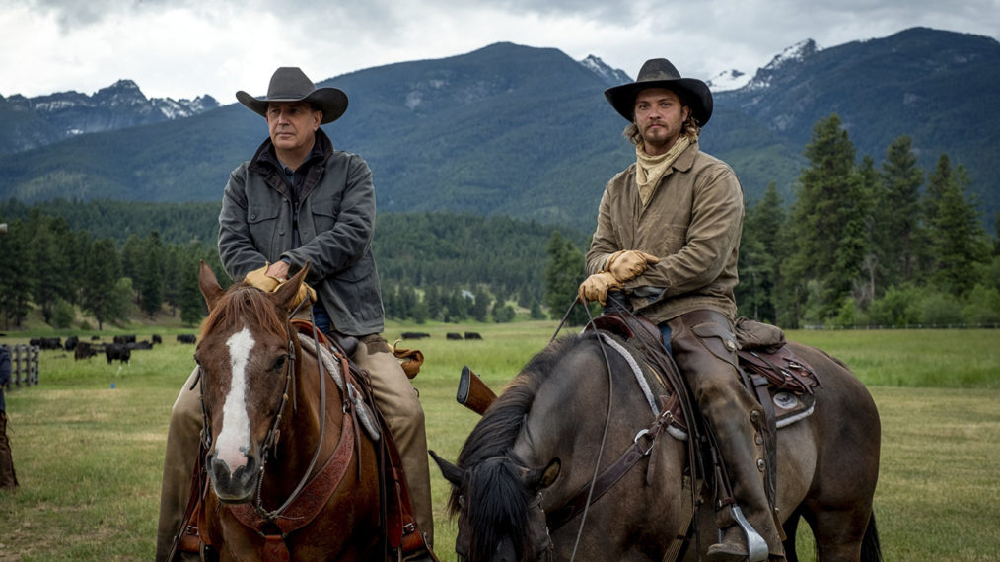

## My First Posting In English 
It's time to make some changes. In the past, I only wrote in Chinese, but I realized that wouldn't help me progress anymore. My thoughts, my Knowledge, my opinions, my perspectives—all of them have been caged. It's pretty terrible.

I asked myself, 'What do you need?' To be honest, it's a broad question. I don't want to do the same things day after day. It reminded me of a quote from `Yellowstone`, a popular American TV series about Western cowboys. It says:

> 'Living day to day isn't living, it's surviving with no regard for tomorrow.'

These words, said by `John Dutton`, the main character played by [Kevin Michael Costner](https://en.wikipedia.org/wiki/Kevin_Costner), left a mark on my heart.

On the left is `Kevin Costner`, and on the right is [Orlando Bloom](https://en.wikipedia.org/wiki/Orlando_Bloom), who played a main character in `Pirates of the Caribbean`.

`Yellowstone` is a contemporary western series, so it's not old-fashioned like a typical cowboy story. The plot is tight and thrilling, with a lot of excitement and profound insights. Even I view it as my favorite because of their perfect acting skills, beautful natural scenery and the freedom of ranch life. It's really a great recommendation for the friends.
