## NGINX-RTMP 实现直播流媒体服务 
### 流媒体服务是如何工作？

它的工作流程如下图：



1. 流推送服务把流 (视频流、音频流等)推送到流服务平台。
2. 流服务平台根据支持的流媒体传输协议处理这些流。
3. 用户通过对应的流媒体传输协议获取这些流。

不同的流媒体传输协议有不同的应用场景。

### 流媒体传输协议

常见的流媒体传输协议有 `RTMP` (Real-Time Messaging Protocol) 、`HLS` (HTTP Live Streaming) 和 `DASH` (Dynamic Adaptive Streaming over HTTP) ，它们用于在互联网上传输音频和视频内容。

它们各自具有不同的特点和用途：

1. **RTMP (Real-Time Messaging Protocol)**：
   * **特点**：
     * RTMP 是 Adobe 公司开发的实时消息传递协议，最初用于传输音频和视频数据。它建立在 TCP 上，因此具有较低的延迟，适用于需要实时性的应用，如在线游戏直播和视频会议。
     * 支持点对点通信，可以实现低延迟的视频流。
     * 常用于 Adobe Flash 播放器，但现在已经不再被广泛支持，因为 Flash 技术已经被淘汰。
   * **应用**：以前用于实时直播，但现在`已被其他协议和技术所取代`。

2. **HLS (HTTP Live Streaming)**：
   * **特点**：
     * HLS 是由`苹果开发的流媒体协议`，`使用 HTTP 协议`进行传输，通常基于 TS (Transport Stream) 容器格式。
     * HLS 将媒体文件`切分成小段`，每个段通常为 2 至 10 秒。客户端可以自动选择适合其带宽和设备的段。
     * 适用于各种设备，包括 iOS 和 Android 设备，以及各种流媒体播放器。
   * **应用**：广泛用于`点播`和`直播`流媒体，特别是在移动设备上。

3. **DASH (Dynamic Adaptive Streaming over HTTP)**：
   * **特点**：
     * DASH 是一个开放标准，允许通过 HTTP 传递自适应流媒体。它与 HLS 类似，但`不受特定厂商的控制`。
     * DASH 允许内容提供商创建多个不同质量和分辨率的媒体文件，以便客户端可以选择最适合其带宽和设备的版本。
     * 支持广泛的编解码器和容器格式。
   * **应用**：DASH 是一个开放的标准，可以应用于各种流媒体服务，尤其是需要跨多个平台和设备的场景。

总结：

* RTMP 适合需要实时性的应用，但由于其依赖于Flash技术，已经被淘汰。
* HLS 适用于移动设备和广泛的流媒体播放器，以点播和直播为主。
* DASH 是一种开放标准，适用于各种流媒体服务，尤其是需要跨平台和设备的场景。

下面讲介绍如何搭建个人的流媒体服务，实现基于 HLS 协议的流播放。

### 安装和配置 Nginx-RTMP

下面基于 Ubuntu 发行版的安装：

``` shell
sudo apt update
sudo apt install libnginx-mod-rtmp
```

实际因为 nginx 版本的不同，上面的方式有时候并不匹配已有的 nginx 版本，你可能会遇到`安装依赖冲突`等问题。

由于 RTMP 模块是第三方模块，所以它也不包含在 nginx 安装包内。最为实用的方式是和 nginx 一起基于源码来编译它，RTMP 将会作为静态模块加载。

> RTMP 模块的安装是依赖于 nginx 版本的，因此推荐基于 nginx 源码安装。自给自足，丰衣足食。

#### 基于源码的安装

进入 nginx 源码目录，然后运行下面命令：

``` shell
./configure --add-module=/path/to/nginx-rtmp-module
make
make install
```

安装的模块不会自动开始提供流。需要在 nginx 配置文件中添加一个配置块，用于定义流的`可用位置`和`方式`。

编辑 nginx 的配置文件：

``` conf
rtmp {
  server {
    listen 1935;
    chunk_size 4096;
    allow publish 127.0.0.1;
    deny publish all;

    application media {
      live on;
      record off;
    }
  }
}
```

* `listen 1935` 设置使 `RTMP` 将侦听端口 `1935` 上的连接，这是标准的。
* `chunk_size 4096` 设置使 `RTMP` 将以 `4KB` 块的形式发送数据，这也是标准的。
* `allow publish 127.0.0.1` 并 `deny publish all` 意味着服务器将只允许从本地主机推送流给 RTMP 服务，以避免任何其他远端用户推送自己的流到服务器上。
* `application media` 定义一个应用名 `media`，这使得 URL 路径 `/media` 变为可用。
* `live on` 启用实时模式，以便多个用户可以同时连接到您的流，这是视频流的基本假设。
* `record off` 禁用 Nginx-RTMP 的录制功能，因此默认情况下所有流不会单独保存到磁盘。

Nginx-RTMP 同时支持 [HLS](https://en.wikipedia.org/wiki/HTTP_Live_Streaming) 协议和 MEPG [DASH](https://en.wikipedia.org/wiki/Dynamic_Adaptive_Streaming_over_HTTP) 协议。我们使用基于 HTTP 的 HLS 传输协议。

HLS 协议规定单个文件需要分割成若干个片段，通常 `.ts` 为后缀的文件。同时包含一个 `.m3u8` 格式的元信息文件，用于描述各个`片段的存储位置`和`播放时间点`等信息。

``` conf
rtmp {
  server {
    listen 1935;
    chunk_size 4096;
    allow publish 127.0.0.1;
    deny publish all;

    application media {
      live on;
      record off;
      # https://github.com/arut/nginx-rtmp-module/wiki/Directives#hls
      hls on;
      hls_path /usr/share/nginx/stream/music/hls/;
      hls_base_url http://lumin.tech/stream/music/hls/;
      hls_nested on;
      hls_fragment 10;
      hls_cleanup off;
      hls_playlist_length 3600;
    }
  }
}
```

* `hls on` 表示启用 HLS 协议。
* `hls_path` 指定了 RTMP 服务分割的文件存储位置。
* `hls_fragment` 表示分片时长，默认 5 秒。
* `hls_playlist_length` 它指定了 HLS 播放列表 (通常是.m3u8文件) 的长度，以确定服务器将保留多长时间的历史播放列表。
* `hls_nested on`：切换 HLS 嵌套模式。hls_path 在此模式下，将为每个流创建一个子目录。播放列表和片段是在该子目录中创建的。默认关闭。
* `hls_cleanup off`：切换 HLS 清理。默认情况下该功能处于开启状态。在此模式下，nginx 缓存管理器进程会从 HLS 目录中删除旧的 HLS 片段和播放列表。

你可以在[这里](https://github.com/arut/nginx-rtmp-module/wiki/Directives#hls)看到更多的 hls 详细配置。

### 指定访问 m3u8 的虚拟目录

最后，我们在 Nginx 配置一个虚拟地址，让播放器可以访问到 `.m3u8` 文件。

``` conf
server { 
  listen 80;
  server_name lumin.tech;
  location /stream/hls/ {
    root /usr/share/nginx/stream/hls;
    add_header Access-Control-Allow-Origin *;
  }
}
```

### 使用 Docker 创建 RTMP 服务

通过容器化来创建应用是个不错的选择，它方便后续的维护和迁移。

下面使用基于 nginx 源码 和 RTMP 源码来安装 nginx 和 RTMP 模块方式：

``` dockerfile
FROM buildpack-deps:bullseye

LABEL maintainer="Lumin <527724143@qq.com>"

# 设置我们需要的 Nginx 和 RTMP 版本
ENV NGINX_VERSION nginx-1.23.1
ENV NGINX_RTMP_MODULE_VERSION 1.2.2

# 安装依赖
RUN apt-get update && \
    apt-get install -y ca-certificates openssl libssl-dev && \
    rm -rf /var/lib/apt/lists/*

# 下载和解压 Nginx
RUN mkdir -p /tmp/build/nginx && \
    cd /tmp/build/nginx && \
    wget -O ${NGINX_VERSION}.tar.gz https://nginx.org/download/${NGINX_VERSION}.tar.gz && \
    tar -zxf ${NGINX_VERSION}.tar.gz

# 下载和解压 RTMP 模块
RUN mkdir -p /tmp/build/nginx-rtmp-module && \
    cd /tmp/build/nginx-rtmp-module && \
    wget -O nginx-rtmp-module-${NGINX_RTMP_MODULE_VERSION}.tar.gz https://gitee.com/cowboy_love_520/nginx-rtmp-module/repository/archive/v1.2.2.tar.gz && \
    tar -zxf nginx-rtmp-module-${NGINX_RTMP_MODULE_VERSION}.tar.gz


# 重命名解压后的目录
RUN mv /tmp/build/nginx-rtmp-module/nginx-rtmp-module-v${NGINX_RTMP_MODULE_VERSION} \
/tmp/build/nginx-rtmp-module/nginx-rtmp-module-${NGINX_RTMP_MODULE_VERSION}

# 构建和安装 Nginx
RUN cd /tmp/build/nginx/${NGINX_VERSION} && \
    ./configure \
        --sbin-path=/usr/local/sbin/nginx \
        --conf-path=/etc/nginx/nginx.conf \
        --error-log-path=/var/log/nginx/error.log \
        --pid-path=/var/run/nginx/nginx.pid \
        --lock-path=/var/lock/nginx/nginx.lock \
        --http-log-path=/var/log/nginx/access.log \
        --http-client-body-temp-path=/tmp/nginx-client-body \
        --with-http_ssl_module \
        --with-threads \
        --with-ipv6 \
        --add-module=/tmp/build/nginx-rtmp-module/nginx-rtmp-module-${NGINX_RTMP_MODULE_VERSION} --with-debug && \
    make -j $(getconf _NPROCESSORS_ONLN) && \
    make install && \
    mkdir /var/lock/nginx && \
    rm -rf /tmp/build

# 创建符号链接以将 Nginx 的访问日志和错误日志输出到写入到容器的标准输出
RUN ln -sf /dev/stdout /var/log/nginx/access.log && \
    ln -sf /dev/stderr /var/log/nginx/error.log

COPY nginx.conf /etc/nginx/nginx.conf

EXPOSE 1935
CMD ["nginx", "-g", "daemon off;"]
```

### 推送流

```shell

ffmpeg -re -i ~/music/leka.mp3 -f lavfi -t 0.1 -i anullsrc=r=44100:cl=stereo -c:a aac -b:a 128k -ac 2 -ar 44100 -f flv rtmp://127.0.0.1:1935/music/leka

```

可以看到控制台正在执行推送：

``` shell
ffmpeg version 4.2.7-0ubuntu0.1 Copyright (c) 2000-2022 the FFmpeg developers
  built with gcc 9 (Ubuntu 9.4.0-1ubuntu1~20.04.1)
  configuration: --prefix=/usr --extra-version=0ubuntu0.1 --toolchain=hardened --libdir=/usr/lib/x86_64-linux-gnu --incdir=/usr/include/x86_64-linux-gnu --arch=amd64 --enable-gpl --disable-stripping --enable-avresample --disable-filter=resample --enable-avisynth --enable-gnutls --enable-ladspa --enable-libaom --enable-libass --enable-libbluray --enable-libbs2b --enable-libcaca --enable-libcdio --enable-libcodec2 --enable-libflite --enable-libfontconfig --enable-libfreetype --enable-libfribidi --enable-libgme --enable-libgsm --enable-libjack --enable-libmp3lame --enable-libmysofa --enable-libopenjpeg --enable-libopenmpt --enable-libopus --enable-libpulse --enable-librsvg --enable-librubberband --enable-libshine --enable-libsnappy --enable-libsoxr --enable-libspeex --enable-libssh --enable-libtheora --enable-libtwolame --enable-libvidstab --enable-libvorbis --enable-libvpx --enable-libwavpack --enable-libwebp --enable-libx265 --enable-libxml2 --enable-libxvid --enable-libzmq --enable-libzvbi --enable-lv2 --enable-omx --enable-openal --enable-opencl --enable-opengl --enable-sdl2 --enable-libdc1394 --enable-libdrm --enable-libiec61883 --enable-nvenc --enable-chromaprint --enable-frei0r --enable-libx264 --enable-shared
  libavutil      56. 31.100 / 56. 31.100
  libavcodec     58. 54.100 / 58. 54.100
  libavformat    58. 29.100 / 58. 29.100
  libavdevice    58.  8.100 / 58.  8.100
  libavfilter     7. 57.100 /  7. 57.100
  libavresample   4.  0.  0 /  4.  0.  0
  libswscale      5.  5.100 /  5.  5.100
  libswresample   3.  5.100 /  3.  5.100
  libpostproc    55.  5.100 / 55.  5.100
Input #0, mp3, from '/docker_volumes/nginx/sites/hugo_blog/music/leka.mp3':
  Metadata:
    title           : 意大利之魂
    album           : Easy Come
    artist          : LEKA
    encoder         : Lavf58.76.100
  Duration: 00:05:44.63, start: 0.025057, bitrate: 128 kb/s
    Stream #0:0: Audio: mp3, 44100 Hz, stereo, fltp, 128 kb/s
    Metadata:
      encoder         : Lavc58.13
Input #1, lavfi, from 'anullsrc=r=44100:cl=stereo':
  Duration: N/A, start: 0.000000, bitrate: 705 kb/s
    Stream #1:0: Audio: pcm_u8, 44100 Hz, stereo, u8, 705 kb/s
Stream mapping:
  Stream #0:0 -> #0:0 (mp3 (mp3float) -> aac (native))
Press [q] to stop, [?] for help
Output #0, flv, to 'rtmp://127.0.0.1:1935/media':
  Metadata:
    title           : 意大利之魂
    album           : Easy Come
    artist          : LEKA
    encoder         : Lavf58.29.100
    Stream #0:0: Audio: aac (LC) ([10][0][0][0] / 0x000A), 44100 Hz, stereo, fltp, 128 kb/s
    Metadata:
      encoder         : Lavc58.54.100 aac
size=    2913kB time=00:02:56.84 bitrate= 135.0kbits/s speed=   1x
```

当推送完成时，在``会生成 ts 和 m3u8 文件，你可以在[这里](https://www.hlsplayer.org/)测试 m3u8 的正确性。

参考资料：

\> [https://www.nginx.com/products/nginx/modules/rtmp-media-streaming/](https://www.nginx.com/products/nginx/modules/rtmp-media-streaming/)

\> [https://github.com/arut/nginx-rtmp-module/wiki/Directives](https://github.com/arut/nginx-rtmp-module/wiki/Directives)

\> [https://www.youtube.com/watch?v=7AMRfNKwuYo&ab_channel=ByteByteGo](https://www.youtube.com/watch?v=7AMRfNKwuYo&ab_channel=ByteByteGo)

\> [https://www.samirchen.com/ios-rtmp-vs-hls/](https://www.samirchen.com/ios-rtmp-vs-hls/)

\> [https://github.com/nginxinc/docker-nginx/blob/4bf0763f4977fff7e9648add59e0540088f3ca9f/stable/debian/Dockerfile](https://github.com/nginxinc/docker-nginx/blob/4bf0763f4977fff7e9648add59e0540088f3ca9f/stable/debian/Dockerfile)

\> [https://hlsjs.video-dev.org/api-docs/hls.js.hls](https://hlsjs.video-dev.org/api-docs/hls.js.hls)
