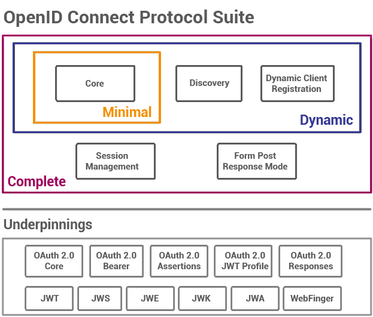
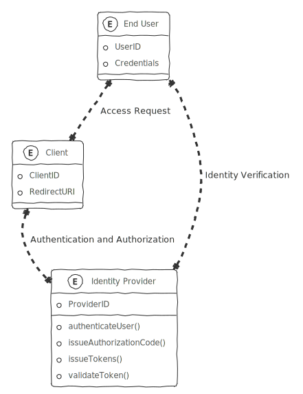
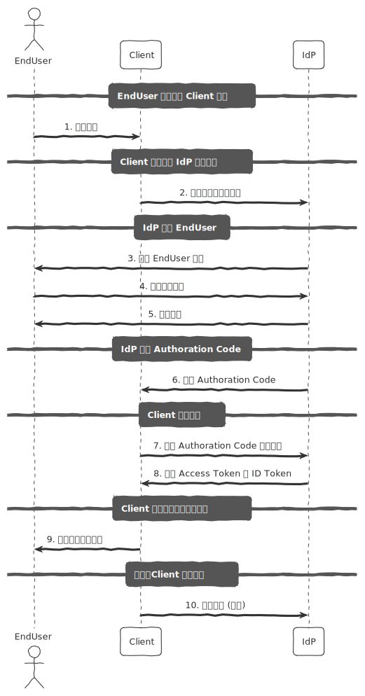

## OpenID Connect 身份验证协议设计 
### 简介

OpenID Connect（OIDC）是基于 OAuth 2.0 规范框架（IETF RFC 6749 和 6750）的可互操作身份验证协议。允许客户端（如 Web 应用、移动应用等）通过`验证用户身份`并获取基本的用户信息，来进行`安全的用户认证`和`授权`。

对于开发人员来说，它为`“当前使用连接的浏览器或移动应用程序的人的身份是什么”`这个问题提供了一个安全且可验证的答案。最重要的是，它消除了设置、存储和管理密码的责任，这通常与基于凭据的数据泄露有关。

OAuth 2.0 是关于资源访问和共享的，而 OIDC 是关于用户身份验证的。它的目的是为你提供多个站点的一次登录名。

### 原理

OpenID Connect 的角色有下面三个：

1. **身份提供者** (Identity Provider, IdP)：身份提供者，负责`用户身份认证`，`发布授权码`和`令牌`，`验证令牌有效性`。常见的 IdP 有 Google、Facebook 等。
2. **客户端** (Client)：需要`获取用户身份信息`的应用程序，例如 Web 应用、移动应用等。
3. **终端用户** (End User)：使用客户端应用并希望通过身份提供者进行身份认证的用户。

它的流程步骤如下实体关系图所示：

1. **EndUser**：请求访问客户端应用。
2. **Client**：重定向用户到身份提供者（IdP）进行身份认证。
3. **IdP**：认证用户身份。
4. **EndUser**：提供认证凭证。
5. **IdP**：返回`授权码`给客户端应用。
6. **Client**：使用授权码向身份提供者请求访问令牌和 ID 令牌。
7. **IdP**：发布`访问令牌`和 `ID 令牌`给客户端应用。
8. **Client**：使用令牌为用户提供访问资源的权限。
9. **Client**：可以选择性地向身份提供者验证令牌的有效性。

通过这些流程，OpenID Connect 协议实现了安全的用户身份认证和授权，确保用户能够安全地访问客户端应用所提供的资源。

参考资料：

\> [https://openid.net/developers/how-connect-works/](https://openid.net/developers/how-connect-works/)

\> [https://auth0.com/docs/authenticate/protocols/openid-connect-protocol](https://auth0.com/docs/authenticate/protocols/openid-connect-protocol)
