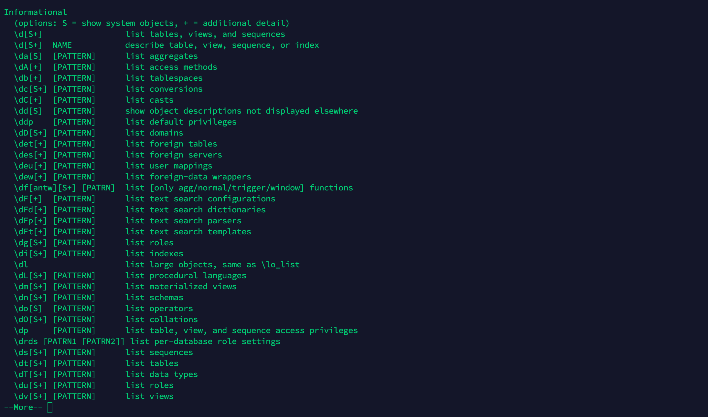

## Postgres 的基本使用 
### 命令行的使用

#### 登录

``` bash
psql -h localhost -d gitlabhq_production -U myuser
```

* `-h localhost`：连接数据库的host
* `-d gitlabhq_production`：需要访问的数据库
* `-U myuser`：以哪个用户名去访问数据库

### 登录之后

#### 查看语法帮助 (Help)

``` bash
gitlabhq_production=# \?
```

[](postgres-help.png)

> 回车键 (enter) 查看更多

#### 列出数据库 (Databases)

``` bash
gitlabhq_production=# \l
```

[](postgres-list-databases.png)

#### 列出表 (Tables)

列出当前数据库的所有表

``` bash
gitlabhq_production=# \dt
```

[](postgres-list-tables.png)

#### 列出用户及权限

``` bash
gitlabhq_production-# \du
```

#### 创建新用户

创建用户名为 yf 的用户，默认是没有任何权限的。

``` bash
gitlabhq_production-# CREATE USER yf;
```

> 当前登录的用户必须有创建角色权限( `create role` )，超级用户( `Superuser` )覆盖创建角色权限。还有记住别遗漏 `;` 分号来作为命令结束符。

#### 创建数据库

创建数据库名为 commento 的数据库。

``` bash
gitlabhq_production-# CREATE DATABASE commento;
```

> 当前用户需拥有创建数据库权限( `Create DB` )。超级用户( `Superuser` )覆盖创建数据库权限。

#### 给新用户授权数据库

把数据库 `commento` 的所有操作权限授权给用户 `yf` 。

``` bash
GRANT ALL PRIVILEGES ON DATABASE commento TO yf;
```

#### 退出命令行

``` bash
gitlabhq_production-# \q
```
