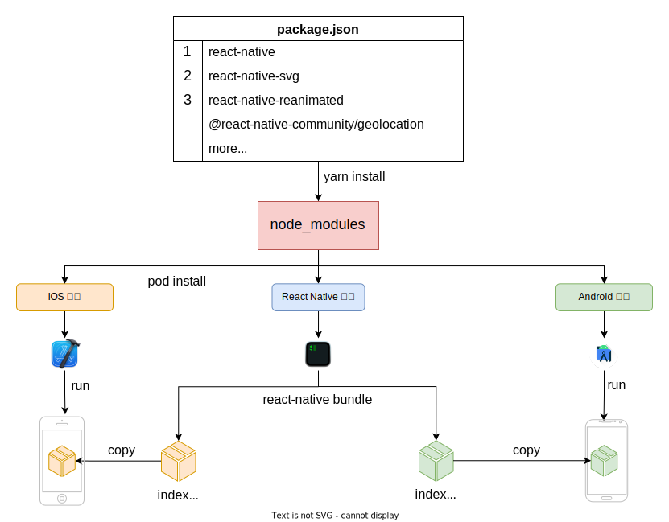
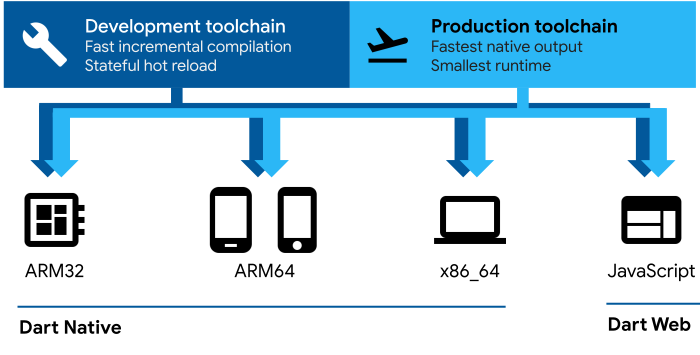

## React Native 基本介绍 
### 简介

React Native 是一种实现跨端技术框架。与[Cordova](https://cordova.apache.org/)（前身：PhoneGap）这种在`Webview 中嵌套网页`App的跨端不同。React Native 最终提供给用户的视图是`原生视图`，这让用户能体验到原生应用的感觉。

> App 使用网页方式，有可能因为应用执行速度慢或使用不够“原生”而`被苹果拒绝上架`。

### 开发成本

React Native 遵循`write once, run anywhere`的宗旨，让一套代码运行在多个系统平台（android、ios、windows），目的是提高研发效率。同时，由于代码为 Javascript 这种解释型语言编写。可以通过`热更新`来下发 bundle （React Native 项目输出的 jsbundle，后面不在赘述）包动态执行，`避开审核周期和限制`，大大提高迭代频率。但这种技术的应用也会带来额外的前期成本。

#### 对原生端技术的了解

React Native 虽然是一种跨端技术，其主要开发技术使用 React。但随着应用的深入开发，它依然需要前端开发人员了解原生端研发技术，通常是`android`和`ios`两端。

> 虽然 React Native 也在支持 Windows 平台，但目前国内市场不常见。

很多时候单纯前端研发人员并不能完成原生组件或功能开发，Native 端同学的介入是**必须的**，以往经历告诉我前端和 Native 端同学需要紧密合作。

一个包含 Native 功能的 Node 包至少包含了`android`和`ios`的原生功能实现源码，遇到问题时，前端研发同学通常需要优先去解决问题。问题的定位有时候极为困难，因为报错信息会毫无头绪。

#### 初期研发环境的搭建

React Native 的初期环境搭建体验并不是很好，有几方面的原因：

1. **对原生开发环境的了解**。初期需要搭建 Android 和 IOS 原生开发环境，你需要了解原生开发的基本内容；如对于原生端的依赖管理，Android 端同学了解 Gradle，IOS 同学了解 Cocoapod。如果按照[官方的步骤](https://www.reactnative.cn/docs/environment-setup)，至少你需要了解每一步配置的目的。
2. **对设备要求**。新版的 React Native 在 mac 系统上编译需要的 Xcode 版本 13 及以上，而 Xcode 的版本受制于系统版本必须 > 11。这一切因为 React Native 生态库中 Expo 开始使用 Swift 5 编译。而 Swift 5 编译器版本对 Xcode 是版本捆绑的；
3. **对网络环境的要求**。首先 React Native 集成到 Native 端是基于源码编译，而源码的依赖库很多是需要翻墙下载的。比如：React Native 68 版本及之后，需要用到：`folly`、`glog`、`boost`等需要网络下载包；
  其次，国内下载他们的速度很慢。如果你不了解原生编译，便不太会手动调优来解决他们，那么只能忍受长时间的下载。

#### 深度开发的成本

相信接触 React Native 的同学都想专注业务研发，而不愿操心开发环境的问题。那么这时候最好的想法是剥离 React Native 项目和原生端项目。

如果你遵从官网[搭建开发环境](https://www.reactnative.cn/docs/environment-setup)指导，执行`npx react-native init AwesomeTSProject --template react-native-template-typescript`初始化项目的，那么你的项目结构会是如下的：

``` bash
├── App.tsx
├── Gemfile
├── __tests__
├── android # android 项目
├── app.json
├── babel.config.js
├── index.js
├── ios # ios 项目
├── metro.config.js
├── node_modules # node 依赖
├── package.json # react native 依赖配置文件
├── tsconfig.json
└── yarn.lock
```

由此，我们的工作流如下图所示：



以上的工作方式，有几个问题值得考虑：

1. 每个 React Native 项目包含原生项目的副本，是不利于项目可维护性的；
2. 对于前端同学，尤其是没有接触过 React Native 同学而言，最好的开始不是环境搭建，而是一步到位安装已经集成了 React Native 原生端壳子，并运行一个纯粹的 React Native 项目。

所以我们需要做几件事情：

1. 把`壳子工程`（Android 项目、IOS 项目）从 React Native 项目中剥离。后续所有 React Native 项目将统一使用该壳子工程开发；
2. 统一 package.json 配置，这个配置我们称为`基础依赖`配置，React Native、Android、IOS 共享，保证三端的依赖包使用的版本都是相同的；
3. 在完成这些后，我们就可以考虑原生端自动化集成 bundle 包的方案了，通常也包含 CI 环境的自动化集成。

### React Native vs Flutter

Google 的 [Flutter](https://flutter.dev/)跨端框架从 2017 年 5 月发布以来，就被人们拿来和 React Native 做比较。我知道很多人会拿表格列出他们在`性能`、`开发调试体验`、`技术复杂度`等维度的不同点，但这样并不能真正区分他们在技术上实质性差异。

例如：在开发体验上，Flutter 对于新手而言非常容易上手，并能快速运行一个 demo App，无需额外的依赖安装。相比之下由于 React Native 对于开发设备和网络环境的要求，会显得慢很多。但这不会成为开发障碍。

说对于开发者而言，关注的是更为本质且影响技术选型的差异。我将从技术框架的部件来描述他们之间的差异点，让我们能够技术选型时，做出更为理性的选择。

#### 语言上的差异

Flutter 使用的是自家[Dart](https://dart.dev/overview)语言。这门语言同时支持[JIT](https://en.wikipedia.org/wiki/Just-in-time_compilation)编译和[AOT](https://en.wikipedia.org/wiki/Ahead-of-time_compilation)编译，并且也能编译成`Javascript`代码。




