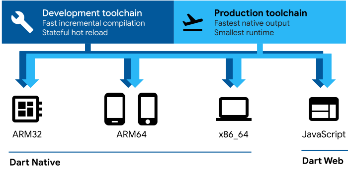
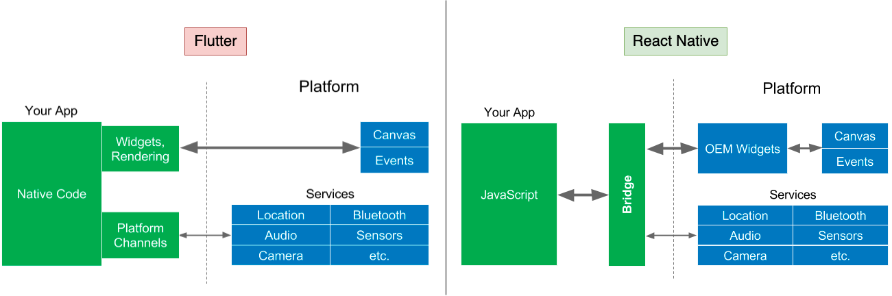
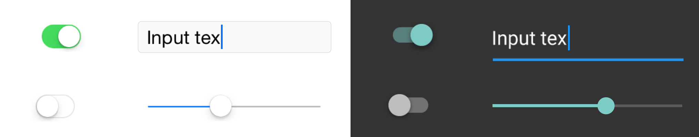
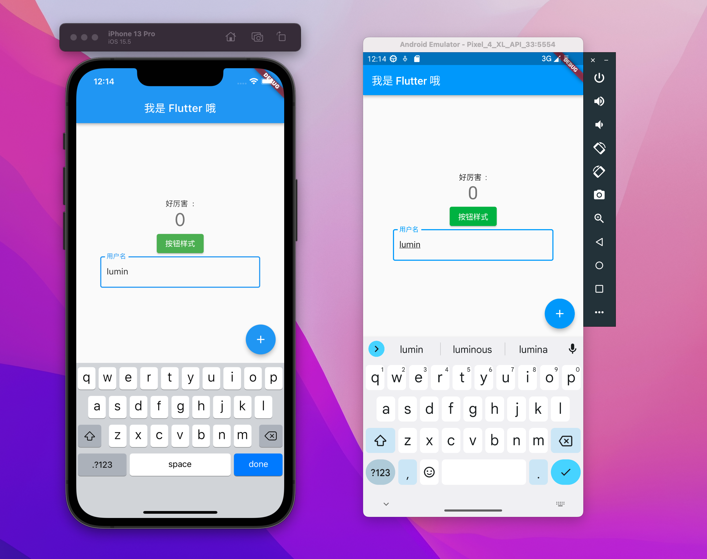
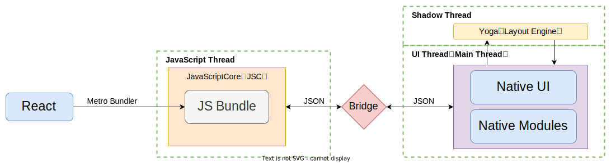
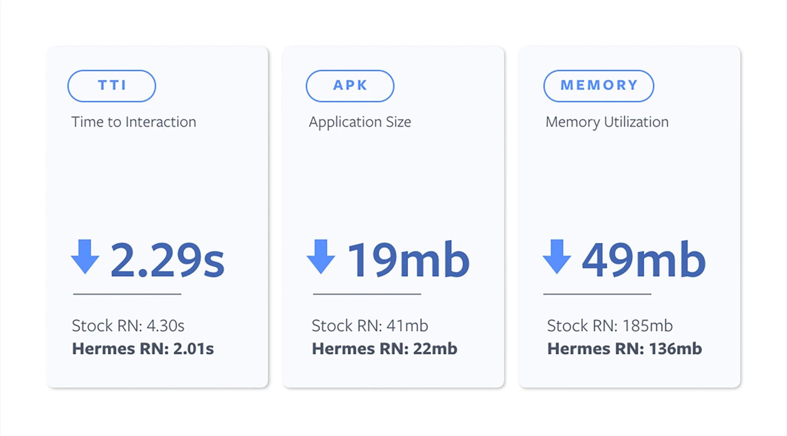
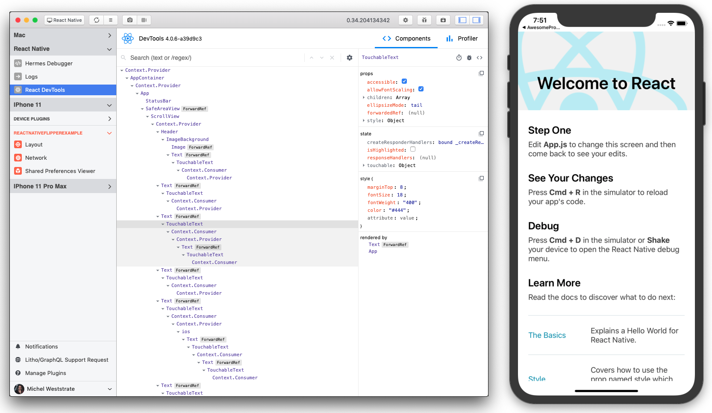

## React Native 技术详解 (一) - 认识它 
### 简介

React Native 是由 Facebook (已改名：Meta) 创建的一种实现跨端的技术。与 [Cordova](https://cordova.apache.org/) (前身：PhoneGap) 或 [ionic](https://ionicframework.com/) 这种在 `Webview 中嵌套网页` App 的跨端技术不同。React Native 最终提供给用户的视图是`原生视图`，这让用户能体验到原生应用的感觉。

> App 使用网页方式，有可能因为应用执行速度慢或使用不够“原生”而`被苹果拒绝上架`。

### 开发成本

在大家心理一直认为 React Native 遵循 `write once, run anywhere` 的宗旨，其实官方首页及其博客给出的是 [Learn once, write anywhere](https://engineering.fb.com/2015/03/26/android/react-native-bringing-modern-web-techniques-to-mobile/)。React Native 应用保持各个平台自有特性，在组件和本地模块上会有平台差异化的属性，这要求开发者需要至少一次对他们的了解。

React Native 使一套代码运行在多个系统平台 (android、ios、windows) ，目的是提高研发效率。同时，由于代码为 Javascript 这种解释型语言编写。可以通过`热更新`来下发 bundle  (React Native 项目输出的 jsbundle，后面不在赘述) 包动态执行，`避开审核周期和规则限制`，大大提高迭代频率。但这种技术的应用也会带来额外的前期成本。

#### 对原生端技术的了解

React Native 虽然是一种跨端技术，其主要开发技术使用 React。但随着应用的深入开发，它依然需要前端开发人员了解原生端研发技术，通常是 `android` 和 `ios` 两端。

> 虽然 React Native 也在支持 Windows 和 macOS 平台，但目前国内市场不常见。其主要精力在于 Android  和 iOS 两端，其它平台的支持可以参考 React Native 的合作方及社区。你可以在[这里](https://www.reactnative.cn/docs/next/out-of-tree-platforms)找到相关内容。

很多时候单纯前端研发人员并不能完成原生组件或功能开发，Native 端同学的介入是**必须的**。以往经历告诉我前端和 Native 端同学需要紧密合作。

一个包含 Native 功能的 Node 包至少包含了 `android` 和 `ios` 的原生功能实现源码，遇到问题时，前端研发同学通常需要优先去解决问题。问题的定位有时候极为困难，因为报错信息会毫无头绪。

如果想完全的掌握 React Native 这门框架技术，并合理评估其风险和价值。你就需要了解其架构原理甚至是 Native 源码。这期间你会接触到 `Javascript 引擎`、`Gradle (groovy)`、`cocoapods (ruby)`、`JNI`、`OBJC`、`Java` 等等一系列编程语言及技术。

#### 初期研发环境的搭建

React Native 的初期环境搭建体验并不是很好，有几方面的原因：

1. **对原生开发环境的了解**。初期需要搭建 Android 和 IOS 原生开发环境，你需要了解原生开发的基本内容；如对于原生端的依赖管理，Android 端同学了解 Gradle，IOS 同学了解 Cocoapod。如果按照[官方的步骤](https://www.reactnative.cn/docs/environment-setup)，至少你需要了解每一步配置的目的。
2. **对设备要求**。新版的 React Native 在 mac 系统上编译需要的 Xcode 版本 13 及以上，而 Xcode 的版本受制于系统版本必须 > 11。这一切因为 React Native 生态库中 [Expo](#expo) 开始使用 Swift 5 编译。而 Swift 5 编译器版本对 Xcode 是版本捆绑的；
3. **对网络环境的要求**。目前为止，React Native 集成到 Native 端是基于`源码编译`，尤其是 Android 的编译。而源码的依赖库很多是需要翻墙下载的。比如：React Native 0.68 版本及之后，需要用到：`folly`、`glog`、`boost` 等需要网络下载包；
  其次，国内下载他们的速度很慢。如果你不了解原生编译，便不太会手动调优来解决他们，那么只能忍受长时间的下载。

{}
好消息是在 React Native [0.71.0-rc0](https://reactnative.dev/blog/2023/01/27/71rc1-android-outage-postmortem) 版本中，为了优化 Android 的构建速度，已将一些依赖打包发布到 Maven Central 来替换基于源码的编译项目构建。

你可以在[这里](https://github.com/reactwg/react-native-new-architecture/discussions/105)看到相关优化的构建讨论。
{}

#### 深度开发的成本

相信接触 React Native 的同学都想专注业务研发，而不愿操心开发环境的问题。那么这时候最好的想法是剥离 React Native 项目和原生端项目。

如果你遵从官网[搭建开发环境](https://www.reactnative.cn/docs/environment-setup)指导，执行 `npx react-native init AwesomeTSProject --template react-native-template-typescript` 初始化项目的，那么你的项目结构会是如下的：

``` bash
├── App.tsx
├── Gemfile
├── __tests__
├── android # android 项目
├── app.json
├── babel.config.js
├── index.js
├── ios # ios 项目
├── metro.config.js
├── node_modules # node 依赖
├── package.json # react native 依赖配置文件
├── tsconfig.json
└── yarn.lock
```

由此，我们的工作流如下图所示：



以上的工作方式，有几个问题值得考虑：

1. 每个 React Native 项目包含原生项目的副本，是不利于项目可维护性的；
2. 对于前端同学，尤其是没有接触过 React Native 同学而言，最好的开始不是环境搭建，而是一步到位安装已经集成了 React Native 原生端壳子，并运行一个纯粹的 React Native 项目。

所以我们需要做几件事情：

1. 把`壳子工程` (Android 项目、IOS 项目) 从 React Native 项目中剥离。后续所有 React Native 项目将统一使用该壳子工程开发；
2. 统一 package.json 配置，这个配置我们称为`基础依赖`配置，React Native、Android、IOS 共享，保证三端的依赖包使用的版本都是相同的；
3. 在完成这些后，我们就可以考虑原生端自动化集成 bundle 包的方案了，通常也包含 CI 环境的自动化集成。

虽然在技术上的有其一定成本，但依然阻挡不了跨端技术**能够降低人力资源成本和提高产能的巨大魅惑**，并且这种新架构的实现，也很容易引起开发者探索和关注。

### React Native vs Flutter

Google 的 [Flutter](https://flutter.dev/) 跨平台框架从 2017 年 5 月发布以来，就被人们拿来和 React Native 做比较。我知道很多人会拿表格列出他们在`性能`、`开发调试体验`、`技术复杂度`等维度的不同点，但这样并不能真正区分他们在技术上实质性差异。

例如：在开发体验上，Flutter 对于新手而言非常容易上手，并能快速运行一个 demo App，无需额外的依赖安装和过渡的跨端知识。相比之下由于 React Native 对于开发设备和网络环境的要求，会显得慢很多。但这并不是开发障碍。

对于开发者而言，关注的是更为本质且影响技术选型的差异。我将从技术架构的部件和功能来描述他们之间的差异点，让我们能够技术选型时，做出更为理性的选择。

#### 语言

Flutter 使用的是自家 [Dart](https://dart.dev/overview) 语言。这门语言同时支持 [JIT](https://en.wikipedia.org/wiki/Just-in-time_compilation) 编译和 [AOT](https://en.wikipedia.org/wiki/Ahead-of-time_compilation) 编译，并且支持编译成 `Javascript` 代码。



在开发时，Flutter 无论是在 android 端或 iOS 端都将使用 Dart VM 来作为 Dart 的运行时，这点使其具备[hot reload](https://docs.flutter.dev/development/tools/hot-reload)的功能，而在部署应用时，Dart 代码以 AOT 方式编译成 Native 语言。所以本质上，Flutter 应用无异于一个原生端应用。相比之下，React Native 需要 JavaScript 执行引擎来解释执行源码，并通过桥接方式和 Native 环境进行通信。因此，性能上 Dart 有明显的优势。

> Flutter Android 端应用的**性能**要比普通应用 (使用 Java 开发的应用) 更高。Android 生态中，大部分 App 都是使用 Java 作为开发语言，运行在系统的 [DVM](https://source.android.com/docs/core/runtime) 上。而 Flutter 直接编译成 C/C++ 代码，调用 [Android NDK](https://developer.android.com/ndk/guides) 运行。



React Native 框架使用 Javascript 语言，其运行在 Javascript 执行引擎上。要想实现原生视图及交互，必须和[宿主平台](https://reactnative.dev/architecture/glossary#host-platform) Native 环境进行交互，而他们之间的通信手段使用很传统的 `JSON 序列化` 方式交换数据。这种方式会在应用初始化时，一次性传递较多的渲染数据，而导致 [TTI](https://web.dev/interactive/) 时间变成长。相比 iOS 端，在 Android 端很容易形成[首次加载的白屏现象](https://www.devio.org/2016/09/30/React-Native-启动白屏问题解决方案,教程)。虽是硬伤，但新架构会有所改进。

> 实践中，6 MB 的 jsbundle 文件，首次加载有较多丰富交互视图时，在 Android 中高端机型中会有 2-3 s 的白屏。

#### 执行环境

在开发调试时，Flutter 的 Dart 代码执行在 [Dart VM](https://mrale.ph/dartvm/) 中。在应用部署时，Dart 会编译成 C/C++ 代码，运行在原生平台环境中。而 React Native 开发调试时和运行时都在 Javascript 引擎中。调用原生能力时，需要通过 Javascript 桥接 (Bridge) 的方式。所以运行效率上，Flutter 有着绝对的优势。

#### 渲染

React Native 在渲染上由 Native UI 管理模块来执行渲染，这意味着渲染是由宿主平台来决定的，如此各自平台就会保持其 UI 风格，如下图所示：



这种不同，不仅表现在样式上，还有各自平台特有的组件属性上的不同。

Flutter 使用内置渲染器： [Skia](https://skia.org/docs/)，它是一个 2D 图形库。在 Flutter 3.3 引入了改进的图形引擎：[Impeller](https://github.com/flutter/flutter/wiki/Impeller)。所以它不再保留原生端样式风格，所有平台的视图统一使用 google 自家的[Material](https://material.io/design/introduction#material-measurements) 风格，也没有平台上的属性差异。不需要关注不同平台的特有属性这点，对于开发者而言是喜闻乐见的。



因为渲染上的自实现，在部署应用时，Skia 库和对应的组件库会内置到 App 中，这会增加 App 的体积。

#### 生态

由于 Flutter 发布时间相对 React Native 要晚两年。React Native 先发优势，我想这是 Flutter 没有足够的三方库来未满足一些应用场景的主要原因。当然，公司若以技术为主导的价值观，相信团队有足够信心能做的很好。

#### 热更新

热更新的技术基础是 JIT 编译。Flutter 使用的 Dart 支持 JIT，也就是说它支持动态执行代码，但是由于 Apple 对动态执行代码的不可预料的限制，官方并没有提供开箱即用的热更新相关的解决方案，你这可以在[这里](https://github.com/flutter/flutter/issues/14330)查看 Flutter 对热更新的讨论。

iOS 生态系统默认支持 Javascript 语言的动态执行。截止目前文章更新， Dart 解释器目前也能运行在 iOS 系统上，在技术上有 [shorebirdtech](https://github.com/shorebirdtech) 和 [fair](https://fair.58.com/zh/hotupdate/deployment/server.htm) 类似的热更新支持。


**总结**：React Native 因有现有技术方案实现多平台的热更新，所以可以支撑非常频繁的业务迭代。React Native 使用的 JavaScript 语言和 ReactJs 技术，对前端同学而言有得天独厚的优势。同时，其生态库更完善，能快速支撑更为丰富的应用场景研发。

反过来说，以上就是 Flutter 的缺点。但是可以看出 Flutter 有着绝对的性能优势。

**值得关注的**是 React Native 在 0.68 版本及之后，开始可选新架构。新的架构会带来很大的性能提升。和老的架构不同的点是新架构也开始使用 C++ 实现的渲染器： [Fabric](https://reactnative.dev/architecture/fabric-renderer)，并且和 Javascript 的交互由原来的 JSON 序列化，变成了[JSI (JavaScript Interfaces)](https://reactnative.dev/architecture/glossary#javascript-interfaces-jsi)，这会大大提高渲染性能。

> 你可以在[这里](https://github.com/react-native-community/discussions-and-proposals/issues/91)了解更多 JSI 的内容讨论。

### React Native 架构及核心生态

新架构之前的架构图如下：



React Native 以 React 技术为开发基础，通过 Metro 捆绑器打包成最终目标代码文件 JS Bundle。jsbundle 运行在 JavaScriptCore 执行引擎，通过 Bridge 传递布局及相关渲染数据。最后，由 Yoga 进行与 Native UI 模块管理布局和渲染的工作。

#### Metro Bundler

 [Metro](https://facebook.github.io/metro/) 是专为 React Native 开发提供的 Javascript 捆包器 (bundler) ，可以理解为打包器。它为 React Native 提供`开发服务`和`打包`功能，开箱即用。

初始化 React Native 项目后，可以在 node_modules 里找到 `metro-*` 相关的依赖包。虽然作为内置依赖项，但是它是可以独立 `CLI` 或`编程方式`运行。独立的编程方式利于三方框架执行 React Native 的集成打包，例如跨端框架： [Taro](https://taro-docs.jd.com/taro/docs)

Metro 打包进程中有以下三个独立的阶段：

1. `解析` (Resolution) ：从入口文件开始，构建模块依赖图，解析各个模块的文件路径；
2. `转换` (Transformation) ：可并行的处理模块文件转义；
3. `序列化` (Serialization) ：生成一个或多个 bundle 包。

Metro 有个到目前为止仍然 Open 的一个 [symlinks](https://github.com/facebook/metro/issues/1) 问题，即 Metro 不能支持项目根目录之外的符号链接依赖项。

#### Hermes

 [Hermes](https://hermesengine.dev/) 是 Facebook 专门针对 React Native 做过优化的 Javascript 引擎，在 React Native 0.70 版本中 Hermes 作为**捆绑的默认内置引擎**。

在这之前 React Native 一直使用 [JavaScriptCore (JSC)](https://webkit.org/) 作为其执行引擎，由于 iOS 平台内置 JSC，官方只维护了一个构建 Android 平台 JSC 的[脚本仓库](#react-native-communityjsc-android-buildscripts)。

> iOS 7 开始，JSC 被内置到系统内。对于 iOS，React Native 使用 iOS 平台提供的 JSC。而 Android 需要将 JSC 和 App 捆绑发布，所以相对 iOS Reac Native 应用，其体积会增加 3-4 MB。

React Native 版本 $>=$ 0.60.4 时，你可以把 Hermes 作为 React Native 的 Javascript 引擎使用，来替换 JSC。

Hermes 相对 JSC 做了一些性能优化：

1. 优化了启动时间。支持**字节码预编译** (Bytecode Precompilation) 能够跳过 Javascript 引擎生成字节码的步骤。在官方[博客](https://reactnative.dev/blog/2021/10/26/toward-hermes-being-the-default)介绍到其 TTI 指标可以减少近一半时间，很可观。通过[这篇博客](https://engineering.fb.com/2019/07/12/android/hermes/)了解 Hermes 优化详情；
2. 降低内存的使用。针对新架构，优化了引擎的 GC；
3. Android 端 APK 下载体积变小；



有人担心 Hermes 内置到 iOS App 内，是否可以过审，至少目前社区内尚无反馈。从[这里](https://github.com/facebook/hermes/issues/34)有相关的讨论，可以知道 Apple 并未强制要求 App 使用 JSC，Apple 更关注的是代码下发的动态执行。

> 我们可以关注 [App Store 审核指南](https://developer.apple.com/cn/app-store/review/guidelines/)相关规则。

#### Yoga

 [Yoga](https://github.com/facebook/yoga) 是一款 C++ 实现的基于 [Flexbox](https://developer.mozilla.org/en-US/docs/Learn/CSS/CSS_layout/Flexbox) 的**跨平台**`布局引擎` (layout engine) ，它是实现**跨端布局一致**的关键部件。

这解答了很多开发同学的疑问，为什么 React Native 只支持 [Relative/Absolute](https://yogalayout.com/docs/absolute-relative-layout) 布局。如果对 Flexbox 掌握不熟的同学，可以通过 [playground](https://yogalayout.com/playground) 可视化工具获取 React Native 的布局样式。

#### React Native Community

[React Native Community](https://github.com/react-native-community) 是支持 React Native 生态系统的多个仓库，有些仓库需要我们特别了解的。

##### react-native-community/cli

[react-native-community/cli](https://github.com/react-native-community/cli) 为 React Native 提供了`命令行工具`和`平台集成 React Native 生态库的脚本`。常用的命令有以下几个：

* `构建打包命令`：react-native bundle
* `运行 Android 设备`：react-native run-android
* `运行 iOS 设备`：react-native run-ios
* `启动开发服务`：react-native start

你可以在[这里](https://github.com/react-native-community/cli/blob/main/docs/commands.md)获取所有可用命令。

> Metro 被内置在 react-native 命令行工具中，在[源码](https://github.com/react-native-community/cli/blob/main/packages/cli-plugin-metro/src/commands/start/runServer.ts#L9)中可以看到其以编程方式集成。

除了作为命令行工具之外，它有两个子包：[@react-native-community/cli-platform-android](https://github.com/react-native-community/cli/tree/main/packages/cli-platform-android) 和 [@react-native-community/cli-platform-ios](https://github.com/react-native-community/cli/tree/main/packages/cli-platform-ios)。

它们分别用于 Android 端和 iOS 端的 `React Native 生态的三方库 (react-native-*) 的集成` 。在 Android 和 iOS 的各自的依赖管理方式下，使用脚本来完成对 React Native 生态库的自动化集成，这种集成方式被称为 [Autolinking](https://github.com/react-native-community/cli/blob/main/docs/autolinking.md)

在 `android/settings.gradle` 文件中可以 Android 平台集成的脚本应用：

``` groovy
apply from: file("../node_modules/@react-native-community/cli-platform-android/native_modules.gradle"); applyNativeModulesSettingsGradle(settings)
```

在 `ios/Podfile` 文件中也可以看到相同 iOS 平台的集成脚本应用：

``` ruby
require_relative '../node_modules/@react-native-community/cli-platform-ios/native_modules'
```

> **注意**：React Native 的生态库`包名`**必须**以 `react-native-*` 开头，才能被自动化集成至客户端。并且目前不支持 [scope](https://docs.npmjs.com/cli/v8/using-npm/scope) 包 (例：@lumin/react-native-image) ，虽然可以手动调整脚本支持，但这需要深入研发了。

##### react-native-community/jsc-android-buildscripts

[jsc-android-buildscripts](https://github.com/react-native-community/jsc-android-buildscripts) 是为了构建 Android JSC 的脚本仓库。在 Android 项目根项目 `build.gradle` 文件中，你可以看到 JSC 引入：

``` groovy
allprojects {
    repositories {
        // ...
        maven {
            // Android JSC is installed from npm
            url("$rootDir/../node_modules/jsc-android/dist")
        }
        // ...
    }
}
```

#### Flipper

[Flipper](https://fbflipper.com/) 是 Facebook 提供的一个移动端`调试工具`，它支持 iOS、Android、React Native，并提供桌面端 GUI 调试界面。

Flipper 是开箱即用的，提供了包括：`网络`、`布局和属性样式`、`持久化存储展示`、`日志`、`Hermes Debugger` 等非常有用的分析功能。



在 React Native 0.62 版本及以上，默认支持 Flipper。相比 React Native 的 Chrome Devtool 调试，它更强大更实用，你可以在[这里](https://fbflipper.com/docs/features/react-native/)查看更多信息。

#### Expo

 [Expo](https://expo.dev/) 是一个针对 React Native 项目的 npm 包和框架。虽然是三方库，但是对于开发 React Native 项目来说是**必要的**，它有以下几项有价值的功能：

1. `Code Playground` ：这点在官网的[组件](https://reactnative.dev/docs/flatlist)文档可以直接看到其应用；
2. `提供了丰富 Native 功能的 SDK`：包括：`亮度控制`、`文件系统`、`字体`、`相机`，`震动`等等一系列必要的 Native 功能，这是很多 React Native 开发者钟爱它的原因。你可以在[这里](https://docs.expo.dev/versions/v46.0.0/sdk/accelerometer/)看到更多功能。

### 总结

React Native 的问题很多，比较突出的体现在开发体验以及缺乏性能监控及指标。今年是 2022 年，虽然新架构的发布，改善了很多性能问题，但也陡增了很多 issues。官方在社区展开了[我们如何改进 React Native ?](https://github.com/react-native-community/discussions-and-proposals/discussions/528)的讨论，并根据投票数对突出问题进行了[回复](https://github.com/react-native-community/discussions-and-proposals/discussions/546)。

对于使用 React Native 的同学来说，该主题的讨论是很有参考价值的。

参考资料：

\> [https://www.devio.org/2016/09/30/React-Native-启动白屏问题解决方案,教程](https://www.devio.org/2016/09/30/React-Native-启动白屏问题解决方案,教程)

\> [https://stackoverflow.com/questions/54388974/how-does-dart-flutter-get-compiled-to-android](https://stackoverflow.com/questions/54388974/how-does-dart-flutter-get-compiled-to-android)

\> [https://www.reactnative.cn/architecture/overview](https://www.reactnative.cn/architecture/overview)

\> [https://annatarhe.github.io/2019/01/31/introduction-to-dart-vm.html](https://annatarhe.github.io/2019/01/31/introduction-to-dart-vm.html)

\> [https://dart.dev/overview](https://dart.dev/overview)

\> [https://engineering.fb.com/2019/07/12/android/hermes/](https://engineering.fb.com/2019/07/12/android/hermes/)

\> [https://www.reactnative.guide/3-react-native-internals/3.1-react-native-internals.html](https://www.reactnative.guide/3-react-native-internals/3.1-react-native-internals.html)
