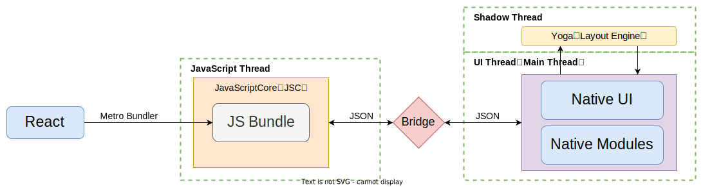
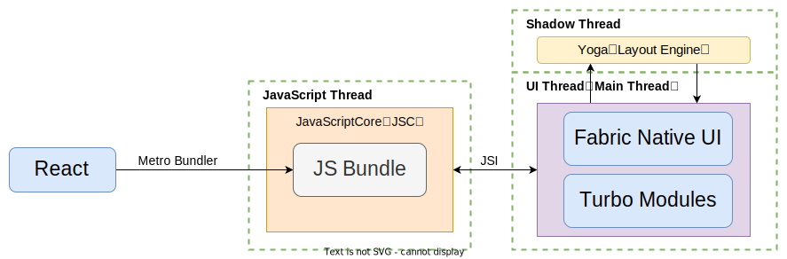

## React Native 技术详解 (二) - 新架构 
在 [React Native 技术详解 (一) - 认识它](../react-native-1-introduction/#react-native-架构及核心生态) 中，我们知道 React Native 以前的架构图如下：

React Native 以 React 技术为开发基础，通过 Metro 捆绑器打包成最终目标代码文件 JSBundle。JSBundle 运行在 JavaScriptCore 执行引擎，通过 Bridge 传递布局及相关渲染数据。最后，由 Yoga 进行与 Native UI 模块管理布局和渲染的工作。

新的架构图如下：

新的架构有以下几个新的概念：`JSI`、`Fabric`、`Turbo Modules`、`CodeGen`，这些都将至我们必须了解的，下面都将逐一解释。

### 新概念

新的架构有两大支柱：`Turo Modules` 和 `Fabric` 。而 `JSI` 是这两大支柱的基石。

#### JSI

[JSI](https://github.com/react-native-community/discussions-and-proposals/issues/91) (JavaScript Interface) `取代`老架构中的 `Bridge`，它为 JS 执行引擎提供 API，使 JS 直接调用原生 (Java/ObjC) 函数。

JSI 带来的一个优势是 `JS 线程` 和 `Native Modules` 的`完全同步`。在 JSI 的帮助下，JS 将能够`持有`对 `C++ 对象的引用` 并直接调用它们的方法。它还会附带共享所有权的概念，允许**原生端**直接与 **JS 线程**通信。

老架构的 Bridge 使用消息队列，JS 和 Native 在高频通信时容易阻塞队列，最后导致事件响应不及时和 UI 卡顿现象。同时 Bridge 里的序列化和反序列也是性能影响关键因素，同时它也是`异步的`。

> 因为老架构桥接的异步调用，所以开发者们通常优先 Native 模块以 Promise 形式实现，React Native 端再以 Promise 语法调用，使其在语法结构上的看起来是同步的。

{}
官方给[同步方法](https://reactnative.dev/docs/native-modules-android#synchronous-methods)开了一个口子，允许使用 [isBlockingSynchronousMethod](https://github.com/facebook/react-native/blob/803e993e6a8e68c62870e27ce4a45b485e244ec4/ReactAndroid/src/main/java/com/facebook/react/bridge/ReactMethod.java#L38) 来支持方法的同步调用。但因为会带来**严重的**性能损失，不建议这么去做。
{}

#### Fabric

Fabric 是负责 Native 端的 `UIManager` 的新名称。现在最大的不同是它也`不再`通过 Bridge 与 JS 端通信了，而是使用 JSI 暴露一个 Native 函数，因此 JS 端可以直接通过 ref 函数进行通信，反之亦然。更好、更高效的性能以及在双方之间传递数据。

React Native [原生组件](https://reactnative.dev/docs/native-components-android)实现上，以往基于 Bridge 来实现。现在基于 JSI 来实现的 [Fabric 原生组件](https://reactnative.dev/docs/the-new-architecture/pillars-fabric-components)会极大提供通信效率。

 `Fabric 原生组件` 和老架构的`原生组件`是一样的，但 Fabric 原生组件却可以获得新架构所有[收益](https://reactnative.dev/docs/the-new-architecture/why)：

* 各个平台的强类型接口声明是`一致的`；
* 能够使用 C++ 编写代码，这样可以使用一套代码集成至其他 Native 平台；
* 通过替换 Bridge 为 JSI，提升 JS 与 Native 的通讯效率。

##### Fabric Renderer

在上一代 React Native 渲染器中，`React 影子树`、`布局逻辑`、`视图拍平算法`是在`各个平台单独实现`的，并通过 Bridge 被 JS 调用。当前的 Fabric 渲染器的设计上采用的是基于 JSI 的`跨平台`的解决方案，共享了核心的 C++ 实现。

下面是新老架构在 Native UI Manager 渲染上的差异：

#### Turbo Modules

 `Turbo Modules` 的目的与老架构的 `Native Modules` 相同，但实现和行为不同。首先，它们是`懒加载` (lazy-loaded) 的，这意味着它只在应用程序`需要它们时加载`，而不是在启动时加载所有它们。此外，它们也使用 JSI API，JS 持有一个引用以在 React Native JS 库端使用它们，从而获得更好的性能，尤其是在`启动时间`上。

#### CodeGen

Codegen 不算是新架构的主要组成部分，它是一个帮助我们`避免编写重复代码`的工具。主要应用于 `Turbo Modules` 和 `Fabric 组件` 的开发，通过它能快速`生成脚手架代码`。

参考资料：

\> [https://litslink.com/blog/new-react-native-architecture](https://litslink.com/blog/new-react-native-architecture)

\> [https://medium.com/mindful-engineering/fabric-architecture-react-native-a4f5fd96b6d2](https://medium.com/mindful-engineering/fabric-architecture-react-native-a4f5fd96b6d2)

\> [https://blog.notesnook.com/getting-started-react-native-jsi/](https://blog.notesnook.com/getting-started-react-native-jsi/)
