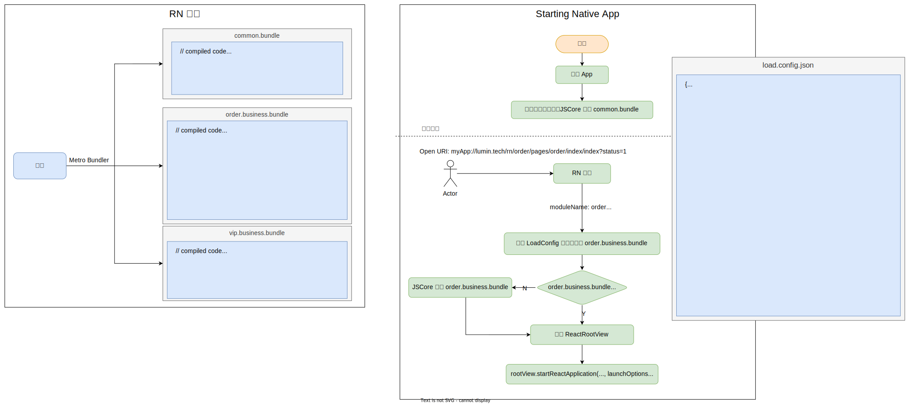

## React Native 技术详解 (五) - 拆包 (Code Splitting) 
### 简介

拆包 (分包) 的实质是进行`代码分割` (code splitting)，即把代码分割成多个 bundle 文件，在我们熟知的许多前端编译构建工具中都有实现代码分割的功能。

例如：Webpack 允许开发者通过动 [import()](https://webpack.js.org/api/module-methods/#import-1) 语法来支持`模块级别`的代码分割，可以实现动态模块加载功能。也支持通过 [SplitChunksPlugin](https://webpack.js.org/plugins/split-chunks-plugin/) 插件支持`块级` (chunk) 的编译时代码分割。他们都是一种性能优化，旨在缩短用户 [TTI](https://developer.chrome.com/docs/lighthouse/performance/interactive/) 时间。

而作为 React Native 官方打包器的 Metro 却并没有提供类似的`直接可用`的语法或插件支持。我个人觉得有以下几点：

1. React Native 的`依赖包`和`宿主平台` (例：Android、iOS 等等)有强依赖关系。一个 React Native 的 NPM 包有可能既包含 JS 代码也包含 Native 代码，单独分割 JS 代码，并不能保证其在宿主平台的正常运行，甚至导致宿主平台的 crash。而 Web 应用的 NPM 包只需关注 JS 的代码分割即可。
2. 一个 React Native 应用，即我们通过 `AppRegistry.registerComponent('Appname', () => App)` 注册的应用，实际在 Native 上可以有多个 React Native Manager 实例，每个实例都对应一个`上下文`。可以理解为浏览器多个标签页，每个标签页对应一个 React Native 应用。

   有趣的是这种模式类似 `SPA 应用`和`多页面应用`的讨论。`热更新技术`、`平台设备`及`产品规模`等因素，会直接影响我们对使用那种模式的决策。对于 React Native 来说无论使用哪种都需要 Native 端进行不同策略的开发。

目前，React Native 提供的拆包 API 是有限的，但足以支持我们完成这项工作。

#### 为什么不使用 Webpack 来进行构建呢？

从理论上来说使用 Webpack 构建没有任何问题。但因为 React Native 的架构使得 React Native 团队想通过实现自己的捆包器来对复杂的宿主环境有更全面的控制。它需要对 JS 执行引擎做构建优化，并实现自己的构建策略以便将来做更多定制化内容。实际上 React Native 团队实现了自己的 JS 执行引擎：[hermes](https://hermesengine.dev/)，并且在 React Native 版本 >= `0.70.0` 中作为**捆绑的默认内置引擎**。

不建议自己配置 Webpack 来实现对 React Native 的构建。如果你想这么做，意味你已经深入了解了 Metro 的构建原理。

### 为什么要进行拆包？

实际生产中一个 jsbundle 体积可以达到 6MB，这严重影响其在宿主平台的首次加载时间，例如：通常它在手机端产生[白屏现象](https://www.devio.org/2016/09/30/React-Native-启动白屏问题解决方案,教程/)。为了应对这种情况，首次加载时可以采用`闪屏`来减弱用户等待焦虑。但这不是根本方法。

我们可以把业务进行`模块拆分`。使得首次加载的包仅为`公共基础依赖内容`和`首页展示业务内容`。后续需要展示其它业务内容，只需加载对应的业务模块，以此来提升启动性能 (TTR/TTI)。

所以通常我们把 jsbundle 拆分两种类型的包：`公共基础包`和`业务包`。

* `公共业务包`：只包含框架底层和长期不变的`基础依赖`。例如：`React Native`、`网络请求`、`组件库`、`埋点`、`dayjs`以及`基础自定义原生模块`等等，同时也包含他们所需的`静态资源`；
* `业务包`：包含业务实现以及可能变化的组件库，也包含所需的静态资源。

随着 jsbundle 体积的增大，拆包将是必要构建步骤。

### 如何拆包？

针对于我们已有的目标，给出了以下实现设计方案的用例图：

参考文献：

\> [https://www.react-native.eu/talks/pawel-trysla-code-splitting-in-react-native](https://www.react-native.eu/talks/pawel-trysla-code-splitting-in-react-native)
