## React Native 技术详解 (五) - 拆包 
### 简介

拆包 (分包) 的实质是进行`代码分割` (code splitting)，即把代码分割成多个 bundle 文件，在我们熟知的许多前端编译构建工具中都有实现代码分割的功能。

例如：Webpack 允许开发者通过动 [import()](https://webpack.js.org/api/module-methods/#import-1) 语法来支持`模块级别`的代码分割，可以实现动态模块加载功能。也支持通过 [SplitChunksPlugin](https://webpack.js.org/plugins/split-chunks-plugin/) 插件支持`块级` (chunk) 的编译时代码分割。他们都是一种性能优化，旨在缩短用户 [TTI](https://developer.chrome.com/docs/lighthouse/performance/interactive/) 时间。

而作为 React Native 官方打包器的 Metro 却并没有提供类似的`直接可用`的语法或插件支持。我个人觉得有以下几点：

1. React Native 的`依赖包`和`宿主平台` (例：Android、iOS 等等)有强依赖关系。一个 React Native 的 NPM 包有可能既包含 JS 代码也包含 Native 代码，单独分割 JS 代码，并不能保证其在宿主平台的正常运行，甚至导致宿主平台的 crash。而 Web 应用的 NPM 包只需关注 JS 的代码分割即可。
2. 一个 React Native 应用，即我们通过 `AppRegistry.registerComponent('Appname', () => App)` 注册的应用，实际在 Native 上可以有多个 React Native Manager 实例，每个实例都对应一个`上下文`。可以理解为浏览器多个标签页，每个标签页对应一个 React Native 应用。

   有趣的是这种模式类似 `SPA 应用`和`多页面应用`的讨论。`热更新技术`、`平台设备`及`产品规模`等因素，会直接影响我们对使用那种模式的决策。对于 React Native 来说无论使用哪种都需要 Native 端进行不同策略的开发。

目前，React Native 提供的拆包 API 是有限的，但足以支持我们完成这项工作。

### 为什么不使用 Webpack 来进行构建呢？

从理论上来说使用 Webpack 构建没有任何问题。但目前 React Native 团队并没有支持。很大原因是 React Native 自身生态库之间有紧密的关联性，难以独立出来。React Native 团队实现了自己的 JS 执行引擎：[hermes](https://hermesengine.dev/)，并且在 React Native 版本 >= `0.70.0` 中作为**捆绑的默认内置引擎**，这样的改动都会伴随着生态库的捆绑发布。

不建议自己配置 Webpack 来实现对 React Native 的构建。如果你想这么做，意味你已经深入了解了 Metro 的构建原理，有能力控制 react native 版本升级及其生态库变化产生的不可预料影响。

### 为什么要进行拆包？

实际生产中一个 jsbundle 体积可以达到 6MB，这严重影响其在宿主平台的首次加载时间。通常它在手机端产生[白屏现象](https://www.devio.org/2016/09/30/React-Native-启动白屏问题解决方案,教程/)，为了应对这种情况，首次加载时可以采用`闪屏`来减弱用户等待焦虑。但这不是根本方法。

我们可以把业务进行`模块拆分`。使得首次加载的包仅为`公共基础依赖内容`和`首页展示业务内容`。后续需要展示其它业务内容，只需加载对应的业务模块以此来提升启动性能 (TTR/TTI)。

> 这种策略和[微信小程序的分包](https://developers.weixin.qq.com/miniprogram/dev/framework/subpackages/basic.html)功能类似。

所以通常我们把 jsbundle 拆分两种类型的包：`公共基础包`和`业务包`。

* `公共业务包`：只包含框架底层和长期不变的`基础依赖`。例如：`React Native`、`网络请求`、`组件库`、`埋点`、`dayjs`以及`基础自定义原生模块`等等，同时也包含他们所需的`静态资源`；
* `业务包`：包含业务实现以及可能变化的组件库，也包含所需的静态资源。

随着 jsbundle 体积的增大，拆包将是必要构建步骤。

### 如何拆包？

我们将 React Native 项目分割成 `common.bundle` 的基础包和多个业务包 `order.business.bundle` 和 `vip.business.bundle` 。通常一个 React Native 项目对应只有一个基础包和业务包；

针对于我们已有的目标，给出了以下实现设计方案的用例图：

1. App 启动时，通过读取包配置文件 `load.config.json`，首先让 JS 引擎加载基础包 `common.bundle` 包；
2. 当进入一个 order 页时，开始加载 `order.business.bundle` 包；

`load.config.json` 配置所有包的`模块名`和它所对应的`包路径`，把`模块名`和 `Scheme 路由协议` (URI) 相结合，能够直接通过路由自动匹配对应的包路径进行加载。

#### 拆包原理

React Native 拆包本质是模块过滤的实现的，即在打`公共包`的时候把`业务模块文件`进行过滤，把业务模块排除在公共包之外。而进行`业务包`打包时，对`公共模块文件`进行过滤，把公共模块排除在业务包之外。

网上也有现成拆包的工具：[react-native-multibundler](https://github.com/smallnew/react-native-multibundler)、[携程 moles-packer](https://github.com/ctripcorp/moles-packer)。但都已经很久没有继续维护了，并且都要求版本匹配。对于 React Native 深度开发者来说，更期望 100% 自主控制风险。

拆包是基于 Metro 来进行的，Metro 提供了 `metro.config.js` 文件来配置打包。其中暴露了两个函数：`createModuleIdFactory` 和 `processModuleFilter`。

* `createModuleIdFactory`：用于给每个模块生成一个唯一的`模块 ID`；
* `processModuleFilter`：用于`过滤掉`不需要生成到 bundle 里的模块文件；

通过 common 项目用来生成基础`模块路径`和其`模块 id` 的映射文件，而后该映射文件用于在 bussiness 项目构建中过滤掉基础模块。

<!-- #### 为什么不直接根据 node_modules 来生成 -->

#### 实现

一个 bundle 包，它包含以下几部分内容：

1. Bundle 的顶部会包含一些 polyfills 文件，来使得 JS 引擎兼容一些标准 JS 语法。通过自执行方式，加载时直接执行；
2. `模块定义`：这里会包含所有通过标准模块语法 (Import/Export) 定义的模块；
3. `模块执行`：整个模块构成一个`有向无环图` (其实循环引用，metro 也能够处理)，最后通过入口`模块 ID` 加载执行入口代码。

未完待续...

参考资料：

\> [https://www.react-native.eu/talks/pawel-trysla-code-splitting-in-react-native](https://www.react-native.eu/talks/pawel-trysla-code-splitting-in-react-native)
