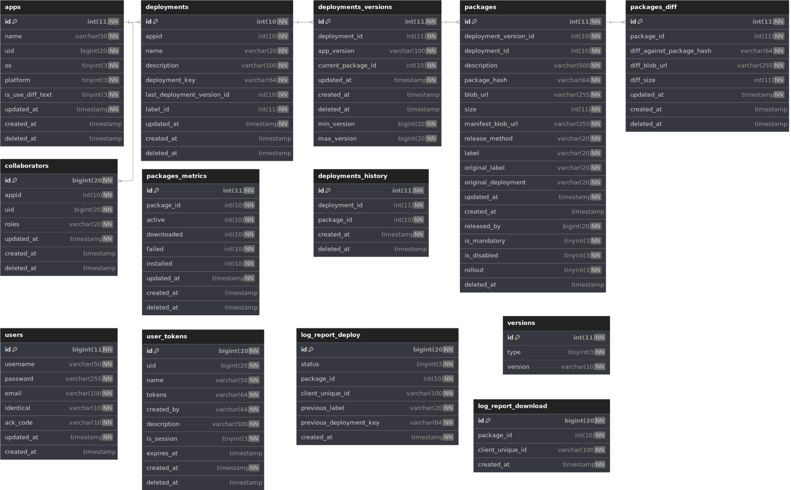
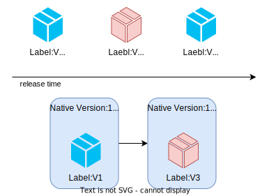
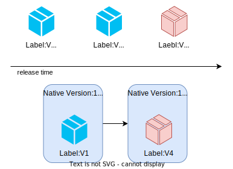
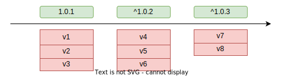

## React Native 技术详解 (六) - Code Push 热更新设计 
React Native 的`热更新`支持是其能作为被广泛使用的技术重要原因。

它能绕过应用市场审核，实现快速多次迭代和问题修复。更准确得说是 JavaScript 能够被 Android 和 iOS 的`动态执行`的支持，所以才会产生替换执行代码的热更新技术。

下面将基于 Code Push 来阐述其热更新设计，目前微软已经将其统一个到 [App center](https://learn.microsoft.com/en-us/appcenter/) 中来实现多端的更新管理。而对于我们而言只需其中的混合应用更新模块。

微软只开源了客户端的 SDK，也就是 [react-native-code-push](https://github.com/microsoft/react-native-code-push)，我们将对其进行解析。

同时也会讲解非官方的目前广泛被作为 Server 端的 [lisong/code-push-server](https://github.com/lisong/code-push-server)，该库年代久远。你会发现其仓库很久没有更新，也有几百份的 fork。所以下面内容会核心介绍其设计，而不是扎进老旧的代码之中。这样在遇到问题时，才能有足够的信心二次开发完成自我产品需求。

建议使用 fork 版本的 [shm-open/code-push-server](https://github.com/shm-open/code-push-server) 来进行部署，它修复了以前的一些问题，并升级为 ts 版本。

### 基本架构

下面是热更新的基本架构图：



它由三个部件组成：

1. **code-push-server** 服务端。提供身份认证、更新包存储、更新校验、更新包下载、统计等等服务；
2. **code-push-cli** 命令行。提供登录、代码打包、更新包部署等功能；
3. **react-native-code-push** 客户端 SDK。校验更新、下载安装更新包、更新上报等功能。

### Server 端表设计

下面展示了完整的服务端表设计以便后续理解：



> 目前企业在实践中，很少使用外键，通常在应用层面聚合数据，开发业务逻辑。

以下是主要几张表的信息：

**apps**：存储一个应用。需要注意的是，React Native 输出 Android 和 iOS 的包需要分别创建一个 app 来发布更新包。如果还有 Windows 端，则同样再创建一个。因为运行每个平台的更新包都是独立的 bundle 包，需要单独发布。

**deployments**：存储部署信息。主要记录下面一些关键信息：

1. 各个平台客户端对服务器的`访问凭证`(字段：deployment_key)。
2. 部署环境，例如默认存在的 `Staging` 和 `Production` 两种部署环境。你可以在相关文档看到 deploymentName 用于表示环境名称。
3. 最后一次部署的版本 id (字段：last_deployment_version_id)。每次发布新版本时，其 id 都会被记录，在执行`回滚`操作时，据此判断哪个版本将被回滚。

**deployments_versions**：存储发布更新包的版本信息。每次发布如果有不同的 `targetBinaryVersion` 指定都会创建一条版本记录，用于记录可被更新的`原生端版本号范围`。如果每次发布指定的 targetBinaryVersion 都一样，会重用相同的记录。

**packages**：存储更新包的信息。包括：下载地址、hash、是否强制更新、标签 (例如：v1、v2)、发布者 id 等等。

**packages_diff**：存储 diff 更新包的信息。

### 身份认证及权限管理

目前 Code Push 有其自己的身份认证模块，在服务器端提供了如下几张表：

1. `users` 用于保存注册者信息；
2. `user_tokens` 查询登录状态；
3. `collaborators` 区分用户角色。

在角色上分为了两种：`owner` 和 `collaborator`。

当使用 cli 登录后，创建一个 app，那么当前登录用户便是该 app 的 `owner` 角色，而该 owner 可以添加其它用户作为 `collaborator` 角色参与到该 app 查看发布等行为。

下面是所有者和协助者的权限对比：

|操作|Owner| Collaborator|
|--|:--:|:--:|
| **-App-** |||
|删除|✅|❌|
|重命名|✅|❌|
|转移 owner 权限|✅|❌|
| **-部署-** |||
|查看|✅|✅|
|发布|✅|✅|
|删除|✅|❌|
|重命名|✅|❌|
|促进 (promote)|✅|✅|
|回滚|✅|✅|
| **-用户-** |||
|查看 collaborator|✅|✅|
|添加 collaborator|✅|❌|
|删除 collaborator|✅|❌|
| **-部署历史-** |||
|查看|✅|✅|
|删除|✅|❌|
| **-统计-** |||
|查看|✅|✅|

### 版本策略

Code Push 使用 [semver](https://semver.org/lang/zh-CN/) 语义化的版本规范，也就是目前 npm 包管理版本的方式。

但不同的是 npm 包通常发布出去的是固定版本号，而 Code Push 却允许使用`逻辑操作符`约束版本号。这样做的目的是使发布的版本可以`被指定二进制版本范围所更新`，而不仅仅是固定版本号。

> 这里的二进制版本指 React Native 所依赖平台的`原生端`版本。

如下是有效的版本号范围表达式的例子：

| 范围表达式 | 谁获得更新                                                                                         |
|------------------|----------------------------------------------------------------------------------------|
| `1.2.3`          | 只有`1.2.3`版本                                                                                |
| `*`                 | 所有版本                                                                                        |
| `1.2.*`          | 主版本为1，小版本为2的任何版本                                       |
| `1.2.3-1.2.7`  | 在 `1.2.3` (包含) 和 `1.2.7` (包含)之间的版本                 |
| `>=1.2.3<1.2.7` | 在 `1.2.3` (包含) 和 `1.2.7` (不包含)之间的版本          |
| `~1.2.3`         | 相当于`>=1.2.3<1.3.0`                                                         |
| `^1.2.3`         | 相当于`>=1.2.3<2.0.0`                                                         |

#### 实现方式

在 Server 端通过 `deployments_versions` 表来记录发布的包版本号。解析语义化版号后，通过 `min_version` 和 `max_version` 两个字段来记录可被更新的原生端的最低和最高版本号。

下面是语义化版本号解析到对应数据库存储的值：

| 范围表达式 |  min_version | max_version | 版本范围|
|------------------|-----------|--|--|
| `1.2.3`          | 1000020000000003|1000020000000004|1|
| `*`                 | 0|9999999999999999999|9999999999999999999|
| `1.2.*`          | 1000020000000000|1000030000000000|10000000000|
| `1.2.3-1.2.7`  | 1000020000000003                 |1000020000000008|5|
| `>=1.2.3<1.2.7` | 1000020000000003          |1000020000000007|4|
| `~1.2.3`         | 1000020000000003| 1000030000000000|9999999997|
| `^1.2.3`         | 1000020000000003    |2000000000000000|999979999999997|

Code Push Server 给`主版本号`预留了 `3` 位大小，`次版本号` `5` 位大小，`补丁版本号` `10` 位大小的表示空间。

在 React Native 的更新中，`比对版本号`为`原生端的版本号`，该版本号在构建时产生。应用程序运行时，React Native 会读取原生端的版本号来向服务器请求可用更新。

下面是读取各端版本号的位置：

| 平台               | 二进制版本号来源 |
|------------------------|---------|
| Cordova                | 在 `config.xml` 文件里的 `<widget version>` 属性   |
| React Native (Android) | 在 `build.gradle` 文件里 `android.defaultConfig.versionName` 属性 |
| React Native (iOS)     | 在 `Info.plist` 文件里的 `CFBundleShortVersionString` 键|
| React Native (Windows) | 在 `Package.appxmanifest` 文件的 `<Identity Version>` 键     |

#### 版本校验

在原生端请求校验更新时，会提供一个表示目标二进制版本号 `appVersion` 字段。此时 Server 端会返回满足 `min_version <= appVersion < max_version` 条件并且选择`版本范围最小`的一个更新。Server 端计算版本范围公式：`max_version - min_version`。

在 `lisong/code-push-server` 实现下，并不是发布更新包的时间最新，更新包就优先被更新，而是由`版本范围`来决定，**这种决策值得商榷**。

看下面的情况：



上面三个更新包的发布版本都满足目标二进制版本号 1.0.2。但即便 V4 版本是最新发布的包，因为 V3 发布的版本范围 `<` V4，因此最后返回可用更新为 V3。如果版本范围`相等`，默认采用`最新`一个更新包。

如果我们期望 App 总能更新最新的更新包，需要发布时指定一个确切的 app 版本号：

``` shell
code-push release demo-ios ./dist/rn/ios "1.0.3" -d Staging --des "update something"
```



#### 思考

目前 `lisong/code-push-server` 是通过版本范围来实现的，但这样的设计并不合理或者说存在 bug。通常`最新`一个可用包被更新才是期望的。下面是目前仓库实现代码片段：

``` ts
models.DeploymentsVersions.findAll({
  where: {
    deployment_id: dep.id,
    min_version: { [Sequelize.Op.lte]: version },
    max_version: { [Sequelize.Op.gt]: version }
  }
})
  .then((deploymentsVersionsMore) => {
    var distance = 0;
    var item = null;
    _.map(deploymentsVersionsMore, function (value, index) {
      if (index == 0) {
        item = value;
        distance = value.max_version - value.min_version;
      } else {
        if (distance > (value.max_version - value.min_version)) {
          distance = value.max_version - value.min_version;
          item = value;
        }
      }
    });
    log.debug(item);
    return item;
  });
```

而在 `shm-open/code-push-server` 仓库下，调整成了返回最新包，它是下面这样：

``` ts
DeploymentsVersions.findAll({
  where: {
    deployment_id: dep.id,
    min_version: { [Op.lte]: version },
    max_version: { [Op.gt]: version },
  },
}).then((deploymentsVersionsMore) => {
  const item = _.last(_.sortBy(deploymentsVersionsMore, 'created_at'));
  logger.debug({
    item,
  });
  return item;
});
```

在满足最大版本号和最小版本号后，返回最新创建的一个更新包，应该说这种是符合预期。

#### Q&A

Q: 为什么需要针对特定版本来更新呢，可以直接使用最新更新包更新在所有原生端版本么？

A: React Native 本身提供的还是原生渲染和本地功能，不可能在一开始就完成所有 API 工作。因此，每次需要开发新的 [Native API](https://reactnative.dev/docs/native-modules-intro) 时，依然需要发布新的原生端版本。此时，只有用户更新原生端版本，才能在较新的更新包里使用新的桥接 API。

### 如何设置发版号

面临范围版本的发版语法该如何发布正确的版本号呢？首先，我们需要明确的是原生端的版本不一定和 bundle 包有关联。在混合应用开发中，有些需求和 bug 修复只需原生端发版。

所以我们需要确保新发布的更新包能够被多个原生端版本所更新，此时范围版本号的语法在这里起到至关重要的作用。

我们考虑下面的情况：


那我们该如何设置发布的版本号呢？这里需要考虑此次更新是否是`破坏性更新`。

可以看到 `1.0.3` 对于 `1.0.2` 是破坏性更新。也就是说 1.0.2 或者 1.0.1 的用户必须升级他们原生端到 1.0.3 版本，才能获取在 1.0.3 版本下的更新包。

所以，如果当前更新包和 1.1.0 之前的原生端不兼容，应该设置成 `^1.1.0`。如果兼容，则设置成：`^1.0.3`。

#### 共识

正因为发版版号的灵活，所以我们需要一种共识来保证大家正常的发版符合团队成员的预期。

对于日常发布更新包，建议使用 `^` 语法。`^` 语法能保证原生端修改`次版本号`和`修订版本号`的版本都能更新到新的包。

还有一个好处是即便原生端发布了新版本号，对于向下兼容的更新包无需关注当前最新原生端版本号是多少，只需按照最后一次部署的版本设置 `^` 语法的版本范围即可。

而如果针对指定范围的补丁更新包，则灵活使用其它操作符即可。

### 回滚(rollback)

回滚是软件更新常见功能。Code Push 支持回滚到上一个版本，也支持回滚到指定版本。目前在 `Staging` 和 `Production` 环境都支持回滚。

查看下面两个 `code-push-cli` 回滚用例：

1. 假设名为 `demo-ios` App 已经发布了两个版本 `v1` 和 `v2`，要把`生产环境`的当前版本回滚到`上一个版本`的更新包:

``` shell
code-push rollback demo-ios Production
```

2. 假如你的更新包版本已经发布到 `v3`，那么可以直接从 `v3` 回滚到指定版本 `v1`：

``` shell
code-push rollback demo-ios Production --targetRelease v1
```

#### 实现方式

Server 端在实现回滚功能，实际会`创建一条新的 packages 表记录`，通过字段 `origin_label` 指向回滚的更新包，此时其 `release_method` 字段被标记为 `Rollback`。



我们注意到上面的原生端版本号都是：1.0.3，这是因为在设计上只能回滚相同的 targetBinaryVersion 且是最近一次发布版本的 package，也就是 `deployments` 表中 `last_deployment_version_id` 对应的 packages 表里的记录。

例如对于下面的例子：



此时，发布的最近一次版本是：`^1.0.3`。因此，能够回滚的更新包只有：v7。

### 增量更新

作为热更新的核心功能，`增量更新`也被叫做`差异更新` (diff update) 是节省用户更新时间和流量必要手段。

它的基本工作原理是把`当前`发布的全量包和最近几次发布的全量包进行比对，生成 diff 包。如果用户更新命中当前发版的包版本，则只需要下载 diff 包即可。

下载完 diff 包成后，在原生端本地当前版本的包和 diff 包合并成新的本地全量包，最后进行新版本包的安装。

在新包发布时，Code Push Server 端`默认`对最近 `3` 个版本的全量包进行合并。生成的 diff 包信息，由 `packages_diff` 表来记录。

因此，一次版本的发布，对于服务器而言会存储 `1` 个全量包和 `3` 个差异包，过多版本进行 diff，会加大服务器存储空间。对于超过 3 个迭代的版本原生端，它会接收到的全量包的更新。

`shm-open/code-push-server` 中，你可以在 [config.ts](https://github.com/shm-open/code-push-server/blob/194acbb05d123b30db83561a18413aaf669bf9a4/src/core/config.ts#L104) 里的 `diffNums` 配置来修改此设置。



**注意**：`内置包`和部署到服务器的更新包**必须**保持一样。否则，热更新会因为 hash 不匹配而进行全量更新。

#### diff 方式

比对方式有`文件差异`比对和`文本差异`比对。文件差异比对将只考虑文件存在与否的比对方式，而文本差异比对则是对同目录下同名文件内容差异进行比对。

其中，`文本差异`比对的功能在 Code Push Server 端`默认未开启`，你需要对 `apps` 表里的 `is_use_diff_text` 字段设置为 `1` 来启用该功能。

##### 文件比对

文件比对比较简单，遍历目录根据每个文件的 hash 值来校验是否需要将其放置 diff 包内。

##### 文本比对

文本比对就需要考虑 patch 算法了。目前 `code-push-server` 采用 google 的 [diff-match-patch](https://github.com/google/diff-match-patch) 来进行算法比对。

### 更新方式

在正常的迭代时，Code Push 客户端的更新是`静默模式` (silent mode)，即用户对更新无感知的。如下可以使用装饰器方式最为简单：

``` ts
// Decorator; Requires ES7 support
@codePush
// or
@codePush(options: CodePushOptions)
class App extends Component<{}> {}
```

装饰器内部实现的逻辑是在组件 `componentDidMount` 勾子中调用 `CodePush.sync()` 方法，

你可以设置更多 [CodePushOptions](https://github.com/microsoft/react-native-code-push/blob/master/docs/api-js.md#codepushoptions) 选项。如需`弹框提示`，那么需要设置 `updateDialog`。

对于有更新提示框的更新被称为`主动模式` (active mode)，通常为了把更新的控制权交给用户。但对于更新包标识了 `mandatory` 为 true 的更新。用户只能选择更新，而无法忽视本次更新。

``` ts
codePush.sync({ updateDialog: true })
```

Code Push 默认调用 React Native 的 `Alert.alert()` 方法来弹出模态框，弹框样式比较丑陋。

参考资料：

\> [https://github.com/microsoft/code-push/blob/v3.0.1/cli/README-cn.md](https://github.com/microsoft/code-push/blob/v3.0.1/cli/README-cn.md)

\> [https://github.com/IllusionVK/ReplaceAppCenter/issues/3](https://github.com/IllusionVK/ReplaceAppCenter/issues/3)
