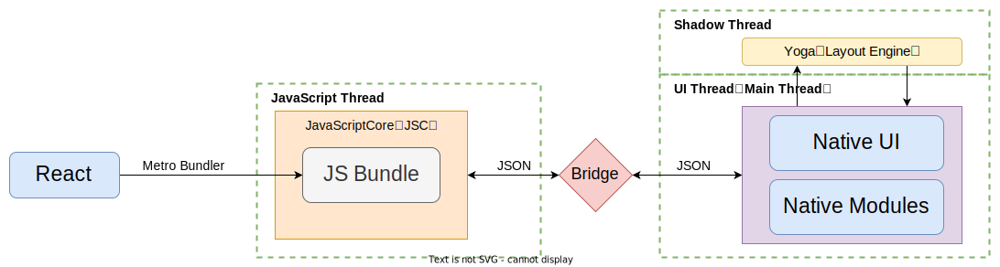

## React Native 技术详解（二）- 新架构 
在[React Native 技术详解（一）- 认识它](../react-native-1-introduction/#react-native-架构及核心生态)中，我们知道 React Native 以前的架构图如下：

React Native 以 React 技术为开发基础，通过 Metro 捆绑器打包成最终目标代码文件 JS Bundle。jsbundle 运行在 JavaScriptCore 执行引擎，通过 Bridge 传递布局及相关渲染数据。最后，由 Yoga 进行与 Native UI 模块管理布局和渲染的工作。

新的架构图如下：

新的架构有以下几个新的概念：`JSI`、`Fabric`、`Turbo Modules`、`CodeGen`，这些都将至我们必须了解的，下面都将逐一解释。
