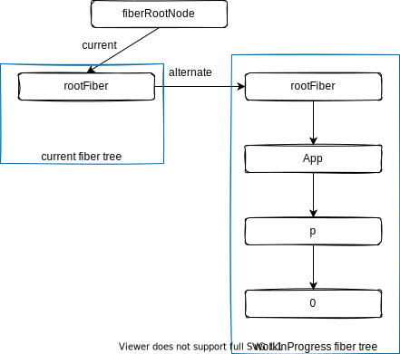

## React 之技术详解 (一) - Fiber 理念篇 
### 问题描述

在浏览器环境里，`JS 运算`在一个被称为`JavaScript 引擎线程`中执行，我们简称：`JS 线程`，它可以操作 DOM，我们需要明确的是 Javascript 语言发明之初就是用来处理页面交互的，而不具备大规模运算的能力。页面元素`布局`及`绘制`都由`GUI 渲染线程`完成。

通常由于`JS 执行`过程中，引起了`重绘` (repaint) 或`重排` (reflow) ，从而使`挂起状态的 GUI 线程`开始执行。

#### JS 线程与 GUI 线程的互斥

如果`JS 线程`和`GUI 线程`同时运行，就不能确保数据更新状态。所以`GUI 更新`会被保存在一个`队列`中等到`JS 线程空闲`时立即被执行，所以说`JS 线程`与`GUI 线程`是`互斥`的。

> 除此之前，浏览器还有`定时触发器线程`、`事件触发线程`、`异步http请求线程`等等，用于实现异步任务。

如果`JS 运算`占用大量运算时间，那么页面的渲染必然会被阻塞，自然而然帧率(FPS)就会降下来。

> 帧率：每秒能呈现渲染多少次画面，用于衡量动画流畅度的指标。通常 fps < 30 就能明显感知卡顿现象，流畅舒适的动画帧率在60左右。所以渲染一次画面所需的时间`力求` < 16ms。

在每`16ms`的时间内，需要完成以下工作，才能保证视觉连贯：

``` text
JS脚本执行 ---  样式布局 --- 样式绘制
```

如果`JS 执行`时间过长，超出了 16 ms，这次刷新就没有时间执行样式布局和样式绘制了，那么该如何解决这个问题呢？

### 解决思路

基本思路是把`JS 运算`切割成多个任务，分批完成各个任务。在完成一部分任务后，把执行的控制权交还给浏览器，让其有时间进行渲染工作。渲染完成后，再进行未完成的计算任务。

> 这种将长任务分拆到每一帧中，像蚂蚁搬家一样一次执行一小段任务的操作，被称为`时间切片` (time slice)

那么我们要解决的问题便是`任务分配`和`如何进行时间分片`的问题，这里有个优化前后的例子：[react-fiber-vs-stack-demo](https://claudiopro.github.io/react-fiber-vs-stack-demo)。

### 16 版本之前 React 中的卡顿问题

在 state 或 props 更新时，React 的工作主要包含两个阶段：

`协调阶段 (Reconciler)`：React 15 及更早版本被叫做 `Stack Reconciler` ，因为其数据保存在递归调用栈中，是自顶向下的递归算法。遍历新数据生成新的 Virtual DOM，通过 Diff 算法，找出需要更新的元素，放到更新队列中去。关键是这个过程并不能被中断。

`渲染阶段 (Renderer)`：遍历更新队列，调用渲染宿主环境的 API, 将对应元素更新渲染。在浏览器中，就是更新对应的 DOM 元素。除浏览器外，渲染环境还可以是 Native、WebGL 等等。

在协调阶段，为了找出需要更新的元素，花费了大量时间，所以渲染阶段被延后执行，这直接导致`卡顿`。

### 协调与渲染

DOM 只是 React 可以渲染的渲染环境之一，其他主要目标是通过 React Native 生成的原生 iOS 和 Android 视图。 (这就是为什么“虚拟 DOM”有点用词不当。)

它可以支持这么多目标的原因是因为 React 被设计为`协调`和`渲染`是分开的阶段。`协调器` (reconciler) 负责计算树的哪些部分发生了变化；然后`渲染器`使用该信息来实际更新渲染的应用程序。

这种分离意味着 React DOM 和 React Native 可以使用自己的渲染器，同时`共享`由 React 核心提供的相同的`协调器`。

在 React 16 之后，重新实现了协调器。它主要不涉及渲染，尽管渲染器需要更改以支持 (并利用) 新架构 (`Fiber`) 。

### Fiber 的含义

1. 作为架构来说，之前 React15 的 Reconciler 采用递归的方式执行，数据保存在递归调用栈中，所以被称为`Stack Reconciler`。React16 的 Reconciler 基于 Fiber 节点实现，被称为`Fiber Reconciler`。
2. 作为静态的数据结构来说，每个`Fiber节点`对应一个`React element`，保存了该组件的类型 (函数组件/类组件/原生组件…) 、对应的DOM 节点等信息。
3. 作为动态的工作单元来说，每个`Fiber 节点`保存了本次更新中该组件改变的状态、要执行的工作 (需要被删除/被插入页面中/被更新…) 。

#### Fiber 做了哪些工作

Fiber 在 React 生成的 Virtual Dom 基础上增加的一层`链表`数据结构，把`递归遍历`转成`循环遍历`。配合 [requestIdleCallback API](https://developer.mozilla.org/zh-CN/docs/Web/API/Window/requestIdleCallback), 实现任务`拆分`、`中断`与`恢复`。

> window.requestIdleCallback()方法将在浏览器的空闲时段内调用的函数排队。这使开发者能够在主事件循环上执行后台和低优先级工作，而不会影响延迟关键事件，如动画和输入响应。函数一般会按先进先调用的顺序执行，然而，如果回调函数指定了执行超时时间timeout，则有可能为了在超时前执行函数而打乱执行顺序。

之所以改变数据结构，是因为`递归遍历不能将工作分解`为增量单位，React一直保持迭代，直到处理完所有组件并且堆栈为空为止。

那么 React 如何实现算法而无需递归遍历树呢？它使用`单链列表树`遍历算法,这样可以`暂停遍历`并`阻止堆栈增长`。链表遍历算法可以`异步运行`，使用指针返回到其暂停工作的节点。

#### Fiber Node

React 的单链表树的节点被叫做 Fiber Node，它包含一些关键信息。以往的 Virtual Dom Node 是包含状态信息的`StateNode`，现在会增加节点关系信息。

``` javascript
function FiberNode(
  tag: WorkTag,
  pendingProps: mixed,
  key: null | string,
  mode: TypeOfMode,
) {
  // 作为静态数据结构的属性
  this.tag = tag;
  this.key = key;
  this.elementType = null;
  this.type = null;
  this.stateNode = null;

  // 用于连接其他 Fiber 节点形成 Fiber 树
  this.return = null;
  this.child = null;
  this.sibling = null;
  this.index = 0;

  this.ref = null;

  // 作为动态的工作单元的属性
  this.pendingProps = pendingProps;
  this.memoizedProps = null;
  this.updateQueue = null;
  this.memoizedState = null;
  this.dependencies = null;

  this.mode = mode;

  this.effectTag = NoEffect;
  this.nextEffect = null;

  this.firstEffect = null;
  this.lastEffect = null;

  // 调度优先级相关
  this.lanes = NoLanes;
  this.childLanes = NoLanes;

  // 指向该 fiber 在另一次更新时对应的 fiber
  this.alternate = null;
}
```

#### 作为架构来说

每个 Fiber 节点有个对应的 React element，多个 Fiber 节点是如何连接形成树呢？靠如下三个属性：

``` javascript
// 指向父级 Fiber 节点
this.return = null;
// 指向子 Fiber 节点
this.child = null;
// 指向右边第一个兄弟 Fiber 节点
this.sibling = null;
```

举个例子：

``` jsx
function App() {
  return (
    <div>
      i am
      <span>Lu Min</span>
    </div>
  )
}
```

对应的 Fiber 树：


> 为什么父级指针叫做 return 而不是 parent 或者 father 呢？因为作为一个工作单元，return 指节点执行完 completeWork 后会返回的下一个节点。`子 Fiber 节点`及其`兄弟节点`完成工作后会返回其父级节点，所以用 return 指代父级节点。

#### 作为静态的数据结构

作为一种静态的数据结构，保存了组件相关的信息：

``` javascript
// Fiber 对应组件的类型 Function/Class/Host...
this.tag = tag;
// key 属性
this.key = key;
// 大部分情况同 type，某些情况不同，比如 FunctionComponent 使用 React.memo 包裹
this.elementType = null;
// 对于 FunctionComponent，指函数本身，对于 ClassComponent，指 class，对于 HostComponent，指 DOM 节点 tagName
this.type = null;
// Fiber 对应的真实 DOM 节点
this.stateNode = null;
```

#### 作为动态的工作单元

作为动态的工作单元，Fiber中如下参数保存了本次更新相关的信息：

``` javascript
// 保存本次更新造成的状态改变相关信息
this.pendingProps = pendingProps;
this.memoizedProps = null;
this.updateQueue = null;
this.memoizedState = null;
this.dependencies = null;

this.mode = mode;

// 保存本次更新会造成的 DOM 操作
this.effectTag = NoEffect;
this.nextEffect = null;

this.firstEffect = null;
this.lastEffect = null;
```

如下两个字段保存调度优先级相关的信息：

``` javascript
// 调度优先级相关
this.lanes = NoLanes;
this.childLanes = NoLanes;
```

> 在 2020 年 5 月，调度优先级策略经历了比较大的重构。以`expirationTime`属性为代表的优先级模型被`lane`取代，详见这个[PR](https://github.com/facebook/react/pull/18796)。

> 如果你的源码中`fiber.expirationTime`仍存在，请参照章节获取最新代码。

### 双缓存下的 Fiber 树

这里用到[双缓存](https://baike.baidu.com/item/%E5%8F%8C%E7%BC%93%E5%86%B2/10953356?fr=aladdin)技术。

React 会存在两个 Fiber 树实例：`current fiber tree` 和 `workInProgress fiber tree`。

* `current fiber tree`：建立在第一个渲染器上，与 Virtaul DOM 具有一对一的关系，对应当前屏幕上显示内容，它的节点称为`current fiber`。

* `workInProgress fiber tree`：正在内存中构建的 Fiber 树，即将用于渲染的树，它的节点称为`workInProgress fiber`。

`current fiber`与`workInProgress fiber`通过`alternate`属性连接：

``` javascript
currentFiber.alternate === workInProgressFiber;
workInProgressFiber.alternate === currentFiber;
```

### Fiber 的渲染原理

React 应用的 root 节点通过`current`指针在不同 Fiber 树的 rootFiber 间切换来实现 Fiber 树的切换。

当 workInProgress fiber 树构建完成交给 Renderer 渲染在页面上后，应用 root 节点的 `current` 指针指向 workInProgress Fiber 树，此时 workInProgress Fiber 树就变为 current Fiber 树。

每次`状态更新`都会产生新的 workInProgress Fiber 树，通过 current 与 workInProgress 的替换，完成 DOM 更新。

下面是`mount`时和`update`时的替换流程。

#### mount 时

考虑下面的例子：

``` jsx
function App() {
  const [num, add] = useState(0);
  return (
    <p onClick={() => add(num + 1)}>{num}</p>
  )
}

ReactDOM.render(<App/>, document.getElementById('root'));
```

**1.首次创建时**

首次执行`ReactDOM.render`会创建`fiberRootNode` (源码中叫 fiberRoot) 和 `rootFiber`。其中 fiberRootNode 是整个应用的 root 节点，rootFiber 是 `<App/>` 所在组件树的根节点。

之所以要区分 fiberRootNode 与 rootFiber，是因为在应用中我们可以多次调用 ReactDOM.render 渲染不同的组件树，他们会拥有不同的 rootFiber。但是整个应用的 root 节点只有一个，那就是 fiberRootNode。

fiberRootNode 的`current`会指向当前页面上已渲染内容对应对 Fiber 树，被称为`current Fiber 树`。


``` javascript
fiberRootNode.current = rootFiber;
```

由于是`首屏渲染`，页面中还没有挂载任何 DOM，所以 fiberRootNode.current 指向的 rootFiber 没有任何子 Fiber 节点 (即 current Fiber 树为`空`) 。

**2.渲染阶段**

接下来进入`render 阶段`，根据组件返回的`JSX`在内存中`依次创建 Fiber 节点`并`连接`在一起构建 Fiber 树，被称为`workInProgress Fiber 树`。

在构建 workInProgress Fiber 树时会`尝试复用` current Fiber 树中已有的 Fiber 节点内的属性，在首屏渲染时只有 rootFiber 存在对应的 current fiber (即`rootFiber.alternate`) 。

下图中`左侧`为页面显示的树，`右侧`为内存中构建的树：



**3.提交阶段**

已构建完的`workInProgress Fiber 树`在`commit 阶段`渲染到页面。

此时 DOM 更新为`右侧树`对应的样子。fiberRootNode 的 current 指针指向`workInProgress Fiber 树`使其变为`current Fiber 树`。


#### update 时

**1.点击 p 节点，触发状态改变**

接下来我们点击 p 节点触发状态改变，这会开启一次`新的 render 阶段`并构建一棵新的 workInProgress Fiber 树。


和 mount 时一样，workInProgress fiber 的创建可以`复用` current Fiber 树对应的节点数据。

> 这个决定是否复用的过程就是 Diff 算法。

**2.渲染之后，提交**

workInProgress Fiber 树在`render 阶段`完成构建后进入`commit 阶段`渲染到页面上。渲染完毕后，workInProgress Fiber 树变为current Fiber 树。


#### 源码中的术语

上面我们了解了 React 的 Scheduler-Reconciler-Renderer 架构体系，在继续深入了解 Fiber 之前，我想介绍几个源码内的术语：

* `Reconciler`工作的阶段被称为`render 阶段`，因为在该阶段会调用组件的`render 方法`。
* `Renderer`工作的阶段被称为`commit 阶段`，就像你完成一个需求的编码后执行 git commit 提交代码。commit 阶段会把 render 阶段提交的信息渲染在页面上。
* `render`与`commit`阶段统称为`work`，即 React 在工作中。相对应的，如果任务正在`Scheduler`内调度，就不属于 work。

### Fiber 的渲染的两个阶段

Fiber 渲染分成两个阶：`render 阶段`和 `commit 阶段`。

#### Render 阶段

在 React 第一次渲染会生成 Fiber 节点树，并在后续的更新被重用。详细点来说渲染阶段会生成一个部分节点标记了 `side effects` 的 Fiber 节点树，在源码中叫做 `workInProgress tree` 或 `finishedWork`。side effects 描述了在下一个 commit 阶段需要完成的工作。

这个阶段的任务是确定需要插入、更新或删除哪些节点，以及哪些组件需要调用其生命周期方法。

这个阶段的特点是可以`异步执行`，中间的执行可以中断，可以根据`可用时间`来处理一个或多个 Fiber 节点，并且用户不可见。

执行会有几个场景：

1. 完成部分工作后，交出控制权处理其它事情，后面控制权回来再继续处理任务。
2. 超过时，当前的任务会被终止，直到下一次继续。
3. 如果有更高优先级的任务，那当前任务会被终止。什么样的任务具有更高优先级的呢？像用户的交互输入优先级是比较高的。

#### Commit 阶段

这个阶段会用到几个数据结构：

1. render 阶段生成 workInProgress tree，
2. 被叫做 current tree 的 fiber 节点树，它直接用于更新UI。
3. effects list，由 render 阶段生成的列表。

这个阶段的任务是更新UI，并回调一些生命周期方法，包含以下一些操作：

* 在标记了 `Snapshot effect` 的节点上调用 `getSnapshotBeforeUpdate` 生命周期方法；
* 在标记了 `Deletion effect` 的节点上调用 `componentWillUnmount` 生命周期方法；
* 执行所有 DOM 插入，更新和删除；
* 将 workInProgress tree 树设置为 current 树；
* 在标记了 `Placement effect` 的节点上调用 `componentDidMount` 生命周期方法；
* 在标记了 `Update effect` 的节点上调用 `componentDidUpdate` 生命周期方法；

#### 总体的流程

``` shell
--- working asynchronously ---------------------------------------------------------------------------
| ------- Fiber ---------------    ------- Fiber ---------------    ------ Fiber ---------------     |
| | beginWork -> completeWork | -> | beginWork -> completeWork | -> |beginWork -> completeWork | ... |
| -----------------------------   ------------------------------    ----------------------------     |
------------------------------------------------------------------------------------------------------
                      ↓↓↓
-----------------------------------------------------------------------
| commitAllWork(flush side effects computed in the above to the host) |
-----------------------------------------------------------------------
```

参考文献：

\> [https://github.com/acdlite/react-fiber-architecture](https://github.com/acdlite/react-fiber-architecture)

\> [https://github.com/reactjs/react-basic](https://github.com/reactjs/react-basic)

\> [https://www.wenjiangs.com/doc/gz3ysc57](https://www.wenjiangs.com/doc/gz3ysc57)
