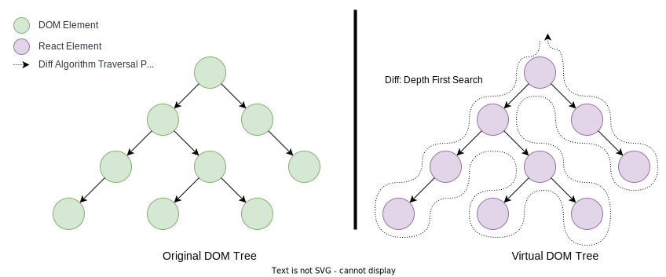
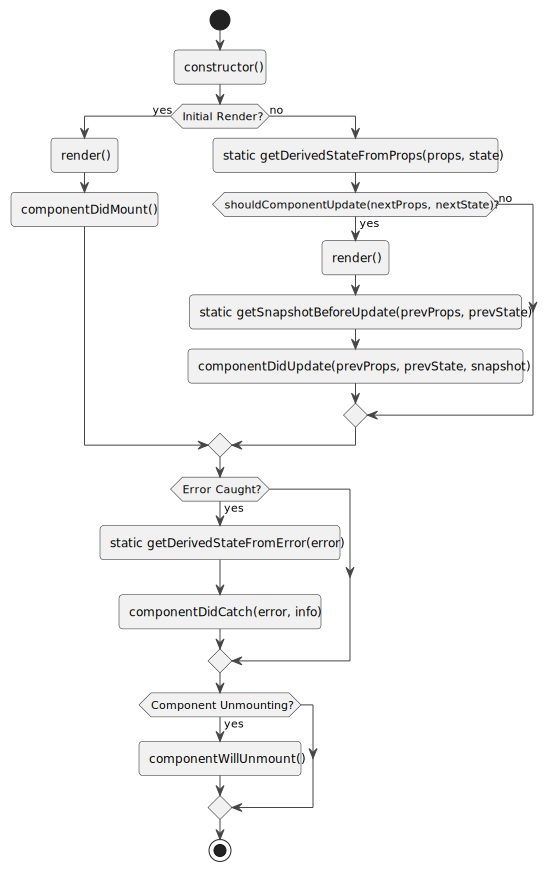

## React 之技术详解 (一) - 认识它 [1] - React 
### 简介

React 是一个由 Facebook 开发并维护的开源前端 JavaScript 库，专门用于构建用户界面 (UI)。最初发布于 2013 年，React 迅速成为开发单页应用程序 (SPA) 的流行选择。

以下是 React 的一些关键优势：

1. **声明式编程**: React 采用`声明式编程`范式，使得代码更容易理解和维护。开发者只需描述 UI 应该呈现的状态，React 会自动处理 UI 的更新。
2. **组件化结构**: React 鼓励将 UI 拆分为独立、可复用的组件，这有助于开发者组织代码并提高开发效率。
3. **虚拟 DOM (Virtual DOM)**: React 使用虚拟 DOM 来优化性能，通过最小化真实 DOM 的操作次数来提高渲染效率。
4. **单向数据流**: React 实施单向数据流(或单向数据绑定)，使得数据的流向更加清晰，有助于减少程序中的错误。
5. **丰富的生态系统**: React 有一个庞大且成熟的生态系统，包括各种各样的工具、中间件、开源组件库和扩展，如 Redux、React Router 等。
6. **灵活性**: React 可以与其他库和框架如 Redux、MobX 或 Angular 搭配使用，提供灵活的架构选择。
7. **强大的社区支持**: React 享有强大的社区支持和丰富的文档资源，有助于解决开发中的问题和学习最佳实践。
8. **学习曲线平缓**: 相比于其他前端框架，React 的 API 较少且相对简单，容易上手学习。
9. **跨平台开发**: 通过 `React Native`，开发者可以使用 React 及其组件模型来构建跨平台的移动应用。
10. **并发特性**: React 的`并发模式`允许应用在用户体验和性能之间取得更好的平衡。

React 的这些优势使得它非常适合构建动态、高交互的 Web 应用程序，无论是小型项目还是大型企业级应用。

### 虚拟 DOM

虚拟 DOM (Virtual DOM) 是一种编程概念，其中对 UI 的更新不是直接操作浏览器的 DOM，而是先在一个轻量级的 JS 对象 (即“虚拟”DOM)中进行。这个对象可以看作是 DOM 的一个快照或者副本。

当应用程序的状态变化时，不是直接更新真实的 DOM，而是先更新这个虚拟 DOM。之后，虚拟 DOM 树的当前状态与上一次渲染后的状态进行比较，这个过程称为`差异计算` (Diffing)。

通过差异计算可以确定实际 DOM 需要进行的最小数量的 DOM 操作，然后才会应用这些变化到真实的 DOM 树上。这个过程称为“重排” (Reconciliation)。



在 React 的更新机制中，每次组件的状态或属性发生变化时，React 都会创建一个新的 React Element 树。然后，React 使用这个新的元素树与上一个渲染的树进行比较，计算出需要在 DOM 上进行的最小更新，这个过程称为`协调` (Reconciliation)。

### 渲染的两个阶段

从调用 render 开始，react 便开始了一轮更新周期，每个周期分为`协调阶段`和`提交阶段`。

1. **协调阶段**：找出需要更新的节点。
2. **提交阶段**：把已经找到的需要更新的节点，通过 DOM API 更新实际的 DOM元素。

在 React 16 之后，整体架构多出一个**调度器**的核心概念用于在协调阶段采用分时处理用户事件和协调工作的任务冲突。

#### 协调阶段

协调的工作内容是每次组件的状态更新，需要从虚拟 DOM 树`根节点开始进行遍历`，生成新的虚拟 DOM 树，完成对新老虚拟 DOM 树的对比 (Diff)，找出需要更新的 React 元素。这种更新操作可能是添加、删除或更新。

这一阶段的主要工作内容包括：

1. **遍历生成新虚拟 DOM 树**:
   - 根据最新的 props 和 state 创建新的 React 元素。

2. **比较差异 (Diffing)**:
   - 对比旧的组件树和新的组件树（即当前在内存中的组件树与最近一次渲染的组件树），并确定哪些组件需要更新。这个过程又称为 Diffing。

3. **生成更新列表**:
   - 确定哪些部分需要更改后，React 会生成一个“更新列表”，这个列表包含了 React 需要执行的所有 DOM 更新。

#### 提交阶段

把需要更新的 React 元素更新到实际的 DOM 里去。

在这一阶段，React 会应用所有排队的更新，实际修改 DOM，并执行如生命周期方法或钩子函数（hooks）中的副作用。提交阶段是同步的，一旦开始就不能被打断。

### Stack Reconciler (已废弃)

协调器 (Reconciler)是协调阶段延伸的一个概念，专门用于高效查找虚拟 DOM 中可更新 React 元素。

Stack Reconciler 是 React 框架早期版本中使用的协调器。"协调" (Reconciliation) 是 React 中用于比较旧的虚拟 DOM 树和新的虚拟 DOM 树的差异，并确定实际的 DOM 需要哪些更新的过程。

Stack Reconciler 的名称来源于它的实现方式，该算法利用 JavaScript 的函数调用栈来跟踪组件树的遍历过程。它采用的是`递归处理`更新，这样的处理方式很直观，但在处理深层次的组件树时可能会遇到一些问题：

1. **调用栈大小限制**：JavaScript 的调用栈是有大小限制的。在深度嵌套的组件树中，Stack Reconciler 的递归过程可能会导致超出调用栈大小限制，从而引发"堆栈溢出"错误。

2. **性能问题**：递归算法必须立即、同步地完成整个树的遍历。这可能导致在大型应用程序中，在复杂的 UI 更新过程中，`主线程被长时间阻塞`，影响性能，特别是在性能较差的设备上。

3. **更新不可中断**：由于 JavaScript 是单线程的，一旦组件树更新开始，就必须一直运行到完成。这意味着更新过程不能中断，直到整棵树遍历完毕。因此，无法实现更新的优先级处理，所有更新都被视为同等重要。

由于这些限制，React 团队引入了新的协调器 —— Fiber Reconciler，它解决了上述问题，具备以下特性：

- **增量渲染**：Fiber Reconciler 能够将渲染工作拆分成多个小的任务单元，这些任务可以根据需要暂停、中断、复用或取消。
- **任务优先级**：Fiber Reconciler 可以根据任务的优先级不同，决定任务的执行顺序。例如，用户的交互或动画相关的更新会被赋予较高的优先级。
- **更好的错误处理**：在 Fiber 架构中，React 可以捕获并处理组件树中的错误，防止整个应用崩溃。

随着 Fiber Reconciler 的推出，`Stack Reconciler 逐渐被淘汰`，目前 React 已经完全采用 Fiber 架构。Fiber Reconciler 为 React 带来了更高的性能和更好的用户体验。

### React 元素 (Element)

React Element 是 React 应用中的最小构建块。它是一个轻量级的对象，代表 React 渲染界面上的一个 DOM 节点或者是其他组件。

在 React 中，一个 React Element (通常是通过调用 React.createElement 函数或者使用 JSX 语法创建的)是`不可变的` (Immutability)，一旦被创建，你就**不能**改变它的子元素或者属性。

它包含了以下信息：

- **type**：这可以是一个字符串 (如 `div` 或 `span` 表示 DOM 标签)，或者是一个 React 组件 (类组件或函数组件)。
- **props**：一个对象，其中包含了这个 React 元素的配置选项，如样式、类名、自定义属性等。
- **props.children**：子级 React Element 对象或 React Element 数组。
- **key**：一个可选的唯一标识符，用于在重新渲染时保持组件状态和生命周期的稳定性。
- **ref**：一个可选的引用，用于获取 DOM 元素或者组件的引用。

当使用 JSX 编写代码时，例如：

```jsx
const element = (
  <div>
    <h1>Hello, world!</h1>
    <p>This is a paragraph.</p>
  </div>
);
```

在背后，这段代码会通过 Babel 等编译器转换为 [React.createElement(type, props, ...children)](https://github.com/facebook/react/blob/ce2bc58a9f6f3b0bfc8c738a0d8e2a5f3a332ff5/packages/react/src/ReactElement.js#L362) 函数调用，如下：

```javascript
const element = React.createElement(
  'div',
  null,
  React.createElement('h1', null, 'Hello, world!'),
  React.createElement('p', null, 'This is a paragraph.')
);

```

`React.createElement(type, props, ...children)` 会返回一个 React Element，它的结构类似于：

```javascript
const element = {
  type: 'div',
  props: {
    children: [
      {
        type: 'h1',
        props: {
          children: 'Hello, world!'
        }
      },
      {
        type: 'p',
        props: {
          children: 'This is a paragraph.'
        }
      }
    ]
  }
};

```

如果 UI 需要更新，你需要创建一个新的 React Element 来替代。这个概念是 React 哲学的核心之一，也是它的**性能优化策略的基础**。

#### 不可变性

React 元素的`不可变性` (Immutability) 是 React 高效渲染 UI 的**关键特性**之一。

### React 组件 (Component)

React 组件是 React 库中的核心概念之一。组件让你可以将 UI 拆分成独立可复用的片段，并对每个片段进行独立构思。

在概念上，组件类似于 JavaScript 函数，它们接受任意的输入 (props)，并返回 `React Element`。

组件可以通过不同的方式定义：

1. **函数式组件**：
   这是最简单的组件类型。它是一个纯函数，接受一个 `props` 对象作为参数，并返回一个 React Element。随着 React Hooks 的引入，函数式组件也可以拥有状态和其他 React 特性。

   ```jsx
   function Welcome(props) {
     return <h1>Hello, {props.name}</h1>;
   }
   ```

2. **类组件**：
   类组件提供了更多的特性，比如`局部状态管理`、`生命周期钩子`等。类组件需要扩展 `React.Component` 类，并实现 `render` 方法，该方法返回 React Element。

   ```jsx
   class Welcome extends React.Component {
     render() {
       return <h1>Hello, {this.props.name}</h1>;
     }
   }
   ```

组件的特点：

- **封装**：组件封装了自己的结构、样式和行为。它们可以轻松地被其他组件引用和嵌套。
- **复用**：设计得当的组件可以在不同的部分重复使用，无需重复编写相同的代码。
- **状态管理**：特别是类组件，它们可以通过 `this.state` 和 `this.setState` 来维护和更新自己的状态。
- **生命周期管理**：类组件可以通过生命周期方法对组件的`创建`、`更新`和`销毁`过程进行管理。
- **Hooks**：函数式组件可以通过 Hooks 使用状态和其他 React 特性，Hooks 提供了一个更简单和功能强大的模型来构建组件。

React 的设计哲学是围绕`组件的可复用性`和`组合性`，让开发者能够构建复杂且可维护的用户界面。

#### 生命周期 (Lifecycle)



React组件的生命周期可以分为`挂载`、`更新`和`卸载`阶段。以下是 React 类组件的生命周期方法的简要概述：

**挂载阶段 (Mounting)**

- `constructor()`: 组件的构造函数，最先被调用，用于初始化状态和绑定事件处理方法。
- `static getDerivedStateFromProps(props, state)`: 在组件创建和每次更新时调用，返回一个对象来更新状态，或者返回 `null` 以不更新任何内容。
- `render()`: 必需的方法，返回 React 元素，决定组件渲染的内容。
- `componentDidMount()`: 组件挂载 (插入 DOM 树中) 后调用，常用于发起网络请求、DOM 操作等。

**更新阶段 (Updating)**

- `static getDerivedStateFromProps(props, state)`: 同上。
- `shouldComponentUpdate(nextProps, nextState)`: 决定组件是否应该更新，返回 `false` 可以避免重新渲染。
- `render()`: 同上。
- `getSnapshotBeforeUpdate(prevProps, prevState)`: 在DOM更新前立即调用，用于捕获更新前的 DOM 状态。
- `componentDidUpdate(prevProps, prevState, snapshot)`: 在组件更新后调用，可以操作 DOM 或进行网络请求。

**卸载阶段 (Unmounting)**

- `componentWillUnmount()`: 组件卸载和销毁前调用，用于执行必要的清理任务。

**错误处理**

- `static getDerivedStateFromError(error)`: 渲染阶段发生错误时被调用，用于渲染备用 UI。
- `componentDidCatch(error, info)`: 渲染后子组件发生错误时被调用，用于记录错误信息。

> 在 React 16.3 版本之后，引入了新的“生命周期”API，并逐步废弃了一些旧的 API，如 `componentWillMount`、`componentWillReceiveProps` 和 `componentWillUpdate`。它们被认为是不安全的，应该避免使用。

**React Hooks (函数组件)**

对于函数组件，React 引入了 Hooks API，可以让你在不编写类的情况下使用 state 和其他 React 特性。

以下是一些常用的 Hooks：

- `useState`: 在函数组件中添加状态。
- `useEffect`: 执行副作用操作，可以看作 `componentDidMount`、`componentDidUpdate` 和 `componentWillUnmount` 的组合。
- `useContext`: 允许函数组件订阅 React 的 `Context`。
- `useReducer`: 类似于 `useState`，但适用于更复杂的状态逻辑。
- `useCallback` 和 `useMemo`: 用于性能优化，避免不必要的渲染。
- `useRef`: 访问 DOM 节点或存储可变值。

Hooks 的出现大大简化了状态管理和生命周期事件的处理，因此`函数组件现在比以往更受欢迎`。
