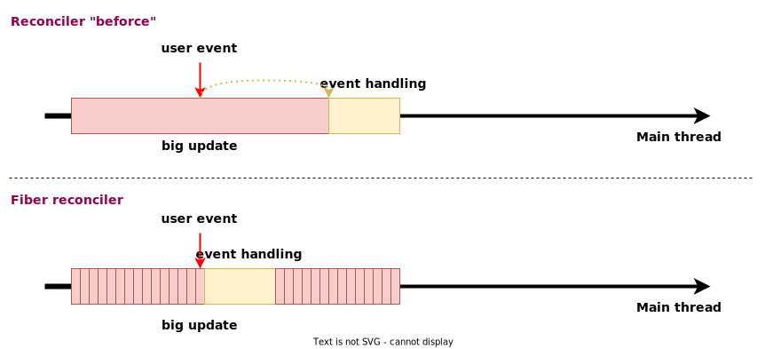
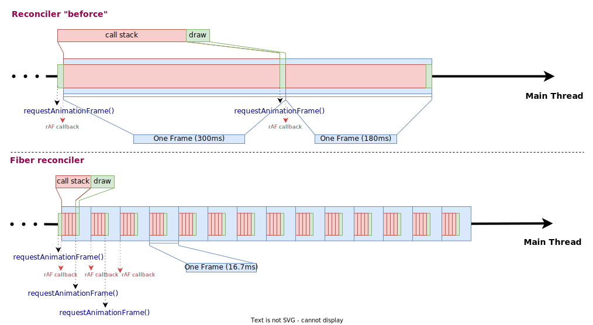
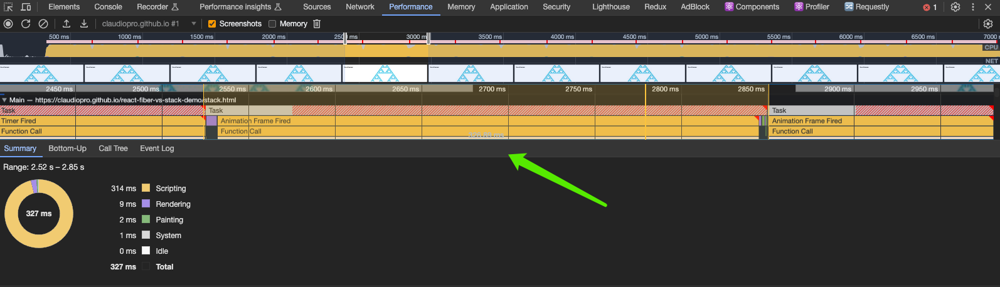
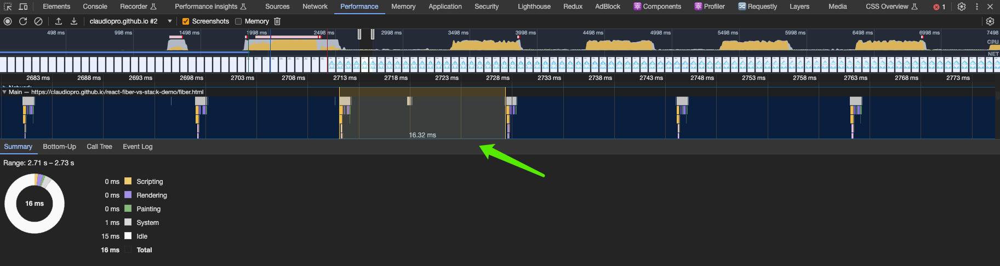
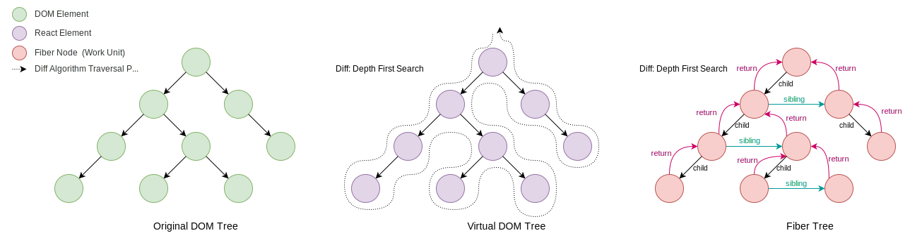
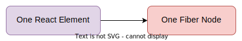
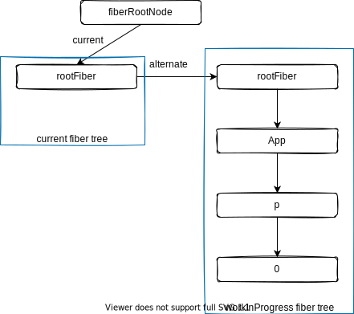

## React 之技术详解 (一) - 认识它 [2] - Fiber 
### 简介

React Fiber 是 React 16 中引入的新的`协调引擎`。

它的主要目标是使 React 的渲染过程更加平滑，允许分割渲染工作到多个块中，并使得主线程更加响应用户操作，防止动画和交互的延迟。

Fiber 为 React 带来了如`时间切片` (time slicing) 和`悬停` (suspense) 等新功能，使得创建交互式的 UI 更加高效。它通过使用虚拟内存或数据结构的概念，即所谓的“fibers”，来追踪组件树上的工作。每个 fiber 代表一个工作单元，并且 React 可以在需要时中断和重新开始这些工作。这使得 React 可以更好地利用现代多核心处理器的优势，提高了应用程序的性能和响应能力。

### 技术革新

我们可以从`用户交互体验`和`动画流畅度`两个方面来说明 Fiber 带来的变革。

#### 更好的用户交互体验



上面的图我们可以看到使用 Fiber 架构后，协调方面的技术革新：

1. 大块的计算任务`分割`成了若干个小的计算`工作单元` (Fiber Node)。
2. `用户事件`的`优先级`得到了提升。
3. 计算任务分割成若干个计算工作单元后，在众多工作单元执行过程中，**允许**用户事件的插入导致工作单元计算的`中断`，并在处理完用户事件后`恢复`工作单元的计算。

#### 更好的动画流畅度



浏览器的渲染引擎通常尝试以显示器的刷新率来绘制内容，以便为用户提供平滑的视觉体验。大多数现代显示器有一个 60Hz 的刷新率，意味着屏幕每秒刷新 60 次。

因此，浏览器的`渲染引擎`会尝试`每 16.7ms` (即 1000 / 60) 绘制一次，以`同步到 60Hz 的刷新率`。

> requestAnimationFrame API 暴露给开发者一个机会，让其在同步频率下，每 16.7ms 执行一次回调函数 (通常用于计算 UI 信息和设置 DOM 样式)，来优化动画流畅度。当开发者使用 requestAnimationFrame 时，他们实际上是请求浏览器在`下一个刷新周期`调用提供的`回调函数`，也就是说请求在 16.7ms 后执行提供的回调函数。

Fiber reconciler 保证了一次连续性的任务 (call stack + draw) 所需的计算时长 < 16.7ms，这样浏览器便把 requestAniationFrame 调用的工作频率同步到 60Hz 绘制帧率，保证动画的平滑度。

### 性能分析

[这里](https://claudiopro.github.io/react-fiber-vs-stack-demo)有个使用 Stack Reconciler 和 Fiber Reconciler 的比较例子。我们通过 Chrome DevTools 的 Performance 工具录制活动信息，来分析两种协调器的性能。

这两个例子的代码除了必要的版本关系带来差异外几乎是一样的。这是个极端的计算 UI 工作量的例子。

1.**Stack Reconciler**



我们可以看到 Stack Reconciler 绘制一帧所需的时间为 327ms 左右，也就说只有 3 FPS 绘制频率，这样的绘制频率达到肉眼可见的卡顿。

2.**Fiber Reconciler**



使用 Fiber 协调器后，每隔 16ms 左右，浏览器会执行一个 Task。通过 Summary 统计看出主线程在这 16ms 内，Task 执行部分只占用了 1ms，剩下 15ms 处于空闲状态 (Idle)。

这保证了浏览器以 60 FPS 的绘制频率

> 一个 Task 就一个连续的代码执行任务，不会有任何回调事件可以插入到 call Stack。

### 实现策略

为了实现更好的用户交互体验和动画流畅度，React 团队使用了以下几点策略。

#### 协调阶段的改变

协调的**工作**是每次组件的状态更新，需要从虚拟 DOM 树`根节点`进行遍历，生成新的虚拟 DOM 树，完成对新老虚拟 DOM 树的对比 (Diff)，找出需要更新的 React 元素。这种更新操作可能是`添加`、`删除`或`更新`。

在数据结构上，新的协调器采用`链表树`，链表树中的节点只保存`第一个子节点`以及对`最近兄弟节点`的引用。为了遍历返回父节点，fiber 节点还保持了一个 `return` 属性引用父节点。



原有的虚拟树遍历采用`递归方式`的深度优先遍历 (DFS) 策略，它是一个连续性的任务。也就是说一开始执行，调用栈 (call stack) 就不会是空的，直到遍历完成。

JavaScript 是单线程语言，调用栈长期不为空实际上就会让用户的回调事件，一直在宏队列里待着，直到调用栈清空。

而 Fiber 树使用`链表树`后，遍历策略依然是深度优先策略，但是无需向递归一样进行回溯。通过 `sibling` 和 `return` 两个属性就可以完成更高效的遍历。

#### 调度器 (Scheduler)

一个一般性的调度器的功能通常负责决定各个异步任务在`何时`以及`以什么顺序`被执行，而 React Fiber 实现了自己的调度器。

##### 优先级

### Fiber 引入的新概念

#### Fiber Reconciler

Fiber Reconciler 是 React 16 使用的`新的协调器`，用于替换老旧的 Stack Reconciler。

 <= React 15 版本的 Reconciler 采用递归的方式执行，数据保存在递归调用栈中，所以被称为 `Stack Reconciler` 。React 16 的 Reconciler 基于 Fiber 节点实现的，被称为 `Fiber Reconciler` 。

#### Fiber Node

Fiber Node 是 React Fiber 架构中的基本`工作单元` (unit of work)。在 React 的 Fiber 重构中，每一个 React Element 都被对应到一个 Fiber Node，这样整个应用就可以表示为一个 Fiber Node 的树状结构。



#### Fiber Tree

Fiber 架构中，每个 React Element 都对应一个 Fiber Node，整个应用由这些节点组成一个大的 Fiber 树。这个树描述了渲染界面所需的所有信息。Fiber Node 具有对其子节点、父节点和兄弟节点的引用，使得遍历和更新状态变得高效。

``` scss
虚拟 DOM 树                             Fiber 树
App                                    Fiber(App)
├─ Header                              ├─ Fiber(Header)
│  ├─ Logo                             │  ├─ Fiber(Logo)
│  └─ Navigation                       │  └─ Fiber(Navigation)
└─ Content                             └─ Fiber(Content)
   ├─ Article                             ├─ Fiber(Article)
   └─ Sidebar                             └─ Fiber(Sidebar)
      └─ Links                               └─ Fiber(Links)

```

### 理解虚拟 DOM 树和 Fiber 树

在 React Fiber 架构中，每个 React 元素都有一个对应的 Fiber 节点，这个 Fiber 节点包含了更多的信息和更灵活的结构，以支持 React 的高效更新和任务调度。

#### 节点关键属性对照表

下面是 React Element 和 [Fiber Node](https://github.com/facebook/react/blob/ce2bc58a9f6f3b0bfc8c738a0d8e2a5f3a332ff5/packages/react-reconciler/src/ReactFiber.js#L136) 属性对比：

| 特性/属性         | React Element                             | Fiber 节点                                        |
|:------------------|:------------------------------------------|:-------------------------------------------------|
| **基本定义**       | 对组件或 DOM 节点的轻量级、不可变描述。    | React 调和或渲染过程中的工作单位，代表 UI 结构及其工作。  |
| `type`            | 元素的类型 (如：'div'、组件等)。          | Fiber 的类型，如函数组件、类组件或宿主组件等。             |
| `props`           | 包含元素属性和子元素的对象。              | 包含 Fiber 属性的对象，类似于 React Element 的 props。    |
| `key`             | 用于列表中维持状态以便重新渲染时使用的字符串。 | 用于列表中 Fiber 的调和，与 React Element 的 key 相同。   |
| `ref`             | 实际 DOM 节点或组件实例的引用。           | 在 Fiber 中用于引用实际 DOM 节点或组件实例（stateNode）。  |
|  `children`       |        当前 React Element 的子元素。         |                                                  |
| **节点引用与关系**   |                                           |                                                  |
| `child`           | --                                       | 指向`第一个子 Fiber 节点`的指针。                                |
| `sibling`         | --                                       | 指向`下一个兄弟 Fiber 节点`的指针。                              |
| `return`          | --                                       | 指向父（返回）Fiber 节点的指针。                               |
| **更新与工作调度**   |                                           |                                                  |
| `updateQueue`     | --                                       | Fiber 的待处理更新列表。                                        |
| `flags`           | --                                       | 指示对 Fiber 进行的`工作类型`的标志（如：插入、更新等）。       |
| `subtreeFlags`    | --                                       | 子树上有哪些副作用（effects）需要处理。                        |
| `lanes`           | --                                       | 代表 Fiber 上的工作类型和优先级。                              |
| `childLanes`      | --                                       | 代表 Fiber 子树上的工作类型和优先级。                          |
| **状态记录**      |                                           |                                                  |
| `memoizedState`   | --                                       | Fiber 上次渲染的状态。                                        |
| `memoizedProps`   | --                                       | Fiber 上次渲染的 props。                                      |
| **调和过程**      |                                           |                                                  |
| `alternate`       | --                                       | 在更新过程中，Fiber 节点的替代版本的指针。                    |
| **调试与追踪**    |                                           |                                                  |
| `_debugID`        | --                                       | 在开发环境中用于调试目的的 ID。                                |
| `_debugSource`    | --                                       | 包含组件来源信息（如文件位置和行号）的属性，用于调试。        |
| `deletions`       | --                                       | 存储需要删除的子 Fiber 节点列表。                              |

开发者写的 JSX 代码最终会转化为 React.createElement() 调用，这些调用构造出来的对象 (即“元素”) 形成了虚拟 DOM 树的结构。React 库在后台使用 Fiber 节点来代表这些元素，并管理它们的状态和生命周期。

在实际的开发流程中，开发者不需要直接与 Fiber 节点打交道，他们仍然是通过操作虚拟 DOM 的概念来构建和管理他们的 UI。React 的编程模型没有改变：你写的 JSX 代码在幕后会被转化成虚拟 DOM，然后 React 使用 Fiber 架构来高效地更新 DOM。

#### 节点引用关系

多个 Fiber 节点是如何连接形成树呢？靠如下三个属性：

``` javascript
// 指向父级 Fiber 节点
this.return = null;
// 指向子 Fiber 节点
this.child = null;
// 指向下一个兄弟 Fiber 节点
this.sibling = null;
```

举个例子：

``` jsx
function App() {
  return (
    <div>
      i am
      <span>Lu Min</span>
    </div>
  )
}
```

对应的 Fiber 树：


### 双缓存下的 Fiber 树

这里用到[双缓存](https://baike.baidu.com/item/%E5%8F%8C%E7%BC%93%E5%86%B2/10953356?fr=aladdin)技术。

React 会存在两个 Fiber 树实例：`current fiber tree`和 `workInProgress fiber tree` 。

* `current fiber tree` ：建立在第一个渲染器上，与 Virtaul DOM 具有一对一的关系，对应当前屏幕上显示内容，它的节点称为 `current fiber` 。

* `workInProgress fiber tree` ：正在内存中构建的 Fiber 树，即将用于渲染的树，它的节点称为 `workInProgress fiber` 。

 `current fiber` 与 `workInProgress fiber` 通过 `alternate` 属性连接：

``` javascript
currentFiber.alternate === workInProgressFiber;
workInProgressFiber.alternate === currentFiber;
```

### Fiber 的渲染原理

React 应用的 root 节点通过 `current` 指针在不同 Fiber 树的 rootFiber 间切换来实现 Fiber 树的切换。

当 workInProgress fiber 树构建完成交给 Renderer 渲染在页面上后，应用 root 节点的 `current` 指针指向 workInProgress Fiber 树，此时 workInProgress Fiber 树就变为 current Fiber 树。

每次`状态更新`都会产生新的 workInProgress Fiber 树，通过 current 与 workInProgress 的替换，完成 DOM 更新。

下面是 `mount` 时和 `update` 时的替换流程。

#### mount 时

考虑下面的例子：

``` jsx
function App() {
  const [num, add] = useState(0);
  return (
    <p onClick={() => add(num + 1)}>{num}</p>
  )
}

ReactDOM.render(<App/>, document.getElementById('root'));
```

**1.首次创建时**

首次执行 `ReactDOM.render` 会创建 `fiberRootNode` (源码中叫 fiberRoot) 和 `rootFiber` 。其中 fiberRootNode 是整个应用的 root 节点，rootFiber 是 `<App/>` 所在组件树的根节点。

之所以要区分 fiberRootNode 与 rootFiber，是因为在应用中我们可以多次调用 ReactDOM.render 渲染不同的组件树，他们会拥有不同的 rootFiber。但是整个应用的 root 节点只有一个，那就是 fiberRootNode。

fiberRootNode 的 `current` 会指向当前页面上已渲染内容对应对 Fiber 树，被称为 `current Fiber 树` 。


``` javascript
fiberRootNode.current = rootFiber;
```

由于是`首屏渲染`，页面中还没有挂载任何 DOM，所以 fiberRootNode.current 指向的 rootFiber 没有任何子 Fiber 节点 (即 current Fiber 树为`空`) 。

**2.渲染阶段**

接下来进入 `render 阶段`，根据组件返回的 `JSX` 在内存中`依次创建 Fiber 节点`并`连接`在一起构建 Fiber 树，被称为 `workInProgress Fiber 树` 。

在构建 workInProgress Fiber 树时会`尝试复用` current Fiber 树中已有的 Fiber 节点内的属性，在首屏渲染时只有 rootFiber 存在对应的 current fiber (即 `rootFiber.alternate` ) 。

下图中`左侧`为页面显示的树，`右侧`为内存中构建的树：



**3.提交阶段**

已构建完的 `workInProgress Fiber 树` 在 `commit 阶段` 渲染到页面。

此时 DOM 更新为`右侧树`对应的样子。fiberRootNode 的 current 指针指向 `workInProgress Fiber 树` 使其变为 `current Fiber 树` 。


#### update 时

**1.点击 p 节点，触发状态改变**

接下来我们点击 p 节点触发状态改变，这会开启一次`新的 render 阶段`并构建一棵新的 workInProgress Fiber 树。


和 mount 时一样，workInProgress fiber 的创建可以`复用` current Fiber 树对应的节点数据。

> 这个决定是否复用的过程就是 Diff 算法。

**2.渲染之后，提交**

workInProgress Fiber 树在 `render 阶段` 完成构建后进入 `commit 阶段` 渲染到页面上。渲染完毕后，workInProgress Fiber 树变为current Fiber 树。


#### 源码中的术语

上面我们了解了 React 的 Scheduler-Reconciler-Renderer 架构体系，在继续深入了解 Fiber 之前，我想介绍几个源码内的术语：

* `Reconciler` 工作的阶段被称为 `render 阶段`，因为在该阶段会调用组件的 `render 方法` 。
* `Renderer` 工作的阶段被称为 `commit 阶段`，就像你完成一个需求的编码后执行 git commit 提交代码。commit 阶段会把 render 阶段提交的信息渲染在页面上。
* `render` 与 `commit` 阶段统称为 `work`，即 React 在工作中。相对应的，如果任务正在 `Scheduler` 内调度，就不属于 work。

### Fiber 的渲染的两个阶段

Fiber 渲染分成两个阶：`render 阶段` 和 `commit 阶段` 。

#### Render 阶段

在 React 第一次渲染会生成 Fiber 节点树，并在后续的更新被重用。详细点来说渲染阶段会生成一个部分节点标记了 `side effects` 的 Fiber 节点树，在源码中叫做 `workInProgress tree` 或 `finishedWork` 。side effects 描述了在下一个 commit 阶段需要完成的工作。

这个阶段的任务是确定需要插入、更新或删除哪些节点，以及哪些组件需要调用其生命周期方法。

这个阶段的特点是可以`异步执行`，中间的执行可以中断，可以根据`可用时间`来处理一个或多个 Fiber 节点，并且用户不可见。

执行会有几个场景：

1. 完成部分工作后，交出控制权处理其它事情，后面控制权回来再继续处理任务。
2. 超过时，当前的任务会被终止，直到下一次继续。
3. 如果有更高优先级的任务，那当前任务会被终止。什么样的任务具有更高优先级的呢？像用户的交互输入优先级是比较高的。

#### Commit 阶段

这个阶段会用到几个数据结构：

1. render 阶段生成 workInProgress tree，
2. 被叫做 current tree 的 fiber 节点树，它直接用于更新UI。
3. effects list，由 render 阶段生成的列表。

这个阶段的任务是更新UI，并回调一些生命周期方法，包含以下一些操作：

* 在标记了 `Snapshot effect` 的节点上调用 `getSnapshotBeforeUpdate` 生命周期方法；
* 在标记了 `Deletion effect` 的节点上调用 `componentWillUnmount` 生命周期方法；
* 执行所有 DOM 插入，更新和删除；
* 将 workInProgress tree 树设置为 current 树；
* 在标记了 `Placement effect` 的节点上调用 `componentDidMount` 生命周期方法；
* 在标记了 `Update effect` 的节点上调用 `componentDidUpdate` 生命周期方法；

#### 总体的流程

``` shell
--- working asynchronously ---------------------------------------------------------------------------
| ------- Fiber ---------------    ------- Fiber ---------------    ------ Fiber ---------------     |
| | beginWork -> completeWork | -> | beginWork -> completeWork | -> |beginWork -> completeWork | ... |
| -----------------------------   ------------------------------    ----------------------------     |
------------------------------------------------------------------------------------------------------
                      ↓↓↓
-----------------------------------------------------------------------
| commitAllWork(flush side effects computed in the above to the host) |
-----------------------------------------------------------------------
```

### 模拟实现

``` ts
// 假设的组件树结构
const componentTree = {
  type: 'div',
  props: { children: [{ type: 'p', props: { children: 'Hello, World!' } }] },
};

// 模拟Fiber节点
class FiberNode {
  constructor(instance, type, props) {
    this.instance = instance;
    this.type = type;
    this.props = props;
    this.child = null;
    this.sibling = null;
    this.return = null;
  }
}

// 创建一个根Fiber节点
const createFiberRoot = (element) => {
  const rootFiber = new FiberNode(null, element.type, element.props);
  return rootFiber;
};

// 模拟React的render函数
const render = (element, container) => {
  // 创建根Fiber
  const rootFiber = createFiberRoot(element);
  // 开始work loop
  workLoop(rootFiber);
  // 将生成的DOM插入到container中
  container.appendChild(rootFiber.stateNode);
};

// Work Loop 的一个简化版实现
const workLoop = (nextUnitOfWork) => {
  while (nextUnitOfWork) {
    // 执行工作并返回下一个工作单元
    nextUnitOfWork = performUnitOfWork(nextUnitOfWork);
  }
};

// 模拟performUnitOfWork函数
const performUnitOfWork = (fiber) => {
  // 创建DOM节点
  if (!fiber.stateNode) {
    fiber.stateNode = document.createElement(fiber.type);
    for (const prop in fiber.props) {
      fiber.stateNode[prop] = fiber.props[prop];
    }
  }

  // 创建子Fiber节点
  const children = fiber.props.children;
  let index = 0;
  let prevSibling = null;

  while (index < children.length) {
    const child = children[index];
    const newFiber = new FiberNode(null, child.type, child.props);
    newFiber.return = fiber;

    if (index === 0) {
      // 设置父Fiber的child属性
      fiber.child = newFiber;
    } else {
      // 设置子Fiber的sibling属性
      prevSibling.sibling = newFiber;
    }

    prevSibling = newFiber;
    index++;
  }

  // 返回下一个工作单元
  if (fiber.child) {
    return fiber.child;
  }
  let nextFiber = fiber;
  while (nextFiber) {
    if (nextFiber.sibling) {
      return nextFiber.sibling;
    }
    nextFiber = nextFiber.return;
  }

  return null;
};

// 模拟DOM容器
const container = document.getElementById('root');

// 执行渲染
render(componentTree, container);

```

参考资料：

\> [https://github.com/acdlite/react-fiber-architecture](https://github.com/acdlite/react-fiber-architecture)

\> [https://github.com/reactjs/react-basic](https://github.com/reactjs/react-basic)

\> [https://www.wenjiangs.com/doc/gz3ysc57](https://www.wenjiangs.com/doc/gz3ysc57)
