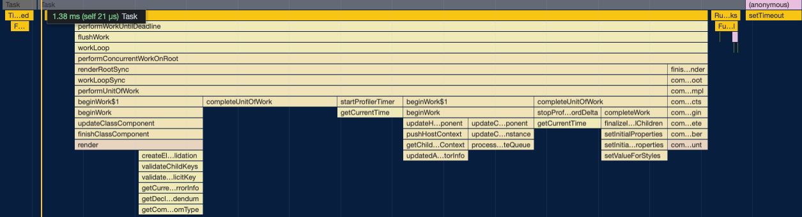
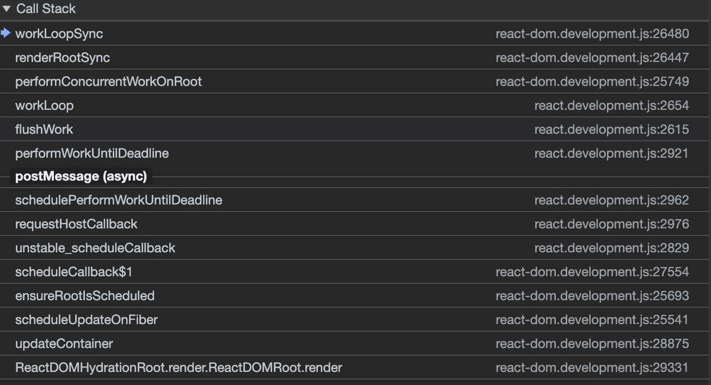

## React 之技术详解 (五) - 调度器 (Scheduler)  
### 简介

调度器的概念，对于了解操作系统的同学比较熟悉，React 的调度实现与之非常类似。

JavaScript 是运行在单线程环境的。像用户对页面的`交互事件更新回调`或 `rAF 动画更新回调`，都执行在单一线程(主线程)上。因此，整个系统运行是`时间共享` (Time Sharing) 的，所有任务将共享一条时间线。

React 通过`时间分片` (time slicing) 技术将处理时间划分为小段，并轮流分配给各个任务，每个任务有自己不同的优先级。来代替浏览器事件循环的默认调度规则。

React 的调度是一种多级调度队列算法。下面逐一介绍一些关键概念，来完成对调度器的完整认识。

### 独立包 scheduler

在 React 中，调度器是单独用一个子包来管理。

一方面调度器的角色和执行什么任务是可以解耦的，它本职用于管理异步任务。在操作系统上调度器是管理进程任务、网络任务和 IO 任务等在时间共享系统上的分配，而用于 React 就是管理用户事件、React 渲染任务的分配。

另一方面调度器后续会开放更多目前未公开的 untable API，它们会给用户带来灵活的异步任务调度方式，提高其使用价值。

### 优先级 (Priority Level)

在 React 的 scheduler 子包定义了任务的优先级：

``` ts
export type PriorityLevel = 0 | 1 | 2 | 3 | 4 | 5;

// TODO: Use symbols?
export const NoPriority = 0;
export const ImmediatePriority = 1;
export const UserBlockingPriority = 2;
export const NormalPriority = 3;
export const LowPriority = 4;
export const IdlePriority = 5;
```

* `NoPriority (0)`: 不需要执行。
* `ImmediatePriority (1)`: 对应于几乎立即执行的更新，如处理`用户的输入`或`点击事件`等。
* `UserBlockingPriority (2)`: 对应于那些需要快速响应以避免打断用户流的更新，如`动画`。
* `NormalPriority (3)`: 是大部分更新的`默认`优先级。
* `LowPriority (4)`: 可以用于那些不那么紧急的更新，比如`数据的预加载`。
* `IdlePriority (5)`: 用于完全不急的任务，比如在浏览器`空闲时执行`。

React 在进行更新时，会根据不同类型的工作赋予不同的优先级。这些优先级常量用于内部调度逻辑，帮助 React 决定应该先执行哪些更新，以及哪些更新可以延后。

在 React 的并发模式下，这些优先级非常关键，因为它们允许 React 暂停和恢复工作，优先响应用户的交互，同时保证了低优先级的更新最终也能完成。

### 任务 (Task)

``` ts
type Task = {
  id: number,
  callback: Callback | null,
  priorityLevel: PriorityLevel,
  startTime: number,
  expirationTime: number,
  sortIndex: number,
  isQueued?: boolean,
};
```

* **callback**：即当任务`到达执行时间`时应该调用的函数。用于 React 里就是[渲染任务的函数](https://github.com/facebook/react/blob/6c7b41da3de12be2d95c60181b3fe896f824f13a/packages/react-reconciler/src/ReactFiberRootScheduler.js#L432C13-L432C25)。
* **priorityLevel**：任务优先级。
* **startTime**：任务开始的时间。表示任务`应当开始`处理的时间。
* **expirationTime**：任务的过期时间。这通常用于确定任务是否应被`立即执行`或`推迟`。
* **sortIndex**：排序索引。它的值是`时间戳`，默认值 `-1`。
* **isQueued** (可选)：一个布尔值，表示任务是否已经被添加到`队列`中。这有助于`避免重复队列任务`。

`sortIndex` 的值是实际任务执行先后顺序的判断依据。

#### 如何确定时间

[源码](https://github.com/facebook/react/blob/6c7b41da3de12be2d95c60181b3fe896f824f13a/packages/scheduler/src/forks/Scheduler.js#L362)里可以看到不同`优先级类型`任务对应的`超时时长`设定都不同，优先级和超时时长对应关系在如下：

``` ts
ImmediatePriority -> IMMEDIATE_PRIORITY_TIMEOUT = -1 // 超时即过期
UserBlockingPriority -> IDLE_PRIORITY_TIMEOUT = 250 // 超时 250 ms 过期
IdlePriority -> IDLE_PRIORITY_TIMEOUT = 1073741823 // 取值为有符号 32 位最大正整数，表示永不过期。
LowPriority ->  LOW_PRIORITY_TIMEOUT = 10000 // 超时 10s 过期
NormalPriority (default) -> NORMAL_PRIORITY_TIMEOUT = 5000 // 超时 5s 过期
```

如果创建任务没有提供 `delay` 选项来设置任务`延时`，那么 `startTime` 为`当前时间`。而 `expirationTime` 就是 `startTime + 超时时长`。

其中，`startTime`、`expirationTime` 和 `sortIndex` 三个属性有重要的关联性。

我们在介绍 Fiber 聊过像用户交互事件都可以阻断 React 普通更新渲染任务，也就是说即便创建任务了，也不一定立即能够执行。

### 任务队列

React 的调度器中有两个数组实现的任务队列：`执行任务队列` (taskQueue) 和`待执行队列` (timerQueue)，元素都是 Task 类型，并都采用了[最小堆](/blog/heap/)数据结构。

最小堆是通常是由`数组`实现的具备`完全二叉树`形状特性的数据结构，它经常应用于优先级队列这样的抽象数据类型 (ADT)。每次执行 `pop` 和 `push` 操作时都会对数组进行`堆化`，让最小 Key 的元素保持在数组的第一个，维持其堆属性。因此，你总能在数组的第一个元素获取优先级最高的任务。

在[源码](https://github.com/facebook/react/blob/6c7b41da3de12be2d95c60181b3fe896f824f13a/packages/scheduler/src/SchedulerMinHeap.js#L91)中，它的 Key 大小是 Task 的 `sortIndex` 和 `id` 先后决定的。



调度器是`事件驱动`的，因此 workLoop() 的执行通常由用户触发或者其他更新事件触发的。当 workLoop 开始工作时，会尝试从 taskQueue 弹出优先级最高的任务来执行。

### 控制权转让

WorkLoop 循环的任务工作是连续的，这会导致`用户事件`或`绘制任务`可能没有机会立即插入到执行队列里执行。为了解决这个问题，WorkLoop 每过一小段时间就会把主线程控制权让出给主机(浏览器)。

在源码里可以看到调度器设定的检查间隔变量 [frameInterval](https://github.com/facebook/react/blob/6c7b41da3de12be2d95c60181b3fe896f824f13a/packages/scheduler/src/forks/Scheduler.js#L471)，在没有主动指定 FPS 情况下，默认值为：`5ms`。也就表示从 workloop 执行任务队列开始超过 5ms 执行队列里的任务还没执行完，那么`考虑`暂停执行，并重新开始`计划执行`。该控制决策，可以在 [shouldYieldToHost](https://github.com/facebook/react/blob/6c7b41da3de12be2d95c60181b3fe896f824f13a/packages/scheduler/src/forks/Scheduler.js#L478) 函数中找到。

``` ts
function shouldYieldToHost(): boolean {
  const timeElapsed = getCurrentTime() - startTime;
  if (timeElapsed < frameInterval) {
    return false;
  }
  if (enableIsInputPending) {
    if (needsPaint) {
      return true;
    }
    if (timeElapsed < continuousInputInterval) {
      if (isInputPending !== null) {
        return isInputPending();
      }
    } else if (timeElapsed < maxInterval) {
      if (isInputPending !== null) {
        return isInputPending(continuousOptions);
      }
    } else {
      return true;
    }
  }
  return true;
}
```

除了每次单个任务执行前检查总执行时长是否超过 5ms 的固定间隔检查外，也会根据当用户是否处于持续输入事件时，来决策是否交出控制权。例如：用户的 `mousemove` 事件、`input` 事件等等。

不过目前该功能需要`实验性质`的 [isInputPending](https://developer.mozilla.org/en-US/docs/Web/API/Scheduling/isInputPending) Web API 的支持，这是一种优化。也就是说 5ms 过后，是否交出控制权取决于用户输入状态，这样可以让任务连续的执行完，而不需要中断再次安排计划任务。

在源码中，可以看到 [enableIsInputPending](https://github.com/facebook/react/blob/6c7b41da3de12be2d95c60181b3fe896f824f13a/packages/scheduler/src/forks/Scheduler.js#L494) 常量目前处于 `false`。因此，目前实际情况任然是固定间隔 5ms 让出控制权。

React 团队后续可能会考虑自己实现用户输出事件状态功能，目前继续保持观望。

### API

调度器提供了一些 API，让外部可以使用调度服务，后续应该会暴露更多接口。

#### scheduleCallback

[scheduleCallback](https://github.com/facebook/react/blob/6c7b41da3de12be2d95c60181b3fe896f824f13a/packages/react-reconciler/src/Scheduler.js#L16) 是调度器对外开放的核心`函数接口`，它是 React Fiber 执行并发工作的任务[入口](https://github.com/facebook/react/blob/6c7b41da3de12be2d95c60181b3fe896f824f13a/packages/react-reconciler/src/ReactFiberRootScheduler.js#L394)。

```ts
function scheduleCallback(priorityLevel: PriorityLevel, callback: Callback, options?: {delay: number}): {}
```

`options` 是`可选的`，React 安排调度任务并没有传任何参数。因此，每次创建 Task 时，`sortIndex` 的值都是 `expirationTime`，并且直接加入到执行任务队列 (taskQueue) 中去。

调度器 Push 任务到队列后，请求 Host (浏览器)执行异步执行任务，在源码里使用 [requestHostCallback](https://github.com/facebook/react/blob/6c7b41da3de12be2d95c60181b3fe896f824f13a/packages/scheduler/src/forks/Scheduler.js#L619) 函数来触发 WorkLoop。

在源码中设置了三个梯度 Web APIs 来执行：`setImmediate`、`MessageChannel` 和 `setTimeout`。

``` ts
if (typeof localSetImmediate === 'function') {
  schedulePerformWorkUntilDeadline = () => {
    localSetImmediate(performWorkUntilDeadline);
  };
} else if (typeof MessageChannel !== 'undefined') {
  const channel = new MessageChannel();
  const port = channel.port2;
  channel.port1.onmessage = performWorkUntilDeadline;
  schedulePerformWorkUntilDeadline = () => {
    port.postMessage(null);
  };
} else {
  schedulePerformWorkUntilDeadline = () => {
    localSetTimeout(performWorkUntilDeadline, 0);
  };
}
```

我们通过 Performance 调试可以发现 `performWorkUntilDeadline` 的后续执行：



也可以设置断点，在调用栈看到调用过程：



#### shouldYieldToHost

控制权转让策略函数，用于判断是否应该转移控制权给浏览器。

#### forceFrameRate

设置帧率函数，可以用于修改 `frameInterval` 参数，来改变控制权转让时间间隔。

参考资料：

\> [https://wicg.github.io/scheduling-apis/](https://wicg.github.io/scheduling-apis/)
