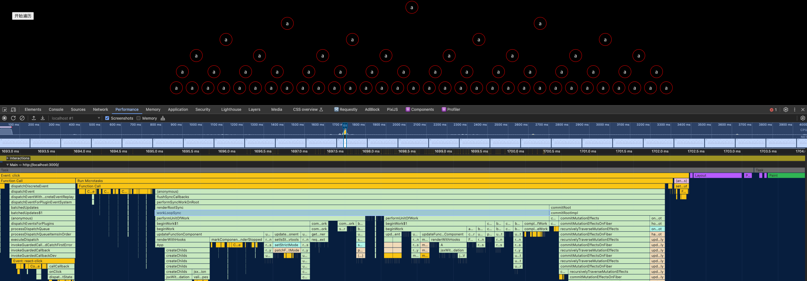

## React 之技术详解 (四) - Reconciler [1] - Render 阶段 
本章我们会讲解 Fiber 节点是如何被创建并构建 Fiber 树的。

阅读代码的最好的方式是使用 chrome devtool 来进行调试，通过 `Performance` 选项的录制，可以获得以时间轴为主的函数调用情况。

下面是一张点击事件触发的从树 root 节点改变属性导致更新的任务图展示，它是一个单个 task 的展现。



可以看到本次更新是一个同步 (sync) 更新方式，从调用 `workLoopSync` 方法开始，紧接着就开始执行 `performUnitOfWork`。

通过函数名，我们定位到[源码](https://github.com/facebook/react/blob/4ec6a6f71475a6f2fee39a0e604ddbbd2f124164/packages/react-reconciler/src/ReactFiberWorkLoop.js#L2104)并且剔除不必要的调试代码，可以看到他们的主要函数逻辑如下：

``` ts
function workLoopSync() {
  while (workInProgress !== null) {
    performUnitOfWork(workInProgress);
  }
}
```

```ts
function performUnitOfWork(unitOfWork: Fiber): void {
  
  const current = unitOfWork.alternate;

  let next;

  //  更新组件，并返回 unitOfWork 的 child
  next = beginWork(current, unitOfWork, entangledRenderLanes);

  if (!disableStringRefs) {
    resetCurrentFiber();
  }
  unitOfWork.memoizedProps = unitOfWork.pendingProps;
  if (next === null) {
    // 没有 child，完成更新。
    completeUnitOfWork(unitOfWork);
  } else {
    // 把工作进程放到 child 节点
    workInProgress = next;
  }
}
```

从这里面开始便引入了 `workInProgress` 的概念，它是一个 `Fiber 节点`，也是一个`工作单元`，只是在不同阶段使用不同命名来区分其作用的概念。

`workInProgress` 是一个 [ReactFiberWorkLoop 模块](https://github.com/facebook/react/blob/main/packages/react-reconciler/src/ReactFiberWorkLoop.js#L309) 上下文变量。同时，还有一个 `workInProgressRoot` 用于保存 Root Fiber。

``` ts
// The root we're working on
let workInProgressRoot: FiberRoot | null = null;
// The fiber we're working on
let workInProgress: Fiber | null = null;
```

`beginWork` 方法用于`更新组件`及返回 `workInProgress.child`。

```ts
function beginWork(
  current: Fiber | null,
  workInProgress: Fiber,
  renderLanes: Lanes,
): Fiber | null {

  workInProgress.lanes = NoLanes;

  switch (workInProgress.tag) {
    // 更新 Component
    // 返回 workInProgress.child
  }
}
```

`completeUnitOfWork`

```ts
function completeUnitOfWork(unitOfWork: Fiber): void {
  // 尝试完成当前的 unitOfWork，之后，移动到 next sibling
  // 若没有 siblings，返回 parent fiber
  let completedWork: Fiber = unitOfWork;
  do {
  
    const current = completedWork.alternate;
    const returnFiber = completedWork.return;

    let next;
    next = completeWork(current, completedWork, entangledRenderLanes);

    if (next !== null) {
      // 完成这个 fiber 会派生出新的 work
      workInProgress = next;
      return;
    }

    const siblingFiber = completedWork.sibling;
    if (siblingFiber !== null) {
      // 工作已完成的 Fiber 节点如果有 Sibling 节点，继续去完成 Sibling 节点
      workInProgress = siblingFiber;
      return;
    }
    // 否则，返回父级节点
    completedWork = returnFiber;
    
    workInProgress = completedWork;
  } while (completedWork !== null);

}
```

``` ts
function completeWork(
  current: Fiber | null,
  workInProgress: Fiber,
  renderLanes: Lanes,
): Fiber | null {
  const newProps = workInProgress.pendingProps;
  
  popTreeContext(workInProgress);
  switch (workInProgress.tag) {
    // ...
    case LazyComponent:
    case SimpleMemoComponent:
    case FunctionComponent:
    case ForwardRef:
    case Fragment:
    case Mode:
    case Profiler:
    case ContextConsumer:
    case MemoComponent:
      bubbleProperties(workInProgress);
      return null;
    case ClassComponent: {
      const Component = workInProgress.type;
      if (isLegacyContextProvider(Component)) {
        popLegacyContext(workInProgress);
      }
      bubbleProperties(workInProgress);
      return null;
    }
    // ... 
  }

}
```

经过以上几个函数，我们就可以得到它的执行逻辑：

### render 阶段

 `render 阶段` 开始于 [performSyncWorkOnRoot](https://github.com/facebook/react/blob/970fa122d8188bafa600e9b5214833487fbf1092/packages/react-reconciler/src/ReactFiberWorkLoop.new.js#L997) 或 [performConcurrentWorkOnRoot](https://github.com/facebook/react/blob/970fa122d8188bafa600e9b5214833487fbf1092/packages/react-reconciler/src/ReactFiberWorkLoop.new.js#L728) 方法的调用。这取决于本次更新是`同步更新`还是`异步更新`。

我们现在还不需要学习这两个方法，只需要知道在这两个方法中会调用如下两个方法：

``` javascript
// performSyncWorkOnRoot 会调用该方法

function workLoopSync() {
  while (workInProgress !== null) {
    performUnitOfWork(workInProgress);
  }
}

// performConcurrentWorkOnRoot 会调用该方法
function workLoopConcurrent() {
  while (workInProgress !== null && !shouldYield()) {
    performUnitOfWork(workInProgress);
  }
}
```

可以看到，他们唯一的区别是是否调用 `shouldYield` 。如果当前浏览器帧没有剩余时间，`shouldYield` 会`中止循环`，直到浏览器有空闲时间后再继续遍历。

 `workInProgress` 代表当前已创建的 workInProgress fiber。

 `performUnitOfWork 方法` 会创建下一个 Fiber 节点，并赋值给 workInProgress，同时把 workInProgress 与已创建的 Fiber 节点连接起来构成 Fiber 树。

 `Fiber Reconciler` 是从 `Stack Reconciler 重构` 而来，通过遍历的方式实现可中断的递归，所以 `performUnitOfWork` 的工作可以分为两部分：`递`和`归`。

#### “递”阶段

首先从 rootFiber 开始向下`深度优先`遍历，为遍历到的每个 Fiber 节点调用 `beginWork()` 方法。

 `beginWork()` 会根据传入的 Fiber 节点创建子 Fiber 节点，并将这两个 Fiber 节点连接起来。

当遍历到叶子节点 (即没有子组件的组件) 时就会进入“归”阶段。

#### “归”阶段

在“归”阶段会调用 `completeWork()` 处理 Fiber 节点。

当某个 Fiber 节点执行完 `completeWork()`，如果其存在兄弟 Fiber 节点 (即 fiber.sibling !== null) ，会进入其兄弟 Fiber 的“递”阶段。

如果不存在兄弟 Fiber，会进入父级 Fiber 的“归”阶段。

`递`和`归`阶段会交错执行直到`归`到 rootFiber。至此，render 阶段的工作就结束了。

### 例子

参照第一篇的例子：

``` jsx
function App() {
  return (
    <div>
      i am
      <span>Lu Min</span>
    </div>
  )
}

ReactDOM.render(<App />, document.getElementById("root"));
```

对应的 fiber 树结构：


 `render 阶段` 会依次执行：

``` text
1. rootFiber beginWork
2. App Fiber beginWork
3. div Fiber beginWork
4. "i am" Fiber beginWork
5. "i am" Fiber completeWork
6. span Fiber beginWork
7. span Fiber completeWork
8. div Fiber completeWork
9. App Fiber completeWork
10. rootFiber completeWork
```

之所以没有 “Lu Min” Fiber 的 `beginWork/completeWork`，是因为作为一种性能优化手段，针对只有单一文本子节点的 Fiber，React 会特殊处理。

如果将 performUnitOfWork 转化为`递归`版本，大体代码如下：

``` javascript
function performUnitOfWork(fiber) {
  // 执行beginWork
  if (fiber.child) {
    performUnitOfWork(fiber.child);
  }

  // 执行completeWork
  if (fiber.sibling) {
    performUnitOfWork(fiber.sibling);
  }
}
```

我们了解到 `render 阶段` 的工作可以分为`递`阶段和`归`阶段。其中`递`阶段会执行 `beginWork()`，`归`阶段会执行 `completeWork` 。`递`阶段的 `beginWork()` 究竟做了什么呢？

### beginWork

可以从源码这里看到 [beginWork](https://github.com/facebook/react/blob/1fb18e22ae66fdb1dc127347e169e73948778e5a/packages/react-reconciler/src/ReactFiberBeginWork.new.js) 的定义，整个方法大概有 500 行代码。

上面我们已经知道，beginWork 的工作是`传入当前 Fiber 节点，创建子 Fiber 节点`，我们从传参来看看具体是如何做的。

#### 从传参看方法执行

``` javascript
function beginWork(
  current: Fiber | null,
  workInProgress: Fiber,
  renderLanes: Lanes,
): Fiber | null {
  // ...省略函数体
}
```

其中传参：

* `current` ：当前组件对应的 Fiber 节点在上一次更新时的 Fiber 节点，即 workInProgress.alternate；
* `workInProgress` ：当前组件对应的 Fiber 节点；
* `renderLanes` ：优先级相关，在讲解 `Scheduler` 时再讲解。

组件 mount 时，由于是首次渲染，是不存在当前组件对应的 Fiber节点在上一次更新时的 Fiber 节点，即 mount 时current === null。

组件 update 时，由于之前已经 mount 过，所以 current !== null。

所以我们可以通过 current === null ? 来区分组件是处于 mount 还是 update。

基于此原因，beginWork 的工作可以分为两部分：

* `update 时` ：如果 current 存在，在满足一定条件时可以复用 current 节点，这样就能`克隆` current.child 作为 workInProgress.child，而不需要新建 workInProgress.child。

* `mount 时` ：除 fiberRootNode 以外，current === null。会根据 `fiber.tag` 不同，创建不同类型的子 Fiber 节点。

``` javascript
function beginWork(
  current: Fiber | null,
  workInProgress: Fiber,
  renderLanes: Lanes
): Fiber | null {

  // update时：如果current存在可能存在优化路径，可以复用current (即上一次更新的Fiber节点) 
  if (current !== null) {
    // ...省略

    // 复用 current
    return bailoutOnAlreadyFinishedWork(
      current,
      workInProgress,
      renderLanes,
    );
  } else {
    didReceiveUpdate = false;
  }

  // mount 时：根据 tag 不同，创建不同的子 Fiber 节点
  switch (workInProgress.tag) {
    case IndeterminateComponent: 
      // ...省略
    case LazyComponent: 
      // ...省略
    case FunctionComponent: 
      // ...省略
    case ClassComponent: 
      // ...省略
    case HostRoot:
      // ...省略
    case HostComponent:
      // ...省略
    case HostText:
      // ...省略
    // ...省略其他类型
  }
}
```

#### update 时

我们可以看到，`didReceiveUpdate === false`(即可以直接复用前一次更新的子 Fiber，不需要新建子 Fiber) ，需满足如下情况：

1. oldProps === newProps && workInProgress.type === current.type，即 props 与 fiber.type 不变；
2. !includesSomeLane(renderLanes, updateLanes)，即当前 Fiber 节点优先级不够，会在讲解 Scheduler 时介绍。

``` javascript
if (current !== null) {
    const oldProps = current.memoizedProps;
    const newProps = workInProgress.pendingProps;

    if (
      oldProps !== newProps ||
      hasLegacyContextChanged() ||
      (__DEV__ ? workInProgress.type !== current.type : false)
    ) {
      didReceiveUpdate = true;
    } else if (!includesSomeLane(renderLanes, updateLanes)) {
      didReceiveUpdate = false;
      switch (workInProgress.tag) {
        // 省略处理
      }
      return bailoutOnAlreadyFinishedWork(
        current,
        workInProgress,
        renderLanes,
      );
    } else {
      didReceiveUpdate = false;
    }
  } else {
    didReceiveUpdate = false;
  }
```

#### mount 时

当不满足优化路径时，我们就进入第二部分，新建子 Fiber。

我们可以看到，根据 `fiber.tag` 不同，进入不同类型 Fiber 的创建逻辑，在源码[ReactWorkTags.js](https://github.com/facebook/react/blob/1fb18e22ae66fdb1dc127347e169e73948778e5a/packages/react-reconciler/src/ReactWorkTags.js)中可以看到类型的常量定义。

``` javascript
// mount 时：根据 tag 不同，创建不同的 Fiber 节点
switch (workInProgress.tag) {
  case IndeterminateComponent: 
    // ...省略
  case LazyComponent: 
    // ...省略
  case FunctionComponent: 
    // ...省略
  case ClassComponent: 
    // ...省略
  case HostRoot:
    // ...省略
  case HostComponent:
    // ...省略
  case HostText:
    // ...省略
  // ...省略其他类型
}
```

对于我们常见的组件类型，如 (FunctionComponent/ClassComponent/HostComponent) ，最终会进入 [reconcileChildren](https://github.com/facebook/react/blob/1fb18e22ae66fdb1dc127347e169e73948778e5a/packages/react-reconciler/src/ReactFiberBeginWork.new.js#L233) 方法。

#### reconcileChildren

从该函数名就能看出这是 `Reconciler` 模块的`核心`部分。那么他究竟做了什么呢？

* 对于 mount 的组件，他会创建新的子 Fiber 节点；

* 对于 update 的组件，他会将当前组件与该组件在上次更新时对应的 Fiber 节点比较 (也就是俗称的 `Diff 算法` ) ，将比较的结果生成新 Fiber 节点。

``` javascript
export function reconcileChildren(
  current: Fiber | null,
  workInProgress: Fiber,
  nextChildren: any,
  renderLanes: Lanes
) {
  if (current === null) {
    // 对于 mount 的组件
    workInProgress.child = mountChildFibers(
      workInProgress,
      null,
      nextChildren,
      renderLanes,
    );
  } else {
    // 对于 update 的组件
    workInProgress.child = reconcileChildFibers(
      workInProgress,
      current.child,
      nextChildren,
      renderLanes,
    );
  }
}
```

和 beginWork 一样，他也是通过 current === null ? 区分 mount 与 update。

不论走哪个逻辑，最终他会生成新的子 Fiber 节点并`赋值`给 `workInProgress.child`，作为本次 beginWork 返回值，并作为下次 `performUnitOfWork` 执行时 `workInProgress` 的传参。

 `mountChildFibers` 与 `reconcileChildFibers` 这两个方法的逻辑基本一致。唯一的区别是：reconcileChildFibers 会为生成的 Fiber 节点带上 `effectTag` 属性，而 mountChildFibers 不会。

#### effectTag

 `render 阶段` 的工作是在内存中进行，当工作结束后会通知 `Renderer` 需要执行的 DOM 操作。要执行 DOM 操作的具体类型就保存在 `fiber.effectTag` 中。

在源码[ReactSideEffectTags.js](https://github.com/facebook/react/blob/1fb18e22ae66fdb1dc127347e169e73948778e5a/packages/react-reconciler/src/ReactSideEffectTags.js)定义操作类型。

例如：

``` javascript
// DOM 需要插入到页面中
export const Placement = /*                */ 0b00000000000010;
// DOM 需要更新
export const Update = /*                   */ 0b00000000000100;
// DOM 需要插入到页面中并更新
export const PlacementAndUpdate = /*       */ 0b00000000000110;
// DOM 需要删除
export const Deletion = /*                 */ 0b00000000001000;
```

> 通过二进制表示 effectTag，可以方便的使用`位操作`为 fiber.effectTag 赋值多个 effect。

那么，如果要通知 Renderer 将 Fiber 节点对应的 DOM 节点插入页面中，需要满足两个条件：

* fiber.stateNode 存在，即 Fiber 节点中保存了对应的 DOM 节点；

* (fiber.effectTag & Placement) !== 0，即 Fiber 节点存在 Placement effectTag。

我们知道，mount 时，fiber.stateNode === null，且在 reconcileChildren 中调用的 mountChildFibers 不会为 Fiber 节点赋值 effectTag。那么首屏渲染如何完成呢？

针对第一个问题，fiber.stateNode 会在 completeWork 中创建，我们会在下一节介绍。

第二个问题的答案十分巧妙：假设 mountChildFibers 也会赋值 effectTag，那么可以预见 mount 时整棵 Fiber 树所有节点都会有Placement effectTag。那么 `commit 阶段` 在执行 DOM 操作时每个节点都会执行一次插入操作，这样大量的 DOM 操作是极低效的。

为了解决这个问题，在mount 时只有 rootFiber 会赋值 Placement effectTag，在 commit 阶段`只执行一次`插入操作。

借用上一节的 Demo，第一个进入 beginWork 方法的 Fiber 节点就是 rootFiber，他的alternate 指向 current rootFiber (即他存在current) 。

为什么 rootFiber 节点存在 current (即 rootFiber.alternate) ?

由于存在 current，rootFiber 在 reconcileChildren 时会走 reconcileChildFibers 逻辑。

而之后通过 beginWork 创建的 Fiber 节点是不存在 current 的 (即 fiber.alternate === null) ，会走 mountChildFibers 逻辑。

### completeWork

在我们了解组件在 `render 阶段` 会经历 `beginWork` 与 `completeWork` 。

上一节我们讲解了组件执行 `beginWork` 后会创建子 Fiber 节点，节点上可能存在 `effectTag` 。

这一节让我们看看 completeWork 会做什么工作。

你可以从这里看到 completeWork 方法定义。

#### 流程概览

类似 beginWork，completeWork 也是针对不同 fiber.tag 调用不同的处理逻辑。

``` jsx
function completeWork(
  current: Fiber | null,
  workInProgress: Fiber,
  renderLanes: Lanes,
): Fiber | null {
  const newProps = workInProgress.pendingProps;

  switch (workInProgress.tag) {
    case IndeterminateComponent:
    case LazyComponent:
    case SimpleMemoComponent:
    case FunctionComponent:
    case ForwardRef:
    case Fragment:
    case Mode:
    case Profiler:
    case ContextConsumer:
    case MemoComponent:
      return null;
    case ClassComponent: {
      // ...省略
      return null;
    }
    case HostRoot: {
      // ...省略
      updateHostContainer(workInProgress);
      return null;
    }
    case HostComponent: {
      // ...省略
      return null;
    }
  // ...省略
```

我们重点关注页面渲染所必须的 `HostComponen` t (即原生 DOM 组件对应的 Fiber 节点) ，其他类型 Fiber 的处理留在具体功能实现时讲解。

同时针对 HostComponent，判断 `update` 时我们还需要考虑 workInProgress.stateNode != null ? (即该 Fiber 节点是否存在对应的 DOM 节点) 。

``` jsx
case HostComponent: {
  popHostContext(workInProgress);
  const rootContainerInstance = getRootHostContainer();
  const type = workInProgress.type;

  if (current !== null && workInProgress.stateNode != null) {
    // update的情况
    // ...省略
  } else {
    // mount的情况
    // ...省略
  }
  return null;
}
```

#### update 时

当 update 时，Fiber 节点已经存在对应 DOM 节点，所以不需要生成 DOM 节点。需要做的主要是处理 props，比如：

* onClick、onChange 等回调函数的注册；
* 处理style prop；
* 处理DANGEROUSLY_SET_INNER_HTML prop；
* 处理children prop。

我们去掉一些当前不需要关注的功能 (比如 ref) 。可以看到最主要的逻辑是调用 updateHostComponent 方法。

``` jsx
if (current !== null && workInProgress.stateNode != null) {
  // update 的情况
  updateHostComponent(
    current,
    workInProgress,
    type,
    newProps,
    rootContainerInstance,
  );
}
```

你可以从这里看到 `updateHostComponent 方法` 定义。

在 updateHostComponent 内部，被处理完的 props 会被赋值给 workInProgress.updateQueue，并最终会在 commit 阶段被渲染在页面上。

``` jsx
workInProgress.updateQueue = (updatePayload: any);
```

其中 `updatePayload` 为数组形式，他的奇数索引的值为变化的 prop key，偶数索引的值为变化的 prop value。

#### mount 时

同样，我们省略了不相关的逻辑。可以看到，mount 时的主要逻辑包括三个：

* 为 Fiber 节点生成对应的 DOM 节点；
* 将子孙 DOM 节点插入刚生成的 DOM 节点中；
* 与 update 逻辑中的 updateHostComponent 类似的处理 props 的过程。

``` javascript
// mount的情况

// ...省略服务端渲染相关逻辑

const currentHostContext = getHostContext();
// 为fiber创建对应DOM节点
const instance = createInstance(
    type,
    newProps,
    rootContainerInstance,
    currentHostContext,
    workInProgress,
  );
// 将子孙DOM节点插入刚生成的DOM节点中
appendAllChildren(instance, workInProgress, false, false);
// DOM节点赋值给fiber.stateNode
workInProgress.stateNode = instance;

// 与update逻辑中的updateHostComponent类似的处理props的过程
if (
  finalizeInitialChildren(
    instance,
    type,
    newProps,
    rootContainerInstance,
    currentHostContext,
  )
) {
  markUpdate(workInProgress);
}
```

还记得我们讲到：mount 时只会在 rootFiber 存在 Placement effectTag。那么 `commit 阶段` 是如何通过一次插入 DOM 操作 (对应一个Placement effectTag) 将整棵 DOM 树插入页面的呢？

原因就在于 completeWork 中的 `appendAllChildren 方法` 。

由于 completeWork 属于“归”阶段调用的函数，每次调用 appendAllChildren 时都会将已生成的子孙 DOM 节点插入当前生成的 DOM 节点下。那么当“归”到 rootFiber 时，我们已经有一个构建好的离屏 DOM 树。

#### effectList

至此 `render 阶段` 的绝大部分工作就完成了。

还有一个问题：作为 DOM 操作的依据，`commit 阶段` 需要找到所有有 effectTag 的 Fiber 节点并依次执行 effectTag 对应操作。难道需要在 `commit 阶段` 再遍历一次 Fiber 树寻找 effectTag !== null的Fiber 节点么？

这显然是很低效的。

为了解决这个问题，在 completeWork 的上层函数 completeUnitOfWork 中，每个执行完 completeWork 且存在 effectTag 的 Fiber 节点会被保存在一条被称为 `effectList` 的`单向链表`中。

effectList 中第一个 Fiber 节点保存在 fiber.firstEffect ，最后一个元素保存在 fiber.lastEffect。

类似 appendAllChildren，在“归”阶段，所有有 effectTag 的 Fiber 节点都会被追加在 effectList 中，最终形成一条以rootFiber.firstEffect 为起点的`单向链表`。

``` text
                       nextEffect         nextEffect
rootFiber.firstEffect -----------> fiber -----------> fiber
```

这样，在 `commit 阶段` 只需要遍历 effectList 就能执行所有 effect 了。

你可以在这里看到这段代码逻辑。

借用 React 团队成员 `Dan Abramov` 的话：effectList 相较于 Fiber 树，就像`圣诞树上挂的那一串彩灯`。

#### 流程结尾

至此，`render 阶段` 全部工作完成。在 performSyncWorkOnRoot 函数中 fiberRootNode 被传递给 commitRoot 方法，开启 `commit 阶段` 工作流程。

``` javascript
commitRoot(root);
```
