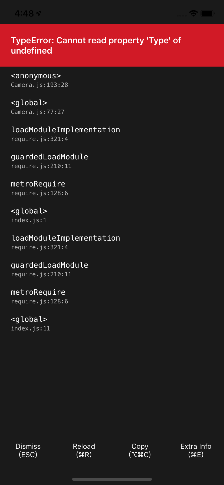
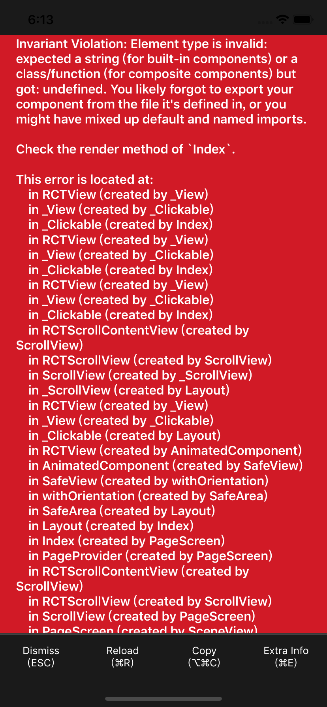

## Reat Native Errors Records 
### RN 错误信息记录

#### TypeError: Cannot read property 'Type' of undefined

| 错误信息        | 原因             | 解决方法                                                                 |
| --------------- | ---------------- | ------------------------------------------------------------------------ |
|  | 组件未能正确引入 | 因为没有具体暴露哪个组件的引入错误，所以可以使用排除法找出引入错误的组件 |

#### Invariant Violation: Element type is invalid

Invariant Violation: Element type is invalid: expected a string (for built-in components) or a class/function (for composite components) but got: undefined. You likely forgot to export your component from the file it's defined in, or you might have mixed up default and named imports.

| 错误信息        | 原因       | 解决方法                                                                 |
| --------------- | ---------- | ------------------------------------------------------------------------ |
|  | 组件未导出 | 因为没有具体暴露哪个组件的引入错误，所以可以使用排除法找出引入错误的组件 |
