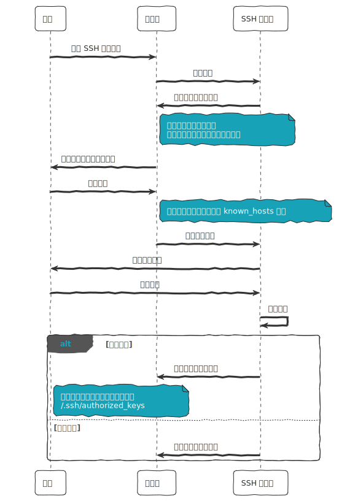
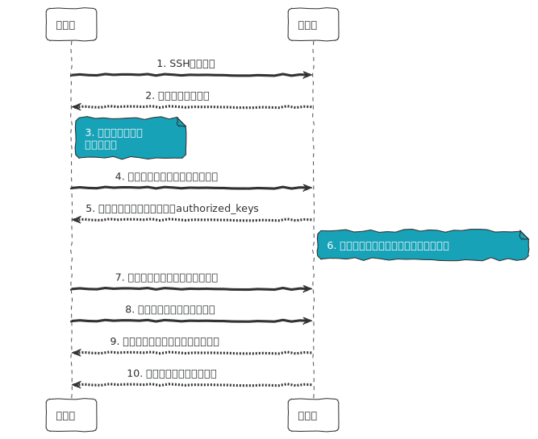

## SSH 认识及应用 
### 简介

SSH 全称为 Secure Shell，是一个`加密的网络协议`，用于`在不安全的网络上`安全地进行远程登录和其他网络服务。

SSH 使用`公钥加密技术`来保证通信的安全。在建立 SSH 连接时，客户端和服务器之间会协商一个安全的加密连接。用户的`私钥存储在客户端`，而`公钥`可以安全地`存储在任何 SSH 服务器`上。

SSH 是基于 `TCP` 协议来传输的。

### 历史

SSH 最初由芬兰计算机科学家 `Tatu Ylönen` 于 `1995 年`设计。协议套件的后续开发由多个开发小组进行，产生了多种实现变体。

协议规范区分两个主要版本，称为 SSH-1 和 SSH-2。最常用的软件堆栈是 `OpenSSH`，由 OpenBSD 开发人员于 1999 年作为开源软件发布。实现分布于所有类型的常用操作系统，包括嵌入式系统。

### 应用程序

SSH 应用程序基于`客户端-服务器 (C/S) 架构`。SSH 服务器端运行一个守护进程通常是 (`sshd`) ，它监听一个网络端口（默认是 `22 号端口`），等待客户端的连接请求。

当用户从客户端使用 SSH 客户端软件 (例如 `ssh 命令行工具`) 发起连接时，客户端与服务器之间会建立一个安全的加密通道。`用户的身份验证`可以通过`密码`、`公钥加密`或`其他机制`进行。

一旦验证成功，客户端就可以在加密的通道上发送命令到服务器，服务器将命令的输出返回给客户端。这允许`远程执行命令`、`管理系统`、`传输文件`（`SCP` 或 `SFTP`），并且所有的通信都是加密的，以防止数据被中间人窃取或篡改。

### 身份认证流程

1.**服务器无客户端公钥时，用户第一次账号密码登录。**



2.**服务器存在客户端公钥时，用户第一次公钥认证登录。**



### OpenSSH

OpenSSH (Open Secure Shell) 是 SSH 协议的`免费开源实现`。OpenSSH 提供了一系列与 SSH 协议相关的客户端和服务器工具，包括：

- **ssh**：SSH 客户端工具，用于安全`连接`到远程服务器。
- **sshd**：SSH 守护进程，是`服务器端`的组件，侦听并接受来自客户端的连接。
- **scp**：基于 SSH 的`文件复制`工具，用于在本地和远程之间安全复制文件。
- **sftp**：安全`文件传输`协议，提供了一个交互式的文件传输会话。
- **ssh-keygen**：用于生成、管理和转换认证`密钥的工具`。
- **ssh-agent**: 一个保管私钥的程序，可以用来保存密钥，并为 SSH 客户端提供认证服务。
- **ssh-keyscan**: 用于收集公共 SSH 主机密钥的工具。
- **ssh-copy-id**: 用于将本地的 SSH 公钥复制到远程主机的 `authorized_keys` 文件的`脚本`。

OpenSSH 还包括其他配置文件和多种支持文件，如：

- **ssh_config**: SSH 客户端配置文件，包含全局配置信息。
- **sshd_config**: SSH 服务器配置文件，包含服务器端的配置选项。

OpenSSH 的目的是提供一种安全的远程操作方式，保证数据在不安全的网络（如互联网）上传输时的机密性和完整性。由于其开源性和高安全性，OpenSSH 成为了远程管理 Linux 和 Unix 系统的标准工具，并且也在其他操作系统中得到广泛使用。

### 简介

`ssh-keygen` 是一个在类 Unix 系统中生成 `SSH 密钥对的工具`。它通常用于自动`生成公钥和私钥`，这些密钥可以用于自动密码无关的登录到 SSH 服务器。

### 常见问题

#### 场景 1

主机校验错误，如果出现以下错误：

``` shell
➜  ~ ssh user@lumin.tech
@@@@@@@@@@@@@@@@@@@@@@@@@@@@@@@@@@@@@@@@@@@@@@@@@@@@@@@@@@@
@    WARNING: REMOTE HOST IDENTIFICATION HAS CHANGED!     @
@@@@@@@@@@@@@@@@@@@@@@@@@@@@@@@@@@@@@@@@@@@@@@@@@@@@@@@@@@@
IT IS POSSIBLE THAT SOMEONE IS DOING SOMETHING NASTY!
Someone could be eavesdropping on you right now (man-in-the-middle attack)!
It is also possible that a host key has just been changed.
The fingerprint for the ECDSA key sent by the remote host is
SHA256:vVPXPwcG3yaG0jrpHG5q7zDXXhUZ0GxZndoARCscQBM.
Please contact your system administrator.
Add correct host key in /Users/lumin/.ssh/known_hosts to get rid of this message.
Offending ECDSA key in /Users/lumin/.ssh/known_hosts:7
Host key for lumin.tech has changed and you have requested strict checking.
Host key verification failed.
```

可能是由于`远程主机密钥已经发生了变化`或者首次连接到远程主机。这是一种安全机制，用来防止中间人攻击。

第一次登录远程主机时，`服务器会记录`客户端的`指纹` (fingerprint) 信息，而客户端会把 SSH 公钥存储存在 `~/.ssh/known_hosts` 文件中。

通常，known_hosts 文件会包含多行，每一行对应一个已知目标主机的公钥。例如：

``` text
52.54.213.119 ssh-rsa AAAAB3NzaC1yc2EAAAABIwAAAQEAq2A7hRGmdnmsDbO9IDSwBK6TbQa+PXYPCPy6rbTrTtw7PHkccKrpp0yVhp5HdEIcKs6pLlVDBfOLX9QUsyCOV0wzfjfNlGEYsdlLJizHhbn2mUjvSAHQqZETYP81eFzLQNnPHt4EVVUh7VfDESU84KezmD5QlWpXLmvU31/yMf+Se8xhHTvKSCZIFImWw3G6mbdoWf9nzpIoaSjB+weqqUUmpaaasXVal72J+UX2B+2RPW3RcT0eOzQgqlJL3RKrTJvdsjE3JEAvGq3lGHSZXy28G3skua2SmVi/w4yCE6gbODqnTWlg7+wC604ydGXA8VJiS5ap43JXiUFFAaQ==
...
```

每一行对应一个已知主机的密钥。每行的格式如下：

``` text
hostname_or_ip ssh-rsa|ssh-dss|ecdsa-sha2-nistp256|... public_key
```

1. hostname_or_ip：这是`目标主机的主机名或 IP 地址`。它标识了与此密钥相关联的主机。
2. ssh-rsa|ssh-dss|ecdsa-sha2-nistp256|...：这是`密钥的类型`。它表示使用的密钥算法，如 RSA、DSA、ECDSA 等。不同的密钥类型将以不同的标识符开头。
3. public_key：这是`目标主机的公钥`。它是一段非常长的字符串，用于验证目标主机的身份。

**处理方式**

删除 IP 或 homename 对应的远程主机记录信息。

``` shell
ssh-keygen -R lumin.tech
```

``` shell
# Host lumin.tech found: line 7
/Users/lumin/.ssh/known_hosts updated.
Original contents retained as /Users/lumin/.ssh/known_hosts.old
```

参考资料：

\> [https://en.wikipedia.org/wiki/Secure_Shell](https://en.wikipedia.org/wiki/Secure_Shell)
