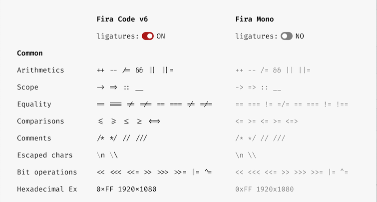
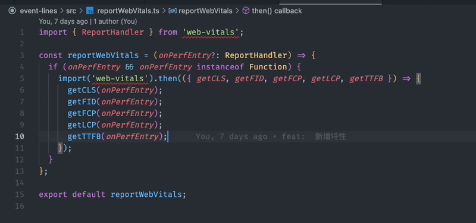

## Visual Studio Code 工作台配置 
### 简介

下面是我个人常年使用的配置。现在，我把他们记录下来用以在新的电脑设备能够快速恢复到之前的配置。

### Text Edtor 设置

#### 字体 FiraCode（需安装字体）

[FiraCode](https://github.com/tonsky/FiraCode) 是一款专门针对编程设计的字体，它的`连字`（ligatures）效果更符合人们阅读习惯。

在[这里](https://github.com/tonsky/FiraCode/wiki)可以查看它的安装方式，安装完成之后设置如下：

``` yaml
"editor.fontFamily": "Fira Code",
"editor.fontLigatures": true,
```



#### 滚动吸顶

``` yaml
"editor.stickyScroll.enabled": true
```


