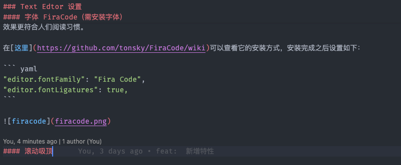

## Visual Studio Code 工作台配置 
### 简介

下面是我个人常年使用的配置。现在，我把他们记录下来以便在新的电脑设备能够快速恢复到之前的配置。

### 设置同步

[Settings Sync](https://code.visualstudio.com/docs/editor/settings-sync)是 vscode 内置的编辑器设置同步功能，你可以通过微软或 github 账号来同步自己的设置，这样即便重新安装 vscode，也能快速恢复之前的设置。

> 早些 vscode 没有该功能时，有款同名插件[Settings Sync](https://marketplace.visualstudio.com/items?itemName=Shan.code-settings-sync) 通过 gist 来同步设置，不过现在已经不需要了，这两者没有任何关系，也就说该插件可以卸载。

### 添加 code 命令

VSCode 有一个自带的命令行工具叫 `code`，默认情况没有设置到系统环境变量。也就说默认未使用，需要手动设置该命令行工具。

通过快捷键 `shift + command + p` 打开命令控制窗口，然后输入 `code` 找到 `Shell Command: Install 'code' command in PATH` 回车安装即可：


个人会经常通过该命令把项目加入到 `workspace` 里来工作，使用 workspace 来管理多项目是一个不错的选择。

``` bash
code -a path/of/youProject
```

### Text Edtor 设置

#### 字体 FiraCode (需安装字体)

[FiraCode](https://github.com/tonsky/FiraCode) 是一款专门针对编程设计的字体，它的`连字` (ligatures) 效果更符合人们阅读习惯。

在[这里](https://github.com/tonsky/FiraCode/wiki)可以查看它的安装方式，安装完成之后设置如下：

``` yaml
"editor.fontFamily": "Fira Code",
"editor.fontLigatures": true,
```


#### 滚动吸顶

``` yaml
"editor.stickyScroll.enabled": true
```


不只是代码上，它也支持 markdown 文档标题吸顶。



#### 自动换行

如果单行文本过长，对于代码阅读会带来麻烦。这意味着你需要通过滚动条来查看视窗之外的文本。所以可以通过调整最大换行列数来控制水平文本长度。

通过 `Word Wrap Column` 来设置最大换行列数，这项配置只是在视觉上的换行，并不表示真正意义上在源文件插入换行控制符，所以不必担心它会改变源文件。

你可以根据你的屏幕大小，自行调配列数。

``` yaml
"editor.wordWrapColumn": 260,
```

#### 自动保存

自动保存文件，会是一个很好辅助点，它免去手动保存的动作。同时保证在 git 提交时，不会因为未保存而导致提交的遗漏。

``` yaml
"files.autoSave": "onFocusChange",
```

除了`失去焦点保存`，还有以下几种自动保存有方式：


### 窗体设置

#### 显示 Command Center

 `Command Center` 展示出来可以方便动作的前进和回退，这并`不是撤销`功能，只改变光标焦点之前的位置，这对于较长代码或复杂结构项目的代码阅读会有不错的帮助。

你可以通过右击 vscode 窗体顶部，勾选 `Command Center` 即可。


### Terminal 设置

#### Oh My Zsh

[Oh My Zsh](https://ohmyz.sh/)是一个命令行框架。对，官方介绍就叫框架。不过对于普通开发者而言，很多人对它的`主题`更为感兴趣。高亮的命令行主题能带来更好的视觉感受。


对于 mac 系统需要设置默认 terminal：

``` yaml
"terminal.integrated.defaultProfile.osx": "zsh",
```

### 主题设置

#### 文件图标主题

VSCode 默认的字体图标主题有些暗淡，色彩偏淡，不够鲜明。我个人喜欢[Material Icon Theme]( https://marketplace.visualstudio.com/items?itemName=PKief.material-icon-theme)这套主题。

#### 颜色主题

整个 vscode 的颜色主题，我选择[One Dark Pro](https://marketplace.visualstudio.com/items?itemName=zhuangtongfa.Material-theme)，这套主题在众多主题中在视觉上是较为舒服的一套。


### 开发插件

#### REST Client

[REST Client](https://marketplace.visualstudio.com/items?itemName=humao.rest-client)是一款模拟 HTTP 请求的插件，类似 postman 的功能。它遵循[RFC2616 标准](https://www.rfc-editor.org/rfc/rfc2616.html)，你可以直接通过一个`.http`后缀文件来描述请求。

``` http
POST https://example.com/comments HTTP/1.1
content-type: application/json

{
    "name": "sample",
    "time": "Wed, 21 Oct 2015 18:27:50 GMT"
}
```

#### Better Comments

[Better Comments](https://marketplace.visualstudio.com/items?itemName=aaron-bond.better-comments)插件对一些标签化的注释进行`高亮`，例如：`todo`、`!`、`?`以及`*`等。


#### ES7+ React/Redux/React-Native snippets

[ES7+ React/Redux/React-Native snippets](https://marketplace.visualstudio.com/items?itemName=dsznajder.es7-react-js-snippets)是一个 `snippets` 插件，在 vscode 通过 snippets 可以通过简写快速生成代码片段。

| Prefix | Method |
|--|--|
| `imp→` | `import moduleName from 'module'` |
| `imd→` | `import { destructuredModule } from 'module'` |
| `ime→` | `import * as alias from 'module'` |
| `exp→` | `export default moduleName` |
| `exd→` | `export { destructuredModule } from 'module'` |
| more... | more... |

**1. React 组件**

 `rcc`

``` ts
import React, { Component } from 'react'

export default class FileName extends Component {
  render() {
    return <div>$2</div>
  }
}
```

 `rfc`

``` ts
import React from 'react'

export default function $1() {
  return <div>$0</div>
}
```

more...

**2. React Native 组件**

 `rnc`

``` ts
import React, { Component } from 'react'
import { Text, View } from 'react-native'

export default class FileName extends Component {
  render() {
    return (
      <View>
        <Text> $2 </Text>
      </View>
    )
  }
}
```

 `rnf`

``` ts
import React from 'react'
import { View, Text } from 'react-native'

export default function $1() {
  return (
    <View>
      <Text> $2 </Text>
    </View>
  )
}
```

more...

从插件名称也直白了了解其支持的语法，你可以在[这里](https://github.com/chillios-ts/vscode-react-javascript-snippets/blob/master/docs/Snippets.md)获取更多简写方式支持。

#### GitLens

 [Gitlens](https://marketplace.visualstudio.com/items?itemName=eamodio.gitlens) 是个不错的 git 管理插件，有点可惜的是它的核心功能只支持开放仓库，并且高级功能需要收费。而这里之所以还介绍使用，是其免费功能特性。

Gitlens 可以展示代码文件每一行的最后一次修改由谁修改，哪一次 commit，如下图展示：


Gitlens 有项比较不错的收费功能是 `Git Graph`，无论 UI 来说，还是功能上来说，都是不错的。


#### Git Graph

上面说到 Gitlens 的 `Git Graph` 是收费功能，那有没有免费的呢？答案是有的。

[Git Graph](https://marketplace.visualstudio.com/items?itemName=mhutchie.git-graph)是一款免费的插件，在 UI 和功能上也不输于 `Gitlens` 。


#### Code Spell Checker

[Code Spell Checker](https://marketplace.visualstudio.com/items?itemName=streetsidesoftware.code-spell-checker)是一款`检测单词拼写`的插件，并且提供了可选的正确单词让你自选。


#### markdownlint

 [markdownlint](https://marketplace.visualstudio.com/items?itemName=DavidAnson.vscode-markdownlint) 是一款用于 markdown 文档`格式化`的插件，它遵循[CommonMark Spec](https://spec.commonmark.org/)写作规范。在协作编写 markdown 文档的时候，可以确保文档格式的一致性。

#### SCSS Everywhere

[SCSS Everywhere](https://marketplace.visualstudio.com/items?itemName=gencer.html-slim-scss-css-class-completion)是一款用于 scss 样式的`自动补全`功能插件。例如：如果样式有层级的`&`连字符，它能提供完整样式名称候选：

``` scss
.btn {
  &-block {}
  &-danger {}
  // ...
}
```


##### Import Cost

[Import Cost](https://marketplace.visualstudio.com/items?itemName=wix.vscode-import-cost) 可以显示引入模块的大小。


### 结束语

个人使用的配置基本都在这了，有些插件并没有列举出来，因为它们并不是通用型插件。

还有技术选项的插件，比如 `Docker`、`MongoDB`、`Kubernetes` 等插件，在需要使用对应技术才会用到。

如果你还有更好的配置或插件，欢迎评论区留言哦。
