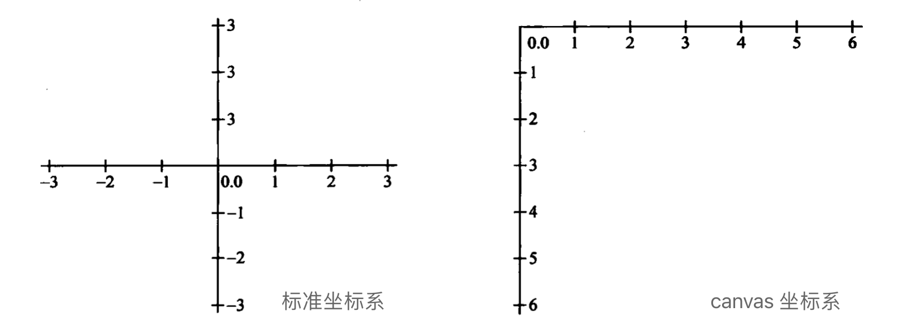

## Web 动画基础所需知识点 
### 介绍

动画里的涉及到角度与坐标的关系，主要通过数学三角学知识来处理。而在物理渲染中，模型的处理主要通过物理学的公式来实现。

下面涉及到的`数学公式`和`物理公式`可以参考这两篇[《常用的数学公式》](/maths/math-formulas)和[《常用的物理公式》](/articles/physics-formulas)来理解。

### canvas 里的坐标系



canvas 里的坐标系中心并不是在画布的正中心，而是在画布的左上角。

这个坐标系有它的历史背景，因为电子枪是从左往右，从上往下扫描屏幕的，后来也成为了图形学编程里屏幕坐标系的习惯，这种习惯也方便了图形编程中某些问题的处理。

### canvas 四象限的角度

在 canvas 里角度的正负表示 如下：


通常，我们可以通过 Javascript 的反正切函数 `Math.atan2(y,x)` 来获取对应的角度，这里的角度单位是弧度。


在 canvas 坐标系统里的角度计算：

``` javascript
Math.atan2(-1, -2) * 180 / Math.PI
// => -153.43494882292202
```

当我们要`逆时针`计算角度时，要`减去`角度大小。而`顺时针`计算时，要`加上`角度大小。如果是两个`角度向量`，那么直接使用`向量加法`即可，图形编程中可以使用`弧度来表示角度向量`。

### 角速度

在 canvas 里下面的方向的速度分解到 $x$ 轴 $y$ 轴的向量表示如下：


在知道了`角度 (angle)`和`速度 (speed)`之后，我们利用三角函数可以获取 $vx$， $vy$的速度向量：

``` javascript
vx = Math.cos(angle) * speed
vy = Math.sin(angle) * speed
```

这里的 `angle` 是弧度，我们可以通过转换公式来转换角度：

``` javascript
vx = Math.cos(degree * Math.PI / 180) * speed
vy = Math.sin(degree * Math.PI / 180) * speed
```

### 角加速度

加速度和速度向量类似，由大小 (力的大小) 和方向组成，由此可以分解到 $x$ 轴和 $y$ 轴上：

``` javascript
let force = 8
let angle = 450

let ax = Math.cos(angle * Math.PI / 180) * force
let ay = Math.sin(angle * Math.PI / 180) * force
```

把`加速度向量`加入`速度向量`中：

``` javascript
vx += ax;
vy += ay;
```

把`速度向量`加入`坐标`中：

``` javascript
object.x += vx;
object.y += vy;
```

### 坐标旋转


**1. 只知道半径 (radius) 和旋转后的角度 (angle) 的情况**

通过下面的公式来计算旋转后的坐标：

``` javascript
object.x = centerX + cos(angle) * radius
object.y = centerY + sin(angle) * radius
```

**2. 只知道旋转 (rotation) 角度和起始坐标 (x,y) 的情况**

通过下面的公式来计算旋转后的坐标：

``` javascript
x1 = x * cos(rotation) - y * sin(rotation)
y1 = y * cos(rotation) + x * sin(rotation)
```

在数学线性代数中，上面旋转变换可以表示变换矩阵：$ R(\theta) = \begin{bmatrix} \cos(\theta) & -\sin(\theta) \\\\ \sin(\theta) & \cos(\theta) \end{bmatrix} $，其中 $\theta$ 是`旋转角度`，通常以`弧度`为单位。

如果对一个坐标 $(x,y)$ 进行旋转变换运算，可以写成`向量方程`形式的线性方程组：

$
\begin{bmatrix}\cos(\theta) \\\ -\sin(\theta)\end{bmatrix}x +
\begin{bmatrix}\sin(\theta) \\\ \cos(\theta)\end{bmatrix}y =
\begin{bmatrix}rx \\\ ry\end{bmatrix}
$。(rx,ry) 是旋转后的坐标。

我们可以编写一个`旋转变换矩阵`的函数来实现坐标的旋转：

``` ts

const point = [1,2]
const rotation = Math.atan2(point[1], pointp[0]) * 180 / Math.PI; // 弧度

const cos = Math.cos(rotation);
const sin = Math.sin(rotation);

const rotationMatrix = [
    [cos, -sin],
    [sin, cos]
];

function rotate(point: number[], matrix: number[][]) {
  const rotatedX = matrix[0][0] * point[0] + matrix[0][1] * point[1]
  const rotatedY = matrix[1][0] * point[0] + matrix[1][1] * point[1]
  return [rotatedX, rotatedY]
}

// 举例
const [rx, ry] = rotate(point, rotationMatrix); // 顺时针旋转后的坐标
```

逆向旋转也有下面的`逆向旋转变换矩阵`：

``` ts
const cos = Math.cos(rotation);
const sin = Math.sin(rotation);

const inverseRotationMatrix = [
    [cos, -sin],
    [sin, cos]
  ];

// 举例
const [rx, ry] = rotate(point, inverseRotationMatrix); // 逆时针旋转后的坐标
```

如果是相对坐标 (centerX, centerY) 为旋转中心，可以把公式写成下面这样：

``` javascript
x1 = (x - centerX) * cos(rotation) - (y - centerY) * sin(rotation) + centerX
y1 = (y - centerY) * cos(rotation) + (x - centerX) * sin(rotation) + centerY
```

`逆向旋转`可以用下面的公式：

``` ts
x1 = (x - centerX) * cos(rotation) + (y - centerY) * sin(rotation) + centerX
y1 = (y - centerY) * cos(rotation) - (x - centerX) * sin(rotation) + centerX
```

这种高级坐标旋转在于你可以在不知道旋转中心的坐标(centerX,centerY)的情况下，提前得出公式，则你可以很方便的`动态改变旋转中心`。

**Q&A：上面是如何推导出来的呢？**

1.首先通过起始点(x,y)和目标点(x1,y1)的`半径`和`角度`，我们可以知道以下等式：

``` javascript
x = radius * cos(angle)
y = radius * sin(angle)

x1 = radius * cos(angle + rotation)
y1 = radius * sin(angle + rotation)
```

2.接下来利用下面数学的**三角恒等式**：

``` javascript
// 余弦和角公式
cos(a + b) = cos(a) * cos(b) - sin(a) * sin(b)
// 正弦和角公式
sin(a + b) = sin(a) * cos(b) + cos(a) * sin(b)
```

3.我们把**1**里的 `x1、y1` 公式利用三角恒等式展开：

``` javascript
x1 = radius * cos(angle) * cos(rotation) - radius * sin(angle) * sin(rotation)
y1 = radius * sin(angle) * cos(rotation) + radius * cos(angle) * sin(rotation)
```

4.最后把**1**里的 `x、y` 变量代入公式，就得到下面的方程：

``` javascript
x1 = x * cos(rotation) - y * sin(rotation)
y1 = y * cos(rotation) + x * sin(rotation)
```

### 碰撞检测

#### 两物体碰撞

这里两个矩形相交就返回 true，否则 false。通常复杂的图形会使用矩形或圆形作为`碰撞区`，来作为碰撞检测。

``` javascript
function checkCollision(rectA, rectB) {
  return !(
    rectA.x + rectA.width < rectB.x ||
    rectB.x + rectB.wdith < rectA.x ||
    rectA.y + rectA.height < rectB.y ||
    rectB.y + rectB.height < rectA.y
  )
}
```

对于近似矩形的对象，可以采用上面的方法。

#### 物体与点碰撞

``` javascript
function checkCollision(rectA, x, y) {
  return !(
    x < rect.x || x > rect.x + rect.width || 
    y < rect.y || y > rect.y + rect.height
  )
}
```

对于不规则的图形，如果要求`高精度`，可以基于`物体与点`的碰撞检测，来定制一个方案。

#### 水平矩形与圆形的碰撞检测

这里有种方案可以精确的检测圆形和矩形的碰撞。

它的解决思路是找出`矩形`距离`圆形`在 x 轴和 y 轴`最近边界点 (testX, testY)`，然后`基于距离`去做碰撞检测，下面的图枚举了全部圆形位置，更容易去理解：


我们可以得到下面的碰撞检测代码：

``` javascript
function rectangleCircleCollision(rect, circle) {
  const cx = circle.x
  const cy = circle.y
  const radius = circle.radius

  const rx = rect.x
  const ry = rect.y
  const rw = rect.width
  const rh = rect.height

  // temporary variables to set edges for testing
  let testX = cx
  let testY = cy

  // which edge is closest?
  if (cx < rx) testX = rx // test left edge
  else if (cx > rx + rw) testX = rx + rw // right edge

  if (cy < ry) testY = ry // top edge
  else if (cy > ry + rh) testY = ry + rh // bottom edge

  // get distance from closest edges
  const distX = cx - testX
  const distY = cy - testY
  const distance = Math.sqrt(distX * distX + distY * distY)

  // if the distance is less than the radius, collision!
  if (distance <= radius) {
    console.log('hited')
    return true
  }
  console.log('not hit')
  return false
}
```

### 斜面反弹

在处理墙面反弹的时候，通常我们只需使 x 轴或 y 轴的速度向量取反即可，但是在斜面上却并不能这么处理。

我们要做的是：旋转整个系统使反弹面水平，然后做反弹，最后再旋转回来。这意味着反弹面、物体的`坐标位置`和`速度向量`都旋转了。


假设：

* 小球 (ball) 的位置为 (x, y) ，速度为 (vx, vy) 。
* 反弹面 (line) 的倾斜角度为 rotation，反弹面的位置为 (lineX, lineY) 。

1.那么通常小球的动画代码会是下面这样：

``` javascript
ball.vx = vx
ball.vy = vy

ball.x += ball.vx
ball.y += ball.vy
```

2.在上面我们已经知道了如何做`坐标旋转`，所以我们可以获取`旋转后`小球的水平位置及速度：

``` javascript
let cos = Math.cos(line.rotation)
let sin = Math.sin(line.rotation)

// 小球相对于斜面的位置
let x1 = ball.x - line.x
let y1 = ball.y - line.y

// 旋转后，小球水平位置的坐标
let x2 = x1 * cos + y1 * sin
let y2 = y1 * cos - x1 * sin

// 旋转后，小球水平位置的速度
let vx1 = ball.vx * cos + ball.vy * sin
let vy1 = ball.vy * cos - ball.vx * sin
```

上面的旋转使用了三角恒等式的`差角公式`，即减去旋转角度来达到水平角度的 $0°$

> 注意 x1, y1 的后续计算都将是相对于斜面的坐标的相对位置。在计算完最后，小球的位置是需要回到原有的坐标系中的，即绝对位置。

3.执行反弹时，这里需要把小球的位置置于平面上，防止小球出现嵌入斜面的情况。

虽然现实中，这样计算时有误差，但是从动画效果上来看，并无大碍：

``` javascript
if(y2 > -ball.radius) {
  y2 = -ball.radius
}
```

4.最后一步是把旋转到水平位置后的小球`坐标`和`速度`旋转回去：

``` javascript
// 小球相对斜面的坐标反转计算
x1 = x2 * cos - y2 * sin
y1 = y2 * cos + x2 * sin

// 小球相对斜面的速度反转计算
ball.vx = vx1 * cos - vy1 * sin
ball.vy = vy1 * cos + vx1 * sin

// 小球相对坐标系的反转计算，得到它的绝对位置
ball.x = line.x + x1
ball.y = line.y + y1
```

### 单轴的动量守恒

使用动量守恒原理，可以确定两个物体碰撞后的反应。因此你可以说：“碰撞前，一个物体以速度 A 运动，另一个物体以速度 B 运动；碰撞后，一个物体速度变成了 C，另一个物体的速度变成了 D”。

动量守恒公式：${\displaystyle m_{1}v_{01}+m_{2}v_{02}=m_{1}v_{1}+m_{2}v_{2}}$

动能守恒公式：$\frac{1}{2}m_1v_{01}^2 + \frac{1}{2}m_2v_{02}^2 = \frac{1}{2}m_1v_1^2 + \frac{1}{2}m_2v_2^2$

对上面的`动量守恒公式`和`动能守恒公式`，利用数学中的**代入消元法**，可以得到两个未知数的公式：

$$
\displaystyle v_1 = \frac{ (m_1 - m_2) \times v_{01} + 2\times m_2 \times v_{02} } {m_1 + m_2}
= \left({\frac {m_{1}-m_{2}}{m_{1}+m_{2}}}\right)v_{01}+\left({\frac {2m_{2}}{m_{1}+m_{2}}}\right)v_{02}
$$

$$
\displaystyle v_2 = \frac{ (m_2 - m_1) \times v_{02} + 2\times m_1 \times v_{01} } {m_1 + m_2}
=\left({\frac {m_{2}-m_{1}}{m_{1}+m_{2}}}\right)v_{02}+\left({\frac {2m_{1}}{m_{1}+m_{2}}}\right)v_{01}
$$

通过以上两个公式，我们可以在提前知道两个物体的`速度`和`质量`的情况下，计算出碰撞后各自在单轴上的速度。

动画上，通常尺寸越大的物体质量也越大，你可以体现这种关系，依据小球的尺寸大小来设置它们的质量。通常情况下，我们会不断尝试调整质量的值，直到动画看起来感觉比较好。

#### 优化

在当计算出一个物体的最终速度后，可以根据未碰撞前两个物体的`相对速度`来计算出另一个物体的最终速度。

这里需要的知识点是：碰撞前后，他们的`总速度 (相对速度) 是相等的`。


总速度等式为：$\large v_{total} = v_{01} - v_{02} = v_{2} - v_{1}$

因此可以优化上面两个求最终速度的公式：

$$
\displaystyle v_1 = \frac{ (m_1 - m_2) \times v_{01} + 2\times m_2 \times v_{02} } {m_1 + m_2}
= \left({\frac {m_{1}-m_{2}}{m_{1}+m_{2}}}\right)v_{01}+\left({\frac {2m_{2}}{m_{1}+m_{2}}}\right)v_{02}
$$

$\displaystyle v_2 = (v_{01} - v_{02}) + v_1$

### 双轴上的动量守恒

上面的一维碰撞，你可以通过一个冗长的公式获取碰撞后两物体的速度，这几乎可以即插即用，现在再加入另一维度。

#### 原理和策略

我们需要计算两个小球位置形成的角度，并逆时针旋转整个场景 (位置和速度) ，这和上面的`斜面反弹`做得是一样的事。


#### 实现

1.给定两个球 ball0 和 ball1，质量为 mass，速度为 vx。所以正常情况他们的动画代码如下：

``` javascript
ball0.x += ball0.vx
ball0.y += ball0.vy

ball1.x += ball1.vx
ball1.y += ball1.vy
```

2.根据三角学知识，可以用 `Math.atan2(dy,dx)` 来计算角度，我们计算正弦和余弦并把它们保存下，因为它们将会反复用到：

``` javascript
let dx = ball1.x - ball0.x
let dy = ball1.y - ball0.y

let angle = Math.atan2(dy,dx)
let sin = Math.sin(angle)
let cos = Math.cos(angle)
```

然后，要对两个小球的`速度`和`位置`进行坐标旋转。

旋转后的位置是 x0、y0、x1、y1，旋转后的速度是 vx0、vy0、vx1、vy1。我们把 ball0 作为**中心点**，所以它的坐标为 (0,0) 。

因为坐标旋转后它也不变，所以可以这么写：

``` javascript
// ball0 旋转后的位置
let x0 = 0
let y0 = 0
```

3.旋转后的位置和速度:

``` javascript
// ball1 旋转后的位置
let x1 = dx * cos + dy * sin
let y1  = dy * cos - dx * sin

// ball0 旋转后的速度
let vx0 = ball0.vx * cos + ball0.vy * sin
let vy0 = ball0.vy * cos - ball0.vx * sin

// ball1 旋转后的速度
let vx1 = ball1.vx * cos + ball1.vy * sin
let vy1 = ball1.vy * cos - ball1.vx * sin
```

4.根据**动量守恒公式**，现在使用 vx0、ball0.mass、ball1.mass 执行一维碰撞反应：

``` javascript
let vxTotal = vx0 - vx1
vx0 = ((ball0.mass - ball1.mass) * vx0 + 2 * ball1.mass * vx1) / (ball0.mass + ball1.mass)
vx1 = vxTotal + vx0
x0 += vx0
x1 += vx1
```

上面我们就获取了碰撞后，ball0 和 ball1 在 x 轴上的速度了，我们把新的 x 速度加在了原来的 x 位置上。

5.最后，我们把一切都旋转回来：

``` javascript
// 位置旋转回来
let x0Final = x0 * cos - y0 * sin
let y0Final = y0 * cos + x0 * sin
let x1Final = x1 * cos - y1 * sin
let y1Final = y1 * cos + x1 * sin

// 获得最终的绝对坐标
ball1.x = ball0.x + x1Final
ball1.y = ball0.y + y1Final
ball0.x = ball0.x + x0Final
ball0.y = ball0.y + y0Final

// 把速度旋转回来
ball0.vx = vx0 * cos - vy0 * sin
ball0.vy = vy0 * cos + vx0 * sin
ball1.vx = vx1 * cos - vy1 * sin
ball1.vy = vy1 * cos + vx1 * sin
```

到此，我们的球体在二维碰撞反应就完成了。
