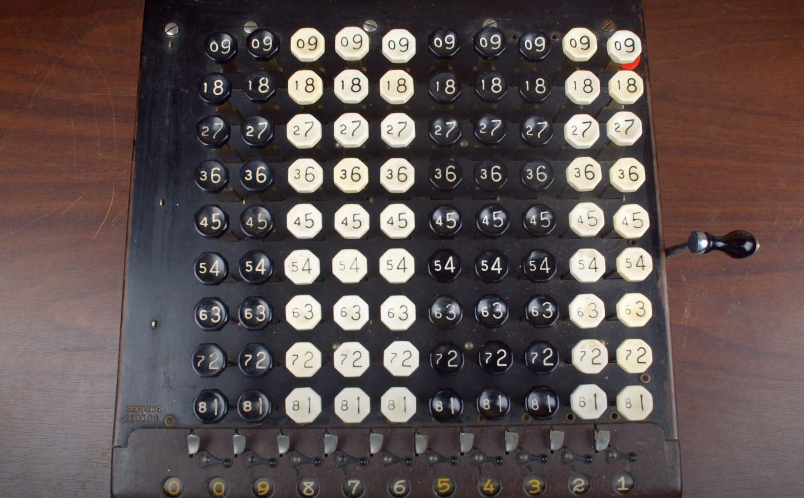

## 二进制：有符号整数编码及加减法运算 
### 简介

在计算机上，数字编码和字符编码本质上都通过二进制来编码。但数字二进制编码除了存储功能，还要求具备运算功能。这也就意味着它会和硬件计算单元有非常紧密的关系。

对于一个 8 bit 大小的存储，二进制的 0 和 1 有 $2^8 = 256$ 种组合。如果为自然数编码，能为 [0,...,255] 一共 256 个自然数的编码，最大的那个数字是：$2^8-1+0=255$。

如果你高兴，可以随意一个数字开始编码。比如：从 103 开始编码，能为 [103,...,358] 一共 256 个数字编码，最大的那个数字是：$2^8-1+103=358$。

如果在 8 bit 大小的存储中，把`负整数`也编码进来，常用的做法是各自分一半的编码数。也就是说负整数占 128 个，正整数占 128 个。那么他们的数值范围可以是负整数区 [-128,...,-1] 和正整数区 [1,...,128]。显然，少了对 0 的编码。为了把 0 也编入。把正整数区的改为从 0 开始的编码。

于是有符号的 8 位整数的数值范围是 [-128,...,-1,0,1,...,127]，即 $(-2^8\text{ ~ }2^8-1)$。以此类推：

* 16 位可以表示范围值：$(-2^{16}\text{ ~ }2^{16}-1)$。
* 32 位可以表示范围值：$(-2^{32}\text{ ~ }2^{32}-1)$。
* 64 位可以表示范围值：$(-2^{64}\text{ ~ }2^{64}-1)$。

在计算机中，所有的数据都是以二进制形式存储的。我们通过`除 2 倒取余`和`按权相加`方法对二进制数和十进制数之进行互转：

### 有符号整数的编码

在给定位数的情况下，它所能表示的编码个数是确定的。8 位的编码个数是 $2^8$， 16 位则是 $2^{16}$ 个。所以剩下的问题就是如何对数值范围里的数值分配二进制编码。

从计算机发展历史来看有三种编码方式：`原码` (Sign-Magnitude)、`反码` (One's Complement) 和`补码` (Two's Complement)。

IBM 是`原码` (Sign-Magnitude) 的早期支持者之一，其 704、709 和 709x 系列计算机可能是最著名的使用原码的系统。

`反码` (One's Complement) 这种数字表示系统通常出现在老式的计算机中；PDP-1，CDC 160A，UNIVAC 1100/2200 系列。Internet 协议 `IPv4`，`ICMP`，`UDP` 以及 `TCP` 都使用同样的 16 位`反码检验和`算法。

`补码` (Two's Complement) 是目前事实上的数字编码标准，被广泛使用。

这三种编码方式的不同点是对`负数`的编码，而正数的编码和数学里的二进制数字表示系统一样。

#### 原码

`原码` (Sign-Magnitude) 把整数分成两部分：`符号位` (Sign Bit) 和`数值` (Magnitude)。

* `符号位`是二进制的最高位 (最左边)，表示整数的`正负`号。`0` 表示`正整数`，`1` 表示`负整数`。
* `数值`表示整数的`绝对值`。

对于一个 8 位的十进制数 100 和 -100，其原码如下图所示：

#### 反码

`反码` (One's Complement) 或者`一的补码`的表示系统的操作如下：

* `正数`和原码的正数表示方式一样。
* `负数`的编码操作是对正数`按位取反`即可获得，`1` 逻辑非 (NOT) 为 `0`，`0` 逻辑非为 `·`。

对于一个 8 位的十进制数 100 和 -100，其反码如下图所示：

`反码`引入了`数字补码` (Numeric Complements)。在应用上，使用`(基数 - 1) 的补码策略`，二进制系统的基数是 2，所以叫`一的补码`。

> 反码这个翻译，目前只有内地教科在用。港台地区翻译采用直译叫`一补码`或`一补数`。同时，补码和补数都是 Complement 的翻译。

> 还得再说一下，这个翻译真的太烂了，因为完全曲解了原意。

如十进制系统，以 10 为基数，使用 (基数 - 1) 的补码策略叫`九的补码`。对于`一的补码`和`九的补码`，我们可以统称为`减基数补码`。

早期机械计算器也有九的补码应用，例如 1920 年的康普托机械计算器：

使用补码的好处可以统一加减法逻辑电路，即使用加法电路执行减法运算，这会节约硬件成本。

> 数字补码系统没有特意指定符号位，

不过，反码和原码对 0 的编码都多出了一个。比如在一个 4 位大小的二进制系统下：

* 原码对 0 的编码为 [0000] 和 [1000]。
* 反码对 0 的编码为 [0000] 和 [1111]。

因为对 0 的重复编码，导致最终数值范围会少一个。8 位存储大小，使用反码技术对有符号整数表示数值范围是 $-255\text{ ~ } 255$。由于存在两种表示零的方式，程序员和硬件设计者就需要考虑这一点，以避免可能的错误和混淆。

同时，每次加减法运算更为复杂。如加法的结果产生了进位，这个进位需要加回到结果的最低位，这称为`端点进位`。

#### 补码

`补码` (Two's Complement) 或者`二的补码`是**最常见**的有符号整数编码方式，它是现代计算机系统中，表示有符号整数的`标准方法`。它的表示系统的操作如下：

* `正数`和原码的正数表示方式一样。
* `负数`的编码操作是对正数`按位取反`之后，再`加 1`。

对于一个 8 位的十进制数 100 和 -100，其补码如下图所示：

`补码` (Two's Complement) 同样使用数字补码，不过在应用上使用`基数补码` (Radix Complement)的策略。因此也叫`二的补码`。

如果是十进制系统，以 10 为基数，使用基数的补码策略叫`十的补码`。对于`二的补码`和`十的补码`，我们可以统称为`基数补码`。

二补码改进了一补码的加法运算，并且对 0 的编码只有一个。

### 深入理解

上面介绍了三种二进制数的编码的表示方式，但没有讨论具体为什么这么去编码，以及为什么补码成为了计算机事实上的有符号整数的编码标准。

下面会介绍一些其它概念，来描述计算机运算的基本规律，从而了解补码的应用。

#### 模算术

在数学中，[模算术](https://en.wikipedia.org/wiki/Modular_arithmetic) (Modular arithmetic) 是一种`整数算术`系统，其中数字在达到`某个值`时进行“环绕”，该值称为`模` (modulus) 。现代模算术方法是由`卡尔·弗里德里希·高斯` (Carl Friedrich Gauss) 在其 1801 年出版的《算术研究》一书中提出的，包括同余的概念。模算术是很基础的理论，但厉害的是应用学科非常广泛。

`模` (modulus) 是指一个计量系统的计数范围，如过去计量粮食用的`斗`、`时钟`等。计算机也可以看成一个计量机器，因为计算机的`字长`是`定长的`，即存储和处理的位数是有限的，因此它也有一个计量范围。

如：`时钟`的计量范围是 $0 \text{ ~ } 11$，`模` = $12$。表示 $n$ 位的计算机计量范围是 $0 \text{ ~ } 2^n-1$，模 = $2^n$。任何有模的计量器，均可化`减法为加法`运算。

假设当前时针指向 8 点，要调成 6 点，调整方式可以通过`倒拨 2 小时`或`顺拨 10 小时`来实现。

在 12 为模的系统里，`加 10` 和`减 2` 效果是一样的，因此凡是减 2 运算，都可以用加 10 来代替。对“模”而言，2 和 10 互为`补数`(Complement)。实际上，以 12 为模的系统中，11 和 1，8 和 4，9 和 3，7 和 5，6 和 6 都有这个特性，共同的特点是`两者相加等于模`。

在`时钟这样的模运算系统`中，8 - 2 的运算操作结果值等于 8 + 10，可以记作 (8 + 10) mod 12。编程里 mod 通常使用 `%` 符号，表示`取余`。因此，8 - 2 = (8 + 10) % 12 = 6，并且可以看到它们还具备 $|-2| + 10 = 12 = 模$ 的关系。在数论中，称 -2 和 10 是对模 12 的同余关系。

**计算机运算系统也是一个模运算模型**

在计算机里，如果计算结果 > 最大表示数值，最高位就会进位。因为没有可以存储最高位进位值的地方，所以产生了`溢出`，也就是`进位溢出`。
  
如给定一个 8 位 (bit) 大小的存储单元，在为 $0\text{ ~ }255$ 的范围数值编码情况时下，进行 $255 + 1$ 的计算，最高就会进位溢出，计算结果又回到 $(0000 0000)_2$，也就是数值 0，这样形成了和时钟一样的循环计数功能。

#### 二进制减法变加法

我们来看看二进制的减法运算如何变成加法的。

当有限位数的计数器执行加法时，产生了进位溢出，溢出的部分就是模，它被自然抛弃，剩下部分就是减法的结果值 3。

同时，我们也可以看出`减数 2` 和模算术系统的`加数`之间`互为补码`，也就意味着我们模算术系统的`加数`直接通过 `模 - 2`，即 16 - 2 = 14 获取。

计算机引进补码可以把减法变加法，统一使用加法逻辑电路，来简化硬件设计。编译器对减数的补码计算实际比手工计算简单很多，也就是上面`按位取反 + 1` 操作，并且每一位的取反操作在电路上是并行操作。下面的章节会解释为什么`按位取反 + 1`的结果就是`补码` (Two's Complement)。

#### 补码的计算

通过模，已经引出了补码 (Complement) 的概念，而在此基础上建立了更为广泛的`数字补码` (Numeric Complements)，其中在进制系统中，基数补码和减基数补码较为常见。

`基数补码` (Radix Complement) 与某个`基数 (radix) 的幂`有关。在这样的系统中，`一个数`和它的`补码相加`会得到它的`模` ${10^{\color{red}{n}}}$，其中 $10$ 是`基数`， $\color{red}{n}$ 是`位数`。即 ${\color{#82B366}{\text{整数 N}}} + {\color{#D79B00}{\text{N 的补码}}} = 基数^{\color{red}{n}}$。

在一个 $\color{red}{8}$ 位十进制系统中：${\color{#82B366}{100}} + {\color{#D79B00}{99999900}} = {10^{\color{red}{8}}} = 100000000$。

在一个 $\color{red}{8}$ 位二进制系统中：${\color{#82B366}{(01100100)_2}} + {\color{#D79B00}{(10011100)_2}} = (10000000)_2 = 2^{\color{red}{8}}  = 256$。

求 r 补码公式如下：

$\text{r's complement} = r^{\color{red}{n}} - N$

* $\color{red}{n}$ 是数字中的位数。
* $N$ 为已给出的整数。
* $r$ 是基数(进制)。

除了基数补码外，还有一种补码方式，就是`基数 - 1` 的补码方式，也就是`减基数补码` (Diminished Radix Complement)。

$\text{(r-1)'s complement} = r^n-1-N$

在十进制数制中，基数补码称为`十的补码`，`减基数补码`称为`九的补码`。而在二进制中，基数补码称为`二的补码`([补码](/articles/bitwise-operations/#补码))，`减基数补码`称为`一的补码`([反码](/articles/bitwise-operations/#反码))。

有些人，特别是 [Donald Knuth](https://en.wikipedia.org/wiki/Donald_Knuth)，建议使用撇号的位置来区分基数补码和减少的基数补码。在这种用法中，四的补码是指以四为底数的基数补码，而四位补码是指以五为底数的数的减基数补码。

##### 按位取反

`按位取反`是我们讨论补码的另一种计算方式，这也是上面`反码`和`补码`的取反操作。在编译器存储负数时，会采取`按位取反`或`按位取反加一`来实现对负数的二进制存储，以及在做减法时，对减数做此操作来获取作为加数的补码。

按位取反的真正含义应该是`每一位`进行`基数 - 1 - 数值`的操作，下面通过十进制和二进制的反码和补码分别说明。

###### 十进制

先讨论十进制系统中对于一个整数 1523，求其反码和补码。我们把计算拆分到各个位上：

通过上面的拆解计算，我们可以得出，在 r 进制(基数)的系统中，已知一个整数，可以得出其`反码`(减基数补码)的计算公式：

让 $T = \\{a, \ldots, b, d\\}$，则 $\sum\limits_{i=n-1}^{i=0} (r - 1 - t)r^i = (r - 1 - a)r^{n-1} + \ldots + (r - 1 - b)r^1  + (r - 1 - d)r^0$。

* $T$ 表示已知整数的每一位数值集合。例：整数 1523 的 $T$ 集合为 $\\{1, 5, 2, 3\\}$。
* $n$ 表示位数。
* $r$ 表示基数。

那么，它的`补码`(基数补码)便是它的`反码 + 1`，即：$\left(\sum\limits_{i=n-1}^{i=0} (r - 1 - t)r^i\right) + 1$。

###### 二进制

对于二进制系统，我们给出一个整数 100 ，求其反码和补码。同样，把计算拆分到各个位上：

在二进制中，只有数值 0 和 1。因此，在对每一位进行 **(2 - 1 - 数值)** 的操作时，其结果都是可以通过`逻辑非` (NOT) 来获得。在此基础上加一便获取了基数补码。

### 原码 vs 反码 vs 补码

假如我们有一个 4 位大小的存储宽度，那么有符号整数的数值对应的原码、反码和补码的表示方式如下图所示：

从这张图上我们可以看到除了补码，原码和反码都存在 0 的编码重复的问题。

> 准确地说 0 既不是正数也不是负数。

在对负数的编码方式上，各有不同：

在使用反码计算减法时，有的需要`端点进位`，如：4 - 2 = 0100 + 1101 = 10001，要把最高位的 1 加到最低位，最终结果 0010 才是 2 的正确编码。而像 4 - 4，这样的减法却并不会产生进位。减法规则的两种操作无疑增加了硬件设计的复杂性。

补码解决了原码和反码的所有问题，这也就是为什么补码成为现在有符号整数的编码标准。

参考资料：

\> [https://zh.wikipedia.org/wiki/有符號數處理#表示方式](https://zh.wikipedia.org/wiki/有符號數處理#表示方式)

\> [https://vibaike.com/195922/](https://vibaike.com/195922/)

\> [https://baike.baidu.com/item/%E8%A1%A5%E7%A0%81?fromtitle=%E8%A1%A5%E6%95%B0&fromid=7545918&fromModule=lemma_search-box](https://baike.baidu.com/item/%E8%A1%A5%E7%A0%81?fromtitle=%E8%A1%A5%E6%95%B0&fromid=7545918&fromModule=lemma_search-box)

\> [https://www.javatpoint.com/radix-and-diminished-radix-complement-in-digital-electronics](https://www.javatpoint.com/radix-and-diminished-radix-complement-in-digital-electronics)

\> [https://www.bilibili.com/video/BV1BE41127du/?spm_id_from=333.337.search-card.all.click&vd_source=af39da37b48042b538f2e6f4b7b2e7c8](https://www.bilibili.com/video/BV1BE41127du/?spm_id_from=333.337.search-card.all.click&vd_source=af39da37b48042b538f2e6f4b7b2e7c8)

\> [https://zh.wikipedia.org/zh-tw/%E8%A1%A5%E6%95%B0](https://zh.wikipedia.org/zh-tw/%E8%A1%A5%E6%95%B0)

\> [https://en.wikipedia.org/wiki/Signed_number_representations](https://en.wikipedia.org/wiki/Signed_number_representations)

\> [https://www.bilibili.com/video/BV1HJ411c7SS/?spm_id_from=333.999.0.0&vd_source=af39da37b48042b538f2e6f4b7b2e7c8](https://www.bilibili.com/video/BV1HJ411c7SS/?spm_id_from=333.999.0.0&vd_source=af39da37b48042b538f2e6f4b7b2e7c8)
