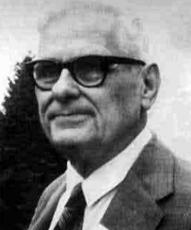
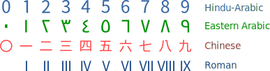

## 何为 λ 演算 (Lambda Calculus)  
### λ 演算

[λ 演算](https://zh.wikipedia.org/wiki/Λ演算#解释与应用)是一套从数学逻辑中发展，来`研究函数`如何进行抽象化定义、如何被应用以及递归的`形式系统`。定义比较抽象，简而言之就是`研究函数`形成的一套方法，一种语言 (有一套自成体系的简洁语法) ，并作为一种用途广泛的`计算模型`。

其应用领域有：数学、哲学、语言学和计算机科学，它在编程语言理论占有重要地，很多编程概念也是基于此作为理论来源。

λ 演算由数学家[阿隆佐·邱奇 (Alonzo Church)](https://zh.wikipedia.org/wiki/阿隆佐·邱奇)在20世纪30年代首次发表，即发明者。值得一提的是他也是[阿兰·图灵](https://zh.wikipedia.org/wiki/艾伦·图灵)的博士生导师，图灵则是被誉为计算机之父。

  ，第一张为邱奇，第二张是图灵。

λ 演算包含两块内容是：`语法`和`规则集`。语法用于组建表达式，即构建`λ 项`。而规则集就是对表达式进行[规约](https://zh.wikipedia.org/wiki/歸約)操作，符号化地操纵表达式。

### 数学函数 VS λ 演算函数

在数学中，可以用 $f(x)$ 表示一个函数，$x$ 定义为[自变量](https://baike.baidu.com/item/自变量)。通常在使用中，$x$ 是一个数值，而在 λ 演算中，$x$ 通常是一个函数，研究的领域也更为广泛。

在 λ 演算中没有值的概念，对于数学`值 (自然数)`的表示，λ 演算也有对应的[邱奇数](/articles/lambda-calculus/#邱奇数)表示。邱奇数也是一个函数。在λ 演算中`一切皆函数`的理念深入任何地方。

### 数的表示

在数学中，`3`表示一个抽象符号，举个简单例子：

`🍎 🍎 🍎`，这里的苹果个数，抽象化的数学符号表示就是：`3`。同样`🍌 🍌 🍌`，这里的香蕉个数，抽象化的数学符号也是：`3`。所以我们认为前面的`3`等价 (“=”表示) 于后面的`3`，即 $3=3$。而`3`这个符号我们通过其它符号基于数学各种`运算法则`也能得出，比如：`1+2=3`、`4-1=3`。

那么进而研究对这些符号的抽象，能不能通过另外一套符号及运算法则的`表示系统`去对上面的数学符号进行定义呢？答案是肯定的，那便是 λ 演算。它的关键不仅能表示数学的中的值，同时也能表示数学中的运算法则，并且其表示语法极为简洁。

这其实是对数学进行建模，通过 λ 演算来建立数学模型。即便没有`3`这个符号，我们依然可以通过 λ 演算来产生新的数学符号来表示`3`，即等价数学中的`3`这个符号。

### λ 演算做的事

λ 演算只做三样事情：

1. 给个输入变量；
2. 用 λ 表达式来构造函数；
3. 把函数应用于变量上。

上面是 λ 演算唯一能做的三件事。

### 为什么要学习 λ 演算？

Q：λ 演算引入了简单的记号，为什么要学习它呢？

A：针对这个问题可以给出三点：

1. λ 演算可以编码任何计算。你在任何编程语言中编写程序，无论这种语言是否存在，λ 演算总能以某种方式来编码。当然这么做可能效率极其低效，但那不重要，这是一种基本计算观念。我们想知道多少及什么样的程序可以用 λ 表达式来写，而事实是都可以；
2. λ 演算被认为是`函数式编程语言`的基石，像 Haskell。最近函数式编程也流行起来，而 Haskell 语言更像是 λ 演算语法的升级版；
3. λ 演算在大多主流的编程语言都可以用，像 C#、Java 等等语言，他们都支持了 λ 演算。而像 λ 演算中`高阶函数`、`柯里化`等相关术语也进入了前端领域，逐步成为一种编程风格。

> 阿兰·图灵说：“你可以在我的图灵机里写下任何东西。”，而邱奇的 λ 演算也是一样的系统，他们是等价的。

### 语法

下面的表格说明了 λ 演算的全部语法：

|   语法   | 名称  | 描述                                                                     |
| :------: | :---: | ------------------------------------------------------------------------ |
|   $x$    | 变量  | 用字符或字符串来表示`参数`或`数学上的值`或`逻辑上的值`。                 |
| $(λx.M)$ | 抽象  | 表示函数定义 ($M$ 是一个 `λ 项`) ，在表达式中的 $x$ 都会绑定为变量 $x$。 |
| $(M\ N)$ | 应用  | 应用单个的函数 $M$ 到单个的参数 $N$ 上。 $M$ 和 $N$ 是 `λ 项`。          |

> 如果在“应用”上有歧义，我们可以使用(M)(N)括号来归为整体来解析阅读。

`()`：括号内的表达式表示的是一个整体。当没有括号时，从左到右分析表达式，即左结合。

### 表达式

下面举例基于 λ 演算语法的表达式，同时通过文字表述来加深对其概念的理解，以此熟练应用。

#### λ 项

所有 λ 演算都是通过运算`λ 项`来完成演算的，所以对于`λ 项`需要有个清晰的归纳定义：

* 变量 $x$ 本身就是一个有效的 λ 项；
* 如果 $t$ 是一个 λ 项，而 $x$ 是一个变量，则 $λx.t$ 是一个 λ 项 (称为 λ 抽象) ；
* 如果 $t$ 和 $x$ 是 λ 项，那么 $(t\ s)$ 是一个 λ 项 (称为应用) 。

其它的都不是 λ 项。只有重复运用[运算法则](/articles/lambda-calculus/#运算法则)操作`λ 项`才是有效的 λ 演算。

#### λ 抽象

λ 演算的基本形式是：$λ<变量>.<表达式>$。

一个数学函数表达式 $f(x) = x + 2$，用 λ 演算的语法表示函数则是 $λx.x + 2$ (x 可以任意命名) 。我们以 λ 演算的 (λx.M) 语法为文字表述就是“**定义了一个函数 M  (指代 x + 2) ，M 里的 x 都会绑定为变量 x**”。

#### λ 应用

数学函数$f(3)$的值用 λ 演算的语法写作 $(λx.x + 2)\ 3$，即 (M N) 的语法格式。转为文字表述就是“**把函数 M 应用于值为 3 的变量上**”。

> λ 演算没有数学中“值”的概念，为了初步的理解采用“值”表`3`的含义，`3`应该理解为符号，这一点在后面的邱奇数会有更深入的解释。

根据上面对[λ 项的定义](/articles/lambda-calculus/#λ-项)可以知道`应用`本身也是`λ 项`，也就能理解 $((M\ N)\ P)$ 是一个`应用`，同时 $((M\ N)\ P)$ 本身继续成为新的`λ 项`。

根据`左结合`的解析规则，$((M\ N)\ P)$ 省略括号也可以表示为：$M\ N\ P$。

### 柯里化

考虑一个这样的函数：它把一个函数作为参数，这个函数将被应用于 3 上，我们可以表示成：$λy.y\ 3$。接下来我们把这个函数再应用于 $λx.x + 2$ 函数上，于是形成的函数 $(λy.y\ 3)(λx.x+2)$。

由此可以推导出这三个表达式是等价的：$(λy.y\ 3)(λx.x+2)$ 等价于 $(λx.x + 2)\ 3$ 等价于 $3 + 2$，这里的等价关系由 λ 演算的[运算法则](/articles/lambda-calculus/#运算法则)来确立的。

这里有了一个新的概念：当一个单一参数的函数，它的返回值又是一个带单个参数的函数，这样的函数称之为`柯里化函数`，以逻辑学家[Haskell Curry](https://zh.wikipedia.org/wiki/哈斯凯尔·柯里)命名，柯里化的概念以及三个编程语言Haskell、Brook、Curry都是以他的名字来命名的。

用编程语言 Javascript 看一个`相加的柯里化函数`如下：

``` javascript
function add(x) {
  return function (y) {
    return x + y
  }
}
```

例如：一个多参函数 $f(x, y) = x - y$ 柯里化后可以写作：$λx.(λy.x - y)$，去除括号即 $λx.λy.x - y$。

由此可以推导出下面三个表达式是也是等价的：

$(λx.λy.x - y)\ 7\ 2$ 等价于 $(λy.7 - y)\ 2$ 等价于 $7 - 2$

### 运算法则

λ 演算`只有两条`真正的法则：`α-变换`和`β-归约`。

|           操作           |  名称  | 描述                                                 |
| :----------------------: | :----: | ---------------------------------------------------- |
| $(λx.M[x]) → (λy.M[y])$  | α-转换 | 重命名表达式中的绑定 (形式) 变量。用于避免名称冲突。 |
| $((λx.M) E) → (M[x:=E])$ | β-归约 | 在抽象化的函数定义体中，以参数表达式代替绑定变量。   |

#### α-变换

Alpha-变换规则表达的是，被绑定变量的名称是不重要的，它是对`变量`的`重命名`操作。举例： $λx.x$ 和 $λy.y$ 是同一个函数。

这个规则看起来很傻，好像没做任何事，但是正因为基于这条规则，才可以实现递归的事情。

#### β-归约

Beta-归约规则是对`应用`的`替换`操作。对于 $(λx.x + 1)\ 3$ 这样的一个`应用`表达式，通过替换函数体 ($x + 1$) 里的 $x$ 来实现`应用`而得到结果就是：$3 + 1$。

所以我们可以确立 $(λx.x + 1)\ 3$ 和 $3 + 1$ 的等价关系，即 $(λx.x + 1)\ 3 = 3 + 1$  (这里 $=$ 表示等价) 。

### 高阶函数

在数学和计算机科学中，[高阶函数](https://en.wikipedia.org/wiki/Higher-order_function)是满足下列`至少其中一个`条件的函数：

* 接受一个或多个函数作为输入；
* 输出一个函数。

无类型 lambda 演算中所有的函数都是高阶的。除了高阶函数所有其它函数都是`一阶函数` (first-order function) 。

### 算术的定义

#### 数字定义

##### 数学中自然数的定义

$0$ 是自然数的其中一个，自然数表示 $N = \\{0,1,2,...\\}$，$0 ∈ N$，那自然数在数学上是如何定义呢？有一个基于序数理论提出的[皮亚诺公理](https://zh.wikipedia.org/wiki/皮亚诺公理)来定义自然数，它的非形式化定义：

1. $0$ 是自然数；
2. 每一个确定的自然数 $a$，都有一个确定的后继数 $a'$，$a'$ 也是自然数；
3. 对于每个自然数 $b$、$c$，$b=c$ 当且仅当 $b$ 的后继数 $=$ $c$ 的后继数；
4. $0$ 不是任何自然数的后继数；
5. 任意关于自然数的命题，如果证明：它对自然数 $0$ 是真的，且假定它对自然数 $a$ 为真时，可以证明对 $a'$ 也真。那么，命题对所有自然数都真。

这里有数学中的`后继数 (successor number)`的概念，后继数可以通过`后继函数`得到。例如：$0$ 的后继数是 $1$，$1$ 的后继数是 $2$，于是有了后继函数 $f(x) = x + 1$ ，我们可以利用后继函数通过[递归定义](https://zh.wikipedia.org/wiki/递归定义)方式定义自然数，所以会有以下推导：

$0 = 0$

$1 = f(0)$

$2 = f(f(0))$

$3 = f(f(f(0)))$

$n = f(f(f(f(0))))...后继函数的n次调用$

如果你愿意，你可以用$0,f(0),f(f(0)),f(f(f(0)))...$来表示自然数的每个符号，但显然是不方便阅读和书写的。这里的${0,1,2,3,...,n}$只是自然数其中一种表示符号。除了阿拉伯符号表示，常见的还有其它类型符号：



##### λ 演算对自然数的定义

λ 演算如何来定义自然数的呢？`阿隆佐·邱奇`发明了以他为命名的`邱奇数 (Church Numerals)`，也是较为常用的表示法。

##### 邱奇数

**邱奇数**为使用邱奇编码的自然数表示法，而用以表示自然数 $n$ 的高阶函数是个任意函数 $f$ 映射到它自身的n重函数复合之函数，简言之，数的“值”即等价于参数被函数包裹的次数。

$f^{\circ n}=\underbrace {f\circ f\circ \cdots \circ f} _{n{\text{ 次}}}.$

邱奇数定义自然数如下：

$0 = λy.λx.x$

$1 = λy.λx.y\ x$

$2 = λy.λx.y\ (y\ x)$

$3 = λy.λx.y\ (y\ (y\ x))$

$...$

$n = λy.λx.yⁿ\ x ...y 对 x 的 n 次应用$

通过 λ 演算法则的[α-变换](/articles/lambda-calculus/#α-变换)和[β-归约](/articles/lambda-calculus/#β-归约)，我们发现上面得到的结果都是常量函数$λx.x$，即一个映射自身的函数。

每个邱奇数有两个参数 $y$ 和 $x$。$y$ 表示`后继函数`：$f(n) = n + 1$，$x$ 表示自然数：`0`。

邱奇数同样也采用`递归定义法`。邱奇数的 $1$ 表示后继函数对自然数 $0$ 的`1`次应用。邱奇数的 $2$ 表示后继函数对自然数 $0$ 的`2`次应用。以此递归，对于自然数邱奇数 $n$，即后继函数对自然数 $0$ 的 `n` 次调用。

数学中我们可以这样定义后继函数：$f(n) = n + 1$，通过上面的表达式，我们可以得出一个后继函数：S，即 $S ≡ λn.λy.λx.y\ (n\ y\ x)$。

我们通过 Javascript 语法实现以上的表达式，并分别对 x 和 y 进行声明：`x = 0` 且 `y = x => x + 1` 。

下面是邱奇数对`0`、`1`、`2`的自然数的定义转为 Javascript 语法的书写方式。

定义自然数 0：

``` javascript
let λ0 = y => (x => x)
```

定义自然数 1：

``` javascript
let λ1 = y => (x => y(x))
```

定义自然数 2：

``` javascript
let λ2 = y => (x => y(y(x)))
```

我们对上面的两个参数：`x`和 `y`，分别进行声明，让 `x = 0` 和 `y = x => x + 1`，然后我们看看他们的执行结果：

``` javascript
// 变量声明
let x = 0, y = x => x + 1

// 函数定义
let λ0 = y => (x => x)
let λ1 = y => (x => y(x))
let λ2 = y => (x => y(y(x)))

// 执行 λ0 函数
λ0(y)(x)  // => 0

// 执行 λ1 函数
λ1(y)(x)  // => 1

// 执行 λ2 函数
λ2(y)(x) // => 2
```

#### 布尔和谓词定义

##### 布尔定义

我们将 `TRUE` 和 `FALSE` 值表示为对其参数执行一个 `if-then-else` 操作的函数：
习惯上，下述两个定义 (称为邱奇布尔值) 被用作 `TRUE` 和 `FALSE` 这样的布尔值：

TRUE := $λx.λy.x$

FALSE := $λx.λy.y$

通过`β规约`操作来理解上面的表达式，上面表达式有两个参数：$x$ 和 $y$，无论 $x$ 是什么值，第一个表达式总是输出 $x$，而第二个表达式总是输出 $y$。

考虑把 `TRUE` 和 `FALSE` 应用到两个实参 `a` 和 `b` ：

$λx.λy.x\ a\ b = a$

$λx.λy.y\ a\ b = b$

可以看到第一个表达式两个实参被应用时，第一个表达式`永远`选择第一个输入作为输出。而第二个表达式`永远`选择第二输入作为输出。

> 有意思的是 $λx.λy.y$ 也是自然数`0`的定义，而计算机编程中的语言通常把`0`作为 `false` 来处理。

##### 谓词

假设我们要得到 `ifelse TRUE 10 20` 这样的运算，即`如果是真那么输出10，如果是假输出20`，那么λ演算运算写法如下：

$ifelse\ TRUE\ 42\ 58 = TRUE\ 42\ 58$

$→ (λx.λy.x)\ 42\ 58$

$→ (λy.42)\ 58$

$→42$

λ 演算的 `TRUE` 在`应用`时，只是选择了第一个实参作为输出，它只是个选择问题而已。

##### 逻辑运算符

我们来看看如何构造一个 `AND` 逻辑运算符，基本形式 $λx.λy.?$。x 和 y 是参数，即被操作的变量。? 是函数体，是实现 AND 逻辑的。

二元函数 AND 我们形式化表示其逻辑如下：

1. $(x = FALSE,\ ∀y∈\\{TRUE,\ FALSE\\})\ →\ ? = TRUE$
2. $(x = TRUE,\ y = FALSE)\ →\ ? = FALSE$
3. $(x = TRUE,\ y = TRUE)\ →\ ? = TRUE$

上面的逻辑下，通过 `x y x` 的 λ 演算形式就可以表示以上逻辑：

1. 若 $x$ = FALSE，则选第二个实参 $x$ 输出。而 $x$ = FALSE，运算结果是 FALSE；
2. 若 $x$ = TRUE，则选第一个实参 $y$ 输出；
   * 若 $y$ = TRUE，运算结果是 TRUE；
   * 若 $y$ = FALSE，运算结果是 FALSE。

所以我们可以得到 AND := $λx.λy.x\ y\ x$，为最终的表达式。

上面的 AND 逻辑处理和 Javascript 语言里的`&&`二元操作符的逻辑是一样的，看下面的代码：

``` javascript
let a = 0, b = 2;
let output = a && b;
console.log(output);
// => 0

a = 1;
output = a && b;
console.log(output);
// => 2
```

在 Javascript 解析器里，a 的值是 0 被看作是 false，所以当进行 AND 操作时，选择第一个变量 a 返回，反之当 a 为 true 时，解析器则不会解析 b 的值的真假，而直接选择第二个变量 b 返回。

同样我们可以构造其它逻辑运算符：

OR := $λx.λy.x\ x\ y$

NOT := $λz.λx.λy.z\ y\ x$

IFTHENELSE := $λz.λy.λx.z\ y\ x$

参考资料：

\> [http://cgnail.github.io/academic/lambda-index/](http://cgnail.github.io/academic/lambda-index/)

\> [https://github.com/txyyss/Lambda-Calculus/releases](https://github.com/txyyss/Lambda-Calculus/releases)

\> [https://www.zhihu.com/question/19804597](https://www.zhihu.com/question/19804597)

\> [https://zh.wikipedia.org/wiki/数学符号表](https://zh.wikipedia.org/wiki/数学符号表)

\> [https://zh.wikipedia.org/wiki/邱奇数](https://zh.wikipedia.org/wiki/邱奇数)

\> [https://www.bilibili.com/video/BV1nZ4y1W7yX](https://www.bilibili.com/video/BV1nZ4y1W7yX)

\> [https://zhuanlan.zhihu.com/p/137168455](https://zhuanlan.zhihu.com/p/137168455)

\> [http://www.cs.columbia.edu/~sedwards/classes/2012/w4115-fall/lambda.pdf](http://www.cs.columbia.edu/~sedwards/classes/2012/w4115-fall/lambda.pdf)

\> [https://code.iamkate.com/lambda-calculus/boolean-logic/](https://code.iamkate.com/lambda-calculus/boolean-logic/)

\> [https://www.jianshu.com/p/e7db2f50b012](https://www.jianshu.com/p/e7db2f50b012)

\> [https://plato.stanford.edu/entries/lambda-calculus/](https://plato.stanford.edu/entries/lambda-calculus/)
