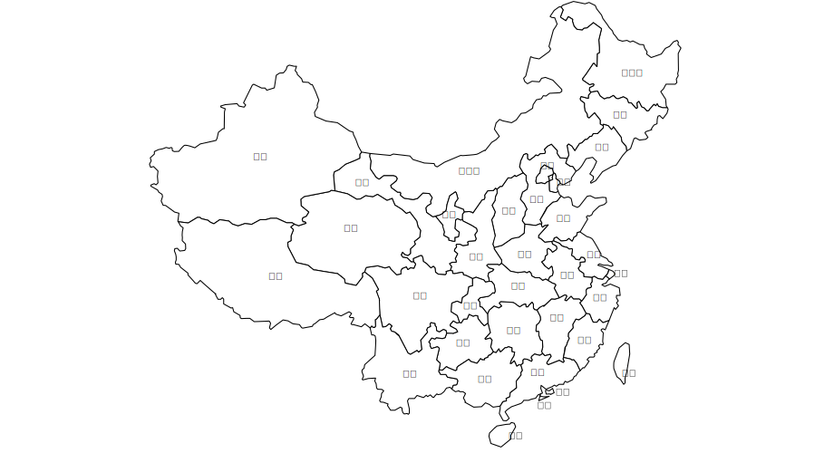
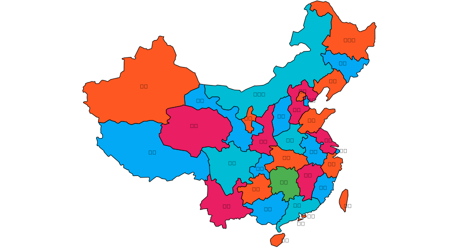

## 利用图建模来给中国地图染色 
### 要做啥？

我们准备给中国地图所有省级行政区都染上色，唯一的要求是使每个`相邻行政区的色块都不同`。这是典型的图着色问题，我们将通过`贪心策略`来决定使用哪种颜色给行政区着色。

中国共计 34 个省级行政区，包括 23 个省、5 个自治区、4 个直辖市、2 个特别行政区。

起始的地图如下：



最后我们会获得一张染色的地图：



### 建模

一张地图可以使用`图`来建模，我们把行政区用`顶点`表示，通过`边`来连接两个相邻行政区。

为了快速遍历寻找相邻顶点，我们采用`邻接表`来作为图的存储结构。


``` javascript
const originalData = {
  '北京': ['河北', '天津'],
  '天津': ['北京', '河北'],
  '河北': ['北京', '天津', '山东', '河南', '山西', '内蒙古', '辽宁'],
  '山西': ['内蒙古', '陕西', '河南', '河北', '北京'],
  '陕西': ['山西', '河南', '湖北', '重庆', '四川', '甘肃', '宁夏', '内蒙古'],
  '内蒙古': ['黑龙江', '吉林', '辽宁', '河北', '山西', '宁夏', '甘肃', '陕西'],
  '河南': ['河北', '湖北', '陕西', '安徽', '山西', '山东'],
  '黑龙江': ['内蒙古', '吉林'],
  '吉林': ['内蒙古', '辽宁', '黑龙江'],
  '辽宁': ['内蒙古', '吉林', '河北'],
  '山东': ['河北', '河南', '江苏', '安徽'],
  '宁夏': ['陕西', '内蒙古', '甘肃'],
  '甘肃': ['陕西', '新疆', '青海', '四川', '宁夏', '内蒙古'],
  '青海': ['西藏', '新疆', '甘肃', '四川'],
  '西藏': ['新疆', '青海', '四川', '云南'],
  '新疆': ['西藏', '甘肃', '青海'],
  '云南': ['西藏', '四川', '贵州', '广西'],
  '湖北': ['陕西', '河南', '安徽', '江西', '湖南', '重庆'],
  '重庆': ['陕西', '贵州', '湖北', '湖南', '四川'],
  '四川': ['重庆', '陕西', '青海', '甘肃', '云南', '贵州', '西藏'],
  '上海': ['浙江', '江苏'],
  '广东': ['福建', '江西', '湖南', '广西', '海南', '澳门', '香港'],
  '广西': ['广东', '海南', '贵州', '云南'],
  '安徽': ['浙江', '江西', '河南', '山东', '江苏', '湖北'],
  '贵州': ['湖南', '广西', '四川', '重庆', '云南'],
  '海南': ['广东'],
  '湖南': ['江西', '重庆', '贵州', '广东', '广西', '湖北'],
  '江苏': ['山东', '河南', '安徽', '浙江', '上海'],
  '江西': ['浙江', '福建', '安徽', '湖北', '湖南', '广东'],
  '浙江': ['江西', '上海', '江苏', '福建', '安徽'],
  '福建': ['浙江', '江西', '广东'],
  '台湾': ['福建'],
  '澳门': ['广东'],
  '香港': ['广东']
}

const order = {
  '黑龙江': 0, '吉林': 1, '辽宁': 2, '北京': 3, '天津': 4, '河北': 5, '山西': 6, '山东': 7, '河南': 8, '安徽': 9, '浙江': 10,
  '上海': 11, '福建': 12, '台湾': 13, '香港': 14, '湖北': 15, '江西': 16, '内蒙古': 17, '宁夏': 18, '陕西': 19, '甘肃': 20,
  '新疆': 21, '西藏': 22, '青海': 23, '重庆': 24, '贵州': 25, '广西': 26, '广东': 27, '澳门': 28, '海南': 29, '云南': 30,
  '四川': 31, '湖南': 32, '江苏': 33,
}
```

上面面是原始的数据，`originalData` 保存着顶点和与之相邻的顶点数组，`order` 表明各个顶点的序列编号，我们使用`邻接表`来存储这张图：

**1.定义图和顶点**

这里定义了一个`图`和`顶点`，顶点保存着自身在邻接表的位置。

``` javascript
class Graph {
  constructor(numVertices, adjLists) {
    this.numVertices = numVertices
    this.adjLists = adjLists
  }
};

class GraphVertix {
  constructor(index, name) {
    this.index = index
    this.data = name
  }
}
```

**2.建模**

我们根据采集到的数据，实例化一个采用`邻接表`为存储结构的图。

``` javascript
function createGraph() {

  const names = Object.keys(originalData)
  // 邻接表
  const adjacencyList = new Array(names.length)

  // 创建顶点
  const mapping = {}
  const vertices = names.map((name, index) => {
    return mapping[name] = new GraphVertix(order[name], name)
  })

  // 添加边
  vertices.forEach(v => {
    const edges = []
    const list = originalData[v.data]
    list.forEach(name => edges.push(mapping[name]))
    adjacencyList[v.index] = edges;
  })
  return new Graph(names.length, adjacencyList)
}

// 创建存储结构为邻接表的图
const graph = createGraph()
```

### 贪心算法

我们把地图着色问题，拆解为相邻顶点采用不同颜色的小问题。通过遍历顶点，把当前顶点与其相邻的顶点做比较，选择与他们不同的颜色即可。

而贪心算法的核心就是选择颜色时，采用可用颜色中第一个，而不关心选可用颜色中哪一个。

在上面的图模型上，我们通过`遍历`邻接表，采用贪心策略去着色：

``` javascript
function greedyColor() {
  function firstAvailable(used_neighbour_colors) {
    const colorSet = new Set(used_neighbour_colors)
    let count = 0
    while (true) {
      if (!colorSet.has(count)) {
        return count
      }
      count++
    }
  }

  // key = 顶点，value = color index
  const color = {}
  // 遍历
  graph.adjLists.forEach((list, index) => {

    // 获取相邻顶点已使用的颜色
    const usedColors = []
    list.forEach((v) => {
      if (typeof color[v.index] !== 'undefined') {
        usedColors.push(color[v.index])
      }
    })
    // 查找一种未使用的的颜色
    color[index] = firstAvailable(usedColors)
  })

  return color
}
// 染色结果
const color = greedyColor()
```

最终，我们获得一个 `color<顶点编号, 颜色编号>` 的染色对象，通过这个对象就可以执行染色操作。

### 示例代码

示例的地址：[https://github.com/dun-cat/algorithms-case](https://github.com/dun-cat/algorithms-case)

你可以运行下面的命令获得两张 SVG 格式的图片，他们分别是`染色的图模型`和`染色的地图`。

``` bash
npm run coloring-china-map
```


最后，祝贺建党 100 周年，祝愿祖国越来越强大。

参考资料：

\> [https://en.wikipedia.org/wiki/Graph_coloring](https://en.wikipedia.org/wiki/Graph_coloring)
