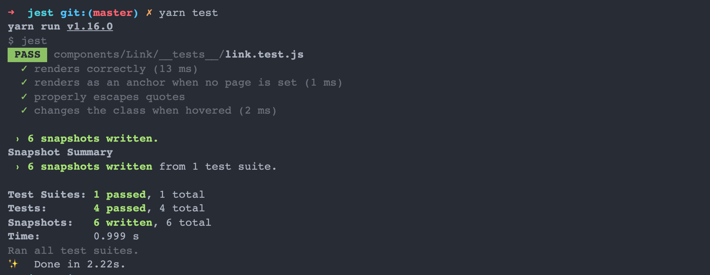
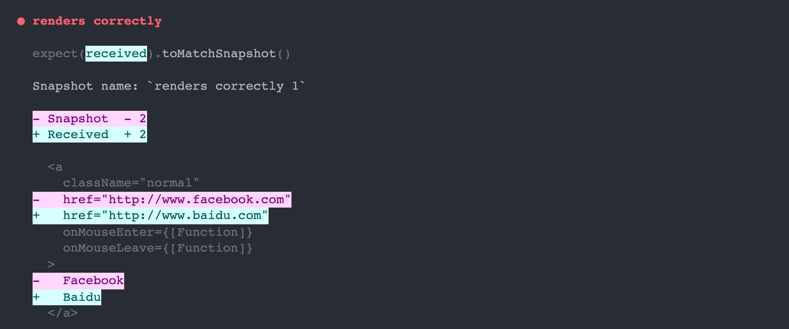
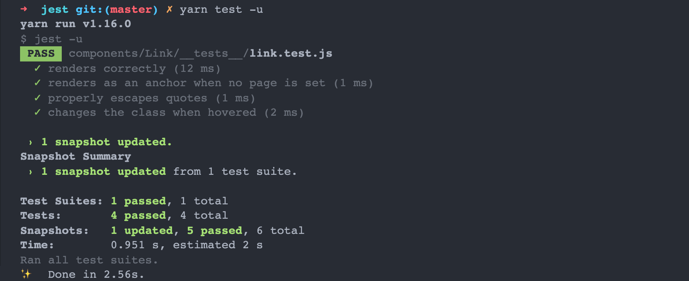

## 前端测试框架：Jest (二) - 快照测试 
### 介绍

通常做UI组件测试要做两件事：

* 交互：确保组件在与用户进行交互时正确运行 (例如，当用户按下按钮时)
* 渲染：确保组件渲染输出正确 (例如，按钮在UI中的外观和位置)

### 快照测试

在对UI组件进行渲染测试时，快照测试会非常有用。第1次测试时，生成一张快照，在做第2次测试时，如果和第1次生成的快照不匹配，测试失败。
或者把参考快照更新为UI组件的新版本。

> 做快照测试时，通常做法是用`渲染器`生成可序列化的值作为快照，而不是生成图片进行像素比较，这样可以高测试效率。

#### 对 React 组件的快照测试

``` javascript
import React from 'react';
import renderer from 'react-test-renderer';
import Link from '../Link.react';

it('renders correctly', () => {
  const tree = renderer
    .create(<Link page="http://www.facebook.com">Facebook</Link>)
    .toJSON();
  expect(tree).toMatchSnapshot();
});
```

### 第一次运行测试时

Jest 创建会在 test 文件同级目录创建一个 `__snapshots__` 目录，并生成以 `.snap` 为后缀的快照文件。

``` javascript
exports[ `renders correctly 1` ] = `
<a
  className="normal"
  href="http://www.facebook.com"
  onMouseEnter={[Function]}
  onMouseLeave={[Function]}
>
  Facebook
</a>
`;
```

### 资源地址

Demo 的具体地址可以在 <https://github.com/dun-cat/jest> 获取。

#### 第一次输出



修改后：

``` javascript
import React from 'react';
import renderer from 'react-test-renderer';
import Link from '../Link.react';

it('renders correctly', () => {
  const tree = renderer
    .create(<Link page="http://www.baidu.com">Baidu</Link>)
    .toJSON();
  expect(tree).toMatchSnapshot();
});
```

#### 第二次输出



这里标记处两次快照的不同点。

#### 更新快照



### 快照测试的弱点

* 快照本身不能验证渲染逻辑的正确性，它们只是擅长防止意外更改，检查渲染结果是否所需的元素、值及样式等等。

* 快照测试失败时，很容易通过 Jest --updateSnapshot 选项更新，而没有采取适当的措施验证是否需要更改。因此，需要某些开发人员纪律。

* 创建快照时，即使在渲染的输出实际上是错误的情况下，也被认为是正确的。

### 快照创建规则

Jest 建议创建的快照应该尽量小，最佳做法应限制快照的大小，以便更易于管理和查看。在 Jest 中可以通过限制快照文件`最大行数`来限制大小。

``` javascript
// .eslintrc.js
module.exports = {
  rules: {
    'jest/no-large-snapshots': [
      "warn", { "maxSize": 12, "inlineMaxSize": 6 },
    ],
  },
};
```
