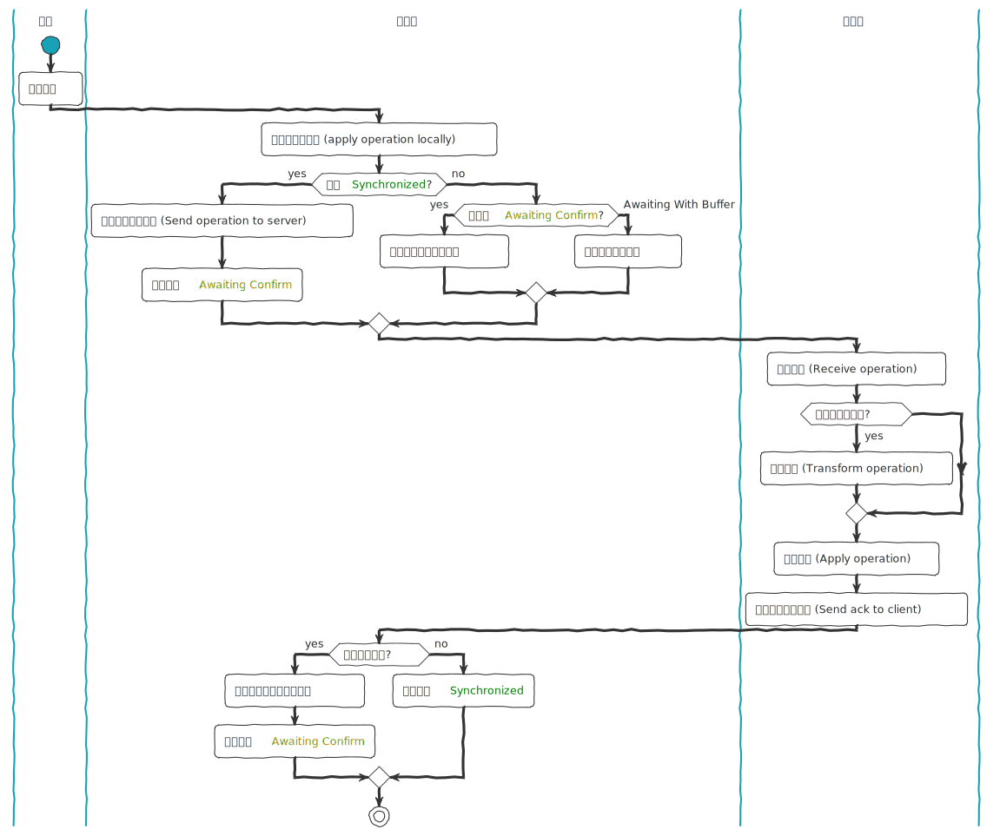

## 协同办公之操作变换 (OT) 技术 
让我们通过一个真实的开发故事，从零开始理解 **Operational Transformation（OT，操作转换）** 如何解决协同编辑中的冲突问题，以及它面临的挑战。

### 故事的开端

小明是一家初创公司的全栈工程师，团队计划开发一个类似 **Google Docs** 的实时协作文档工具。最初，他们天真地认为：“只要把用户的按键操作实时**广播**给其他用户，就能实现同步！”但很快遇到了灾难性的问题……

**阶段 1：最初的“简单”方案（问题爆发）**

场景：

1. 用户 A 在文档开头输入 `“Hello”`，操作被广播给用户 B。  
2. 用户 B 同时在同一位置输入 `“Hi”`，操作也被广播给用户 A。  
3. **结果**：用户 A 看到 `“HHiello”`，用户 B 看到 `“HHelloi”` —— 数据彻底不一致！

问题根源：

- **操作顺序不同**：由于网络延迟，用户 A 和 B 收到彼此操作的顺序可能不同。  
- **直接叠加操作**：简单地将操作应用到本地副本，导致**状态分歧**（类似多线程并发写冲突）。

**阶段 2：引入“操作顺序”控制（部分失败）**

小明尝试改进：**为每个操作分配全局递增的版本号**，强制所有客户端按顺序执行操作。

新问题：

1. 用户 A 在位置 0 插入 `“X”`（版本 1）。  
2. 用户 B 在位置 0 插入 `“Y”`（版本 2），但网络延迟导致用户 A 先收到版本 2 的操作。  
3. **用户 A 的本地文档**：  
   - 应用版本 2：插入 Y → `“Y”`  
   - 应用版本 1：在位置 0 插入 X → `“XY”`  
4. **用户 B 的本地文档**：  
   - 应用版本 1：插入 X → `“X”`  
   - 应用版本 2：在位置 0 插入 Y → `“YX”`  
**结果**：依然不一致！

核心挑战：

- **操作上下文依赖**：操作的**有效性**依赖于文档的`当前状态`。直接按版本号顺序执行，忽略了操作之间的**上下文关系**。

**阶段 3：引入 OT 算法**

小明终于研究到 OT 算法，其核心思想是：**动态调整操作，使其在任意顺序下都能收敛到一致状态**。

关键步骤：

1. **定义操作类型**：  
   - `Insert(pos, text)`  
   - `Delete(pos, length)`  

2. **设计转换函数**：  
   - 当两个操作 `op1` 和 `op2` 并发时（即基于同一版本生成），通过函数 `Transform(op1, op2)` 生成调整后的 `op1'` 和 `op2'`，使其在交换顺序后仍能正确应用。

经典示例：插入冲突

- **初始文档**：空文档。
- **用户 A** 发出 `opA = Insert(0, "X")`（版本 1）。  
- **用户 B** 同时发出 `opB = Insert(0, "Y")`（版本 1）。  

**未使用 OT**：  

- 用户 A 先应用 `opA` → "X"，再应用 `opB` → "YX"。  
- 用户 B 先应用 `opB` → "Y"，再应用 `opA` → "XY"。  
**结果不一致！**

使用 OT：  

1. 服务器检测到 `opA` 和 `opB` 是**并发**的（基于同一版本）。  
2. 转换函数调整操作：  
   - `Transform(opA, opB)` → `opA' = Insert(1, "X")`  
   - `Transform(opB, opA)` → `opB' = Insert(0, "Y")`  
3. 最终所有客户端文档变为 **“YX”** 或 **“XY”**？—— **不！OT 的关键在于确保转换后操作收敛到同一状态**。  
   - 实际上，OT 的转换规则需保证：无论执行顺序如何，最终文档一致。  
   - 正确转换后，用户 A 和 B 的文档均应为 **“XY”** 或 **“YX”**（需根据业务规则确定优先级，例如以用户 ID 排序）。

**阶段 4：OT 的复杂性（新的挑战）**

小明发现 OT 的理论看似完美，但实际实现极其复杂，尤其是在处理**删除操作**和**嵌套操作**时。

挑战 1：删除与插入的交错

- **场景**：  
  1. 文档内容：**“ABCD”**。  
  2. 用户 A 删除位置 1 的字符（即删除 **“B”**），得到 **“ACD”**。  
  3. 用户 B 在位置 2 插入 **“X”**（原文档位置 2 是 **“C”**），预期得到 **“ABXCD”**。  
- **问题**：若操作顺序不同，转换后的结果可能错误。  
  - 若先应用删除操作，用户 B 的插入位置需要调整（因为删除操作改变了文档长度）。  

OT 解决方案：  

- 转换函数需根据先前操作动态计算位置偏移。例如：  
  - 用户 B 的 `Insert(2, "X")` 在用户 A 的 `Delete(1)` 之后，应转换为 `Insert(1, "X")`（因为删除操作使原位置 2 变为新位置 1）。

挑战 2：操作的依赖性

- **场景**：用户连续执行多个操作（如先插入后删除），这些操作需要作为一个**原子单元**处理。  
- **问题**：若中间操作被其他用户的操作打断，转换逻辑可能变得无法维护。

**解决方案**：  

- 引入**操作历史缓冲区**，记录所有未确认的操作，并在**收到服务器确认**后按顺序转换和应用。

**阶段 5：OT 的工程实践**

小明最终采用以下策略实现 OT：  

1. **中央服务器协调**：所有操作先发送到服务器，服务器维护全局操作序列，负责`转换`和`广播`。  
2. **客户端预测**：在等待服务器确认期间，客户端本地预览操作（类似乐观锁），收到服务器转换后的操作后修正状态。  
3. **使用成熟库**：如 `ShareDB`（基于 JSON 的 OT 实现）、`Quill` 富文本编辑器内置的 OT 逻辑。

**代码片段示例（简化版插入转换）**  

```javascript
// 转换函数：处理两个插入操作
function transformInsert(op1, op2) {
  // op1 和 op2 均为 { pos: number, text: string }
  if (op1.pos < op2.pos) {
    // op1 在 op2 前面，op2 的位置需要后移
    return { ...op2, pos: op2.pos + op1.text.length };
  } else if (op1.pos > op2.pos) {
    // op2 不影响 op1
    return op1;
  } else {
    // 同一位置，按用户 ID 决定优先级
    return op1.userId < op2.userId ? 
      { ...op1, pos: op1.pos } : 
      { ...op1, pos: op1.pos + op2.text.length };
  }
}
```

### OT 的局限性  

1. **算法复杂度**：支持富文本（如斜体、颜色）时，转换函数需处理多维操作，代码量爆炸。  
2. **网络依赖**：要求中央服务器协调，难以实现完全去中心化（CRDT 算法更擅长此场景）。  
3. **历史兼容性**：文档版本回滚时可能需重新计算所有操作。

### OT 的核心价值

- **实时一致性**：在多人协作场景中，确保所有用户的视图最终收敛到相同状态。  
- **响应速度**：通过本地预测和异步修正，平衡了实时性和正确性。  

**现代应用**：Google Docs、腾讯文档早期版本均依赖 OT，而新一代工具（如 Figma）则结合了 OT 和 CRDT 的思想。

`操作变换`（Operational Transformation，OT）是一种技术，用于在分布式系统中实现协同编辑，确保多个用户可以同时编辑同一文档或数据，而`不会产生冲突`。

转换操作是指将`一个操作`根据`已经存在的其他操作`进行调整，以确保这些操作能够无冲突地应用到文档中。转换操作的`目标`是`保持所有客户端的文档状态一致`，尽管这些客户端可能以不同的顺序接收到和应用操作。

它最早由 IBM 在 `1989` 年提出，并在之后的研究中不断改进和发展。下面的解析以 [OT.js](https://github.com/Operational-Transformation/ot.js/) 为案例。

这里有一个 [Demo](https://operational-transformation.github.io/) 演示。

### 工作流程

1. **操作生成**：
   用户在本地对文档进行编辑，并生成相应的操作。这些操作会被暂存到本地操作队列中。

   ``` ts
   { type: 'insert', value: str } // 插入
   { type: 'delete', value: count } // 删除
   { type: 'retain', value: count } // 保留
   ```

2. **操作传播**：
   本地生成的操作会被发送到服务器，并从服务器分发给其他客户端。每个客户端在接收到其他用户的操作时，会将其加入到本地的操作队列中。

3. **操作转换**：
   在应用接收到的操作之前，客户端会根据已经应用的操作对新操作进行转换，以确保新操作不会与之前的操作产生冲突。这一过程包括对操作的重定位和内容调整。

4. **操作应用**：
   转换后的操作会被应用到本地文档中，更新文档状态。经过转换后的操作可以保证所有客户端的文档状态最终一致。

### How

转换操作的实现包括以下几个关键步骤：

1. **操作定义**：
   在 OT 中，常见的操作类型包括插入（insert）、删除（delete）和保留（retain）。每个操作都包含类型、位置和内容等信息。

2. **转换规则**：
   操作变换的核心在于定义一组规则，用于在两个操作相遇时调整它们的位置和内容。这些规则通常包括：
   - **Insert-Insert**：两个插入操作相遇时，需要调整它们的位置，以保持文本的一致性。
   - **Insert-Delete**：插入和删除操作相遇时，需要决定插入的内容是否会受到删除操作的影响。
   - **Delete-Delete**：两个删除操作相遇时，需要调整删除的范围以避免重复删除或遗漏删除。

3. **转换函数**：
   实现转换规则的函数会根据操作的类型和位置，对操作进行调整。例如，假设有两个操作 `A` 和 `B`，转换函数 `transform(A, B)` 会返回一个新的操作 `A'`，使得在 `B` 之后应用 `A'` 能够得到正确的结果。

   以下是一个简化的示例：

    ``` javascript
      function transform(a, b) {
      // Transform a to be applied after b
      if (a.type === 'insert' && b.type === 'insert') {
        if (a.position < b.position) {
          return a;
        } else {
          return new Insert(a.position + b.value.length, a.value);
        }
      } else if (a.type === 'delete' && b.type === 'delete') {
        if (a.position < b.position) {
          return a;
        } else {
          return new Delete(a.position + b.value.length);
        }
      } else if (a.type === 'retain' && b.type === 'retain') {
        // 处理 retain 操作
      }
      // 处理其他操作组合
    }
    ```

4. **应用转换**：在协同编辑过程中，当客户端接收到一个新操作时，会将其与已应用的操作进行转换。转换后的操作会应用到本地文档中，确保所有客户端的文档状态一致。

### 一次操作的流程



参考资料：

\> [https://en.wikipedia.org/wiki/Operational_transformation](https://en.wikipedia.org/wiki/Operational_transformation)
