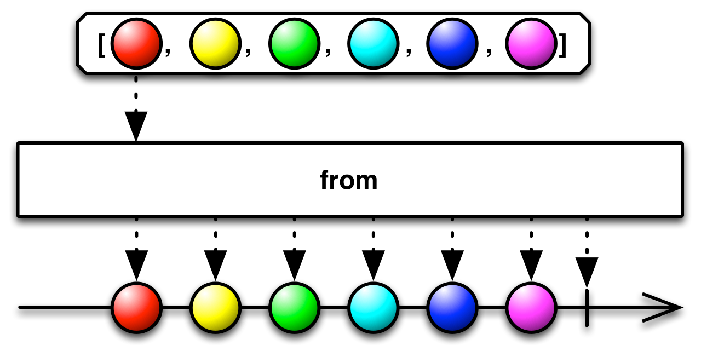

## 响应式编程之 ReactiveX 
### 简介

[ReactiveX](https://reactivex.io/)，通过`流` (streams) 、`可观察对象` (observables) 和`操作符` (operators) 完成对`响应式编程`的一种实现，具有多种语言实现，包括 RxJs、RxJava、Rx.NET、RxPy 和 RxSwift。

ReactiveX 是一种使用`可观察流` (observable streams) 进行[异步编程](https://en.wikipedia.org/wiki/Asynchronous_programming)的 API 。

`可观察流`类似`事件发射器` (event emitters)，可以发出三个事件：`下一个` (next)、`错误` (error) 和`完成` (complete) 。

一个 `observable` 会一直发出 next 事件，直到它发出 error 事件或 complete 事件。但是，此时它不会再发出任何事件，除非它再次被订阅 (subscribed) 。

ReactiveX 结合了`观察者`模式和`迭代器`模式以及`函数式编程` (主要指：[集合管道模式](/articles/programmin-pattern-collection-pipeline/)) 的优秀特性。

下面以 Javascript 版本的 `RxJs` 进行讲解，它被称为事件的“Lodash”。

### 通知

#### Observable 通知

 `Observable` 通过以下通知 (Notifications) 与它的 `Observer(s)` 通信：

* `OnNext`：将 Observable 发出的项目传达给 Observer；
* `OnCompleted`：表示 Observable 已成功完成，它将不再发射任何项目；
* `OnError`：表示 Observable 已因指定的错误条件而终止，并且它将不再发出任何项目；
* `OnSubscribe` (可选)：表示 Observable 已准备好接受来自观察者的请求通知。

在 RxJs 中，Observable 通过下面方式通知 Observer：

``` js
// 发送下一个项目
observer.next(value)
// 发送失败通知
observer.error(err)
// 发送完成通知
observer.complete()
```

#### Observer 通知

 `Observer` 通过以下通知与其 `Observable` 进行通信：

* `Subscribe` ：表示 Observer 准备好接收来自 Observable 的通知；
* `Unsubscribe` ：表示 Observer 不再想接收来自 Observable 的通知；
* `Request` (可选)：表示 Observer 希望来自 Observable 的额外 `OnNext` 通知不超过指定数量。

在 RxJs 中，Observer 通过下面方式通知 Observable：

``` js
// 订阅
observable.subscribe()
// 取消订阅
observable.unsubscribe()
```

#### 约定下治理通知

一个 Observable 可以发出零个或多个 `OnNext` 通知，每个通知代表一个发射的项目，然后它可以通过 `OnCompleted` 或 `OnError` 通知跟随这些发射通知，但不能同时发出。

在发出 `OnCompleted` 或 `OnError` 通知后，它可能不会再发出任何进一步的通知。

Observable 可能根本不发出任何项目。

Observable 也可能永远不会以 `OnCompleted` 或 `OnError` 通知来终止。也就是说，Observable 不发出通知、只发出 `OnCompleted` 或 `OnError` 通知或只发出 `OnNext` 通知是合适的。

Observables **必须**`串行` (而不是并行) 向观察者发出通知。他们**可能**会从不同的`线程`发出这些通知，但通知之间必须有正式的[Happened-before](https://en.wikipedia.org/wiki/Happened-before)关系。

> Happened-before 表示两个事件的结果之间的关系，因此如果一个事件应该在另一个事件之前发生，则结果必须反映这一点，即使这些事件实际上是无序执行的 (通常是为了优化程序流程) 。

### Observable 和 Observer

观察者 (Observer) 订阅一个可观察 (Observable) 序列，该序列通常通过调用提供的`回调函数`发送项目 (Item) 给 observer。

如果许多事件异步进入，它们**必须**存储在队列中或丢弃。在 ReactiveX 中，observer 永远不会被乱序的项目调用或 (在多线程上下文中) 在回调返回前一个项目之前调用。异步调用保持异步，可以通过返回一个 observable 来处理。

它类似于`迭代器模式`，如果发生致命错误，它会单独通知 observer (通过调用第二个函数) 。当所有项目都发送完毕后，它就完成了 (并通过调用第三个函数通知 observer) 。Reactive Extensions API 还从其他编程语言的迭代器操作符中借用了许多操作符。

#### Observable 的终止

如果一个 Observable 未曾发出一个 `OnCompleted` 或 `OnError` 通知，那么一个 observer 可能认为该 Observable 仍然是`活跃状态的` (即便当前没有发送项目) ，并且可能发给它一些通知 (例如：取消订阅或请求的通知) 。

当一个 Observable 发出一个 `OnCompleted` 或 `OnError` 通知时，Observable 可能会释放其资源并终止，并且它的 observers 不应尝试与它进一步通信。

 `OnError` 通知**必须**包含错误的原因 (也就是说使用 `null 值` 调用 OnError 是无效的) 。

在 Observable 终止之前，它**必须**首先向订阅它的所有 observers 发出 `OnCompleted` 或 `OnError` 通知。

#### Observer 的订阅和退订

Observable 可以在 Observable 收到观察者的`订阅` (Subscribe) 通知后，立即开始向该观察者发出通知。

当观察者向 Observable 发出`取消订阅` (Unsubscribe) 通知时，Observable 将尝试停止向它发出通知。但是，**不能**保证 Observable 在观察者发出`取消订阅`通知后不会再向观察者发出任何通知。

当 Observable 向其观察者发出 `OnError` 或 `OnComplete` 通知时，这将`结束订阅`，而观察者**不再需要**以发出取消订阅通知这种方式来结束订阅。

#### 多个 Observers

如果`第二个` observer 订阅了一个已经在向`第一个` observer 发送项目的 Observable，那么 observer 会接收到什么项目将由 Observable 来决定。

Observable 来决定它是否会向每个 observer 发送相同的项目 (items) ，或是否会从头到尾重播的完整项目序列给`第二个` observer，又或者它是否会向`第二个` observer 发出完全不同的项目序列。

**不能**保证同一个 Observable 的两个观察者会看到相同的项目序列。

#### “Hot” 和 “Cold” Observables

Observable 什么时候开始发射它的项目序列？这取决于 Observable。

Hot 的 Observable 可能会在创建后立即开始发射项目，因此任何后来订阅该 Observable 的观察者都可以`在中间的某个位置开始观察序列`。

另一方面，一个 Cold 的 Observable 会等到 Observer 订阅它之后才开始发射项目，因此这样的 Observer 可以保证`从一开始就看到整个序列`。

在 ReactiveX 的一些实现中，还有一个叫做 `Connectable 的 Observable` 。这样的 Observable 在调用其 `Connect` 方法之前不会开始发射项目 ，无论是否有任何 Observer 订阅了它。

#### 通过 Observable 操作符组合

Observables 和 Observables 只是 ReactiveX 的开始。它们本身只不过是`标准观察者模式`的`轻微扩展`，更适合处理一系列事件而不是单个回调。

ReactiveX 的`真正能力`是允许您**转换** (transform) 、**组合** (combine) 、**操作** (manipulate) 和使用 Observables 发出的项目序列的操作符。

这些 Rx 操作符允许您以`声明` (declarative) 的方式将`异步序列`组合在一起，具有回调的所有效率优势，但没有`嵌套回调处理程序`通常与异步系统相关联的弊端。

### 背压 (Backpressure)

在软件世界中，`背压`是从流体动力学中借用的概念。

在[WIKI 百科](https://en.wikipedia.org/wiki/Back_pressure)上定义为：

> 背压是与通过管道的所需流体流动相反的阻力或力，导致摩擦损失和压降。

在软件的上下文中，可以调整定义以引用软件内的数据流：

> 与期望相反的阻力或力量经过软件的数据流。

背压并不是一种「机制」，也不是一种「策略」，是一种现象：**在数据流从上游生产者向下游消费者传输的过程中，上游生产速度大于下游消费速度，导致下游的 Buffer 溢出，这种现象就叫做 `backpressure` 溢出**。

#### 背压策略

* 控制生产者 (减速/加速由消费者决定)
* 缓冲区 (临时累积传入数据峰值)
* 丢弃 (对传入数据的百分比进行采样)

> 从技术上讲，还有第四种选择——`忽略背压`——老实说，如果背压没有引起严重问题，这不是一个坏主意。引入更多复杂性也是有代价的

#### ReactiveX 中的背压

背压是可选的，并非所有的 ReactiveX 实现都包含背压，并且在那些实现中，并非所有的 Observable 或操作符都支持背压。

如果 Observable 检测到其观察者实现了 `Request` 通知并理解 `OnSubscribe` 通知，则它可能会背压。

如果 Observable 实现了背压并且其观察者使用了背压，则 Observable 不会在订阅后立即开始向观察者发送项目。相反，它将向观察者发出 `OnSubscribe` 通知。

在收到 `OnSubscribe` 通知后的任何时候，观察者都可以向其订阅的 Observable 发出 `Request` 通知。此通知请求特定数量的项目。

Observable 通过向观察者发出的项目不超过观察者请求的项目数来响应这样的请求。然而，Observable 还可以发出 `OnCompleted` 或 `OnError` 通知，它甚至可以在观察者请求任何项目之前发出这样的通知。

未实现背压的 Observable 应通过发出指示不支持背压的 `OnError` 通知来响应来自观察者的 `Request` 通知。

 `Requests` 是累积的。例如，如果观察者向 Observable 发出三个 `Request` 通知，分别针对 3、5 和 10 个项目，则该 Observable 可能会向观察者发出多达 18 个项目，无论这些 `Request` 通知何时到达相对于 Observable 发出的时间作为回应的项目。

如果 Observable 产生的项目比观察者请求的多，则取决于 Observable 是否会丢弃多余的项目，将它们存储以稍后发出，或者使用其他策略来处理`溢出` (overflow) 。

#### 拉取 vs 推送

`拉取` (Pull) 和`推送` (Push) 是两种不同的协议，用来描述数据`生产者` (Producer) 与数据`消费者` (Consumer) 之间如何进行通信的。

|通信方式|生产者|消费者|
|-|-|-|
|Pull|被动 (Passive) ：在请求时产生数据。|主动 (Active) ：决定何时请求数据。|
|Push|主动 (Active) ：按照自己的节奏产生数据。|被动 (Passive) ：对接收到的数据做出反应。|

**什么是推送**？在推送系统中，生产者决定何时向消费者发送数据，而消费者不知道何时会收到该数据。

 `Promise` 是当今 JavaScript 中最常见的`推送系统类型`。Promise (生产者) 向注册的回调 (消费者) 传递解析值，但与函数不同的是，Promise 负责准确确定何时将该值“推送”到回调。

### 操作符

Reactive X 里的操作符 (operator) 本质上是一个`纯函数` (pure function)，它`接收一个 Observable 作为入参`，并生成一个`新的 Observable 作为出参`。它将一个 observable (`源`) 作为其`第一个参数`并返回另一个 observable (`目标`或`外部`可观察对象) 。

``` js
function myOperator(observable) {
  // ...
  return newObservable
}
```

#### 弹珠图

要解释操作符是如何工作的，文字描述通常是不足以描述清楚的。许多操作符都是跟时间相关的，它们可能会以不同的方式`延迟` (delay) 、`取样` (sample) 、`节流` (throttle) 或`去抖`动值 (debonce) 。

图表通常是更适合的工具。`弹珠图` (Marble diagrams) 是操作符运行方式的视觉表示，其中包含`输入` Obserable(s) (输入可能是多个 Observable )、`操作符及其参数`和`输出` Observable 。

在下图中可以看到解剖过的弹珠图。


在 RxJs 中内置了一些操作符，比如 `map(...)`、`filter(...)`、`merge(...)` 等等。

> 操作符是函数，它基于当前的 Observable 创建一个新的 Observable。这是一个`无副作用`的操作：前面的 Observable 保持不变。

你可以自定义一个操作符：

``` js
const rxjs = require("rxjs");

function counter(input) {
  let output = rxjs.Observable.create(function subscribe(observer) {
    input.subscribe({
      next: (number) => observer.next(number + 1),
      error: (err) => observer.error(err),
      complete: () => observer.complete()
    });
  });
  return output;
}
```

使用该操作符：

``` js
// input 是个 observable
let input = rxjs.from([1, 2, 3, 4]);
// output 是个新的 observable
let output = counter(input);

output.subscribe((x) => console.log(x));
```

输出：

``` bash
2
3
4
5
```

#### 链式调用

大多数操作符对 Observable 进行操作并返回一个新的 Observable。这允许您在一个链中一个接一个地应用这些操作符。

还有其他模式，例如 Builder 模式，其中特定类的各种方法通过方法的操作修改该对象来操作同一类的项目。这些模式还允许您以类似的方式链接方法。

但是在 Builder 模式中，方法出现在链中的顺序通常并不重要，但 Observable 操作符的`顺序很重要`。

一连串的 Observable 操作符不会独立地对起源于该链的原始 Observable 进行操作，而是`轮流`操作，每个操作符都对链中前一个操作符生成的 Observable 进行操作。

在 RxJs 7.2 版本后，以前在 `rxjs/operators` 里的操作符直接改为由 `rxjs` 导出，并且提供了`管道`操作符来支持链式调用：

``` js
const { map, reduce } = require("rxjs");
const rxjs = require("rxjs");
let sourceObservable = rxjs.from([1, 2, 3, 4, 5]);
sourceObservable.pipe(
    map(function(number) { return number * 2; }),
    reduce(function(sum, number) { return sum + number; }, 0) 
  )
  .subscribe(function(number) {
    console.log(number);
  }, function(error) {
    console.error(error);
  }, function() {
    console.log('done');
  })
```

输出：

``` bash
30
done
```

 `pipe` 是 observable 的一个方法，我们看下源码实现：

``` js
  ...
  pipe(...operations) {
      if (operations.length === 0) {
          return this;
      }
      return pipeFromArray(operations)(this);
  }
  ...
```

我们发现 `pipeFromArray` 是一个`柯里化函数`，这是函数式编程的一个特征。

接下来，在 `es6/util/pipe.js` 中，我们找到 `pipeFromArray` 的实现：

``` js
import { noop } from './noop';
/* tslint:enable:max-line-length */
export function pipe(...fns) {
    return pipeFromArray(fns);
}
/* @internal */
export function pipeFromArray(fns) {
    if (!fns) {
        return noop;
    }
    if (fns.length === 1) {
        return fns[0];
    }
    return function piped(input) {
        return fns.reduce((prev, fn) => fn(prev), input);
    };
}
```

 `piped` 是个函数，它的入参 `input` 也是我们的 `sourceObservable`，出参也是个 observable，所以也是个操作符。

 `map(function(number) { return number * 2; })` 和 `reduce(function(sum, number) { return sum + number; }, 0)` 都会返回一个操作符 (函数) ，同样他们以 observable 作为入参，并返回一个新 observable。

#### 创建 observable

然后对于源 observable 发出的每个项目，它会对该项目应用一个函数，然后在目标 Observable 上发出它。它甚至可以在目标 observable 上发出另一个 observable。这称为`内部可观察对象`。

在 RxJs 中有多种方式创建 observable。

通过 `create` 方法创建 observable：

``` js
const rxjs = require("rxjs");
let observable = rxjs.Observable.create(function (observer) {
   observer.next();
});
```

一个格式良好 (well-formed) 的有限 (finite)  Observable，**必须**尝试精准地调用 observer 的 `onCompleted` 或 `onError` 的其中一个方法`一次`，并且此后**禁止**尝试调用 observer 的任何其他方法。

通过 `from` 方法将一些其他对象或数据结构转换为 observables：

``` js
const rxjs = require("rxjs");
let observable = rxjs.from([1, 2, 3, 4]);
```



### 调度器

如果你想在你的 Observable 操作符级联中引入`多线程`，你可以通过指示这些操作符 (或特定的 Observables) 对特定的`调度器` (Schedulers) 进行操作来实现。

在支持多线程语言的实现中 (例如：Rx.NET) ，`调度器`允许你调度繁重的工作给一个`线程池`或者`专门的线程`，并且在 `UI 线程` 运行最后的订阅 (subscription) ，从而更新 UI。

在 RxJs 中，实际上很少需要担心大多数方法的调度器参数。由于 JavaScript 本质上是`单线程`的，因此调度选项并不多，默认调度程序通常是正确的选择。

#### RxJs 中的调度类型

|调度器|目的|
|-|-|
|null|通过不传递任何调度程序，通知`以同步和递归方式传递`。将此用于`恒定时间` (constant-time) 操作或`尾递归` (tail recursive) 操作。|
|queueScheduler|在当前`事件帧` (event frame)  (蹦床[trampoline]调度器) 中的队列上调度。将其用于`迭代`操作。|
|asapScheduler|在`微任务` (micro task) 队列上调度，这与用于承诺的队列相同。基本上在当前工作之后，但在下一个工作之前。将此用于`异步转换` (asynchronous conversions) 。|
|asyncScheduler|使用 `setInterval` 调度。将此用于`基于时间`的操作。|
|animationFrameScheduler|安排将在下一次浏览器内容`重绘之前`发生的任务。可用于创建流畅的浏览器动画。|

例子：

``` js
const { Observable, observeOn, asyncScheduler } = require("rxjs");

const observable = new Observable((observer) => {
  observer.next(1);
  observer.next(2);
  observer.next(3);
  observer.complete();
}).pipe(observeOn(asyncScheduler));

console.log("just before subscribe");
observable.subscribe({
  next(x) {
    console.log("got value " + x);
  },
  error(err) {
    console.error("something wrong occurred: " + err);
  },
  complete() {
    console.log("done");
  }
});
console.log("just after subscribe");
```

输出：

``` bash
just before subscribe
just after subscribe
got value 1
got value 2
got value 3
done
```

参考资料：

\> [https://medium.com/@jayphelps/backpressure-explained-the-flow-of-data-through-software-2350b3e77ce7](https://medium.com/@jayphelps/backpressure-explained-the-flow-of-data-through-software-2350b3e77ce7)

\> [https://blog.csdn.net/weixin_47898971/article/details/121606582](https://blog.csdn.net/weixin_47898971/article/details/121606582)

\> [https://stackoverflow.com/questions/28145890/what-is-a-scheduler-in-rxjs](https://stackoverflow.com/questions/28145890/what-is-a-scheduler-in-rxjs)
