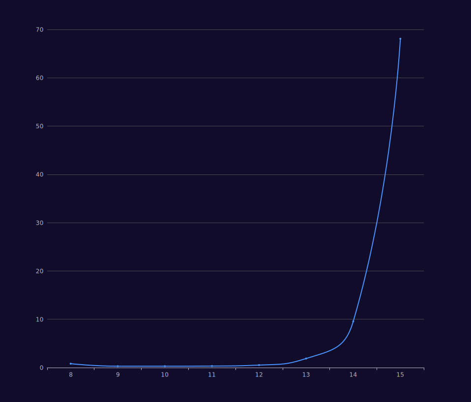
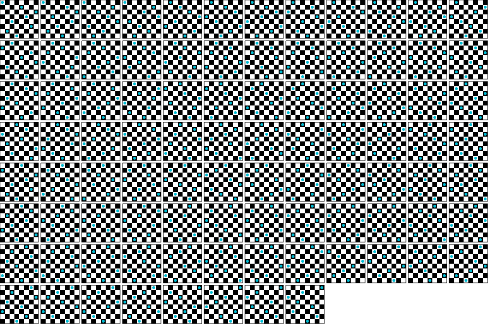

## 回溯算法用例：八皇后疑惑 
### 问题描述

**Q:** 在 `8×8` 格的国际象棋上摆放`8`个皇后，使其不能互相攻击，即任意两个皇后都不能处于同一行、同一列或同一斜线上，问有多少种摆法？

八皇后疑惑 (eight-queens-puzzle) 是由国际西洋棋棋手马克斯·贝瑟尔于 1848 年提出的问题，`回溯算法`的经典用例。

数学家`高斯`认为有76种方案。1854 年在柏林的象棋杂志上不同的作者发表了`40`种不同的解，后来有人用`图论`的方法解出`92`种结果，这也是最终答案。

如果经过 ±90 度、 ±180 度旋转，和对角线对称变换的摆法看成一类，共有`42`类。

计算机发明后，有多种计算机语言可以编程解决此问题。

该问题是求问题的可行解，只要满足约束条件的解都是可行解。

### 求解方法

`穷举法`：如果尝试`穷举`所有可能性，利用数学组合会有 $8^8 = 16777216$ 种，这种方式每个皇后在每个人格子都会尝试过一次，极为低效。即便在摆放位置时发现条件不成立，依然会继续摆放。

`回溯法`：回溯是穷举的`优化版本`，回溯会分步解决问题，当在解决问题过程中，发现条件不成立会取消上一步甚至上几步的计算，再通过其它可能的分步再次尝试寻找问题解。

上面的方式都是`暴力搜索法`的方式，对于小规模的数据来说，这种方式较为划算。

### 回溯算法

我们采用回溯法 (Backtracking Algorithm) 来解决，回溯本质是`暴力搜索法`的一种，在最坏的情况下，回溯法会导致一次复杂度为指数时间的计算。

在使用`回溯`来解决八皇后疑惑时，我们需要明确几个问题：

**Q：子问题是什么？**

 A：回溯经常使用递归来处理子问题，当递归结束也就意味着我们解决了所有子问题，也就解决了**八皇后疑惑**。所以我们的子问题:

* 当前步骤的摆放位置是否不符条件：
  * 若不符合，则不再继续子问题；
  * 若符合，则继续执行子问题。

形式化表示：

``` text
Backtrack(x)
    if x is not a solution
        return false
    if x is a new solution
        add to list of solutions
    backtrack(expand x)
```

**Q：子问题的输入输出是什么？**

A：每个子问题必要`输入`有：棋盘大小、当前遍历的步骤索引以及被记忆的符合条件的皇后位置信息。而`输出`只有一个 boolean 值，用于递归边界判断。

**Q：首要遍历的对象是什么？**

A：我们首要遍历的对象是棋盘行数，对于 n 皇后问题，我们将一个皇后在首列依次按行摆放，其余 n - 1 个皇后在剩余的列数中依次尝试摆放。

> 递归使我们解决问题的逻辑更加清晰，但它不是实现回溯算法必要的技巧。任何递归都可以转换为循环遍历。当数据规模过大时，递归较为容易造成编译器的栈溢出错误。

### 算法实现

我们算法的`目标`是找出每一种符合规则的`8`个皇后位置，并在控制台显示出来。

为了实现这一目标，会用到几个变量：

* `board` ：符合规则的 8 个皇后的位置信息，其类型是一维数组；
* `size` ：棋盘的尺寸大小，例如：size = 1 就表示棋盘为 8x8 大小；
* `output` ：输出结果，其类型是二维数组。

下面代码演示了查找符合规则的情况:
  
``` javascript
function calcQueens(size) {
  const output = [];
  subquestion(new Array(size).fill(-1), 0, size, output)
  if (output.length === 0) {
    console.log('无解！')
  } else {
    console.log(`一共有${output.length}种解法`)
  }
}

function subquestion(board, currentColumn, size, output) {

  // 结束
  if (currentColumn === size) {
    output.push(JSON.parse(JSON.stringify(board)))
    return
  }

  // 遍历当前列的每一行，检测每一行是否与前面的皇后位置冲突
  for (let i = 0; i < size; i++) {
    // 存储皇后位置
    board[currentColumn] = i

    // 检测当前列是否冲突
    if (noConflicts(board, currentColumn)) {
      // 继续下一列的遍历
      let done = subquestion(board, currentColumn + 1, size, output)
      if (done) return true
    }
  }
  return false
}

function noConflicts(board, currentColumn) {
  // 皇后的位置信息，查看每个皇后是否与
  for (let i = 0; i < currentColumn; i++) {
    // 首先检测【皇后的位置】是否和【当前列皇后位置】同行。若同行，则冲突
    if (board[i] === board[currentColumn]) return false
    // 其次，如果【当前列皇后位置】和【遍历的皇后位置】纵横差相等，则冲突
    if (currentColumn - i === Math.abs(board[currentColumn] - board[i])) return false
  }
  return true
}

calcQueens(8)
```

### 精简算法代码

``` javascript
function queen(a, cur) {
  if (cur === a.length) {
    console.log(a)
    return
  }
  for (let i = 0; i < a.length; i++) {
    a[cur] = i
    let flag = true
    for (let j = 0; j < cur; j++) {
      let ab = i - a[j]
      if (a[j] == i || (ab > 0 ? ab : -ab) == cur - j) {
        flag = false
        break
      }
    }
    if (flag) {
      queen(a, cur + 1)
    }
  }
};
queen([1, 1, 1, 1, 1, 1, 1, 1], 0)
```

绝对值函数改为手写判断，同时不再使用全称变量名，更适用于作为`小规模数据`的运算方法。

### 时间复杂度

回溯本质也是暴力搜索的一种，所以八皇后问题衍生为 n 皇后问题后的时间复杂度为 $O(n!)$。

下面是在个人普通笔记本 node 环境执行`8 ~ 15`棋盘大小的执行时间：

``` bash
➜  algorithms-case git:(main) ✗ yarn start
yarn run v1.22.10
$ node n-queens.js
一共有92种解法
✨  Done in 0.81s.

一共有352种解法
✨  Done in 0.29s.

一共有724种解法
✨  Done in 0.29s.

一共有2680种解法
✨  Done in 0.32s.

一共有14200种解法
✨  Done in 0.52s.

一共有73712种解法
✨  Done in 1.88s.

一共有365596种解法
✨  Done in 9.57s.

一共有2279184种解法
✨  Done in 68.08s.
```

我们通过曲线图可以看到变化曲度：



如果使用递归，在执行 16 大小的时候，直接发生`内存溢出`。

``` bash
<--- JS stacktrace --->

==== JS stack trace =========================================

Security context: 0x116ce259e6e9 <JSObject>
    0: builtin exit frame: stringify(this=0x116ce2591a21 <Object map = 0x116c102842a9>,0x116c7ec026f1 <undefined>,0x116c7ec026f1 <undefined>,0x116c3010db89 <JSArray[16]>,0x116ce2591a21 <Object map = 0x116c102842a9>)

    1: arguments adaptor frame: 1->3
    2: subquestion [0x116c3010db29] [/Users/lumin/lumin.git.repo/algorithms-case/n-queens.js:~14] [pc=0xdf62c8ecc1a](this=0x116c8128d481 <JSGlob...

FATAL ERROR: Ineffective mark-compacts near heap limit Allocation failed - JavaScript heap out of memory
```

V8 对于内存的使用有严格的限制，16 的数据规模消耗的内存已经超标。

你可以手动设置内存使用大小:

``` bash
node --max-old-space-size=4096 yourFile.js
```

### 示例代码

演示代码地址：[https://github.com/dun-cat/algorithms-case](https://github.com/dun-cat/algorithms-case)

你可以通过运行下面的命令获得一张格式为 `svg` 的结果图：

``` bash
npm run n-queens
```



上图展示了 8 皇后疑惑的所有一共`92`种解。

如果你阅读过演示代码，很容易知道如何修改图片生成配置 (列数，单个解的大小等等) ，以及生成 n 皇后的结果图，希望你有个愉快的视觉体验。

这里还有一个演示 n 皇后的计算可视化工具，清晰演示了遍历过程： <https://algorithm-visualizer.org/backtracking/n-queens-problem>
