## 如何使用 NestJS 开发后端应用 - PPT 分享 
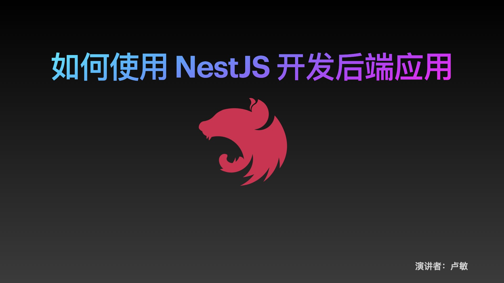

### Nest 是什么？

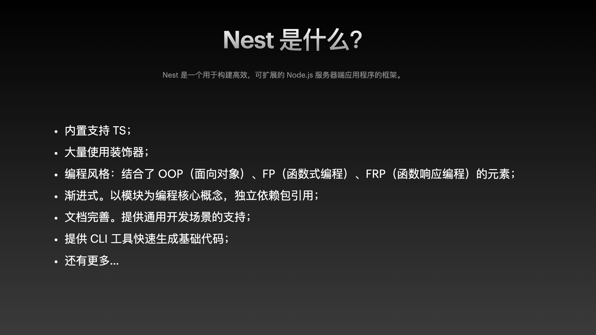

编程风格：OOP 的法则，设计出松耦合、更优良的程序。SOLID（单一功能、开闭原则、里氏替换、接口隔离以及依赖反转）基本原则。

多种编程范式意味着会有比较多的编程概念。Nest 在某些功能会使用 RxJs 库，它是一个响应式编程的库，它使编写异步或基于回调的代码更容易，包括 Nest 微服务之间的通信实现。

大量使用装饰器：权限系统对接（自定义装饰器结合反射）、接口 API 的使用 class-validator 类验证器、控制器（路由）。

渐进式：Nest 的官方仓库使用 Lerna 来管理，所以依赖包都在 @Nest scope 下引入。

文档完善： 国内有支持 nest 的中文文档，8 版本，不过没有类目。

CLI工具：快速生成基础代码；也可以克隆官方的启动项目

### 哲学

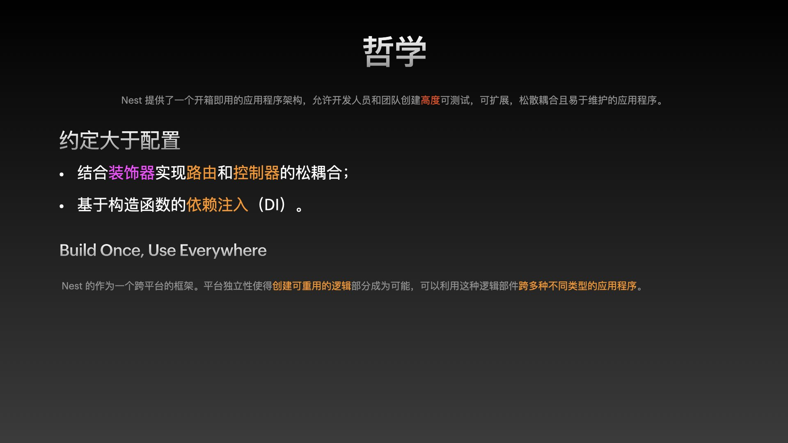

约定大于配置：通常有人会误解这句话，这种约定并非自定义约定，而是建立在已有的技术或固有设计上。这个 Java 的 spring 框架有相同的哲学。

国内阿里有个 egg 框架，在它的首页设计原则也提到了“约定优于配置”。

以及他们实现这原则的原话是：根据功能差异将代码放到不同的目录下管理，对整体团队的开发成本提升有着明显的效果。Loader 实现了这套约定。

例子：

1. 利用装饰器实现路由 和 控制器的解绑。
   1. 在 egg 在官方文档上代码示例是需要单独写路由配置的，来控制器建立映射的；
2. 基于构造函数的依赖注入
   1. 依赖注入是一种设计模式，nest 里通过控制反转（IoC）技术来实现的，用于把实例注入到类中，这个实例通常是提供者（Providers）；
   2. 传统类内部主动创建依赖对象，而 IOC 创建和查找依赖对象的控制权交给了容器，由容器进行注入组合对象，所以对象与对象之间是 松散耦合。在 Nest 里这个容器就是它的运行时系统；
   3. 在前端领域，AngularJs 是实现依赖注入的鼻祖。在 Nest 里可以看到 service 在使用上和 angular 是一样的。

Build once，use everywhere

这句话翻译成中文有点土，还是用原来的英文。

1. 例如，多数模块可以在不修改的情况下复用于不同的 HTTP 服务器框架（例如 Express 和 Fastify ）。沿袭了 express 的接口。
2. 项目模块抽离，用户中心。用户的身份认证。

### 基本概念

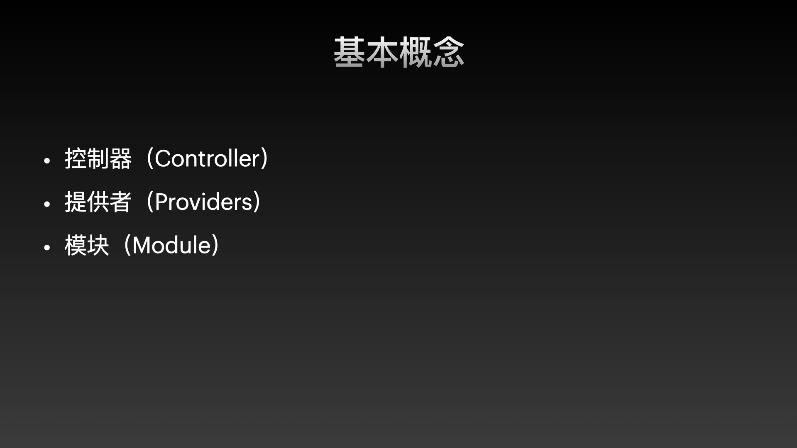

这三个概念是开发基本概念，对于一个 web 应用大部分时间都在针对它在编程。

`控制器`：对外暴露行为接口，构建应用对外服务的窗口。

`提供者`：Service 只是其中一以类作为 provider，还支持普通值、类、异步函数或同步工厂。

`模块`：默认情况下，模块是单例的，所以可以放心大胆的使用依赖注入的方式引入。

### 控制器（Controller）

通常后台开发会分为： Controller 层、Service 层、Mapper 层，Controller 负责业务逻辑、Service 作为低层次服务、Mapper 就是 ORM，把实体对象映射到数据库表。当然这些都是逻辑分类，并非强约束，只是目前主流开发形态会是这样的。

Nest 在框架实现上也符合这样的分层架构，对于做过 spring 开发的同学会一目了然，心领神会。

目前，我们基于 nest 开发的 Node 后台服务，在 ORM 选型时使用的是 TypeORM，其实还有 Sequelize 可以作为备选。相对 Sequelize 而言， TypeORM 官方对装饰器支持，使得它使用起来更为舒适。

#### 装饰器的应用

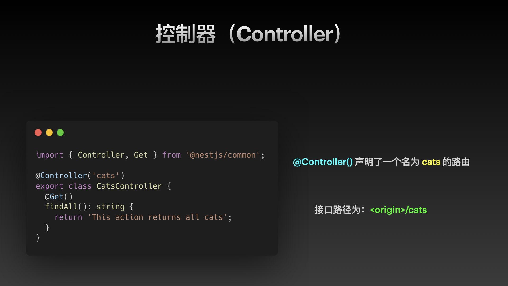

这是一个最简单的 Controller ，这里会用到  Controller 和 Get 装饰器。

在没有设置全局路由前缀的情况下，默认路径是这个。

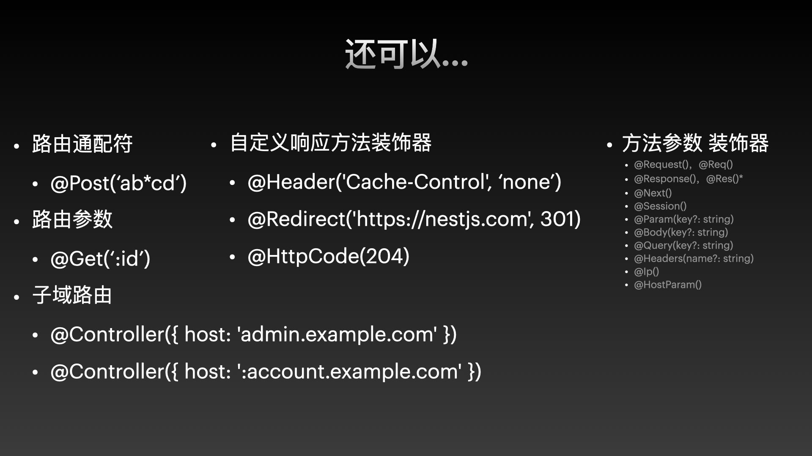

除此之外，Nest 还提供了较为完善的装饰器，并对底层 HTTP 平台（例如，Express 和 Fastify）之间的类型兼容。

Express 大家应该比较熟悉，前端很多工具都用它作为代理服务工具。包括 webpack 的 webpack-dev-server。

response 和 request 实例对象，其实都兼容 express 的对象接口，所以在编写 ts 类型的时候，可以直接引用 express 或者 fastify 的 types。

对于 http 协议请求方法类型支持的方法装饰器都支持的，除了这里的 post、get，像 delete、put 装饰器都可以直接使用。

因为装饰器的应用是一种申明式，所以在阅读代码时，代码会比较清晰和简练。

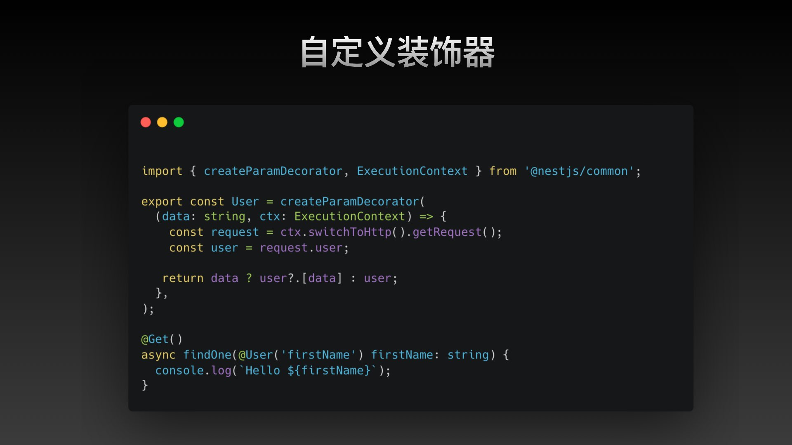

自定义装饰器一个非常实用的场景是用户认证信息的读取。

Nest 通过 passport 库，作为其验证模块，所以用户身份信息会附加到 request 实例上。那么我们可以封装一个用户信息的装饰器可以方便直接使用。

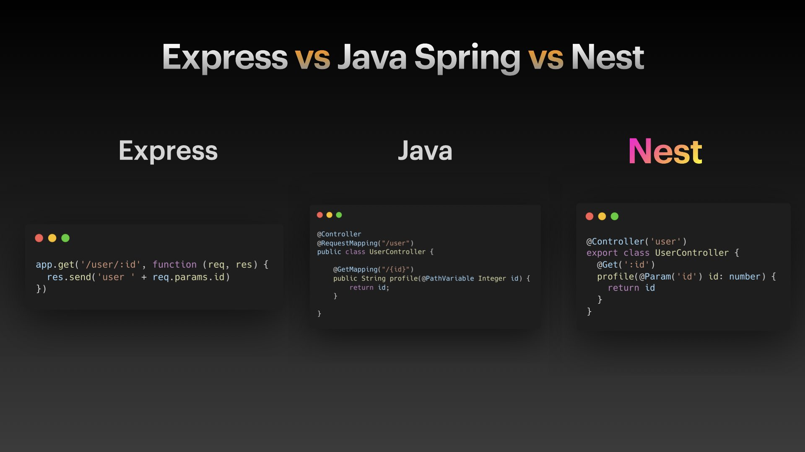

我们拿 Nest 和 Express 以及 Java Spring 做下对比。

可以看到  Nest 的装饰器（Decorator）使用和在 Java 中被叫做“注解”（Annotation）的使用基本是相同的。

所以哪天 Java 转 Node ，或 Node 转 Java，Nest 或许是一个不错的铺垫。

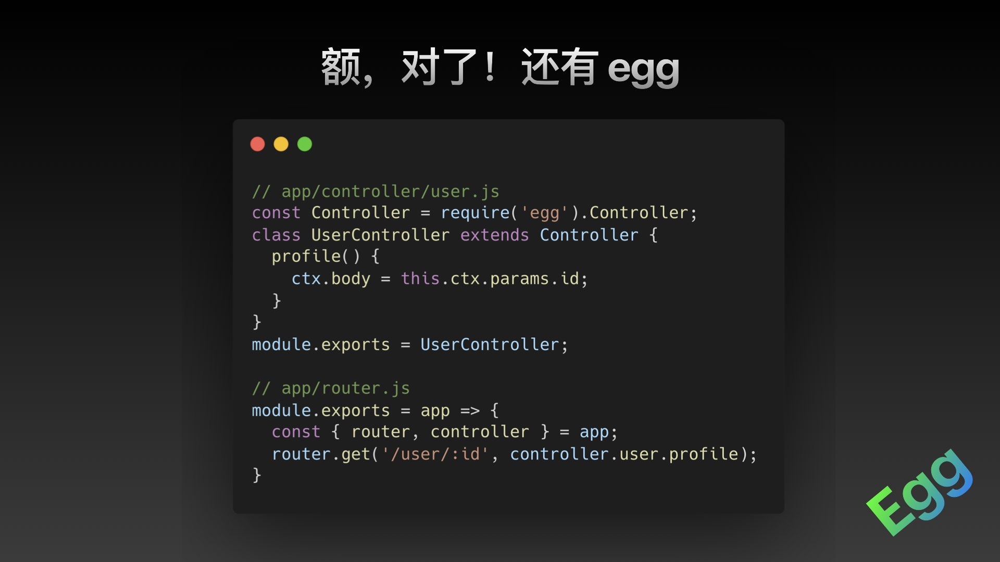

可以看到 egg 里 Router 和 Controller 还是缺少一定约定的。

如果我需要把 User 模块剥离出去，关注点一定是离不开它的 Router 配置。

### 提供者（Providers）

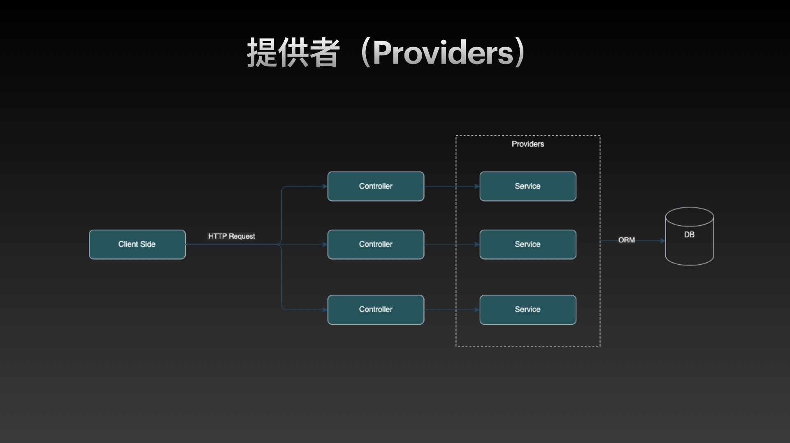

Provider 是 Nest 框架的核心概念之一，因为 Nest 模块的功能都是通过 Provider 来提供的。

正因为 Provider 约束的功能的实现接口化，使得 Nest 模块化及依赖注入的实现变成容易。

前面提到 Service 只是其中一以类作为 provider，还支持`普通值`、`异步函数`或`同步工厂`。

Provider 作为功能的体现，其实现方式一定是多样的，Nest 提供了多种 Provider 实现方式的接口。

#### useValue

使用 useValue 可以给未实现的服务提供一个 mock 常量值

#### useFactory

通过工厂模式可以动态创建 provider，并且提供了 inject 属性接收一组提供者。让 Nest 在实例化过程中解析并作为参数传递给工厂函数。

同时，我们可以看到， provider 的 provide 和 inject 属性除了使用类名以外，还可以使用依赖注入令牌（DI Token）。除此之外 module 的 exports 属性也可以使用 DI 令牌哦。

这意味着在 Provider 里无需引入 database  provider 实例，直接通过令牌注入即可，非常舒适。

但是，你仍然需要在模块里通过 exports 属性引入 DatabaseModule，因为 Nest 使用模块化的概念。

### 模块（Module）

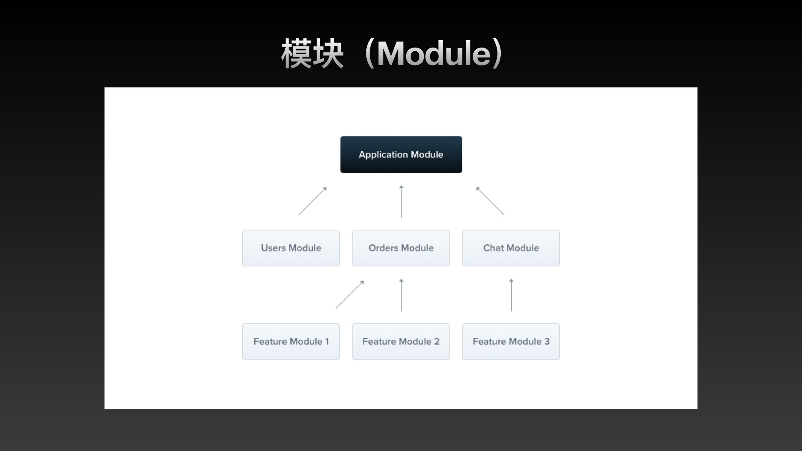

Module 是 Nest 的核心概念。它是整个框架在实现上解耦的关键部件。

每个应用程序至少有一个模块，一个根模块。根模块是 Nest 用来构建应用程序图的起点。

虽然理论上非常小的应用程序可能只有根模块，但这不是典型的情况。我们要强调的是，强烈建议将模块作为组织组件的有效方式。

对于大多数应用程序，最终的架构将采用多个模块，每个模块都封装了一组密切相关的功能。

模块使整个应用架构清晰可见，其依赖关系显式透明。

#### 模块化编程

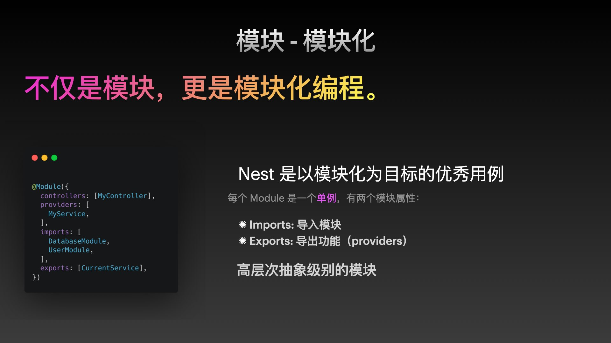

Nest 的模块概念其实是一种`模块化编程`（Modular Programming）概念的实现。

模块化编程是一种编程范式，尤其和面向对象编程有着紧密关系（但不能混为一谈哦）。面向对象编程通常讲究低耦合高内聚，而模块化编程在于分解大型软件程序，分成更小的部分，使整个架构的部件具备很高的可重用性，这大大降低耦合性，并且其有自己的发展历史。“模块化编程”一词至少可以追溯到 1968 年 7 月由拉里康斯坦丁在信息和系统研究所组织的全国模块化编程研讨会；

#### 模块的导入导出

与模块化紧密的两个概念是`信息隐匿`和`关注点分离`。每个模块对外暴露的功能都必须通过 module 的  exports 来指定，相当于高层次抽象级别的接口暴露。

当我们通过 imports 属性引入一个模块 A 时，我们需要通过 A 模块的 exports 属性来了解其暴露的功能（provider），其未在 exports 指定的，不可访问。

使用模块化很重要的原因是需要显式暴露功能，隐匿不需要对外开放的功能。

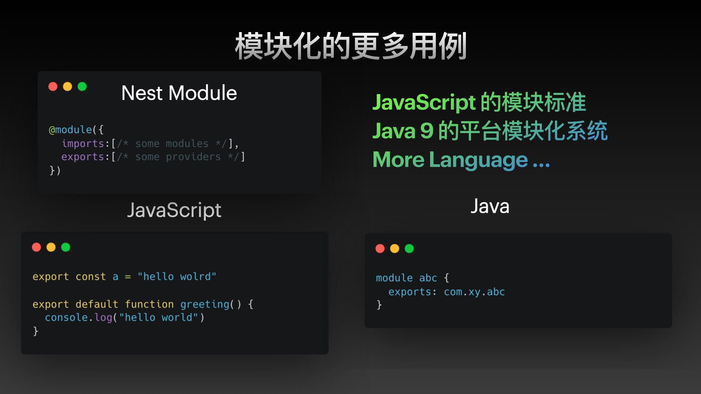

#### 模块化的更多用例

在 ES6 开始，JavaScript 原生支持了模块的使用，它规范了编码约定和编程习惯。我们再也不用关系全局变量污染的问题。任何对外暴露的函数、变量都通过 export 语法来实现。

17 年 Java 在 版本 9 开始，引入了平台模块系统，其一个模块由包的集合组成，所以它的模块规模更大。你可以通过 module-info.java 文件的 module 来声明模块。

虽然不同语言的实现模块化的规模和方式不同，但可以看出他们都按照定义了模块接口用于实现模块化，而 Nest 框架的 module 同样循序这一准则。

如果你能理解模块化带来的好处，那么就能理解 Nest 的 Module 所实现的，正是这种面向领域实现的高层次模块化编程概念。

严格使用定义明确的模块化接口，它带来的是离散的可扩展和可重用模块。

### 依赖注入（Dependency Injection）

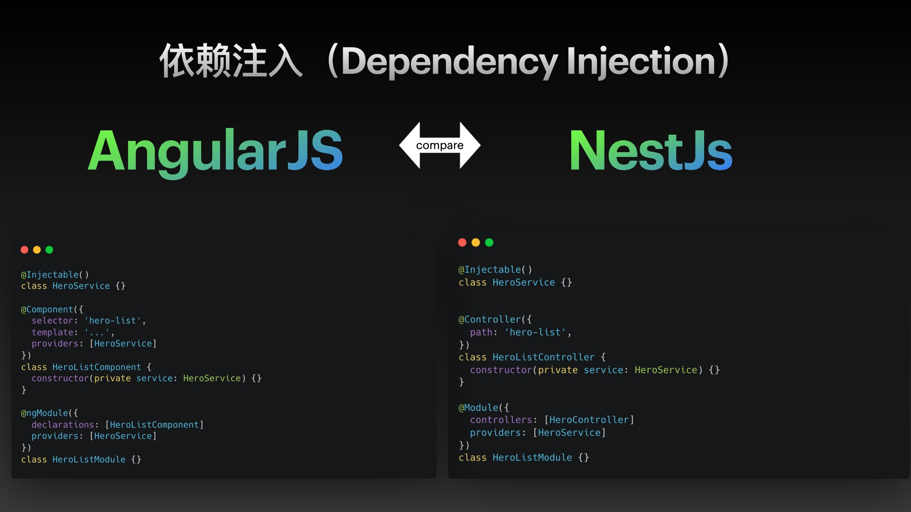

Nest 除了在模块化的实现之外，另一个贯穿这个架构的技术便是`依赖注入`（DI）。在软件工程有一项重要原则是`控制反转`（IoC），而依赖注入是用来实现 `IoC` 的一种模式，其中被反转的控制是设置一个对象的依赖关系。

#### AngularJs & NestJs

前面说到 Nest 依赖注入是借鉴的 AngularJs，相似度非常高。

这种相似度不仅体现在语法上，底层实现基本一致，包括 provider 的实现方式。 可以说对于使用 AngularJS 框架的开发者而言，NestJs 的依赖注入就像见到了同卵亲兄弟一般熟悉。

虽然 AngularJs 在国内的应用并不像 Vue 或 React 来的广泛。但作为第一个 mvc 设计概念的框架，以及首次在前端领域应用依赖注入设计模式，仅仅这两点而言。其开创了现代 SPA 应用的先河。

不过，也因其较多的框架概念，对于初学入门者有一定的学习曲线。

值得一提的是，依赖注入也是目前流行的 Java Spring 框架的实现技术之一。

#### Nest 的依赖注入

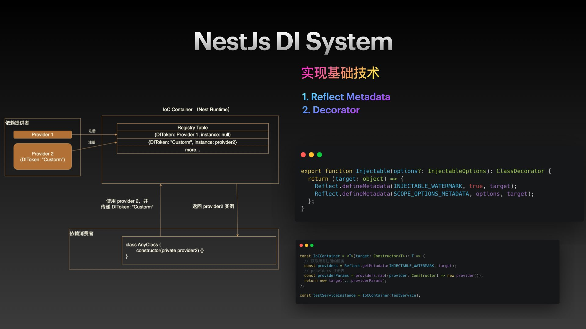

Nest DI 的底层实现基础技术：

基于 TypeScript 的元数据反射和装饰器，之所以说是基于 TypeScript 是因为，这两种基础技术目前都处于 ES7 的提案状态。所以实际使用由 TypeScript 编译来实现提案标准的。

要启动这两项技术你需要在 tsconfig.json 里配置："experimentalDecorators": true 和 "emitDecoratorMetadata": true。

#### Decorator

装饰器不用过多介绍，是一种不对原始对象进行修改的装饰者设计模式的应用，在 JavaScript 中，通常实现上采用高阶函数。

#### MetaData

Reflect 元数据在 JavaScript 里实际上是一种标记技术，然后通过 metaDataKey 获取被标记的对象。IoC 容器以此来管理 provider 实例的获取及创建，它像是一种工厂模式的实现。

TypeScript 使用的是 `reflect-metadata` 三方库来实现。

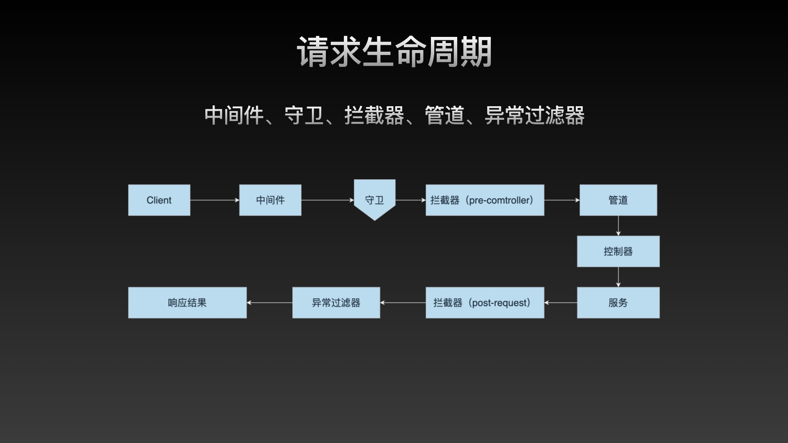

在 Nest 接受请求的整个生命周期中，有几个概念：中间件、守卫、拦截器、管道、异常过滤器，他们执行的先后顺序如这张图所示。

每个概念都有着自己职责和分工，并且他们可以自定义应用范围。

#### 中间件

中间件的概念和 express 的中间件是一样的，你还可以直接使用 express 的三方中间件，比如：body-parser、cookie-parser。

还有 express-session、express-winston 等等。

不过，虽然提供了该功能。但其实，Nest 不建议所有功能都通过中间件来实现。这种方式类似“插件”模式，所有功能都使用统一一种实现方式。

其它。。。

Nest 通过守卫、拦截器、管道异常过滤器等划分，分别实现在请求生命周期阶段，做不同分工的任务来完成请求相应。

* 如果你需要对请求做身份验证或权限验证，那么守卫将是不错的选择。
* 如果你想在不同范围处理异常，那么异常过滤器你值得拥有。
* 如果你想验证或转换请求数据，那么管道是你的首选。

### 微服务（MicroService）

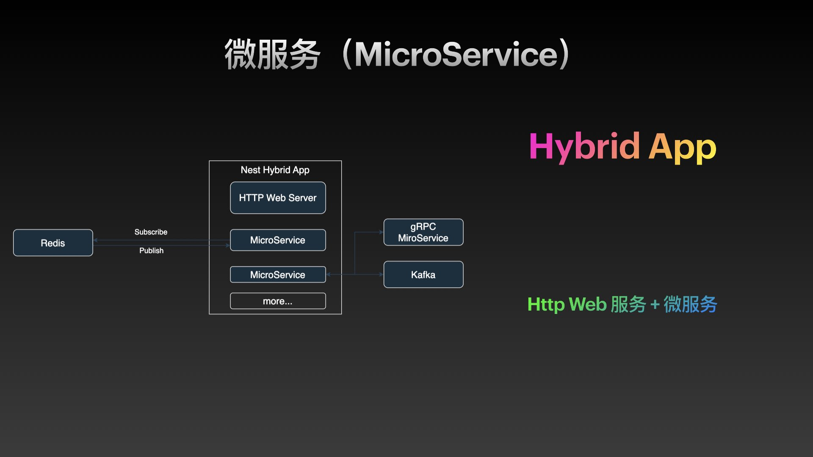

#### HyBrid App

Nest 同时支持 Http Web 服务和多个微服务的并行运行。这意味着你可以同时使用 HTTP  协议及 RPC 协议来进行通信。

Nest 内置实现了一个 RPC 协议。因此，在 Nest 框架体系下。你可以在各个 Node 服务之间通过该协议进行 TCP 通信。

同时，你可以对同一个 Controller 进行 HTTP 服务及微服务的混合开发，这是一种非常有趣且便利的开发模式。

除此之外，借助 Nest IoC 容器的依赖注入、模块化 、装饰器以及 RxJs 这种响应式编程库的应用，使得整个开发非常便利。

Nest 中，依赖注入、装饰器、异常过滤器、管道、守卫和拦截器同样适用于微服务。不过在异常过滤这块，Nest 提供了专门的 RpcException 来处理异常。

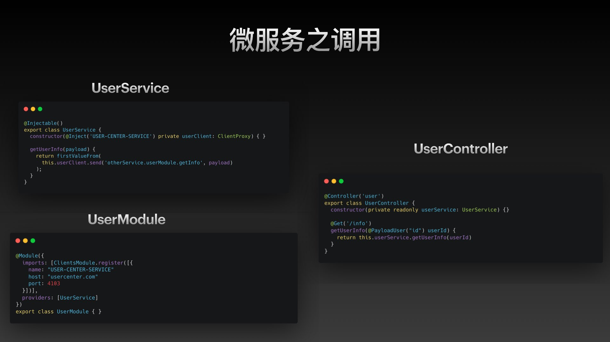

**UserModule**：

同样，任何功能的引入，都需要显式在模块中通过 imports 属性引入，这是前面提到的模块化编程概念的应用。
而后通过 @nestjs/microsevices 包引入 ClientMoule 来动态注册微服务的 Client 模块。

我们也可以看到 nestjs 框架下的技术功能实现上，采用的是分包策略。只有在我们需要的时候，由我们自己来引入对应技术的子包实现具体功能模块。这也是 Nest 实现渐进式框架的关键代码组织管理方式。

**UserService**：

根据后台服务分层开发的架构思想，通常我们把对其他微服务的调用放置在 Service 内。但你也可以直接在 Controller 进行 ClientProxy 的依赖注入。

这里需要说明的是 ClientProxy 是惰性的，不会启动应用就建立连接。只有在第一次调用微服务时，才回去创建与微服务的连接，后续再重用该连接。

ClientProxy 实例暴露一个 send 方法返回一个 Observable 对象。Nest 使用响应式编程库 Rxjs 来处理 RPC 数据流。

Rxjs 被称为“事件”的“lodash”库，是一个非常流行支持多平台的事件流处理库。（心累，学不动了。）

**UserController**：

在这里我们可以直接调用 UserService 里的方法。那么，就简单实现了通过调用用户中心微服务接口来实现下游服务的对上游服务的用户数据请求。

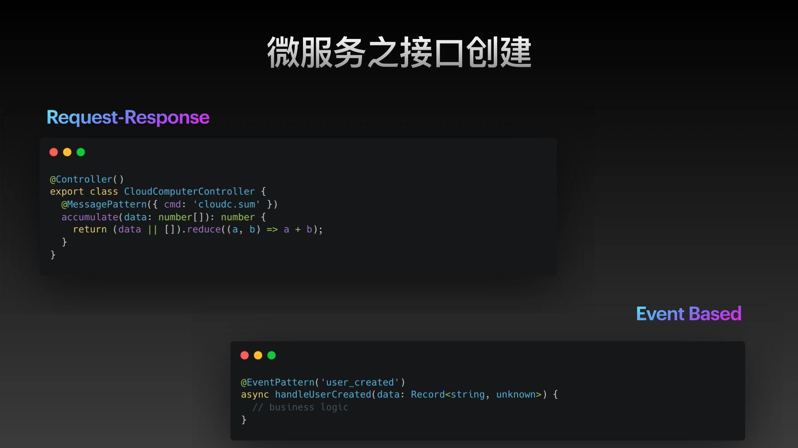

Nest 同时支持 `请求-相应`（Request-Response） 和 `事件消息`（Event Message） 两种通信方式。如果你的业务中只需发布事件而无需相应，那么可以使用基于事件的通信方式。

我们通常使用微服务用于消息交换。因此 `请求-相应` 通信方式更符合常用业务需求。

**CloudComputerController**：

我们可以通过 Controller 暴露一个微服务接口。

Nest 提供了 `@MessagePattern` 装饰器来申明一个微服务接口。值得注意的是该装饰仅在 Controller 类中使用，因为它是整个微服务的入口点。

### Nest CLI

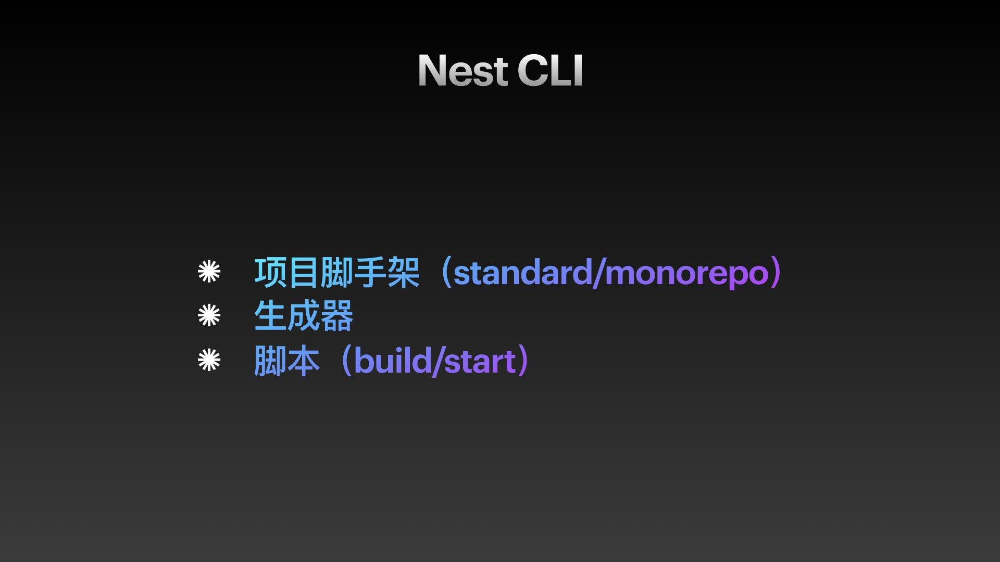

项目脚手架

Nest  CLI 可以生成项目脚手架，让我们快速进入开发状态。同时，它支持两种模式：standard 和 monorepo。

标准模式：是默认模式，以单个项目为中心，不需要共享模块或优化复杂的构建。
monorepo 模式：适合团队开发，注重模块共享，拆解复杂系统应用。一般作为 workspace 的概念来管理成员。

此外，标准模式可以转换成 monorepo 模式。

生成器

Nest CLI 可以生成 Nest 概念下几乎所有类型的单文件。比如：service、controller、pipe、decorator 等等。

并且，还有个特殊的 CRUD 生成器，可以以一个模块为单位，生成对应模块的 service、controller、module、DTO、Entity 文件，并且创建基础 CRUD 代码。

脚本

Nest CLI 提供了 start  build 两个命令：分别用于开发服务及生产构建。

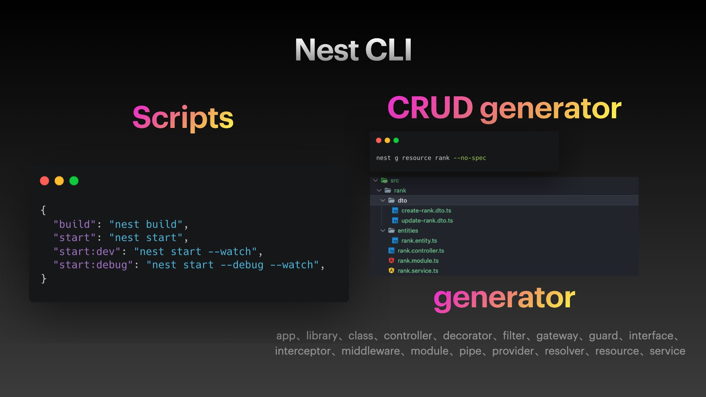

### 文档自动化

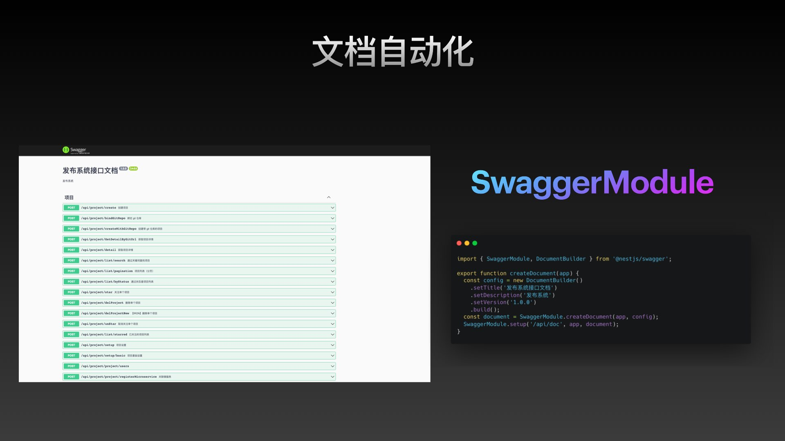

Nest 提供了一个 SwaggerModule 模块，用于创建文档。

Swagger 是目前流行的接口文档工具，通过 Nest 提供的装饰器，我们能够非常变量的实现文档的自动化生成及部署。

DocumentBuilder 提供了文档创建方法，并且允许提供一个 app 服务。这样文档会和服务一起绑定部署。

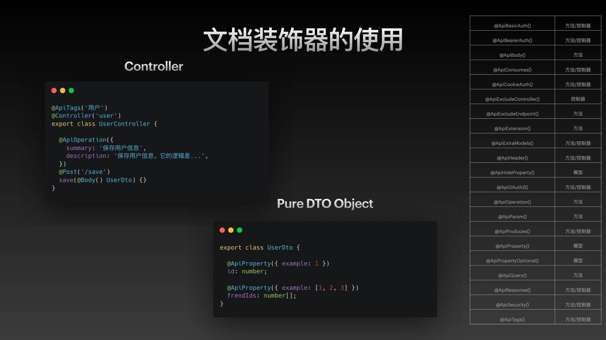

Nest 为文档提供了大量文档类的装饰器，用于生成接口文档。

你可以直接在装饰器里写入描述，用以来替代注释。这里有个隐藏小技巧，它支持 Markdown 哦。

和 Java 一样 Nest 也提供了 DTO 概念，用于数据层到交互层直接的数据传输。
