## 如何在移动端的调试中更加舒适？ 
### 介绍

在工作的过程中，各种场景下的调试所占时间远超乎你的想象，我们需要总结一套调试方案来的提高研发效率，我们需要享受开发，而不是被享受。

### 代理调试

代理调试是指通过代理 HTTP/S 请求来捕获请求信息。

这种调试主要是通过分析网络数据来定位问题，所以客户端环境无关，只要是基于 TCP 的 HTTP/S协议都可以被代理处理。

#### 本地网络调试

需要移动端设置代理 ip 和端口，并且保持移动端和代理主机在`同一网域下`，常用的 GUI 代理软件是 [Charles](https://www.charlesproxy.com/)

除了能够看到请求的发送接收信息，还可以对请求`设置断点`修改请求内容来达到调试的目的，也可映射本地脚本和文件内容，作为很好的 mock 工具。

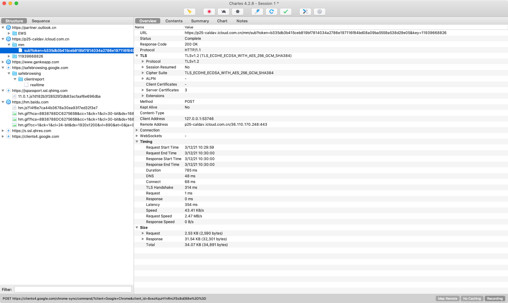

除了 `charles`，代理软件 `proxyman` 的 Mac 桌面端也是功能强大的，并且在界面 UI 上独树一帜。

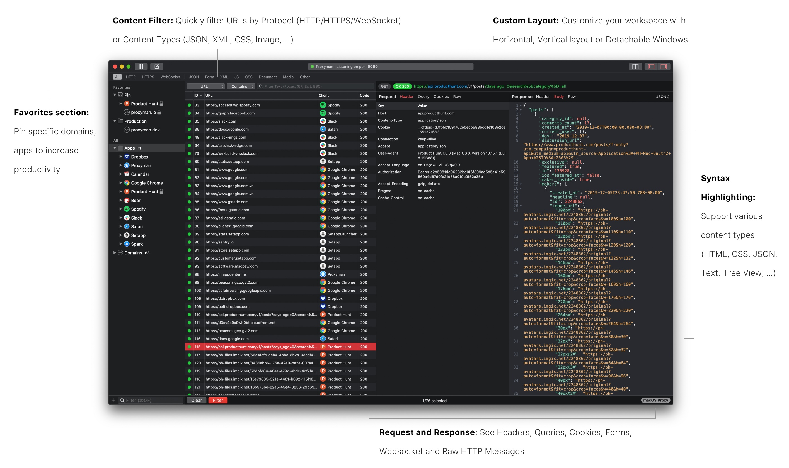

#### 远程网络调试

需要移动端设置代理 host 和端口。这里的 host 指定`域名`或直接指定`目标 ip` (减少 DNS 解析时间) 。不同于 GUI 代理软件，远程代理调试是代理到服务器上的，所以代理软件不会有GUI，但是可以由代理软件提供的 Web 程序查看请求内容。

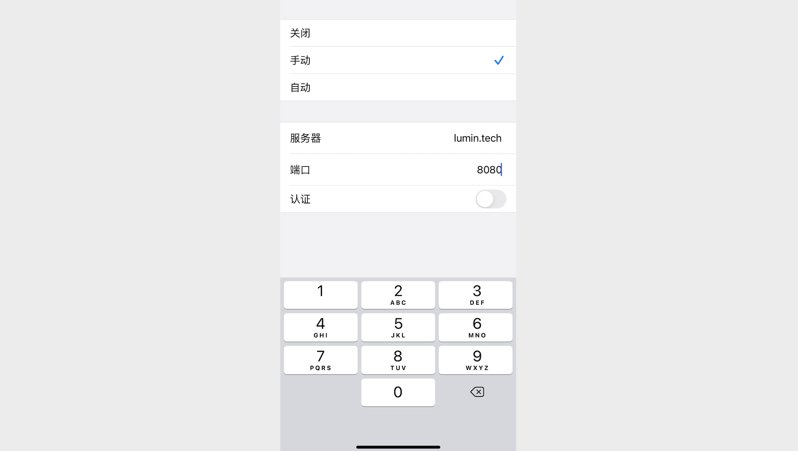

目前比较顺手的开源软件有[mitmproxy](https://www.mitmproxy.org/)，提供了良好的 Web GUI 功能。

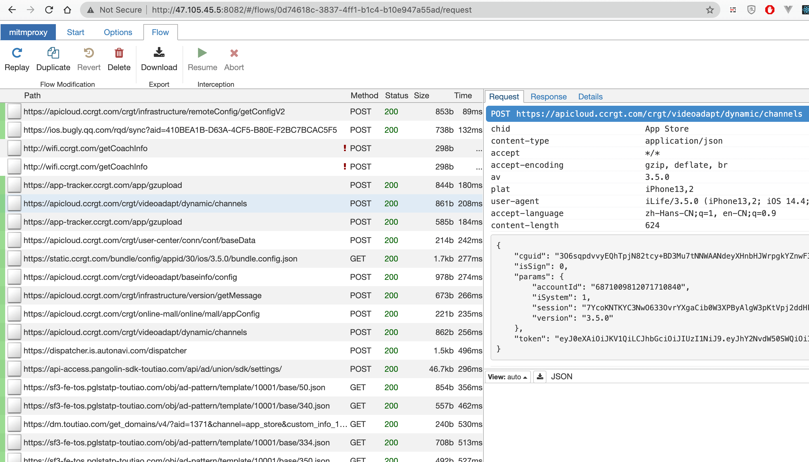

远程服务器代理的优点在于`用户端无需安装代理软件`，任何受信用用户都可以连接远程代理服务直接进行网络调试，`不受网域限制`，但是相对于本地代理调试软件，Web 端提供的调试功能要相对薄弱。

#### 移动端代理

这种方式直接在移动端安装代理软件实行代理，相对于本地网络和远程网络代理，这种代理更为快捷。

在IOS上可以使用 [proxyman](https://proxyman.io/ios) 来实现，不过免费版本受限只能使用两条过滤规则。

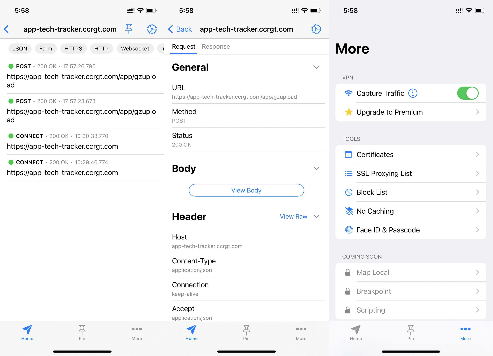

### 调试工具

#### Safari 浏览器环境下

如果你的站点在 IOS 的 Safari 浏览器下运行，那么可以开启 Safari 提供的移动开发工具来调试。

你需要同时在 Safari 桌面端和移动端`开启开发选项`，然后通过数据线`直连` Mac，就可以开启调试。

移动端的设置路径是：**设置 - Safari浏览器 - 高级 - 网页检查器**，桌面端的设置路径：**Preferences - Advanced - Show Develop menu in menu bar**。

在完成上面设置之后，就可以工作：

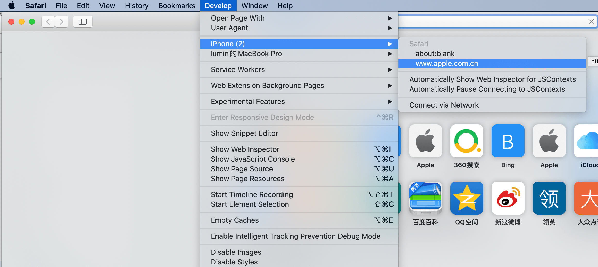
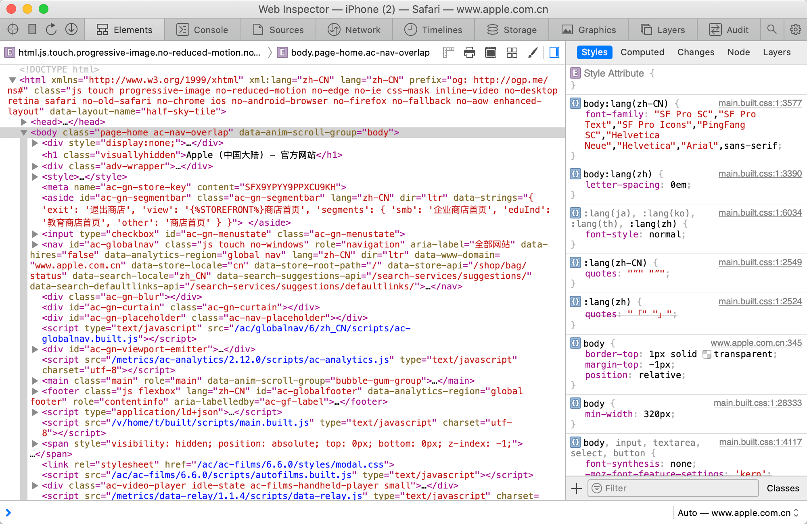

因为目前 Android 上没有 Safari 版本，所以`只能在 IOS 设备上 Safari 浏览器内`使用该调试方法。

#### Chrome Dev Tool 远程调试

在 chrome 的桌面端内置了[Dev Tools](https://developers.google.com/web/tools/chrome-devtools)开发工具，它也支持[远程调试 (Remote Debugging)](https://developers.google.com/web/tools/chrome-devtools/remote-debugging)。

> 虽然是内置在 chrome 里，但其实是个独立应用程序，可以接入 chrome 开放的[远程调试协议](https://chromedevtools.github.io/devtools-protocol/)来单独使用该工具 (例如：vscode、百度小程序IDE、微信小程序IDE等等) 。

你需要几个简单步骤来开启调试：

* 第一步：使用一台 Android 设备通过数据线连接到电脑，然后开启 Android 设备的 USB 调试功能；

* 第二步：打开 chrome，在地址栏里输入 `chrome://inspect` 回车，这样就进入设备侦测面板；

* 第三步：开始调试，启用 `Discover USB Devices` 复选框，就会侦测到Android设备及已打开的网页；

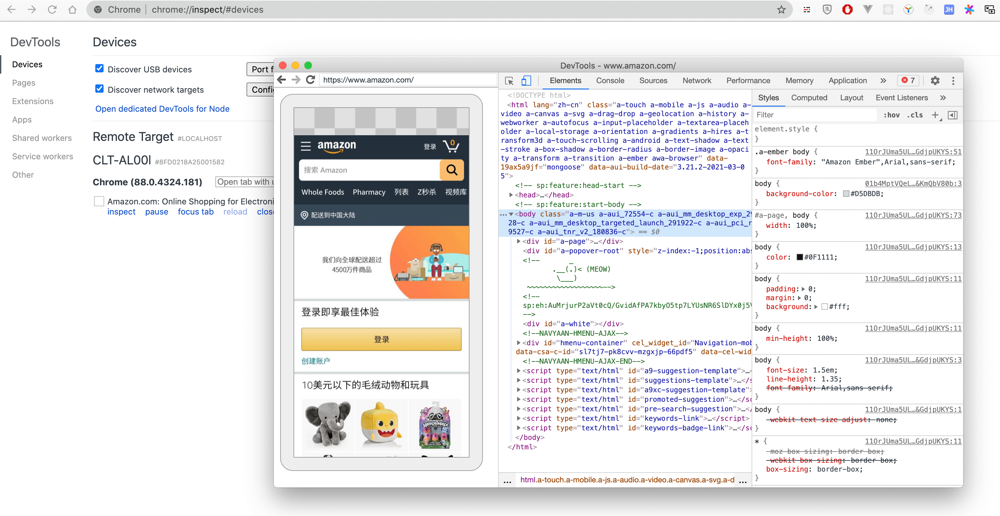

这个调试方法也具有局限性，它`只能在 Android 设备的 Chrome浏览器`内调试。

#### Android Webview 环境

在 Android webview 环境下的需要原生端做代码支持，通过 `setWebContentsDebuggingEnabled` 方法开启调试功能。

``` java
if (Build.VERSION.SDK_INT >= Build.VERSION_CODES.KITKAT) {
    WebView.setWebContentsDebuggingEnabled(true);
}
var demo:WebView = findViewById(R.id.webview_demo)
demo.loadUrl("https://www.lumin.tech/")
```

AndroidManifest.xml 配置网络权限：

``` xml
<?xml version="1.0" encoding="utf-8"?>
<manifest xmlns:android="http://schemas.android.com/apk/res/android"
    package="com.example.myapplication">
    <uses-permission android:name="android.permission.INTERNET" />
    ...
</manifest>
```

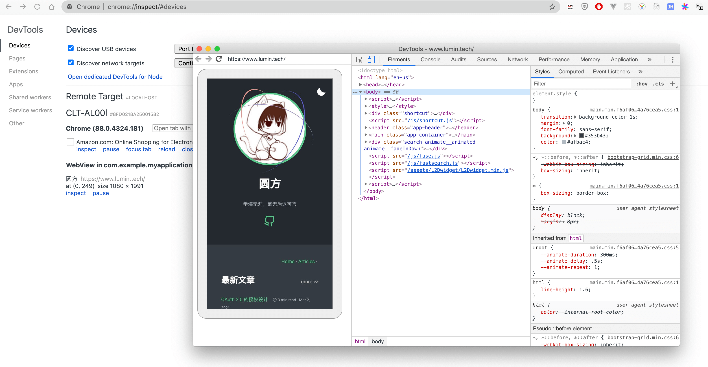

该方法的局限是只能在 `Android 设备` 上并且 App 的 Webview `代码上开启调试功能`才可以远程调试，对于公司内部 App 可以在测试环境开启。

#### 微信 Android Webview 环境

在微信 Android Webview 里默认是不具备开发调试功能，但是提供了开启方式。

> Android 微信的 Webview 使用的是 [X5 内核](https://x5.tencent.com/)。

在微信的聊天框里输入 `debugx5.qq.com`，打开链接跳转到X5的调试页面，勾选`打开TBS内核Inspector调试功能`就可以使用 Chrome DevTool 远程调试了，同时它也支持 [vConsole](#vconsole) 功能。

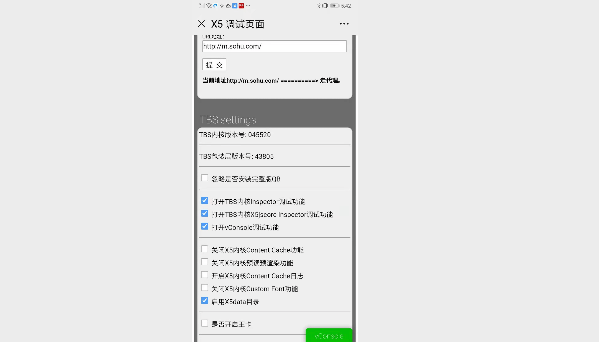

这个功能直接作用于真机，无论是在测试环境还是生产环境都可以进行良好的调试，但是受限于 Android 设备。

#### 微信开发者工具

利用微信开发者工具的 Web 开发功能，你可以使用自己的微信号来调试微信网页授权，也可以调试、检验页面的JS-SDK相关功能与权限，模拟大部分 SDK 的输入和输出。

利用集成的Chrome DevTools 能进行很好的协助开发.

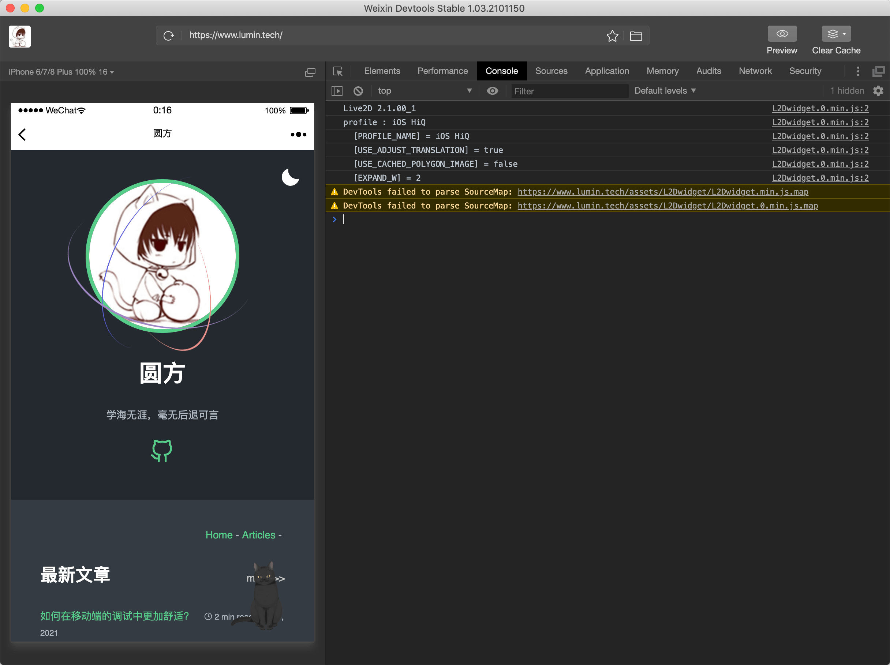

#### vConsole

 [vConsole](https://github.com/Tencent/vConsole) 是腾讯开源的一套在移动网页里开发调试的工具，提供了比较不错的调试体验。

他具备几点功能：

* 代理了 console 日志代理输出；
* 展示本地缓存 (cookies、localStorage、sessionStorage) ；
* 代理了网络请求 (XMLHttpRequest、Fetch) ；
* 支持控制台输入；
* 展示了  DOM 树；

vConsole 可以通过 npm 安装:

``` shell
npm install vconsole
```

可以 js 引入：

``` html
<script src="http://wechatfe.github.io/vconsole/lib/vconsole.min.js?v=3.2.0"></script>
<script>
  window.vConsole = new window.VConsole();
</script>
```

也可以作为 webpack 插件集成到工程里：

``` javascript
// 引入插件
var vConsolePlugin = require('vconsole-webpack-plugin'); 

module.exports = {
    ...
    plugins: [
        new vConsolePlugin({
            filter: [],  // 需要过滤的入口文件
            enable: true // 发布代码前记得改回 false
        }),
        ...
    ]
    ...
}
```

参考资料：

\> [https://developers.google.com/web/tools/chrome-devtools/remote-debugging](https://developers.google.com/web/tools/chrome-devtools/remote-debugging)

\> [https://developers.google.com/web/tools/chrome-devtools/remote-debugging/webviews](https://developers.google.com/web/tools/chrome-devtools/remote-debugging/webviews)

\> [https://chromedevtools.github.io/devtools-protocol](https://chromedevtools.github.io/devtools-protocol)

\> [https://x5.tencent.com/docs/questions.html](https://x5.tencent.com/docs/questions.html)
