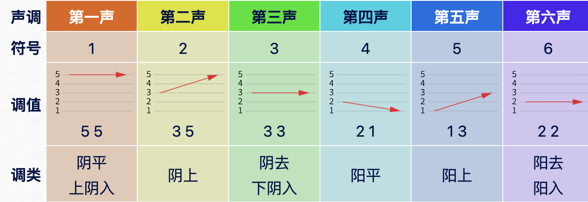

## 如何学粤语？ 
### 粤语音标

`粤语音标`（Yueyu Phonetics）是粤语的`发音系统`，简称`粤拼` (Jyutping)。它使用一套符号来表示不同的`音素`和`音调`。粤语的音标通常使用罗马字母和特定的音标符号。

和学习普通话一样，粤拼由`声母`、`韵母`和`声调`三部分组成，由此书面形式学习粤语的正确发音。

#### 声母 (Consonants)

粤语拼音有以下一些声母：

``` text
b, p, m, f, d, t, n, l, g, k, ng, h, gw, kw, w, j, s, ts, tsh, tshw
```

`普通话`和`粤语`同属`汉藏系`，两者在语音上有一定的对应关系。以下七组字表提供了一条由汉语拼音进入粤语拼音的学习捷径。

1. 普通话声母: b、p、m、f
2. 普通话声母: d、t、n、l
3. 普通话声母: g、k、h
4. 普通话声母: j、q、x
5. 普通话声母: zh、ch、sh、r
6. 普通话声母: z、c、s
7. 普通话零声母: y 开头、w 开头、a 开头、e 开头、o 开头

##### 普通话声母和粤语声母

* 普通话`唇音` ( `b`、`p`、`m`、`f` )、`舌尖中音` ( `d`、`t`、`n`、`l` ) 和`舌根音` ( `g`、`k` ) 三组音值大致与粤语相同;
* 普通话的 `h` 是`舌根音`，但在粤语里却是`喉音`；
* 普通话有`舌尖前音` ( `z`、`c`、`s` )、`舌尖后音` ( `zh`、`ch`、`sh` ) 和`舌面音` ( `j`、`q`、`x` ) 三组音，但粤语只有 ( `z`、`w`、`s` ) 一组。粤语 `z`、`c`、`s` 的发音介乎普通话 `z`、`c`、`s` 和 `j`、`q`、`x` 之间。粤语没有`卷舌音`；
* 普通话声母 `r` 在粤语相对应的是 `j`；
* 粤语声母 `ng` 是`舌根鼻音`，普通话没有 `ng` 声，它只出现在韵尾的位置；
* 粤语声母 `gw`、`kw` 都是`圆舌根音`，发音近似发普通话`瓜` gua、`夸` kua 里的 `gu`、`kw` 的部分。

粤语声母发声学习可以参考[这里](https://www.ilc.cuhk.edu.hk/workshop/Chinese/Cantonese/Romanization/ch2_initials/2_learn.aspx)。

#### 韵母 (Vowels)

```text
aa、a、o、oe、eo、e、u、yu、i
aa、a、o、oe、e、u、yu、i

```

粤语共有 `60` 个韵母（另有两个鼻音单独成韵），比普通话多。粤语韵母有以下几个特点：

1. `没有韵头`（介音）；
2. `韵腹`由 `aa`、`a`、`o`、`oe`、`eo`、`e`、`u`、`yu`、`i` 等元音组成；
3. `单韵母`有 `8` 个：`aa`、`a`、`o`、`oe`、`e`、`u`、`yu`、`i`；
4. `复韵母`有 `11` 个：即收 `-i` 或 `-u` `韵尾`的韵母。当中 `eoi` 的 `-i` 受圆唇音 `eo` 影响，实际发出来的是圆唇音；
5. `鼻音韵母`有 `20` 个：即收`-m`、`-n`、`-ng` 韵尾的韵母。当中收 `-m` 韵尾的韵母，发音时最后要把嘴巴合拢，如 「添（tim1）」 字的粤语发音，就像英语的"Tim"；
6. `塞音韵母`有 `21` 个：即收`-p`、`-t`、`-k` 韵尾的韵母，也就是传统所指的`入声`。这类韵尾的发音跟英语有点相似，如 「摄（sip3）」、「泄（sit3）」、「识（sik1）」 三字的粤语发音， 就分别类近英语的"sip"、"sit"和"sick"。不过，英语的 `-p`、`-t`、`-k` 韵尾，发音时气流受阻之后会爆破成声，而粤语的`-p`、`-t`、`-k` 韵尾，只有闭塞而没有爆破。另外要注意，收 `-p` 韵尾的韵母， 发音时最后要把嘴巴合拢。
7. 韵母 `a` 有长短之分，较长的用 「aa」，较短的则用 「a」 来表示，例如 「街（gaai1）」 和 「鸡（gai1）」。
8. 粤语有 `2` 个`圆唇韵母`，分别是长元音 `oe` 和短元音 `eo`。要掌握 `oe`，可以先试读 「靴（hoe1）」字，这个字的粤语发音类似英语的"her"，但不用卷舌，而且要带圆唇。至于 `eo`，其发音与 `oe` 相似，只是开口度较小，音长也较短。
9. 粤语有 `2` 个鼻音，分别是 `m` 和 `ng` ，可单独成韵，例如 「唔（m4）」 和 「五（ng5）」。

粤语韵母发声学习可以参考[这里](https://www.ilc.cuhk.edu.hk/workshop/Chinese/Cantonese/Romanization/ch3_finals/2_learn.aspx)。

#### 声调 (Tones)

粤语有 `6` 个声调，它们用数字来表示，分别是 `1`、`2`、`3`、`4`、`5` 和 `6`。每个音调对于词义来说是不同的，所以在粤语中正确的音调非常重要。

其实，粤语有 `9` 个声调，但因为最后面的 `3` 个声和 `1`、`3`、`6` 声调一样，只是比较短促，被叫做`入声`。所以实际主要学习前 6 个声调即可。这也就是常说的粤语`九声六调`。



粤语声调发声学习可以参考[这里](https://www.ilc.cuhk.edu.hk/workshop/Chinese/Cantonese/Romanization/ch4_tones/2_learn.aspx)。

### 四个不发音的尾音

几个不发声的`尾音`：`K`、`T`、`P`、`M`。

`K` 的不发音字：

``` text
北 bak1     觉 gok3
百 baak3    力 lik6
乐 lok6     特 dak6
贼 caak6    目 muk6
```

`T` 的不发音字：

```text
袜 mat6    不 bat1
甩 lat1    别 bit6
失 sat1    活 wut6
质 zat1    割 got3
```

`P` 的不发音字：

``` text
给 kap1    执 zap1
急 gap1    碟 dip6
孽 yip6    摄 sip3
十 sap6    折 zip3
```

`M` 的不发音：

```text
感 gam2    点 dim2
音 yam1    签 cim1
尖 zim1    闪 sim2
欠 him3    啱 ngam1
```

### 粤语歌曲鉴赏



查询工具：[香港小学学习字词表](https://www.edbchinese.hk/lexlist_ch/index.jsp)、[香港中文大学自学中心语言相关资料](https://www.ilc.cuhk.edu.hk/workshop/Chinese/Cantonese/Romanization/ch2_initials/3_compare.aspx)、[开放粤语字典](https://github.com/kfcd/yyzd)。

参考资料:

\> [https://www.youtube.com/watch?v=kBmaeQhZFLo&list=PLR2TZ21UA-5bFZA4eWIlL8pBKkE4B0YpD&index=1&ab_channel=uncleM](https://www.youtube.com/watch?v=kBmaeQhZFLo&list=PLR2TZ21UA-5bFZA4eWIlL8pBKkE4B0YpD&index=1&ab_channel=uncleM)

\> [https://www.youtube.com/watch?v=UwIbucNwxo0&ab_channel=8tatTV](https://www.youtube.com/watch?v=UwIbucNwxo0&ab_channel=8tatTV)

\> [https://www.kugou.com/yy/html/search.htm](https://www.kugou.com/yy/html/search.htm)

\> [https://www.gequbao.com/](https://www.gequbao.com/)