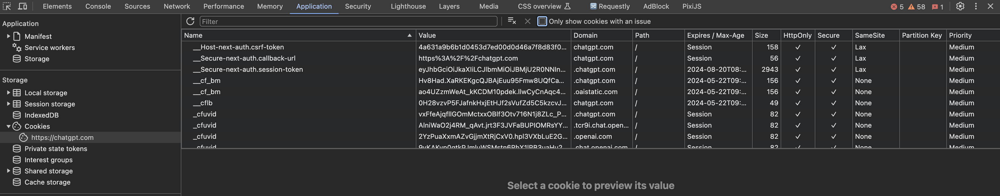

## 如何正确使用 Cookie ？ 
### 简介

HTTP Cookie（也叫 Web Cookie 或浏览器 Cookie）是服务器发送到用户浏览器并`保存在本地`的一小块数据。

浏览器会`自动`存储 HTTP 请求返回的 cookie 信息，并在下次向同一服务器再发起请求时自动携带并发送到服务器上。

通常，它用于告知服务端两个请求是否来自同一浏览器。Cookie 使基于无状态的 HTTP 协议记录稳定的状态信息 (如：`登录状态`) 成为了可能。

Cookie 主要用于以下三个方面：

* 会话状态管理。如用户登录状态、购物车、游戏分数或其他需要记录的信息
* 个性化设置。如用户自定义设置、主题和其他设置。
* 浏览器行为跟踪。如`跟踪分析用户行为`的第三方广告商等。

### 同站和同源

`站点` (Site) 和`源` (Origin) 的组成部分如下：



`TLD` 指的是[顶级域名](https://developer.mozilla.org/en-US/docs/Glossary/TLD) (top-level domain)。

同站还是跨站？

| Origin A | Origin B | 是否跨站 |
|:-|:-|:-|
|`https://www.example.com:443`|`https://www.evil.com:443`|跨站：不同域名|
||`http://www.example.com:443`|跨站：不同协议|
||`https://login.example.com:443`|同站：子域名无关|
||`https://www.example.com:80`|同站：端口无关|

同源还是跨源(或跨域)？

| 出发地 A | 源 B | 是否跨源 |
|:-|:-|:-|
|`https://www.example.com:443`|`https://www.evil.com:443`|跨站：不同域名|
||`https://example.com:443`|跨源：不同子域名|
||`https://login.example.com:443`|跨源：不同子域名|
||`http://www.example.com:443`|跨源：不同协议|
||`https://www.example.com:80`|跨源：不同端口|
||`https://www.example.com`|同源：隐式端口 (443)|

**如何校验同站还是跨站？**

所有现代浏览器都支持请求携带 [Sec-Fetch-Site](https://developer.mozilla.org/zh-CN/docs/Web/HTTP/Headers/Sec-Fetch-Site) HTTP 标头。支持一下几个值：

* `cross-site`：跨站；
* `same-site`：同站；
* `same-origin`：同源；
* `none`：这一请求与任意上下文无关。例如：直接在地址栏中输入 URL、打开一个书签，或者往浏览器窗口中拖放一个文件。

你合理相信 `Sec-Fetch-Site` 标头的值，原因如下：

* [JavaScript 无法修改以 Sec- 开头的 HTTP 标头](https://www.w3.org/TR/fetch-metadata/#sec-prefix)。
* 浏览器始终会设置这些标题。

### 创建 Cookie

`服务器端`设置 [Set-cookie](https://developer.mozilla.org/zh-CN/docs/Web/HTTP/Headers/Set-Cookie) 标头，`客户端`设置 Cookie 标头。

#### Set-Cookie

服务器收到 HTTP 请求后，服务器可以在响应标头里面添加`一个`或`多个` Set-Cookie 选项。

一个简单的 Cookie 可能像这样：

``` shell
Set-Cookie: <cookie-name>=<cookie-value>
```

``` ts
HTTP/1.0 200 OK
Content-type: text/html
Set-Cookie: yummy_cookie=choco
Set-Cookie: tasty_cookie=strawberry

[页面内容]
```

下面是多个属性的语法：

``` ts
Set-Cookie: <cookie-name>=<cookie-value>
Set-Cookie: <cookie-name>=<cookie-value>; Domain=<domain-value>
Set-Cookie: <cookie-name>=<cookie-value>; Expires=<date>
Set-Cookie: <cookie-name>=<cookie-value>; HttpOnly
Set-Cookie: <cookie-name>=<cookie-value>; Max-Age=<number>
Set-Cookie: <cookie-name>=<cookie-value>; Partitioned
Set-Cookie: <cookie-name>=<cookie-value>; Path=<path-value>
Set-Cookie: <cookie-name>=<cookie-value>; Secure

Set-Cookie: <cookie-name>=<cookie-value>; SameSite=Strict
Set-Cookie: <cookie-name>=<cookie-value>; SameSite=Lax
Set-Cookie: <cookie-name>=<cookie-value>; SameSite=None; Secure

# 可以同时有多个属性，例如：
Set-Cookie: <cookie-name>=<cookie-value>; Domain=<domain-value>; Secure; HttpOnly
```

在 chrome devtool 中 `Application` 选项卡里我们可以看到浏览器存储的 cookie 值及属性。



##### Expires

持久性 Cookie `过期时间` (Expires) 指定的日期或`有效期`（Max-Age）指定的一段时间后被删除。

``` shell
Set-Cookie: id=a3fWa; Expires=Wed, 21 Oct 2015 07:28:00 GMT;
```

> 当 Cookie 的`过期时间`（Expires）被设定时，设定的日期和时间只与**客户端**相关，而不是服务端。

##### Max-Age

在 cookie 过期之前需要经过的`秒数`。秒数为 0 或负值将会使 cookie 立刻过期。假如同时设置了 Expires 和 Max-Age 属性，那么 Max-Age 的`优先级更高`。

##### Secure

表示仅当请求通过 `https` 协议(`http://localhost` 不受此限制)的站点发送时，才会将该 cookie 发送到服务器，因此其更能够抵抗[中间人](https://developer.mozilla.org/zh-CN/docs/Glossary/MitM) (MitM) 攻击。

{}
`非安全站点`（http）**不能**在 cookie 中设置 Secure 属性（从 Chrome 52 和 Firefox 52 开始）。

当 Secure 属性由 `localhost` 设置时，https 的要求会被忽略（从 Chrome 89 和 Firefox 75 开始）。
{}

##### SameSite

控制 cookie 是否`随跨站请求`一起发送，这样可以在一定程度上防范跨站请求伪造攻击（[CSRF](https://developer.mozilla.org/zh-CN/docs/Glossary/CSRF)）。

其中 `Lax` 是浏览器的默认行为。

可选的属性值有：

* **Strict**：浏览器**仅**对`同一站点`的请求发送 cookie，即请求来自设置 cookie 的站点。如果请求来自不同的`域名`或`协议`，则携带有 SameSite=Strict 属性的 cookie 不会被发送。
* **Lax**：cookie `不会在跨站请求`中被发送，如：加载图像或框架（frame）的请求。但 cookie 在用户`从外部站点导航到 (GET 请求) 源站`时，cookie 也会被发送。
  
  这是 SameSite 属性未被设置时的`默认行为`。

* **None**：浏览器在`跨站和同站请求中均会发送` cookie。在设置这一属性值时，**必须**同时设置 `Secure` 属性。
  
  就像这样：`SameSite=None; Secure`。如果未设置 `Secure`，则会出现以下错误：

  ``` shell
  Cookie "myCookie" rejected because it has the "SameSite=None" attribute but is missing the "secure" attribute.

  This Set-Cookie was blocked because it had the "SameSite=None" attribute but did not have the "Secure" attribute, which is required in order to use "SameSite=None".
  ```

##### HttpOnly

阻止 JavaScript 通过 `Document.cookie` 属性访问 cookie。其用于防范`跨站脚本攻击`（[XSS](https://developer.mozilla.org/zh-CN/docs/Glossary/Cross-site_scripting)）。

{}
注意即便设置了 HttpOnly，但 cookie **仍然**会通过 JavaScript 发起的请求发送。例如，调用 XMLHttpRequest.send() 或 fetch()。
{}

##### Domain

指定 cookie 可以送达的主机 (Host)。

若缺省，则此属性默认为当前文档 URL 的主机（`不包括子域名`）。而设置域名将会使 cookie 对指定的域名及其所有子域名可用。

所以，如果指定了一个域名，则其子域名也总会被包含。**只能**设置`一个`域名值。

``` shell
Set-Cookie: name=value; domain=example.com; path=/
```

这样，cookie 将在 example.com 及其所有子域（如 sub.example.com、another.example.com）中有效。

##### Path

表示浏览器要发送该 Cookie 标头时，请求的 URL 中所**必须**存在的路径。

正斜杠（/）字符可以解释为目录分隔符，且子目录也满足匹配的条件。例如，如果 path=/docs，那么：

* 请求路径 /docs、/docs/、/docs/Web/ 和 /docs/Web/HTTP 都满足匹配条件。
* 请求路径 /、/docsets 或者 /fr/docs 则不满足匹配条件。

##### 前缀

在 IETF [RFC 6265](https://datatracker.ietf.org/doc/html/rfc6265) 中，添加了具有特殊属性 Cookie 名称的限制，在[最新提案](https://www.greenbytes.de/tech/webdav/draft-ietf-httpbis-cookie-prefixes-latest.html)中，提供了前缀 `__Secure-` 和 `__Host` 两种实现方式。目前，大多数浏览器实现了该提案。

其目的是防止符合语法的 cookie `走私`到服务器，限制了 Cookie 可能被滥用。

仅在使用了安全（HTTPS）来源，并同时设置 secure 属性时才能使用名称中包含 `__Secure-` 或 `__Host-` 前缀的 cookie。

另外，假如 cookie 以 `__Host-` 为前缀，那么 `path` 属性的值**必须**为 `/`（表示主机的任何路径），且**不能**含有 `Domain` 属性。

例如对于下面的情况，浏览器会特殊对待：

``` ts
// 当响应来自安全来源（HTTPS）时，二者都会被接受
Set-Cookie: __Secure-ID=123; Secure; Domain=example.com
Set-Cookie: __Host-ID=123; Secure; Path=/

// 缺少 Secure 属性，会被拒绝
Set-Cookie: __Secure-id=1

// 缺少 Path=/ 属性，会被拒绝
Set-Cookie: __Host-id=1; Secure

// 由于设置了 Domain 属性，会被拒绝
Set-Cookie: __Host-id=1; Secure; Path=/; domain=example.com

```

通常，服务器无法验证 cookie 是否从安全的客户端发送过来。而浏览器可以通过检查前缀来触发其安全策略，来保证浏览器发送出去的 cookie 是安全的。

#### Cookie

现在，对该服务器发起的每一次新请求，浏览器都会将之前保存的 Cookie 信息通过 Cookie 请求头部再发送给服务器。

``` shell
GET /sample_page.html HTTP/1.1
Host: www.example.org
Cookie: yummy_cookie=choco; tasty_cookie=strawberry
```

JavaScript 通过 Document.cookie 访问 Cookie

通过 Document.cookie 属性可创建新的 Cookie。如果`未设置 HttpOnly` 标记，你也可以从 JavaScript 访问现有的 Cookie。

```ts
document.cookie = "yummy_cookie=choco";
document.cookie = "tasty_cookie=strawberry";
console.log(document.cookie);
// logs "yummy_cookie=choco; tasty_cookie=strawberry"
```

### 会话期 cookie

会话期 cookie 会在浏览器退出时 (不只是单个 tab) 被移除。若 cookie `不设置` Expires 或 Max-Age 属性，则其为会话期 cookie。在浏览器调试器里可以看到 `Expires/Max-Age` 下的值为 `Session`。

> [sessionStorage](https://developer.mozilla.org/zh-CN/docs/Web/API/Window/sessionStorage) 会关闭对应浏览器`标签`或`窗口`时被清除。

### 本地开发中使用 cookie

大多数情况下，出于开发目的，`http://localhost` 的行为类似于 HTTPS，浏览器会以特殊方式处理它。

但在本地设置 Secure Cookie 时，并非所有浏览器都拥有相同的行为！例如，Chrome 和 Safari 不会在本地主机上设置 Secure Cookie，而 `Firefox` 可以。在 Chrome 中，这被视为 [bug](https://issues.chromium.org/issues/40120372)。

所以，在某些浏览器上，对 localhost 设置下面的 Cookie 是被拒绝的：

``` ts
Set-Cookie: SameSite=None; Secure
```

此时，需要开发者搭建本地 HTTPS 开发服务，这里推荐使用 [mkcert](https://github.com/FiloSottile/mkcert) 来快速搭建。

### 安全问题

对 Cookie 讨论最多的应该就是 CSRF 攻击了。它的攻击示意图如下：



老旧的安全性较弱的浏览器由于会自动携带跨站的 cookie 到攻击网站发送的请求中，才导致用户没有反应时间就触发了对信任网站的意外请求，这是很危险的一件事。

现代的浏览器已经不允许跨站及跨域共享 cookie，所以其实**几乎不存在**还能通过这种手段攻击成功的。

但是对于服务器安全来说客户端永远是不可信的，依然需要对客户端发来的请求做安全校验，以此尽可能的提高用户访问服务的安全性。

#### 处理方式

上面有介绍服务器设置对 Cookie 设置 `HttpOnly`、`Secure`、`SameSite` 等属性可以要求浏览器端更安全接受 Cookie。下面介绍服务器端做对客户端的请求的校验。

1. `Origin` 和 `Referer` 的验证。

在浏览器发送过来的 HTTP/S 协议请求中，校验 Origin 和 Referer 防止跨源访问。



2. 同步令牌模式 (Synchronizer token pattern)

大多数 CSRF 预防技术的工作原理是将`额外的身份验证数据`嵌入到请求中，从而允许 Web 服务器检测来自未经授权的位置的请求。

`同步器令牌模式` (STP) 是一种技术，服务器嵌入一个令牌 (每个请求都有唯一的不可预测的值) 到所有 HTML 表单中，在用户提交时，服务器端进行验证。

这种令牌也称为`防伪令牌`，令牌需要确保`不可预测性`和`唯一性`的任何方法来生成（例：随机种子的哈希链），使攻击者无法在请求中放置正确的令牌，来逃避对其身份的验证。



嵌入表单：

``` html
<form action="https://example.com/tweet" method="POST">
  <input type="hidden" name="csrf-token" value="nc98P987bcpncYhoadjoiydc9ajDlcn">
  <input type="text" name="tweet">
  <input type="submit">
</form>
```

3. CSRF Token 放置标头

令牌在整个用户`会话期间保持不变`，因此它可以很好地与 AJAX 配合使用。

服务器端设置 CSRF Token Cookie：

``` ts
Set-Cookie: __Host-csrf_token=i8XNjC4b8KVok4uw5RftR38Wgp2BFwql; Expires=Thu, 23-Jul-2015 10:25:33 GMT; Max-Age=31449600; Path=/; SameSite=Lax; Secure
```

在客户端运行的 `JavaScript 读取其值`并将其复制到随每个请求发送的自定义 HTTP 标头中：

``` js
X-Csrf-Token: i8XNjC4b8KVok4uw5RftR38Wgp2BFwql
```

> CSRF 令牌 cookie **不得**具有 `httpOnly` 标志，因为它的设计目的是由 JavaScript 读取。

该技术的安全性基于以下假设：只有在与`最初设置` cookie 的服务器的 HTTPS 连接的客户端上运行的 JavaScript 才能够读取 cookie 的值。

从恶意文件或电子邮件运行的 JavaScript 不应能够成功读取 cookie 值以复制到自定义标头中。

### 第三方 Cookie

如果访问的`当前站点`发送`跨域请求`设置了响应 Cookie，那么该 Cookie 就是第三方 Cookie。[第三方 Cookies](https://en.wikipedia.org/wiki/Third-party_cookies) 主要用于`网络跟踪`，作为`网络广告`生态系统的一部分。

例如像下面一个示例，使得广告平台可以追踪用户浏览网站的行为：



第三方 Cookie 被广泛视为对 Web 用户隐私和匿名性的威胁。截至 2024 年，所有主要的 Web 浏览器供应商都将逐步淘汰对第三方 Cookie 的支持。

从 2024 年第一季度开始，Chrome 已经有计划在废弃第三方 Cookie 的使用，你可以从[这里](https://developers.google.com/privacy-sandbox/3pcd?hl=zh-cn)获取相关信息。

参考资料：

\> [https://developer.mozilla.org/zh-CN/docs/Web/HTTP/Cookies](https://developer.mozilla.org/zh-CN/docs/Web/HTTP/Cookies)

\> [https://web.dev/articles/when-to-use-local-https?hl=zh-cn](https://web.dev/articles/when-to-use-local-https?hl=zh-cn)

\> [https://en.wikipedia.org/wiki/Cross-site_request_forgery](https://en.wikipedia.org/wiki/Cross-site_request_forgery)
