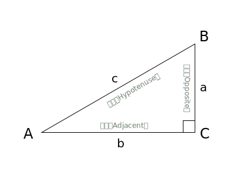
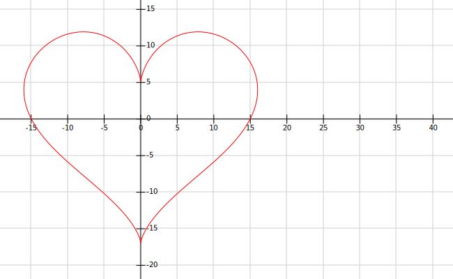

## 常用的数学公式 
### 三角函数 (Trigonometric functions)

#### 基本函数

公式： ${\displaystyle \sin \theta ={\frac {a}{c}}}$，${\displaystyle \cos \theta ={\frac {b}{c}}}$，${\displaystyle \tan \theta ={\frac {a}{b}}}$

#### 三角恒等式

**1. 毕达哥拉斯恒等式**

$\sin^2x + \cos^2x = 1$

**2. 和差公式**

$\sin \left(x+y\right)=\sin x \cos y + \cos x \sin y$，$\sin \left(x-y\right)=\sin x \cos y - \cos x \sin y$

$\cos \left(x+y\right)=\cos x \cos y - \sin x \sin y$，$\cos \left(x-y\right)=\cos x \cos y + \sin x \sin y$

当两个角相同时，和角公式可以简化，称为**二倍角公式** (或**倍角公式**) ：

${\begin{aligned}\sin 2\theta &=2\sin \theta \cos \theta \ ={\frac  {2\tan \theta }{1+\tan ^{2}\theta }}\end{aligned}}$

### 勾股定理 (Pythagoras theorem)

公式：${\displaystyle a^{2}+b^{2}=c^{2}}$，${\displaystyle c={\sqrt {a^{2}+b^{2}}}}$

#### 角度 (degree) 与弧度 (radian) 互转

弧度是角的度量单位，弧度定义为`弧长与半径的比值`，单位表示：`rad` 。

当`弧长 = 半径`时，则弧度为`1`rad。

当`弧长` = $2\pi r$ (周长) ，则弧度为 $2\pi$ rad。可以知道弧度值的范围在`0 ~ 6.283185`之间。

圆周率是`周长与直径的比值`，用 $\pi$ 表示：$\pi$ = 3.141592653589793...

一个圆分为360等分，即 $360°$。一个 $360°$ 的圆，它的弧度为 $2\pi$ rad，所以可以推导出：$\large{\frac {角度} {弧度} = \frac {360°} {2\pi}}$，因此有了下面的转换公式：

公式：$\large{弧度 = \frac {角度\times\pi} {180°}}$，$\large{角度 = \frac {弧度 \times 180°} {\pi}}$

### 爱心参数方程

爱心参数方程是一种心形曲线 (Heart Curve) 。

$x = 16\sin^3(t)$

$y = 13\cos(t) - 5cos(2t) - 2cos(3t)-cos(4t)$

$t$ 取值区域： $0< t < 2\pi$

我们可以通过一个叫 [fooplot](http://www.fooplot.com/#W3sidHlwZSI6MiwiZXF4IjoiMTZzaW4ocyleMyIsImVxeSI6IjEzY29zKHMpLTVjb3MoMnMpLTJjb3MoM3MpLWNvcyg0cykiLCJjb2xvciI6IiNmZjAwMDAiLCJzbWluIjoiMCIsInNtYXgiOiIycGkiLCJzc3RlcCI6Ii4wMSJ9LHsidHlwZSI6MTAwMCwid2luZG93IjpbIi00OC44MDEzMDI5MDk4NTA5MiIsIjcyLjI3MDYzMTc5MDE2MDg5IiwiLTQwLjA0Njg3MDcwODQ2NTQ1NSIsIjM0LjQ1ODkzNTI2MDc3MjYiXX1d) 的在线工具，绘制出该曲线。

