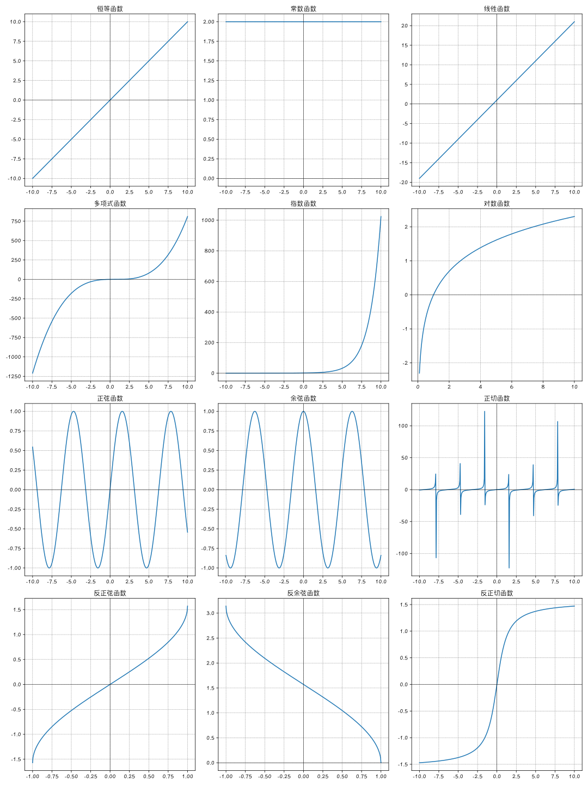

## 常见数学术语 
### 常见数学符号

#### ∑

∑ 是希腊字母 Σ（大写的西格玛，Sigma），在数学和统计学中广泛用作`求和符号`。形式如下：$ \sum_{i=1}^{n} a_i $。

这表示从 $i = 1$ 到 $i = n$ 的所有 $a_i$ 的和，具体计算方式如下：$ a_1 + a_2 + a_3 + \cdots + a_n $。

**例子**：假设我们有一组数：$2, 3, 5, 7$ 我们想求这些数的和，可以用 ∑ 表示为：$ \sum_{i=1}^{4} a_i = 2 + 3 + 5 + 7 = 17 $。

> $\sum$ 的发音为 "Sigma"（/ˈsɪɡmə/），读 “西格玛”。

### 方程

#### 线性方程 (linear equations)

线性方程也称`一次方程式`。指未知数都是一次的方程。其一般的形式是：$ax+by+...+cz+d=0$。

#### 线性方程组 (system of linear equations)

线性方程组为`线性方程`的集合。

$$
\cases{
2x +  y + 3z = 10 \\\
x + y + z = 6 \\\
x + 3y + 2z = 13
}
$$

#### 向量方程 (vector equation)

一个`解` (solution) 是$x$，$y$，$z$ 值的集合，这些值使等式成立。

上面的线性方程组，也可以写成下面`向量方程`形式：

$$
\begin{bmatrix}2 \\\ 1 \\\ 1\end{bmatrix}x +
\begin{bmatrix}1 \\\ 1 \\\ 3\end{bmatrix}y +
\begin{bmatrix}3 \\\ 1 \\\ 2\end{bmatrix}z =
\begin{bmatrix}10 \\\ 6 \\\ 13\end{bmatrix}
$$

#### 齐次方程 (homogeneous)

如果右边的常量都为 0 ，则该方程组是`齐次的` (homogeneous) ，如下面方程：

$$
\begin{aligned}
3x_1 − 7x_2 + 4x_3 = 0 \\\
5x_1 + 8x_2 − 12x_3 = 0 \\\
\end{aligned}
$$

#### 零解 (trivial solution)

$$
\begin{bmatrix}x_1 \\\ x_2 \\\ x_3\end{bmatrix} =
\begin{bmatrix}0 \\\ 0 \\\ 0\end{bmatrix}
$$

对于齐次方程，如果变量都为 0 ，我们称为零解，也可以叫平凡解，基本没啥功能意义。与之对应的解叫`非平凡解` (non-trivial solution) 。

这个解没有任何意义，但是齐次方程在`线性代数`里确实是非常重要的.

#### 线性无关 (linearly independent)

给定 $v_1,..., v_n$ 是一组向量 (都在同一维度) ，若 $x_1v_1 + ··· + x_nv_n = 0$ `只有零解`，则这组向量可以叫做`线性无关` (linearly independent) 。

例如方程组 $\begin{aligned}x_1 + 3x_2 = 0 \\\ x_1 + 2x_2 = 0\end{aligned}$中，向量 $\begin{bmatrix}1 \\\ 1\end{bmatrix}$ 和 $\begin{bmatrix}3 \\\ 2\end{bmatrix}$ 是线性无关的。

反之，对于方程组 $\begin{aligned}x_1 + 3x_2 = 0 \\\ 2x_1 + 6x_2 = 0\end{aligned}$，我们不仅可以找到`零解`，同时也能找到其它解 $x_1 = 3,\ x_2 = −1$，那么我们可以认为向量 $\begin{bmatrix}1 \\\ 2\end{bmatrix}$ 和 $\begin{bmatrix}3 \\\ 6\end{bmatrix}$ 是`线性相关`的。

#### 解向量 (solution vector)

解向量是`线性方程组`的一个解。

因为一组解在空间几何里可以表示为一个向量，所以叫做解向量。

### 函数

在数学中，函数的类型和分类方法有很多种，以下是一些常见的类型和分类方式：

1. **单射函数（Injective Function）**：
    - 特点：不同的输入有不同的输出，即 $ f(x_1) = f(x_2) $ 则 $ x_1 = x_2 $。

2. **满射函数（Surjective Function）**：
    - 特点：函数的值域（输出）覆盖整个目标集合。

3. **双射函数（Bijective Function）**：
    - 特点：既是单射又是满射，即每个输入有唯一的输出，每个输出也有唯一的输入。

4. **恒等函数（Identity Function）**：
    - 特点：输出等于输入，即 $ f(x) = x $。

5. **常数函数（Constant Function）**：
    - 特点：所有输入对应同一个输出，即 $ f(x) = c $，其中 $ c $ 是常数。

6. **线性函数（Linear Function）**：
    - 特点：形如 $ f(x) = ax + b $，其中 $ a $ 和 $ b $ 是常数。

7. **多项式函数（Polynomial Function）**：
    - 特点：形如 $ f(x) = a_n x^n + a_{n-1} x^{n-1} + \cdots + a_1 x + a_0 $，其中 $ a_i $ 是常数。

8. **指数函数（Exponential Function）**：
    - 特点：形如 $ f(x) = a^x $，其中 $ a $ 是常数。

9. **对数函数（Logarithmic Function）**：
    - 特点：形如 $ f(x) = \log_a x $，其中 $ a $ 是常数。

10. **三角函数（Trigonometric Function）**：
    - 包括正弦函数（$ \sin x $）、余弦函数（$ \cos x $）、正切函数（$ \tan x $）等。

11. **反三角函数（Inverse Trigonometric Function）**：
    - 包括反正弦函数（$ \arcsin x $）、反余弦函数（$ \arccos x $）、反正切函数（$ \arctan x $）等。

12. **分段函数（Piecewise Function）**：
    - 特点：函数在不同的区间由不同的表达式定义。

