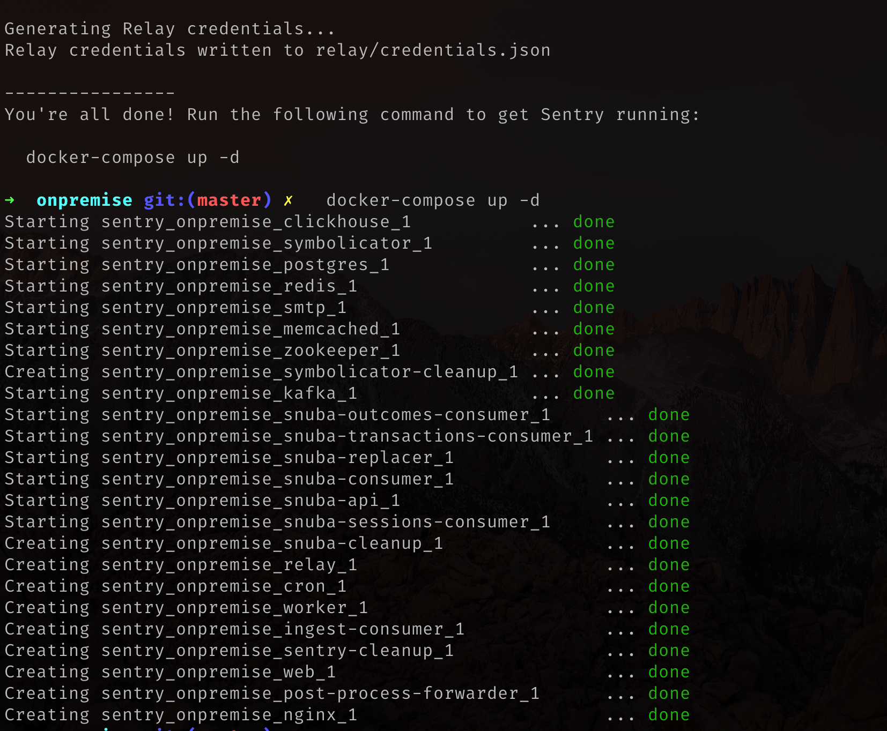
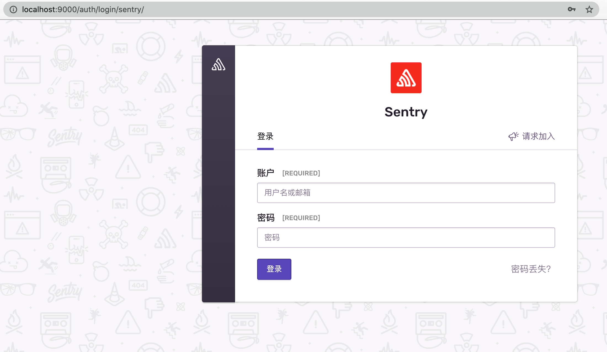

## 异常监控之 Sentry (一) - 安装 
### 简介

Sentry 是一套系统的前端监控服务，包含众多依赖服务，比如：邮件、数据库 Postgres、Snuba(快速事件搜索，筛选和聚合的服务)、Redis、Kafka等等。所以推荐使用 Docker 来安装。只要你网络够快，分分钟就可搭建完成。
使用 [Docker](/articles/docker-introduction) 安装会有很多优势。

### 如何安装

Sentry 官方维护了一个 Docker 安装配置开源项目：[onpremise](https://github.com/getsentry/onpremise)。我们只需要几个命令操作即可使用 Sentry 。

#### 安装

中间会提示输入邮箱和密码，这将作为 Sentry 的 `Owner` 。没错 Sentry 除了 Memeber、Admin、Manager几个角色外，还有一个`无任何限制(Unrestricted)
的最高权限角色` Owner。

``` bash
git clone git@github.com:getsentry/onpremise.git
cd onpremise
./install.sh
```

#### 运行

``` bash
docker-compose up -d
```



#### 校验

浏览器输入 localhost:9000，然后输入之前安装时输入的账号密码即可进入。


