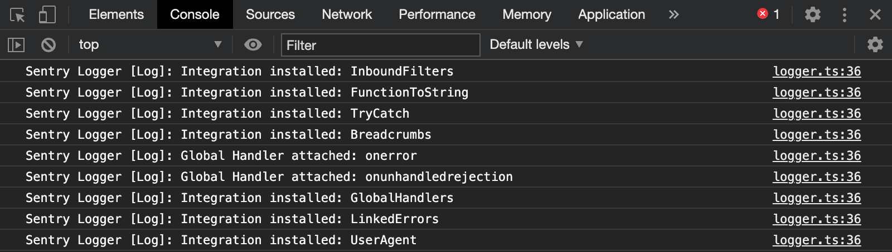
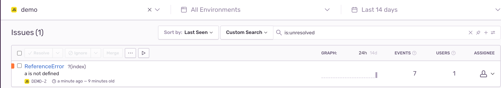
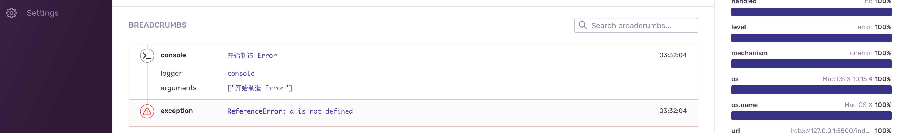
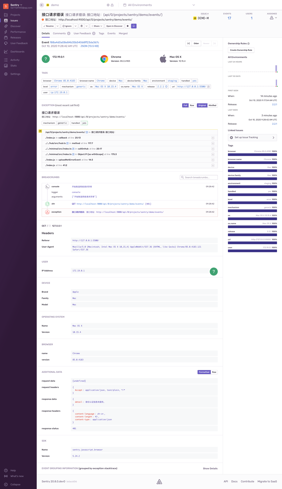
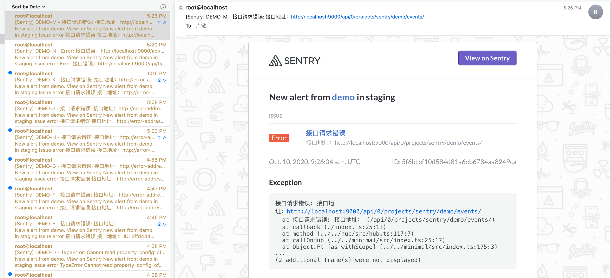

## 异常监控之 Sentry (三) - 异常捕获 
### SDK的安装

1、可以通过 ESM 方式安装；

``` bash
# Using yarn
$ yarn add @sentry/browser @sentry/tracing

# Using npm
$ npm install --save @sentry/browser @sentry/tracing
```

2、也可以通过 CDN 方式安装；
CDN包有两种：一种是包含性能监控功能的，另一个则没有。

``` html
<!-- 不包含性能监控 -->
<script
  src="https://browser.sentry-cdn.com/{{ packages.version('sentry.javascript.browser') }}/bundle.min.js"
  integrity="sha384-[object Promise]"
  crossorigin="anonymous"
></script>

<!-- 例子 -->
<script 
  src="https://browser.sentry-cdn.com/5.24.2/bundle.min.js" 
  integrity="sha384-8x1Z8KjWCA4KJ7mh5cTEtm1Jngg4yEZDYTAU3A4HfHdtaiCYba4cCuJDHQ3zc2Qe" 
  crossorigin="anonymous"></script>
```

``` html
<!-- 包含性能监控 -->
<script
  src="https://browser.sentry-cdn.com/{{ packages.version('sentry.javascript.browser') }}/bundle.tracing.min.js"
  integrity="sha384-[object Promise]"
  crossorigin="anonymous"
></script>
```

### SDK的初始化

在 **Project - SDK SETUP** 配置里可以获取 DSN。

``` javascript
import * as Sentry from "@sentry/browser";

Sentry.init({
  dsn: "http://5764bca3ccd0484ebe9bd0ef19b7541b@localhost:9000/2", // 上报的服务器源
  debug: true,
  release: 'common-auth@1.3.2', // 标记发布版本
  environment: "staging", // 区分上报环境的常用参数
});
```

正式环境 debug 推荐设置 false，默认为 false。

release 信息可以标记上报事件对应的发布版本信息。在处理完结果后需`及时更新`版本信息，在 `node\npm` 环境考虑使用 `process.env.npm_package_version` 来代替手动操作。

浏览器控制台的初始化信息：

[](sentry_sdk_initlog.png)

初始化还有其它选项，可以参考：[https://docs.sentry.io/platforms/javascript/configuration/options/](https://docs.sentry.io/platforms/javascript/configuration/options/)

### 模拟错误上报

``` html
<!DOCTYPE html>
<html lang="en">
<head>
  <meta charset="UTF-8">
  <script src="https://browser.sentry-cdn.com/5.24.2/bundle.min.js" integrity="sha384-8x1Z8KjWCA4KJ7mh5cTEtm1Jngg4yEZDYTAU3A4HfHdtaiCYba4cCuJDHQ3zc2Qe" crossorigin="anonymous"></script>
  <script>
    Sentry.init({
      dsn: "http://5764bca3ccd0484ebe9bd0ef19b7541b@localhost:9000/2",
      debug: true,
      environment: "staging",
    });
  </script>
  <script>
    console.log('开始制造 Error');
    console.log(a.test());
    console.log('这行无法被执行');
  </script>
</head>
</html>
```

在选择的项目 Issues 列表就有会出现上报事件，包含基本错误类型和错误消息。

[](sentry_demo_tracking.png)

点进去可以通过面包屑(Breadcrumb)，来定位问题。

[](sentry_demo_tracking_detail.png)

### 手动自定义事件上报

除了默认的全局自动事件上报，我们也可以自定义错误消息上报，这点在监控网络请求错误会比较有用。

``` javascript
import axios from 'axios';

function foo() {
  console.log('开始制造网络请求异常');
  const requestUrl = 'http://localhost:9000/api/0/projects/sentry/demo/events/';
  const requestParams = {
    name: 'demo',
    age: 18
  };
  return axios.get(requestUrl, requestParams);
}

function uploadNetErrorEvent(error) {
  Sentry && Sentry.withScope(function (scope) {
    // 设置请求信息
    scope.setExtra('request headers', error.config.headers);
    scope.setExtra('request data', error.config.data);

    // 设置响应信息
    if (error.response) {
      scope.setExtra('response status', error.response.status);
      scope.setExtra('response headers', error.response.headers);
      scope.setExtra('response data', error.response.data);
    }
    // 创建异常描述
    let err = new Error('接口地址：' + error.config.url);
    err.name = '接口请求错误'
    // 手动捕获异常
    Sentry.captureException(err);
  });
}

foo().catch(error => {
  uploadNetErrorEvent(error);
});
```

下面是错误信息以及邮件通知：

[](sentry_self_error1.png)
[](sentry_self_error.png)

扩展阅读:

\> [https://docs.sentry.io/platforms/javascript/install/cdn/](https://docs.sentry.io/platforms/javascript/install/cdn/)

\> [https://docs.sentry.io/platforms/javascript/sourcemaps/](https://docs.sentry.io/platforms/javascript/sourcemaps/)
