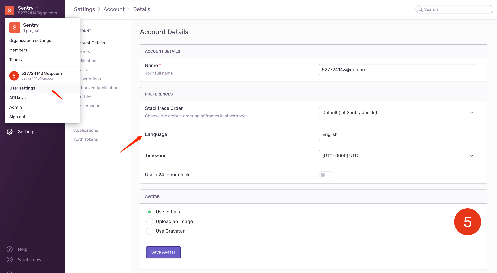
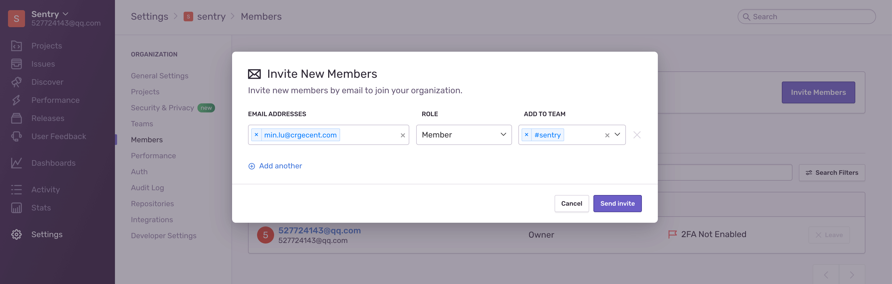
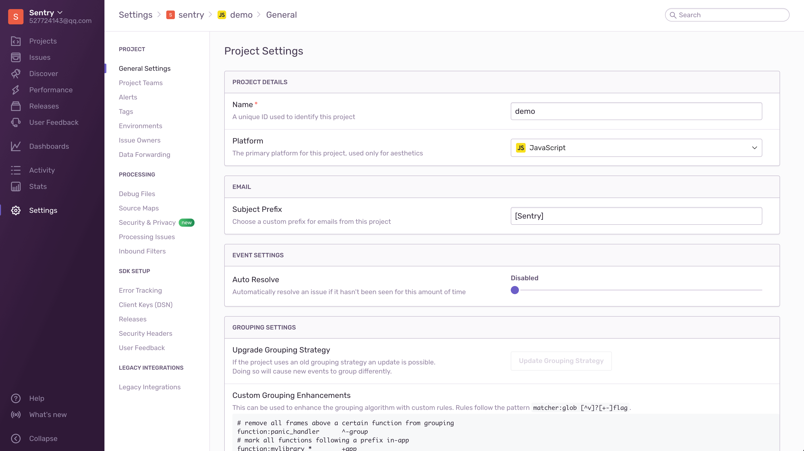
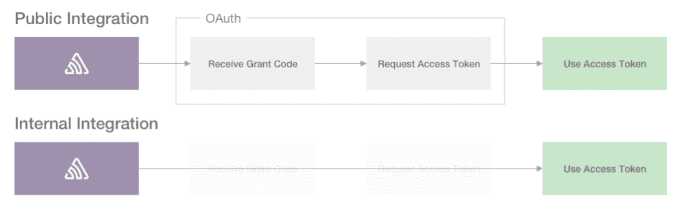
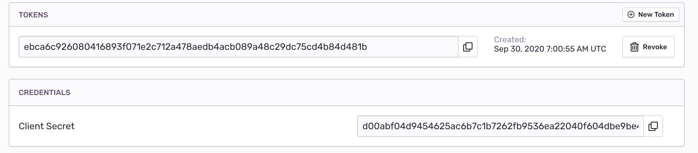
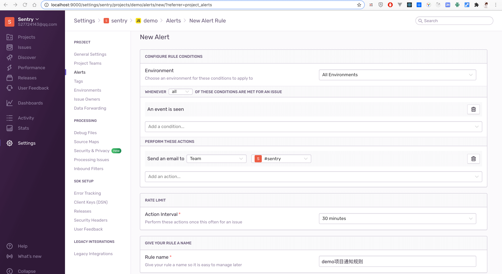
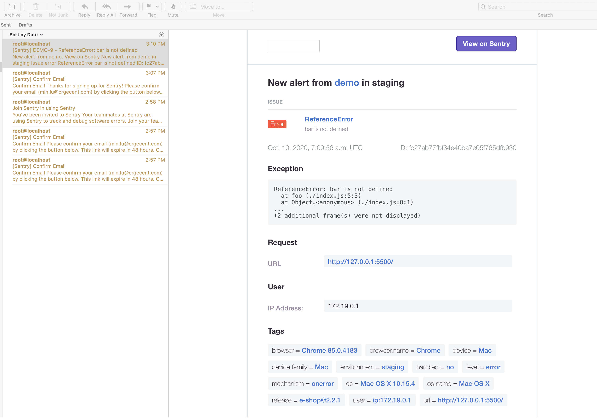

## 异常监控之 Sentry (二) - 配置 
#### 1. 修改界面语言

点击左上角个人头像或信息 User settings。

[](sentry-lan.png)

#### 2. 团队与成员

Sentry 的成员管理以团队 (Team) 的形式做分组，一个项目 (Project) 可以对应多个团队，不过多介绍。

添加成员，通过邮件邀请的方式：

[](sentry_invite_member.png)

#### 3. 项目的设置

项目的设置在 **Settings - Projects** 里，点击你要设置项目即可。

[](sentry_project_settings.png)

#### 4. 环境设置 (Environment)

Sentry 里每次上报叫做`事件(Event)`，上报的环境区分并不在后台管理里配置，而是由 Sentry 客户端SDK来生成。

以浏览器端为例：

``` javascript
import * as Sentry from "@sentry/browser";

Sentry.init({
  environment: "production",
});
```

> 环境创建后无法删除，只能隐藏。除非移除SDK上报，不然上报依然被 Sentry 记录。

#### 5. 集成平台 (Integration Platform) 的设置

集成平台可以让外部服务通过REST API 或 webhooks 与 Sentry 进行交互。

集成分为`公共集成(Public integration)`和`内部集成(Internal integration)`。可在 **Settings - ORGANIZATION - Developer Settings** 里配置。

在使用上不同点是公共集成多了一个 `OAuth 的授权` 流程，以此获取 `Access Token` 。

[](sentry_authentication_flow.png)

##### 创建内部集成

这里我们创建一个名为 `source-map` 的内部集成用于 Source Maps 的上传。

在 PERMISSIONS 的 Release 项给予 Admin权限，创建即可。创建完成就可以看到`访问令牌(Access Token)`和`秘钥(Client Secret)`了，秘钥勿外露。

[](sentry_sourcemap_token.png)

#### 6. 设置邮件通知规则

当发生异常事件时，我们需要制定邮件通知规则来。通知对应的人员去及时关注及解决它。

[](sentry_email_setting.png)

这里设置只要有异常事件就发送邮件通知，并把邮件发送人设置为 sentry 团队里的所有成员。

[](sentry_email_error.png)
