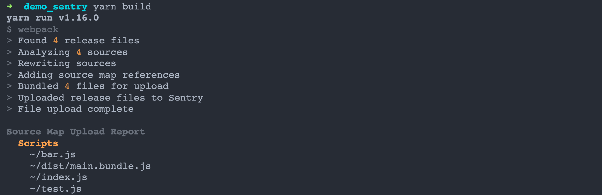
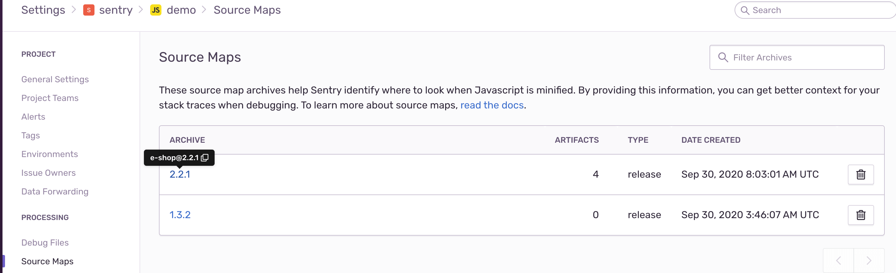
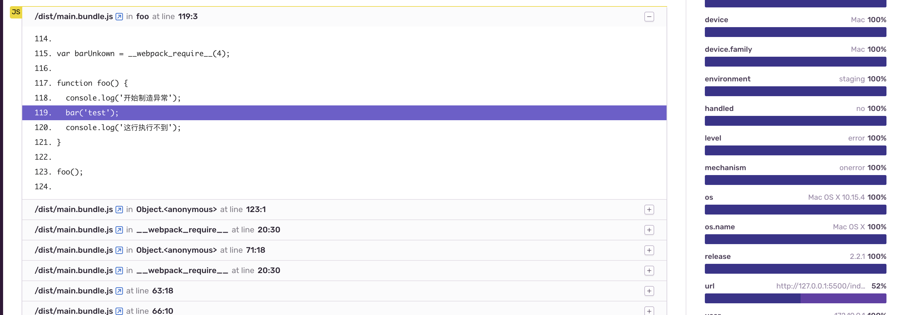

## 异常监控之 Sentry (四) - Source Map 
### Source Maps 上传

Source Map 用于分析错误位置，对于被 minified 后的代码 (例如UglifyJS) 或从高级语言 (例如TypeScript和ES6) 中转译的代码特别有用。`通常在编译构建时，我们就可以上传了`。

这里有个基于 webpack 插件的官方[example](https://github.com/getsentry/sentry-webpack-plugin/tree/master/example)，下面以此为基础进行设置。

在 webpack.config.js 里的配置：

``` javascript {hl_lines=["13-16"]}
const SentryCliPlugin = require('@sentry/webpack-plugin');
const path = require('path');

module.exports = {
  entry: ['./index.js'],
  output: {
    filename: '[name].bundle.js',
    path: path.resolve(__dirname, 'dist'),
  },
  devtool: 'source-map',
  plugins: [
    new SentryCliPlugin({
      // sentry-cli configuration
      authToken: 'ebca6c926080416893f071e2c712a478aedb4acb089a48c29dc75cd4b84d481b', 
      org: 'sentry',
      url: "http://localhost:9000/",
      project: "demo",

      // webpack specific configuration
      include: './dist', // 只需包括输出目录好了
      ignoreFile: '.sentrycliignore',
      ignore: ['node_modules', 'webpack.config.js'],
      release: 'e-shop@2.2.1',
    }),
  ],
};
```

 `authToken` 的申请可以参考配置篇的[创建内部集成](/blog/sentry-2-setting)。

打包控制台输出：

[](sentry_sourcemap_build.png)

上传成功后，可以在 Sentry 管理平台上看见对应项目的 Source Maps。

[](sentry_source_map_view.png)

### 模拟异常捕获 (Error Tracking)

通过修改 index.js 文件里代码，制造一次异常事件：

``` javascript
// 把 bar 重命名为 barUnkown
var barUnkown = require('./bar');

function foo() {
  console.log('开始制造异常');
  bar('test');
  console.log('这行执行不到');
}
foo();
```

在 index.html 里引入 main.bundle.js：

``` html
<!DOCTYPE html>
<html lang="en">
<head>
  <meta charset="UTF-8">
  <script src="https://browser.sentry-cdn.com/5.24.2/bundle.min.js" integrity="sha384-8x1Z8KjWCA4KJ7mh5cTEtm1Jngg4yEZDYTAU3A4HfHdtaiCYba4cCuJDHQ3zc2Qe" crossorigin="anonymous"></script>
  <script>
    Sentry.init({
      dsn: "http://5764bca3ccd0484ebe9bd0ef19b7541b@localhost:9000/2",
      debug: true,
      release: 'e-shop@2.2.1',
      environment: "staging",
    });
  </script>
  <script src="./dist/main.bundle.js"></script>
</head>
</html>
```

> 注意SDK初始化的 release 和 webpack插件里的 release 设置项保持一致，不然上报的事件就无法映射到对应的 source map。

Sentry 上的捕获信息：

[](sentry_source_map_result.png)

### 持续集成环境(CI)下的设置

在 CI 环境下，可以通过`~/.sentryclirc`文件来存储公共信息 (例如：authToken、org、url等等cli配置项) 。

``` yml
[auth]
token=your-auth-token
```

可以设置环境变量

``` bash
export SENTRY_AUTH_TOKEN=your-auth-token
```

或者直接命令写入

``` bash
sentry-cli --auth-token your-auth-token
```

总之，统一管理，免去SDK初始化非必要配置和后续修改配置维护成本。

扩展阅读:

\> [https://docs.sentry.io/platforms/javascript/install/cdn/](https://docs.sentry.io/platforms/javascript/install/cdn/)

\> [https://docs.sentry.io/platforms/javascript/sourcemaps/](https://docs.sentry.io/platforms/javascript/sourcemaps/)
