## 微前端 (一) - 理念篇 
### 什么是微前端？

微前端 (micro-frontends) 术语在 2016 年在 [TECHNOLOGY RADAR](https://www.thoughtworks.com/cn/radar/techniques/micro-frontends) 中被提及。

> 该网站叫做 thoughtworks，有个叫`雷达` (radar) 的技术期刊，用于持续追踪有趣的技术是如何发展的，每种技术被称之为`条目`。

该条目提到了`微服务`中，多服务可`独立部署`并易于`扩展交付`的特性。而随着前端`单页面应用` (SPA) 的流行，构建大型应用需要更为合理的前端架构来管理`多开发人员`和`多团队`开发带来的复杂性。

### 微前端的含义

微前端应该有两方面的含义：

1. 从架构来说，`微前端`采用微服务的一些设计理念，是实现组合多应用的一种技术架构；
2. 每个微 (子) 应用，我们可以称之为`微前端`。

### 优势

* **技术栈无关**
<br>主框架不限制接入应用的技术栈，微应用具备完全自主权

* **独立开发、独立部署**
<br>与微服务一样，微前端的独立部署能力是关键。这会缩小任何给定部署的范围，从而降低相关风险。无论您的前端代码以何种方式或在哪里托管，每个`微应用`都应该有自己的`持续交付管道`，用于`构建`、`测试`并将其部署到`生产环境`。
<br>

* **团队自治**
<br>我们的团队将围绕业务功能的垂直切片组建，而不是围绕技术能力。每个微应用都是封装的单个页面，并由单个团队端到端维护，这带来了团队更高的凝聚力。
<br>

* **增量升级**
<br>在面对各种复杂场景时，我们通常很难对一个已经存在的系统做全量的技术栈升级或重构，而微前端是一种非常好的实施渐进式重构的手段和策略。

* **独立运行时**
<br>每个微应用之间状态隔离，运行时状态不共享。

微前端架构旨在解决`单体应用`在一个相对长的时间跨度下，由于参与的人员、团队的增多、变迁，从一个普通应用演变成一个`巨石应用` (Frontend Monolith) 后，随之而来的应用不可维护的问题。这类问题在企业级 Web 应用中尤其常见。

### 为什么不用 iframe

[这里](https://www.yuque.com/kuitos/gky7yw/gesexv)给出了解释，主要有以下几点：

1. URL 状态不同步。iframe 的页面 url 中的状态信息并不能同步到父窗口，无法使用浏览器的前进后退功能。
2. DOM 结构不共享。iframe 的页面布局只针对于 iframe 窗口 (例如：全局弹框无法给出合理布局) 。
3. 全局上下文完全隔离，内存变量不共享。iframe 内外系统的通信、数据同步等需求，主应用的 cookie 要透传到根域名都不同的微应用中实现免登效果。
4. 慢。每次微应用进入都是一次浏览器上下文重建、资源重新加载的过程。

### 集成方式

#### Iframe 集成

在浏览器中组合应用程序的最简单方法之一是不起眼的 iframe。就其性质而言，iframe 可以轻松地从独立的子页面构建页面。它们还在样式和全局变量方面提供了很好的隔离度，不会相互干扰。

虽然不推荐，但是这里仍然展示其基本使用方式：

``` html
<html>
  <head>
    <title>Feed me!</title>
  </head>
  <body>
    <h1>Welcome to Feed me!</h1>

    <iframe id="micro-frontend-container"></iframe>

    <script type="text/javascript">
      const microFrontendsByRoute = {
        '/': 'https://browse.example.com/index.html',
        '/order-food': 'https://order.example.com/index.html',
        '/user-profile': 'https://profile.example.com/index.html',
      };

      const iframe = document.getElementById('micro-frontend-container');
      iframe.src = microFrontendsByRoute[window.location.pathname];
    </script>
  </body>
</html>
```

#### Javascript 集成

这种方法可能是最灵活的方法，也是我们看到团队最常采用的方法。每个`微应用`都使用`<script>`标签包含在页面上，并在加载时公开一个`全局函数`作为其`入口`点。然后`容器应用程序`确定应该挂载哪个`微应用`，并调用相关函数来告诉微前端何时何地渲染自己。

下面是一个比较粗糙的实现，不过它演示了基本技术：

``` html
<html>
  <head>
    <title>Feed me!</title>
  </head>
  <body>
    <h1>Welcome to Feed me!</h1>

    <!-- 这些 bundle 不会立即渲染任何东西 -->
    <!-- 每一个 boudle 提供一个“入口函数”添加到 window -->
    <script src="https://browse.example.com/bundle.js"></script>
    <script src="https://order.example.com/bundle.js"></script>
    <script src="https://profile.example.com/bundle.js"></script>

    <div id="micro-frontend-root"></div>

    <script type="text/javascript">

      const microFrontendsByRoute = {
        '/': window.renderBrowseRestaurants,
        '/order-food': window.renderOrderFood,
        '/user-profile': window.renderUserProfile,
      };

      // 路由其中一个入口函数
      const renderFunction = microFrontendsByRoute[window.location.pathname];

      // 提供一个元素 ID ，作为渲染容器
      renderFunction('micro-frontend-root');
    </script>
  </body>
</html>

```

#### Web Components 集成

这是前一种方法的一个`变体`是为每个微前端定义一个 HTML 自定义元素供容器实例化，而不是定义一个全局函数供容器调用。

``` html
<html>
  <head>
    <title>Feed me!</title>
  </head>
  <body>
    <h1>Welcome to Feed me!</h1>

    <!-- 这些 bundle 不会立即渲染任何东西 -->
    <!-- 每一个 bundle 都自定义了一个元素类型 -->
    <script src="https://browse.example.com/bundle.js"></script>
    <script src="https://order.example.com/bundle.js"></script>
    <script src="https://profile.example.com/bundle.js"></script>

    <div id="micro-frontend-root"></div>

    <script type="text/javascript">
      
      const webComponentsByRoute = {
        '/': 'micro-frontend-browse-restaurants',
        '/order-food': 'micro-frontend-order-food',
        '/user-profile': 'micro-frontend-user-profile',
      };
      // 路由对应组件
      const webComponentType = webComponentsByRoute[window.location.pathname];

      // 把组件挂载到容器上。
      const root = document.getElementById('micro-frontend-root');
      const webComponent = document.createElement(webComponentType);
      root.appendChild(webComponent);
    </script>
  </body>
</html>
```

### 样式 (Styling)

CSS 作为一种语言本质上是`全局的`、`继承的`和`级联的`，传统上没有`模块系统`、`命名空间`或`封装`。其中一些功能现在确实存在，但通常缺乏浏览器支持。

在微前端环境中，这些问题中的许多问题都会加剧。例如：如果一个团队的微前端有一个样式表说 h2 { color: black; }，另一个说 h2 { color: blue; }，并且这两个选择器都附加到同一个页面，那么有人会感到失望！这不是一个新问题，但由于这些选择器是由不同团队在不同时间编写的，并且代码可能分散在不同的存储库中，因此更难发现，这一事实使情况变得更糟。

多年来，人们发明了许多方法来使 CSS 更易于管理：

* 有些选择使用严格的命名约定，例如：[BEM](http://getbem.com/)，以确保选择器仅适用于预期的地方；
* 其他不喜欢单独依赖开发人员纪律的人使用`预处理器`，例如：`SASS`，其选择器嵌套可用作命名空间的一种形式；
* 一种较新的方法是使用 `CSS 模块` 或各种 `CSS-in-JS 库`，以`编程方式`应用所有样式，确保仅在开发人员想要的位置直接应用样式；
* 对于更基于平台的方法，`shadow DOM` 还提供样式隔离。

`选择的方法`并`不重要`，只要找到一种方法来确保开发人员可以`独立编写他们的样式`，并确信他们的代码在组合成单个应用程序时的`行为是可预测`的。

### 共享组件库

我们在上面提到过微前端的`视觉一致性`很重要，一种方法是开发一个共享的、可重用的 UI 组件库。总的来说，我们认为这是一个好主意，虽然很难做好。

创建这样一个库的主要好处是通过重用代码和视觉一致性来减少工作量。此外，您的组件库可以作为一个活生生的样式指南，它可以成为开发人员和设计人员之间很好的协作点。

#### 注意点

* 最容易出错的事情之一就是过早地创建过多的这些组件。创建一个具有所有应用程序所需的所有常见视觉效果的 `Foundation Framework` 是很有诱惑力的。然而，经验告诉我们，在实际使用组件之前，很难甚至不可能猜测它们的 API 应该是什么，这会导致组件早期的大量流失。出于这个原因，我们更愿意让团队根据需要在他们的代码库中创建自己的组件，即使这最初会导致一些重复。一旦组件的 API 变得明显，你就将重复的代码放入共享库中。
<br>例如：图标、标签和按钮。我们还可以共享可能包含大量 UI 逻辑的更复杂的组件，例如：自动完成的下拉搜索字段。或者一个可排序、可过滤、分页的表格。

* 确保您的共享组件仅包含 UI 逻辑，而`不包含业务`或`域逻辑`。当域逻辑被放入共享库时，它会在应用程序之间产生高度耦合，并增加更改的难度。
<br>例如，通常不应该尝试共享 `ProductTable`，其中将包含关于“产品”究竟是什么以及人们应该如何表现的各种假设。这样的域建模和业务逻辑属于微前端的应用程序代码，而不是共享库。

#### 谁负责共享库

与任何共享的内部库一样，其`所有权`和`治理`也存在一些棘手的问题。

* **共享资产**
<br>作为共享资产，“每个人”都拥有它，但实际上这通常意味着没有人拥有它。它可以很快成为没有`明确约定`或`技术愿景`的不一致代码的大杂烩。在另一个极端，如果共享库的`开发完全集中`，那么`创建组件的人`和`使用它们的人`之间就会出现很大的`脱节`。

* **保管人模型**
<br>我们见过的最好的模型是任何人都可以为库做贡献，但需要一个`保管人` (一个人或一个团队) 负责确保这些贡献的`质量`、`一致性`和`有效性`。维护共享库的工作需要强大的技术技能，还需要培养跨多个团队的协作所需的人员技能。

### 跨应用通信

微前端最常见的问题之一是如何让微应用间相互通信。

一般而言，我们建议让他们尽可能少地交流，因为这通常会重新引入我们最初试图避免的那种不适当的耦合。也就是说，通常需要的是`某种程度`的跨应用通信。

几种通信方式：

* `自定义事件`允许微应用间接通信，这是最小化直接耦合的好方法，尽管它难以建立强约定。
* `向下传递`回调和数据的 React 模型 (从`容器应用`向下传递到`微应用`) 也是一个很好的解决方案，它使约定更加明确。
* 使用`地址栏`作为通信机制，我们将在下一篇更详细地探讨这种机制。

如果使用 redux，通常的方法是为整个应用程序创建一个`单一的`、`全局的`、`共享的`存储。然而，如果每个微应用都应该是独立应用，那么每个微应用都有自己的 redux 存储是有意义的。redux 文档甚至提到“将 Redux 应用程序隔离为更大应用程序中的一个组件”。

无论我们选择哪种方法，我们都希望我们的微应用通过`事件消息`来进行通信，并避免任何共享状态。就像跨微服务共享数据库一样，一旦我们共享了我们的数据结构和域模型，就会产生大量耦合，并且很难进行更改。

与样式一样，有几种不同的方法可以在这里很好地工作。但你仍然需要注意的是：

* 仔细考虑你要引入什么样的耦合。
* 随着时间的推移你将如何`保持这种契约`。就像微服务之间的集成一样，如果没有跨不同应用程序和团队的协调升级过程，您将无法对集成进行重大更改。

### 身份验证和授权

微应用的用户应该如何通过服务器进行身份验证和授权？显然，我们的客户应该只需要对自己进行`一次身份验证`，因此身份验证通常属于应该由容器应用拥有的`横切关注点` (cross-cutting concerns) 类别。

容器可能有某种登录表单，通过它我们可以获得某种令牌。该令牌将由容器拥有，并且可以在`初始化`时`注入`到每个微应用。

最后，微应用可以将令牌连同它向服务器发出的任何请求一起发送，服务器可以执行任何需要的验证。

### 测试 (Testing)

在测试方面，我们认为`单体应用`和`微应用`之间没有太大区别。一般来说，测试单体应用的任何策略都可以在每个单独的微应用中重现。也就是说，每个微应用都应该有自己全面的`自动化测试套件`，以确保代码的质量和正确性。

明显的差距将是各种`微应用`与`容器应用`的`集成测试`。这可以使用您首选的`功能/端到端`测试工具 (例如 `Selenium` 或 `Cypress` ) 来完成，但不要太过分；

`功能测试`应该只涵盖无法在[测试金字塔](https://martinfowler.com/bliki/TestPyramid.html) (TestPyramid) 的较低级别进行测试的方面。我们的意思是，使用`单元测试`来覆盖您的`低级业务逻辑`和`呈现逻辑`，然后使用`功能测试`来验证页面是否正确组装。

例如，您可以在特定 URL 加载完全集成的应用程序，并`断言`相关微应用的硬编码标题存在于页面上。

如果有跨应用的用例，那么可以使用`功能测试`来覆盖这些，但让`功能测试`专注于验证应用的`集成`，而不是每个微应用的内部业务逻辑。微应用的内部逻辑应该已经被单元测试覆盖。

参考资料：

\> [https://micro-frontends.org/](https://micro-frontends.org/)

\> [https://martinfowler.com/articles/microservices.html](https://martinfowler.com/articles/microservices.html)

\> [https://martinfowler.com/articles/micro-frontends.html](https://martinfowler.com/articles/micro-frontends.html)

\> [https://qiankun.umijs.org/zh/guide](https://qiankun.umijs.org/zh/guide)

\> [https://github.com/naltatis/micro-frontends-in-action-code](https://github.com/naltatis/micro-frontends-in-action-code)
