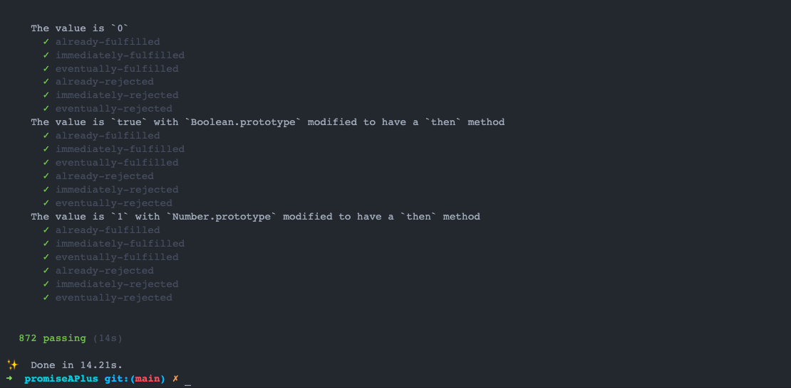

## 探索 Javascript 里的 Promise 
### 介绍

在计算机科学中，`future`、`promise`、`delay` 和 `deferred` 是指用于在某些并发编程语言中同步程序执行的构造。由于某些计算 (或者网络请求) 尚未结束，我们需要一个对象来代理这个未知的结果，于是就有了上述这些构造 (future、promise等) 。

Promise 一词在1976年就已提出，也有称之为 `eventual`，它的应用起源于[函数式编程](https://zh.wikipedia.org/wiki/函数式编程)和相关范例。

> 无论是函数式编程还是面向对象编程都是编程范式，即如何编程程序的方法论。

### Javascript 里的 Promise

[ECMAScript 2015 (6th Edition, ECMA-262) Promise](https://262.ecma-international.org/6.0/#sec-promise-objects)的标准定义是：“一个 Promise 是一个对象(object)，用于延时计算或异步计算的最终结果的占位”。

在 javascript 里创建 一个 Promise 如下：

``` javascript
const p = new Promise((resolutionFunc, rejectionFunc) => {
    resolutionFunc(777);
});
```

更多用法可以查看文章[Javascript Promise 的使用](/articles/promise-what-you-need-know)。

任何 Promise 对象都存在三个互斥状态：`fulfilled`、`rejected`、以及 `pending`，即同时只存在其中一个状态。

假设有一个 Promise 实例 **p** ：

* 如果立即入列 `p.then(f, r)` 任务并且之后再调用 `f` 函数 ，那么 `p` 的状态是 `fulfilled` ；
* 如果立即入列 `p.then(f, r)` 任务并且之后再调用 `r` 函数 ，那么 `p` 的状态是 `rejected` ；
* 如果 `p` 的状态不是 `fulfilled` 也不是 `rejected`，那么标记为 `pending` 状态。

### 解读 Promises/A+ 规范

实现 Promise 代码普遍采用[Promises/A+ 规范](https://promisesaplus.com/)，通过它我们会得到一些基础概念。

Promise 表示一个异步操作的最终结果，能和 promise 进行交互的只有它的 `then` 方法，`then` 方法注册一个回调函数用于接收 promise 的结果值或拒绝 (reject) 的原因 (reason) 。

#### 术语

1. `promise` ：是一个对象或函数，它的行为符合本规范；
2. `thenable` ：是一个对象或函数，用于定义 `then` 方法；
3. `value` ：是一个合法的 Javascript 类的值 (包括undefined，ableable 或 promise) ；
4. `exception` ：是使用 `throw` 语句引发的值；
5. `reason` ：是表明拒绝承诺 (reject promise) 的原因的值。

#### 要求

一个 promise `必须`是这三种状态之一：`pending`、`fulfilled` 或 `rejected` 。

1. 若 promise 进入了 `pending` 状态：
   * 那么接下来可能进入 `fulfilled` 或 `rejected` 状态。
2. 若 promise 进入了 `fulfilled` 状态：
   * 禁止进入其它状态；
   * 必须有一个值且不能发生改变。
3. 若 promise 进入了 `rejected` 状态：
   * 禁止进入其它状态；
   * 必须有一个原因 (reason) 且不能发生改变。

#### then 方法

一个 promise `必须`提供一个 `then` 方法来访问最终值 (eventual value) 或原因 (reason) 。

Promise 的 then 方法接受两个参数：

``` javascript
promise.then(onFulfilled, onRejected)
```

1. `onFulfilled` 和 `onRejected` 都是可选的：
   * `onFulfilled` 如果不是函数，必须忽略；
   * `onRejected` 如果不是函数，必须忽略。
2. 若 `onFulfilled` 是一个函数：
   * 必须在 **fulfilled** 的时候被调用，并且 promise 的结果值作为其第一个参数；
   * 禁止在 **fulfilled** 之前被调用；
   * 禁止调用超过一次。
3. 若 `onRejected` 是一个函数：
   * 必须在 **rejected** 的时候被调用，并且 promise 的 reason 作为其第一个参数；
   * 禁止在 **rejected** 之前被调用；
   * 禁止调用超过一次。
4. 在[执行上下文](https://es5.github.io/#x10.3)堆栈里仅包含[平台代码](/articles/what-is-promise/#注释)之前，`onFulfilled` 或 `onRejected` 禁止被调用。
5. `onFulfilled` 和 `onRejected` 必须作为函数调用 (即没有 `this` 值) 。
6. 同一个 promise，`then` 可能被调用多次：
   * 无论何时，只要 promise 为 **fulfilled**，则所有 `onFulfilled` 回调必须按照他们原有的次序给 `then` 做调用；
   * 无论何时，只要 promise 为 **rejected**，则所有 `onRejected` 回调必须按照他们原有的次序给 `then` 做调用；
7. `then` 必须返回一个 promise。**promise2 = promise1.then(onFulfilled, onRejected)**：
   * 若 `onFulfilled` 或 `onRejected` 任一个返回了值 `x`，则运行 Promise 解决程序 **[[Resolve]](promise2, x)**；
   * 若 `onFulfilled` 或 `onRejected` 任一个抛出异常 `e`，**promise2** 必须被 rejected 并携带的 `e` 值作为异常原因；
   * 若 `onFulfilled` 不是个函数并且 **promise1** 为 **fulfilled**，则 **promise2** 必须为 **fulfilled** 且和 **promise1** 有相同的值；
   * 若 `onRejected` 不是个函数并且 **promise1** 为 **rejected**，则 **promise2** 必须为 **rejected** 且和 **promise1** 有 reason 值；

#### Promise 解决程序 (Promise Resolution Procedure)

**Promise Resolution Procedure** 是一个`抽象操作`，用来输入一个 promise 和一个 value，我们表示为`[[Resolve]](promise, x)`。

若 `x` 是一个 `thenable`，则它尝试使 promise 采用 `x` 的状态，这建立在 `x` 的行为看起来像个 promise的假设下。否则，它满足 (fulfills) x 为一个 promise。

对于多个 thenables 的处理，只要他们暴露一个兼容 `Promises/A+` 的 then 方法，就允许 promise 之间的交互。它还允许多个` Promises/A+ `的实现去同化那些不兼容的实现。

运行`[[Resolve]](promise, x)`的步骤如下:

1. 若 promise 和 x 引用到同一个对象，则 reject promise 并抛出一个 TypeError 作为 reason。
2. 若 x 是一个 promise，则采用其状态：
   1. 若 x 为 pending，则 promise 必须保留 x 为 pending，直到 x 被 `fulfilled` 或 `rejected` 为止。
   2. 无论何时，只要 x 为 fulfilled，则 fulfill promise ，并且他们的值是相同的。
   3. 无论何时，只要 x 为 rejected，则 reject promise ，并且他们的原因是相同的。
3. 否则，若 x 是一个对象或函数：
   * 让 `then` 成为 `x.then` ；
   * 若在一个已抛出的异常值 `e` 里，发现 `x.then` 的结果属性，则 reject promise，并把 `e` 作为 reason。
   * 若 `then` 是一个函数，则 x 作为 this 来调用它，第一个参数为 `resolvePromise`，第二个参数为 `rejectPromise`，当:
     * 无论何时，只要 resolvePromise 被调用时携带一个值 y，则运行`[[Resolve]](promise, y)`；
     * 无论何时，只要 rejectPromise 被调用时携带一个 reason `r`，则 reject promise，并提供 `r` ；
     * 若 resolvePromise 和 rejectPromise 都被调用，或多个调用产生相同参数，则第一个调用获得优先权，并其它调用都被忽略；
     * 若调用中抛出了异常 `e` :
       * 若 resolvePromise 或 rejectPromise 已被调用，则忽略它；
       * 否则，reject promise 并返回 e 作为 reason。
   * 若 `then` 不是一个函数，则 fulfill promise 并返回 x；
4. 若 x 不是一个对象或函数，则 fulfill promise 并返回 x。

如果一个 promise 通过参与一个环形的 thenable 链解决 (resolved) ，比如 `[[Resolve]](promise, thenable)`的递归，这最终导致[[Resolve]](promise, thenable) 无限执行。在 promise 的实现中，鼓励对这种递归的检测并抛出 TypeError 作为 reason，但不被要求必须这么做。

#### 注释

* `平台代码`：这里的**平台代码** (platform code) 是指引擎 (engine) 、环境 (environment) 和实现 promise 的代码。实际上，此要求是为了在事件循环轮到 then 之后，确保 onFulfilled 和 onRejected 能异步得被执行并且使用新的堆栈。这可以通过`宏任务 (macro-task)`机制 (例如 setTimeout 或 setImmediate ) 或`微任务 (micro-task)`机制 (例如MutationObserver 或 process.nextTick) 来实现。 promise 的实现被视为平台代码，因此它本身可能包含`任务调度队列 (task-scheduling queue)`或`蹦床 (trampoline)`。
* `x` : 通常，只有 `x` 来自当前的实现才能知道这是一个真正的 promise。本节允许采用已知符合 promise 的状态。
* 对于 promise 的实现中，不应该对 thenable 链做任何深度限制。只有在循环的 thenable 才导致 `TypeError`，若遇到一个有区别的无限thenables 链，那么递归永远是正确的行为。

> micro-task  (音标：['maikrəu]) 与 macro-task (音标：[ˈmækroʊ])  的区别是`执行顺序`，micro-task 优先于 macro-task 执行，在实现 Promise 的浏览器中，通常采用 micro-task 作为其异步执行机制。

### Javascript 语言的 Promise 实现

下面的代码以 ES6 语法实现 Promise，我们将根据[官方测试套件](https://github.com/promises-aplus/promises-tests)的来测试我们的 Promise。

#### 创建 Promise

根据协议，我们可以得知：

1. Promise 是一个对象；
2. Promise 有个唯一状态；
3. Promise 有个 value，用于存储结果值或 reason。

所以我们写出我们的基本代码：

``` javascript
// 状态
const PENDING = 0
const FULFILLED = 1
const REJECTED = 2

class Promise {

  constructor() {
    this.state = PENDING
    this.value = void 0 // 用于存放 resolve 的结果值，或者 reject 后的 reason
   }
}
```

实例化一个 Promise 通常是下面这种用法：

``` javascript
new Promise((resolve, reject) => resolve("done"));
```

实例化时，会传入一个回调函数，我们叫作 executor，它有两个函数类型的参数，分别是 resolve 和 reject。resolve 用于通知任务完成，reject 用于通知任务失败。

所以在构造函数里，我们加入此参数：

```javascript
class Promise {
  constructor(executor) {
    if (typeof executor !== "function") {
      throw new TypeError( `Promise resolver ${executor} is not a function` );
    }

    this.state = PENDING
    this.value = void 0 // 用于存放 resolve 的结果值，或者 reject 后的 reason
    tryDoIt(this, executor);
  }
}
```

这里 tryDoIt 函数，用于执行回调，我们将在后面的小节介绍到，这里先略过。

#### 编写 Promise 中的 then()

then 是规范定义的必要函数，也是链式调用的关键。

考虑以下两种情况：

``` javascript

// 第一种情况
let promise = new Promise(resolve => resolve("done"))
promise.then(v => console.log(v))

// 第二中情况
let promise = new Promise(resolve => {
  setTimeout(() => resolve("done"), 1000)
});
promise.then(v => console.log(v))
```

第一种情况， 因为实例化 Promise 的时候会立即 resolve，所以 then 的的回调会立马执行。

第二种情况， promise 设为 1 秒后 resolve，所以 then 的的回调会在 1 秒后才执行。

因此，我们对于then 的回调需要用队列来存储，直到 promise 从 pending 状态转为 fulfilled 或 rejected 才被执行。

``` javascript

class Handler {
  constructor() {
    this.onFulfilled = null;
    this.onRejected = null;
  }
}

class Promise {

  constructor(executor) {
    if (typeof executor !== "function") {
      throw new TypeError( `Promise resolver ${executor} is not a function` );
    }

    this.state = PENDING
    this.value = void 0
    this.queue = []
    this.handler = new Handler()
    tryDoIt(this, executor);
  }

  then(onFulfilled, onRejected) {
    let newPromise = new Promise((resolve, reject) => {
      if (this.state === FULFILLED && typeof onFulfilled !== "function") {
        resolve(this.value);
      } else if (this.state === REJECTED && typeof onRejected !== "function") {
        reject(this.value);
      }
    })

    if (typeof onFulfilled === "function") {
      newPromise.handler.onFulfilled = onFulfilled
    }
    if (typeof onRejected === "function") {
      newPromise.handler.onRejected = onRejected
    }

    this.queue.push(newPromise)
    process(this);

    return newPromise
  }
}
```

根据规范，我们必须确保 onFulfilled 和 onRejected 都为函数类型，同时 then 需要返回一个新的 promise 实例，以支持链式调用。

#### 使用 tryDoIt() 执行 executor

在 **「创建 Promise」** 这小节，我们有用到 tryDoIt 函数，它用于在实例化的时候尝试执行 executor，然后把 Promise 的 resolve 和 reject 控制权交给 executor。

``` javascript
function tryDoIt(promise, executor) {
  const resolve = (value) => {
    // 扭转 promise 的状态
    transition(promise, FULFILLED, value);
  };
  const reject = (reason) => {
    // 扭转 promise 的状态
    transition(promise, REJECTED, reason);
  };
  try {
   // 把 resolve 和 reject  权限交给 executor
    executor(resolve, reject);
  } catch (err) {
    reject(err);
  }
}

```

#### 使用 transition  扭转 promise 的状态

上面我们使用了 transition 函数来改变当前 promise 的状态，它的代码如下：

``` javascript
function transition(promise, state, value) {
  if (promise.state === state || promise.state !== PENDING) return;
  promise.state = state;
  promise.value = value;
  return process(promise);
}
```

在 executor 中，resolve 和 reject 可能被使用者意外的多次调用，在规范中这是禁止的，所以需要在重复掉调用的时候忽略，即当 promise 状态不为 pending 的时候忽略。

#### 使用 process() 尝试执行 queue 里的 promise

process 函数用于处理执行 then 函数时入列的 promise。

``` javascript
function process(promise) {
  if (promise.state === PENDING) return;
  nextTick(processNextTick, promise);
  return promise;
}
```

只有当 queue 里的 promise 状态为 fulfilled 或 rejected 的时候，才能执行 onFulfilled 或 onRejected。

由于 `onFulfilled` 和 `onRejected` 被要求异步执行，所以通过 nextTick 函数来实现。这依赖平台的异步机制，在浏览器环境我们可以通过 `setTimeout()`、`setImmediates` 或 `queueMicrotask()`，在 node 环境可以使用 `process.nextTick()` 。

我们做一些兼容处理来支持 node 和 浏览器环境：

``` javascript
const nextTick = (() => {
  if (root.process && typeof root.process.nextTick === "function") {
    return root.process.nextTick;
  } else {
    const caller = queueMicrotask || setTimeout
    return (f, p) => caller(f.call(p))
  }
})();
```

#### 使用 processNextTick() 执行 onFulfilled() 或 onRejected()

上面有提到 then 函数会返回一个新的 promise，并把 onFulfilled 和 onRejected 暂存到该 promise 中，而 processNextTick() 即是用于执行 promsie 中的 onFulfilled() 或 onRejected()。

同时依据规范要求，如果 onFulfilled 或 onRejected 不是一个函数类型，则必须把在 promise 中的值 (value 或 reason) 传到下一个 then() 中，如以下范例：

``` javascript
let promise = new Promise(resolve => resolve("done"));
promise.then(undefined).then(v => console.log(v));
// => done

let promise = new Promise((resolve, reject) => reject("reason"));
promise.then(undefined, undefined).then(undefined, r => console.log(r));
// => reason
```

所以，当 onFulfilled 或 onRejected 不是一个函数类型，我们需要把当前值交由 resolvePromise 处理：

``` javascript
function processNextTick(promise) {
  let handler;
  while (promise.queue.length > 0) {
    const thenablePromise = promise.queue.shift();
   
    if (promise.state === FULFILLED) {
      handler = thenablePromise.hanlder.onFulfilled || ((v) => v);
    } else if (promise.state === REJECTED) {
      handler = thenablePromise.hanlder.onRejected || ((r) => { throw r })
    }

    try {
      const x = handler(promise.value);
      resolvePromise(thenablePromise, x);
    } catch (error) {
      transition(thenablePromise, REJECTED, error);
    }
  }
}
```

取出 queue 顶部一个 promise，根据其状态执行并返回值，最后 resolve 该 promise。

#### 使用 resolvePromise() 处理 promsie 中的值

如果 x 指向同一个 promise ，则需要直接给抛出异常：

``` javascript
let promise1 = new Promise(resolve => resolve("done"));
let promise2 = promise1.then(() => promise2);

// Uncaught (in promise) TypeError: Chaining cycle detected for promise #<Promise>

```

所以在 resolvePromise 的时候需要预检：

``` javascript
function resolvePromise(promise, x) {
  if (promise === x) {
    throw new TypeError("TypeError: Chaining cycle detected for promise");
  }

  let called;
  if (x && (typeof x === "function" || typeof x === "object")) {
    try {
      const thenFunction = x.then;
      if (thenFunction && typeof thenFunction === "function") {
        const onFulfilled = (y) => {
          if (called) return;
          called = true;
          resolvePromise(promise, y);
        };
        const onRejected = (r) => {
          if (called) return;
          called = true;
          transition(promise, REJECTED, r);
        };
        thenFunction.call(x, onFulfilled, onRejected);
      } else {
        transition(promise, FULFILLED, x);
      }
    } catch (error) {
      if (called) return;
      called = true;
      transition(promise, REJECTED, error);
    }
  } else {
    transition(promise, FULFILLED, x);
  }
}
```

#### 暴露静态方法 resolve() 和 reject()

这两个函数非规范必要函数，但为了通过官方测试库，因此我们也将提供：

``` javascript
Promise.reject = (reason) => {
  return new Promise((resolve, reject) => {
    reject(reason)
  })
}

Promise.resolve = (value) => {
  return new Promise((resolve, reject) => {
    resolve(value)
  })
}
```

至此，我们的 promise 实现就已全部完成了！

### 使用 Promises-aplus-tests 测试

最后，我们通过官方的测试脚本对我们的库进行合格检验，在 `package.json` 我们如下配置：

#### 安装

``` json
{
   "devDependencies": {
    "promises-aplus-tests": "*"
  },
  "scripts": {
    "test": "node test.js"
  },
}
```

#### 测试编写

[promises-aplus-tests](https://github.com/promises-aplus/promises-tests) 要求我们提供一个 adapter 对象，该对象包含一个 pending 状态 promise 实例的 `deferred` 方法，一个静态方法 `resolve` 以及一个静态方法 `reject` 。

所以我们编写的 test.js 文件如下：

``` javascript

// 官方 promise/A+ 实现测试库
const promisesAplusTests = require("promises-aplus-tests");

// promise 实现库
const Promise = require('./promiseAPlus.js');

// 适配器
const adapter = {
  deferred: () => {
    let resolve;
    let reject;
    const promise = new Promise((res, rej) => { resolve = res; reject = rej; });
    return {
      promise,
      reject,
      resolve,
    };
  },
  rejected: (reason) => Promise.reject(reason),
  resolved: (value) => Promise.resolve(value),
};


// 执行测试脚本
promisesAplusTests(adapter, function (err) {
  // All done; output is in the console. Or check `err` for number of failures.
});
```

#### 执行测试

``` bash
npm run test
```

执行结果通过了一共872个所有用例：


以上代码已分享至 github 上，源码地址：[https://github.com/dun-cat/promiseAPlus](https://github.com/dun-cat/promiseAPlus)

参考资料：

\> [https://zh.wikipedia.org/wiki/Future与promise](https://zh.wikipedia.org/wiki/Future与promise)

\> [https://262.ecma-international.org/6.0/#sec-promise-objects](https://262.ecma-international.org/6.0/#sec-promise-objects)

\> [https://github.com/zloirock/core-js/blob/master/packages/core-js/modules/es.promise.js](https://github.com/zloirock/core-js/blob/master/packages/core-js/modules/es.promise.js)

\> [https://promisesaplus.com/](https://promisesaplus.com/)

\> [https://zh.wikipedia.org/wiki/函数式编程](https://zh.wikipedia.org/wiki/函数式编程)

\> [https://zh.wikipedia.org/wiki/反面模式](https://zh.wikipedia.org/wiki/反面模式)
