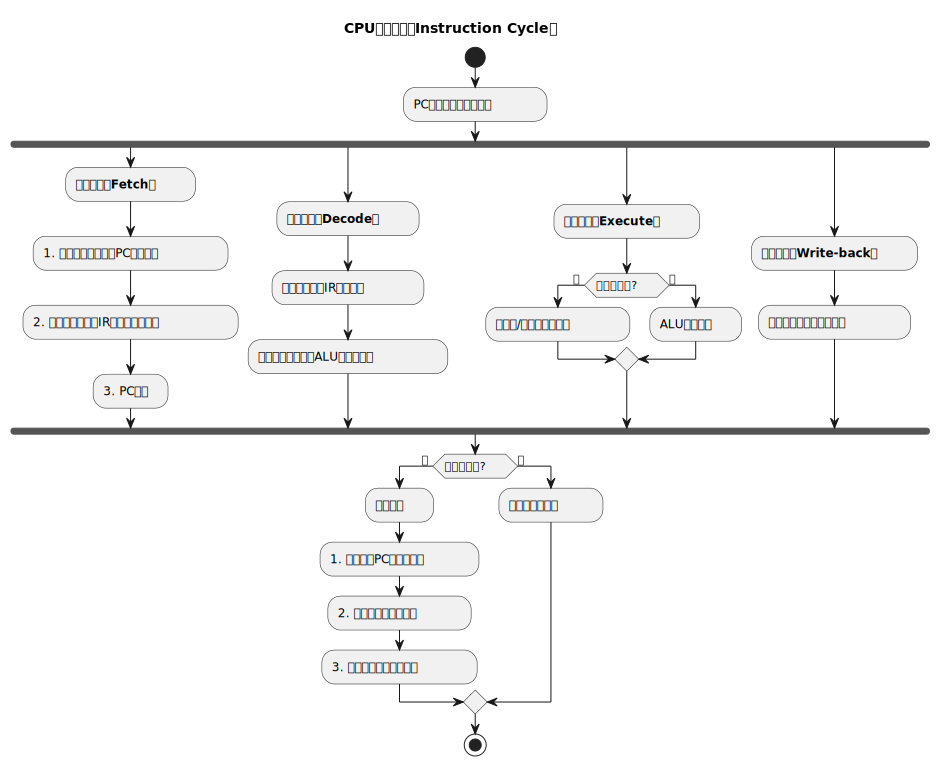
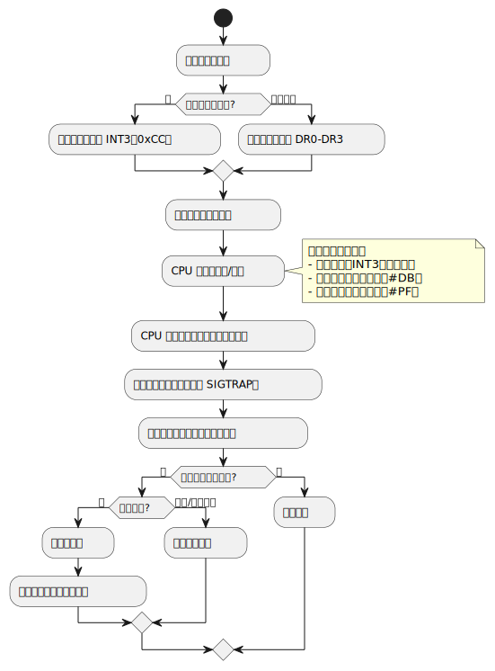

## 操作系统及计算机组成原理 (一) - CPU 
### 定义与核心作用

- **定义**：`中央处理器`（CPU，Central Processing Unit）是计算机的“大脑”，负责执行指令、处理数据并协调其他硬件组件的工作。
- **核心作用**：
  1. **指令执行**：`读取`、`解码`并`执行`程序指令。
  2. **算术与逻辑运算**：通过`算术逻辑单元`（ALU）完成计算。
  3. **控制协调**：管理内存访问、I/O 操作及系统资源分配。

### 核心组成

**1. 控制单元（Control Unit, CU）**

- **功能**：指挥 CPU 各部件协同工作，包括：
  - **指令解码**：将机器指令转换为`控制信号`。
  - **时序控制**：生成`时钟信号`协调操作步骤。
  - **流程管理**：处理`中断`、`跳转指令`等。

机器指令的组成：

```text
[操作码（Opcode）] [操作数（Operand）]
```
* 操作码：指定操作类型（如加法、跳转）。
* 操作数：提供操作对象（如寄存器地址、内存地址）。

**2. 算术逻辑单元（Arithmetic Logic Unit, ALU）**

- **功能**：执行所有算术（加减乘除）和逻辑运算（与、或、非）。
- **输入输出**：
  - **输入**：来自寄存器的操作数。
  - **输出**：运算结果写入寄存器，状态标志（如进位、零标志）存入状态寄存器。

**3. 寄存器（Registers）**

- **定义**：CPU 内部的`高速存储单元`，用于暂存`数据`、`地址`和`状态`。
- **关键寄存器**：
  - **程序计数器 (Program Counter，PC)**：存储下一条指令地址 ([虚拟地址](/blog/operating-system-3-memory/#%E8%99%9A%E6%8B%9F%E5%9C%B0%E5%9D%80))。
  - **指令寄存器 (Instruction Register，IR)**：保存当前正在执行的指令。
  - **累加器 (Accumulator，ACC)**：存储 ALU 运算的中间结果。
  - **状态寄存器 (Flags Register，FLAGS)**：记录运算状态（如`溢出`、`零值`）。

**4. 缓存（Cache）**

- **作用**：减少 CPU 访问内存的延迟，分多级（L1、L2、L3）：
  - **L1缓存**：集成在CPU核心内，速度最快（1-4周期延迟），容量最小（KB级）。
  - **L2缓存**：容量较大（MB级），速度次之。
  - **L3缓存**：多核共享，容量最大（MB~GB级），速度最慢。

**5. 总线接口单元（Bus Interface Unit, BIU）**

- **功能**：管理 CPU 与内存、I/O 设备之间的数据传输。
- **总线类型**：
  - **数据总线**：传输操作数或结果。
  - **地址总线**：指定内存或I/O地址。
  - **控制总线**：传递读写、中断等控制信号。

### 指令周期

CPU 执行一条指令分为以下阶段：

**1. 取指（Fetch）**

- **步骤**：
  1. PC 指向的指令地址通过地址总线发送到内存。
  2. 内存返回指令代码，经数据总线存入 IR。
  3. PC 递增，指向下一条指令地址。

**2. 解码（Decode）**

- 控制单元解析 IR 中的指令，生成`控制信号`（如选择 ALU 操作类型）。

**3. 执行（Execute）**

- ALU 根据指令执行运算，或访问内存读取操作数。
- **示例**：`ADD R1, R2` 指令将 R1 和 R2 的值相加，结果存回 R1。

**4. 写回（Write-back）**

- 将执行结果写入寄存器或内存。

**5. 中断检查**

- 检查是否有中断请求，若有则暂停当前流程，处理中断。



### 中断

中断是 CPU 响应外部或内部事件的机制，暂停当前任务，转而处理更高优先级的任务。

**核心作用**：  

1. **异步处理**：允许 CPU `高效响应外部事件`（如键盘输入、网络数据到达）。  
2. **异常处理**：`捕获程序错误`（如除零、页错误）或系统调用（软中断）。  
3. **多任务支持**：通过时钟中断`实现进程/线程调度`。

#### 分类

**1. 按触发源分类**

| **类型**            | **触发源**                     | **示例**                                   |
|---------------------|--------------------------------|-------------------------------------------|
| **外部中断（硬中断）** | 硬件设备（如键盘、磁盘、网卡） | 按键触发中断、DMA 传输完成中断             |
| **内部中断（异常）**  | CPU 执行指令时的错误或事件     | 除零错误（#DE）、缺页异常（Page Fault）    |
| **软中断（软件中断）** | 程序主动调用中断指令           | 系统调用（`int 0x80`）、调试断点（`int 3`） |

**2. 按是否可屏蔽分类**

| **类型**    | **特点**                     | **示例**                |
|-------------|------------------------------|-------------------------|
| **可屏蔽中断** | 可通过 `CLI` 指令屏蔽        | 外部设备中断（如键盘）  |
| **不可屏蔽中断（NMI）** | 必须立即处理，无法屏蔽       | 硬件故障（如内存奇偶校验错误） |

#### 处理流程

**中断处理步骤**

1. **中断触发**：设备或异常触发中断请求（IRQ）。  
2. **中断响应**：CPU 检查中断是否被屏蔽，若允许则暂停当前指令。  
3. **保存上下文**：将当前程序计数器（PC）、寄存器等压入内核栈。  
4. **跳转处理程序**：通过`中断向量表`（IVT）或`中断描述符表`（IDT）找到`中断服务例程`（ISR）。  
5. **执行 ISR**：运行中断处理代码（如读取键盘输入、处理缺页异常）。  
6. **恢复上下文**：从栈中恢复寄存器，执行 `IRET` 指令返回原任务。

> 中断向量表通常用于嵌入式系统。

**中断向量表（IVT）与中断描述符表（IDT）**

- **IVT**（实模式）：256 个中断向量，每个向量指向一个 ISR 地址（16 位）。  
- **IDT**（保护模式）：包含门描述符（任务门、中断门、陷阱门），支持权限检查和更复杂的中断处理。  

**中断优先级**

- **固定优先级**：如 x86 中 IRQ0（时钟中断）优先级最高。  
- **动态优先级**：通过可编程中断控制器（PIC 或 APIC）配置。

**中断服务例程 (ISR)**

`中断服务例程`（Interrupt Service Routine，ISR）是计算机系统中处理中断事件的程序。

注册中断服务例程。以 Linux 为例，在 Linux 操作系统中，内核提供了一套机制来注册和管理中断服务例程。

- **原理**：Linux 内核使用`中断描述符表`（IDT）来管理中断，当有中断发生时，内核会根据中断号在 IDT 中查找对应的中断服务例程并执行。
- **注册过程**：对于`设备驱动开发`者，需要使用内核提供的函数来注册中断服务例程。常用的函数是 `request_irq`，示例代码如下：
  
```c
#include <linux/interrupt.h>
#include <linux/module.h>

// 定义中断服务例程
static irqreturn_t my_isr(int irq, void *dev_id) {
    // 处理中断的代码
    return IRQ_HANDLED;
}

static int __init my_module_init(void) {
    int irq = 10;  // 假设中断号为 10
    int ret;

    // 注册中断服务例程
    ret = request_irq(irq, my_isr, IRQF_SHARED, "my_irq_handler", (void *)&my_isr);
    if (ret) {
        printk(KERN_ERR "Failed to register IRQ %d\n", irq);
        return ret;
    }

    return 0;
}

static void __exit my_module_exit(void) {
    int irq = 10;  // 假设中断号为 10

    // 释放中断服务例程
    free_irq(irq, (void *)&my_isr);
}

module_init(my_module_init);
module_exit(my_module_exit);
MODULE_LICENSE("GPL");
```

在上述代码中，`request_irq` 函数用于注册中断服务例程，`free_irq` 函数用于释放中断服务例程。

#### 硬件支持

**1. 可编程中断控制器（PIC）**

- **功能**：管理多个中断源，仲裁优先级，向 CPU 发送中断信号。
- **示例**：Intel 8259A PIC，支持 8 级中断（级联可扩展至 64 级）。

**2. 高级可编程中断控制器（APIC）**

- **功能**：多核 CPU 中分配中断到不同核心，支持消息信号中断（MSI）。  
- **组成**：
  - **Local APIC**：集成在 CPU 中，处理本地中断和核间中断（IPI）。  
  - **I/O APIC**：管理外部设备中断。  

#### 操作系统中的中断管理

**1. 中断处理分层**

- **上半部（Top Half）**：快速处理关键操作（如应答中断、缓存数据），需立即完成。  
- **下半部（Bottom Half）**：延迟处理耗时操作（如数据处理），通过软中断、任务队列或工作队列实现。  

**2. 中断与进程调度**

- **时钟中断**：触发调度器检查是否需要切换进程/线程。  
- **中断线程化**（Linux）：将部分中断处理转为内核线程，减少关中断时间。  

**3. 中断屏蔽**

- **关中断**：通过 `CLI`（x86）或 `local_irq_disable()`（Linux）屏蔽可屏蔽中断。  
- **应用场景**：保护关键代码段（如自旋锁、进程切换）。  

#### 实际应用

**1. 设备驱动**

- **外设事件处理**：键盘输入时，键盘控制器发送中断，驱动程序调用中断服务例程（ISR）读取按键数据并传给操作系统。
- **数据传输控制**：硬盘控制器读取数据完成后触发中断，驱动程序将数据从缓冲区搬运到内存，供应用程序使用。
- **设备状态监控**：网络接口卡（NIC）在数据包到达时触发中断，驱动程序处理数据并交给协议栈解析。

**2. 操作系统中的中断应用**

- **任务调度**：定时器周期性触发中断，操作系统检查任务状态，决定是否`切换进程`，保证多任务并发执行。
- **系统异常处理**：当程序执行非法指令或发生`除零错误`时，CPU 触发异常中断，操作系统终止故障进程或采取恢复措施。
- **资源管理**：操作系统通过中断`监控 CPU`、`内存使用情况`，并根据需求进行`负载均衡`或`优化调度策略`。

**3. 虚拟化**

- **虚拟中断**：Hypervisor 截获物理中断，转发给虚拟机（VM）。

#### 代码断点调试

代码断点调试和中断之间有着密切的底层联系，调试器的断点功能本质上是通过 **CPU 的中断机制** 实现的。

##### **断点调试的本质**

1. 断点触发中断
   - **软中断指令**：  
     在代码中插入特殊指令（如 `INT 3`，对应机器码 `0xCC`），触发 CPU 的软中断。  

     ```asm
     ; x86 示例：插入 INT3 指令
     mov eax, 42
     int3    ; 触发断点中断
     mov ebx, eax
     ```

   - **中断处理流程**：  
     CPU 检测到 `INT 3` 后，暂停当前程序，跳转至调试器注册的中断处理程序（即调试事件处理函数）。

2. 调试器接管控制
   - **中断处理程序**：  
     调试器（如 GDB、Visual Studio）捕获中断信号（如 `SIGTRAP`），暂停程序执行，进入调试状态。  
   - **上下文保存与恢复**：  
     调试器保存当前寄存器、内存状态，允许用户查看变量、调用栈等，恢复执行时还原现场。

##### 调试器与中断的协作流程



##### 关键扩展：单步执行的底层原理

- **陷阱标志位（TF）**：  
  设置 CPU 的 `EFLAGS.TF` 标志位，使 CPU 每执行一条指令后触发 **调试异常（#DB）**。

  ```asm
  pushf
  or dword [esp], 0x100  ; 设置 TF 位
  popf
  ```

- **调试器处理**：  
  捕获调试异常，暂停程序并更新调试界面，实现逐指令调试。

理解这一机制有助于更高效地使用调试工具，并能在需要时实现自定义调试功能（如`逆向工程`、`性能分析`）。

#### 常见问题与优化

**1. 中断风暴（Interrupt Storm）**

- **成因**：高频中断（如网络高负载）导致 CPU 利用率飙升。  
- **解决**：合并中断（如 NAPI 网络收包）、调整中断亲和性（绑定到特定 CPU 核）。  

**2. 中断延迟（Interrupt Latency）**

- **定义**：中断触发到 ISR 开始执行的时间。
- **优化**：减少关中断时间、使用实时内核补丁（如 PREEMPT_RT）。  

**3. 中断嵌套（Nested Interrupts）**

- **条件**：允许高优先级中断打断低优先级 ISR。  
- **风险**：栈溢出或死锁，需谨慎设计。  

##### 总结

- **中断是 CPU 响应事件的核心机制**，贯穿硬件、操作系统和应用程序。  
- **分类与优先级**决定事件处理顺序，**中断处理流程**确保上下文无缝切换。  
- **现代优化技术**（如线程化中断、APIC）提升多核系统性能和实时性。  

### 时钟周期

时钟周期 (Clock Cycle) 和指令周期是计算机体系结构中的两个关键概念，它们共同决定了 CPU 的执行效率和性能。

- **时钟周期（Clock Cycle）**  
  - **定义**：CPU 内部时钟信号的一个完整振荡周期，是 CPU 操作的最小时间单位。  
  - **计算**：若 CPU 主频为 `3 GHz`，则时钟周期为 $ T = \frac{1}{3 \times 10^9} \approx 0.333 \, \text{ns} $。  
  - **作用**：所有 CPU 操作（如寄存器读写、ALU 运算）均以时钟周期为基本时间单位。

- **指令周期（Instruction Cycle）**  
  - **定义**：CPU 从内存中取出一条指令到完全执行该指令所需的时间。  
  - **阶段**：通常包括取指（Fetch）、解码（Decode）、执行（Execute）、访存（Memory Access）、写回（Write Back）五个阶段。

### 性能关键指标

| **指标**         | **说明**                                                                 | **示例**               |
|------------------|-------------------------------------------------------------------------|-----------------------|
| **时钟频率**     | 每秒时钟周期数（Hz），决定指令执行速度。                                   | 3.0 GHz = 每秒 30 亿周期 |
| **IPC（每周期指令数）** | 每个时钟周期完成的指令数，受架构和流水线效率影响。                         | 现代 CPU 可达2-4 IPC    |
| **核心数**       | 物理处理单元数量，支持并行任务。                                           | 4核、8核              |
| **缓存容量**     | 缓存越大，减少内存访问延迟的效果越明显。                                    | L3缓存：16 MB         |
| **制程工艺**     | 晶体管尺寸（纳米级），越小则功耗越低、密度越高。                            | 7nm、5nm工艺          |

### 现代 CPU 核心技术

**1. 流水线技术（Pipelining）**

- **原理**：将指令执行分为多个阶段（如取指、解码、执行），各阶段并行处理不同指令。
- **优化**：提高吞吐量，但需处理**数据冒险**（如指令依赖）和**控制冒险**（如分支预测错误）。

**2. 超标量架构（Superscalar）**

- **能力**：每个时钟周期发射多条指令到多个执行单元。
- **示例**：Intel的乱序执行（Out-of-Order Execution）技术。

**3. 多核与超线程（Hyper-Threading）**

- **多核**：单个CPU芯片集成多个物理核心，并行处理任务。
- **超线程**：单个核心模拟多个逻辑核心，共享执行资源（如Intel HT技术）。

**4. 动态频率调整**

- **技术**：根据负载自动调节频率和电压以平衡性能与功耗（如Intel Turbo Boost）。

### CPU 与其他组件的交互

**1. 内存（RAM）**

- **交互**：CPU通过内存控制器（IMC）访问RAM，缓存未命中时需等待内存响应（约100ns延迟）。
- **虚拟内存**：CPU的MMU（内存管理单元）将虚拟地址转换为物理地址，支持分页机制。

**2. 输入输出设备**

- **中断驱动**：设备通过中断请求（IRQ）通知CPU数据就绪。
- **DMA（直接内存访问）**：设备绕过CPU直接与内存交换数据，减少CPU负担。

**3. 显卡（GPU）**

- **协作**：CPU将图形计算任务卸载到GPU，通过PCIe总线传输数据。
- **异构计算**：CPU与GPU协同处理（如深度学习推理）。

### CPU 架构与指令集

**1. CISC（复杂指令集） vs RISC（精简指令集）**

| **特性**       | **CISC（如x86）**                     | **RISC（如ARM）**                  |
|----------------|---------------------------------------|------------------------------------|
| **指令复杂度** | 指令长度可变，支持复杂操作（如单指令完成乘加）。 | 指令长度固定，仅支持简单操作。       |
| **性能重点**   | 硬件复杂度高，优化单线程性能。          | 依赖编译器优化，适合低功耗场景。      |
| **应用场景**   | 桌面、服务器（Intel/AMD）。            | 移动设备、嵌入式系统（苹果M1、高通）。 |

**2. 扩展指令集**

- **加速特定任务**：如Intel AVX（向量运算）、AES-NI（加密加速）、AMD 3DNow!（多媒体处理）。

### CPU 的物理实现

**1. 晶体管与逻辑门**

- **基础单元**：CPU 由数十亿晶体管组成，构成与门、或门、非门等逻辑电路。
- **摩尔定律**：晶体管数量每18-24个月翻倍（近年面临物理极限）。

**2. 制造工艺**

- **光刻技术**：使用紫外光刻机（如ASML EUV）在硅片上蚀刻电路。
- **封装技术**：3D堆叠（如Intel Foveros）、Chiplet（多芯片模块）提升集成度。

### 未来发展趋势

1. **量子计算**：量子比特（Qubit）颠覆传统二进制逻辑，解决特定问题（如因数分解）指数级加速。
2. **神经形态芯片**：模拟人脑神经元结构，优化AI推理效率（如Intel Loihi）。
3. **光计算**：利用光子替代电子传输数据，减少能耗并提升速度。

### 常见问题解答

1. **CPU 与 GPU 的区别？**  
   - CPU：通用计算，强于复杂逻辑和单线程性能。  
   - GPU：专为并行计算设计，适合图形渲染和大规模数据并行任务。

2. **如何选择 CPU？**  
   - **需求导向**：游戏/视频编辑需高主频多核；服务器需多核高缓存；移动设备需低功耗。

3. **CPU 温度过高会怎样？**  
   - **降频保护**：触发温度墙（Thermal Throttling），降低性能防止硬件损坏。
